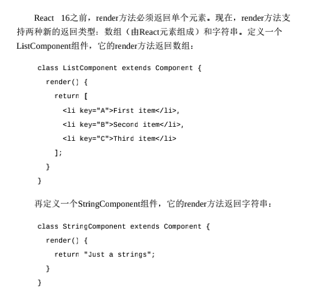

# React

## setState 注意

- 批量，一次性更新，相同 key 合并
- 在生命周期和合成事件里是异步的，会判断是否 isBatching,然后再异步批量执行
- 在 setState 的回调，setTimeout,原生 addEventListener 里面的是直接同步的，所以如果被 setTimeout 包住的话，里面的 setState 就是同步的了，执行便是正常一条一条地执行
- this.setState((state, props) => ({
  counter: state.counter + props.increment
  }));
  setState 的第一个属性如果传入参数，代表在本轮批量执行前的一个操作，此时 state 的值是即将更新的结果值，第二个则是更新后执行的回调

## 性能优化

- 浅比较
  原理就是 shouldComponentUpdate 里面做，只是大多数情况下 PureComponent 和 memo 已经够用，实际上就是对基本值进行比较，
  对于对象值只比较属性长度，属性如果是数组或者对象的引用一旦变化浅比较就没意义了，那么优化点就在这里，不直接传给组件一个对象而用 ...给扩展开来，扩展成值
  <Comment key={i} {...c} />
  comment 里面直接 const {body, author} = this.props; 取出来即可，
  这样的实现把对象里面的值都扩展出来，pureComponent 就能更好地判断是不是需要重新渲染
- 虚拟化长列表
  react-window 和 react-virtualized 是热门的虚拟滚动库。
- 代码分割
  React.lazy 配合 suspend 进行路由懒加载
- 最小颗粒化精细化组件，render 函数里面不要有数据操作也不要有高阶组件，绑定事件用 this.会比()=>{this.\*\*\*}好一点点
- 添加 why-did-u-update 查看多余渲染
- 浏览器 performance 看 timing
- immutable 单向数据可以方便地实现数据响应，对象添加属性就会自动响应，而不用像 redux 一样一定要返回一个{...state,newpeyload}
- 能尽量用 props 传的就尽量用 props 传，redux 的话一些无关属性的变化可能会导致子孙也渲染

## React.children.map 迭代出来的节点是不能直接修改属性的，可以配合 React.cloneElement 进行扩展修改

- React.cloneElement 克隆并返回一个新的 ReactElement （内部子元素也会跟着克隆），新返回的元素会保留有旧元素的 props、ref、key，也会集成新的 props（只要在第二个参数中有定义）

## 自己封装 antDesign 的表单，

```
参考hejie-react/react/study/learn/KFormTest.js

目的用法：
<FormItem validateStatus="error" help={unameError || ""}>
{getFieldDec("username", {
  rules: [{ required: true, message: "Please input your username!" }]
})(<KInput type="text" prefix={<Icon type="user" />} />)}
</FormItem>

<!-- 关键用一个高阶函数生成， -->
// 包装函数：接收字段名和校验选项返回一个高阶组件
getFieldDec = (field, option) => {
this.options[field] = option; // 选项告诉我们如何校验
<!-- 柯里化 -->
return InputComp => (
  <div>
    {React.cloneElement(InputComp, {
      name: field,
      value: this.state[field] || "",
      onChange: this.handleChange, //执行校验设置状态等
      onFocus: this.handleFocus //焦点处理
    })}
  </div>
);
};
```

## react16 新增

- 新钩子
  简单来说就是 will 的钩子都被替代 getDerivedStateFromProps
  除了了 shouldComponentUpdate，其他在 render 函数之前的所有函数(componentWillMount，componentWillReceiveProps， componentWillUpdate)都被 getDerivedStateFromProps 替代。
- 错误边界，componentDidCatch，配合 getDerivedStateFromError 可以降级渲染
- ReactDOM.createPortal，传送门，挂载节点在任意位置，节点还是可以继续冒泡到 react 根
- 返回新增 react 元素数组和字符串
  

## 代码分割，路由懒加载

- React.lazy 配合 Suspense

```
const OtherComponent = React.lazy(() =## import("./OtherComponent"))
<Suspense fallback={<div##Loading...</div##}##
<section##
  <OtherComponent /##
  <AnotherComponent /##
</section##
</Suspense##
```

## 类似 v-html 一样解析 html

`<div id='htmlStr' dangerouslySetInnerHTML={{ __html: htmlStr }}##</div##`

## 绑定事件

```
1. 比较喜欢的做法
  handleClick = () =## {
  this.props.asyncFetch(this.state.num + 1)
  }
2. 在 constructor 里面 bind(this)
3. onClick={(e) =## {this.\*\*\*(e)}}
```

## 高阶 Hoc

- 有函数式高阶以及类组件高阶，其中在装饰器语法下
- 自定义 withState，状态提升高阶组件封装 input 框
- 路由懒加载高阶
- hoist-non-react-statics 自动拷贝所有非 React 静态方法

## hook

- useEffect

1. 第二个参数，如果想执行只运行一次的 effect（仅在组件挂载和卸载时执行），可以传递一个空数组（[]），注意：这时候在这里的 state 的值一直是固定的，只会初始化一次，在 effct 里怎么 set 都只会从初始值开始 set
2. 第二个参数如果不设置，代表有变化就会触发，也可设置依赖数组
3. 模拟 didmount 之类的消除工作：可以 return 一个函数来清除一些副作用

- useContext

```

const HejieCtx = React.createContext()

父：
<HejieCtx.Provider value={{ list, dispatch }}##
子孙组件
</HejieCtx.Provider##

子孙：
const { dispatch, list } = useContext(HejieCtx)

```

- useReducer

```

function listReducer(state, action) {
switch (action.type) {
case "init":
return action.payload
case "add":
return [...state, action.payload]
default:
return state
}
}

use:
const [list, dispatch] = useReducer(listReducer, [])
dispatch({ type: "add", payload: ["西瓜", "菠萝"] })

```

- 自定义 hooke
  就是自定义函数，函数命名 use\*\*\*,运用 useState 什么之类,return 而已，没什么好说

- 像 thunk 一样包装 dispatch

```
// 对dispatch函数进行封装，使其支持处理异步action
function wrapDispatch(dispatch) {
return function(action) {
  if (isPromise(action.payload)) {
    dispatch({ type: "loading_start" })
    action.payload.then(v =## {
      dispatch({ type: action.type, payload: v })
      dispatch({ type: "loading_end" })
    })
  } else {
    dispatch(action)
  }
}
}

```

- 函数式组件用 react-redux 的 connect

```
1.
const FruitAdd = connect()(function({ dispatch }) {
});

2. 用法一样
connect(
mapStateToProps,
mapDispatchToProps
)(HookTest);
```

## context

- 使用

```

const ThemeContext = React.createContext("light")
<ThemeContext.Provider value={this.state.count}##
子
</ThemeContext.Provider##

子：
用法一：设置静态属性
class ThemedButton extends React.Component {
static contextType = ThemeContext

<!-- 然后this.context就可以使用了 --##

...
}

用法二：使用 consumer
<ThemeContext.Consumer##{value =## <Button##{value}</Button##}</ThemeContext.Consumer##

```

## redux

- react-redux

```

根组件用<Provider store={store}##传 store 后

子组件
const mapStateToProps = state =## ({
list: state.goods.list
})
函数式
const mapDispatchToProps = dispatch =## ({
add: payload =## dispatch({ type: "add", payload }),
})
对象式
const mapDispatchToProps = {
add,
asyncFetch
}
@connect(mapStateToProps, mapDispatchToProps)

```

- redux-thunk
  使得可以写异步 action，而且参数自带可以解析出 dispatch 和 getState，如果还要别的参数比如 axios，可以用 withExtraArgument 把 axios 传给 action
  applyMiddleware(thunk.withExtraArgument(serverAxios))

```
这样这个action就能解析出来dispatch,$axios
export const asyncFetch = payload => {
return (dispatch,$axios) => {
  setTimeout(() => {
    dispatch({ type: "init", payload })
  }, 1000)
}
}

```

## redux-saga

1. 创建任务清单

```
// 任务清单
import { call, put, takeEvery } from "redux-saga/effects";

const UserService = {
login(uname) {
return new Promise((resolve, reject) => {
  ...
});
}};
// worker Saga

function* login(action) {
try {
  yield put({ type: "requestLogin" });
  //这些put的名字派发者都是saga了，派发的这些事务也在user.redux.js里面写进去
  const result = yield call(UserService.login, action.uname);
  yield put({ type: "loginSuccess", result });
} catch (message) {
  yield put({ type: "loginFailure", message });
}
}

function* mySaga() {
  yield takeEvery("login", login);
}
export default mySaga;
```

2. 注册

```
const store = createStore(
combineReducers({ fruit: fruitReducer, user }),
applyMiddleware(logger, thunk, sagaMiddleware)
);
sagaMiddleware.run(mySaga);
```

3. 使用 saga 后，原来所有的 redux 都采用最纯粹的写法，直接 action 都是派发一个对象，不用函数了，所有的异步事务都在 saga 清单里面做

## react-router

- render/children/component,互斥的，
  优先执行 children > component > render exact 表明是独占路由
- 动态改变 query 参数

```
import { push } from 'react-router-redux';
import qs from 'query-string';

export const search = () => (dispatch) => {
const query = { firstName: 'John', lastName: 'Doe' };

const searchString = qs.stringify(query);

dispatch(push({
  search: searchString
}))
}

```

## 复合组件

```

<div##
{React.Children.map(props.children, child =## {
  if (child.type === "p") {
    return
  }
  return child
})}
</div##
```

## 生命周期

```
export default class Lifecycle extends Component {
  constructor(props) {
    super(props);
    // 常用于初始化状态
    console.log("1.组件构造函数执行");
  }
  componentWillMount() {
    // 此时可以访问状态和属性
    console.log("2.组件将要挂载");
  }
  componentDidMount() {
    // 组件已挂载，可进行状态更新操作，可进行api调用等
    console.log("3.组件已挂载");
  }
  componentWillReceiveProps() {
    // 父组件传递的属性有变化，做相应响应
    console.log("4.将要接收属性传递");
  }
  shouldComponentUpdate(prevProps, prevState) {
    // 组件是否需要更新，需要返回布尔值结果，优化点
    console.log("5.组件是否需要更新？");
    return true;
  }
  componentWillUpdate() {
    // 组件将要更新，可做更新统计
    console.log("6.组件将要更新");
  }
  componentDidUpdate() {
    // 组件更新
    console.log("7.组件已更新");
  }
  componentWillUnmount() {
    // 组件将要卸载, 可做清理工作
    console.log("8.组件将要卸载");
  }
  render() {
    console.log("组件渲染");
    return <div>生命周期探究</div>;
  }
}
```
