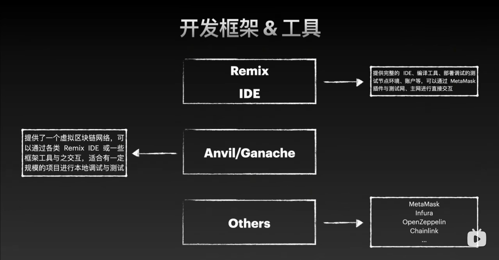

## 1. Solidity

### 文档地址

https://book.getfoundry.sh/projects/clone-a-verified-contract

### 1.1. 本质上就是一个部署在 evm 虚拟机上的程序

开发工具  

Solidity 是一种面向合约的编程语言，用于编写智能合约。 智能合约是一种自动化执行的程序，它可以在区块链上执行特定的任务。
Solidity 是一种高级编程语言，它可以编译为 EVM 字节码，这是一种可在区块链上执行的虚拟机。

### 1.2. Pragma 指令

Pragma 是用来指示编译器检查其 Solidity 版本是否与所需版本匹配的关键字。 如果匹配，则表示源文件可以成功运行。 如果不匹配
，编译器将发出错误。可见性 public、private、internal 和 externa pragma solidity >0.7.0 <0.8.0;

contract Marketplace { function buy(uint price) public returns (uint) { // ... } }

### 1.3. modifier 函数修饰符(类似各种中间件)

函数修饰符可用于更改函数的行为。 它们的工作原理是在函数执行前检查条件。 例如，函数可以检查只有指定为卖方的用户才能列出要
出售的商品。

```rs
pragma solidity >0.7.0 <0.8.0;

contract Marketplace {
    address public seller;

    modifier onlySeller() {
        require(
            msg.sender == seller,
            "Only seller can put an item up for sale."
        );
        _;
    }

    function listItem() public view onlySeller {
        // ...
        // 执行真正的核心逻辑
    }
}
```

此示例介绍以下各项：

-   类型为 address 的变量，用于存储卖方用户的 20 字节 Ethereum 地址。 本模块稍后会详细介绍这些变量。
-   名为 onlySeller 的修饰符，用于说明只有卖方才能列出商品。
-   特殊符号 \_，表示函数体插入的位置。
-   使用修饰符 onlySeller 的函数定义。

### 1.4. 事件

事件描述了合同中采取的操作。 与函数类似，事件具有在调用事件时需要指定的参数。若要调用事件，必须将关键字“emit”与事件名称
及其参数一起使用。

```java
pragma solidity >0.7.0 <0.8.0;

contract Marketplace {
    event PurchasedItem(address buyer, uint price);

    function buy() public {
        // ...
        emit PurchasedItem(msg.sender, msg.value);
    }
}

```


### 1.5. 条件和循环

同 js 一样都是 if else{}, 然后循环建议用 for

```ini
x < 20 ? 1 : 2;
```

### 1.6. 值类型

“整数” int, uint, uint256, int32【指定位数】、“布尔”bool、“string literal”、“address 地址”和“枚举”enum。每个 Solidity 源
文件中都使用整数。 它们表示整数，可以有符号也可以无符号。 存储的整数大小介于 8 位到 256 位之间。

-   已签名：包括负数和正数。 可以表示为 int。
-   未签名：仅包含正数。 可以表示为 uint。

String shipped = "shipped"; // shipped String delivered = 'delivered'; // delivered String newItem = "newItem"; //
newItem

-   \<newline> 转义为换行
-   \n 换行
-   \r 回车
-   \t Tab address 地址地址是一种具有 20 字节值的类型，它表示 Ethereum 用户帐户。 此类型可以是常规“address”，也可以是
    “address payable”。两者之间的区别在于，“address payable”类型是 Ether 发送到的地址，它包含额外的成员 transfer 和 send
    address payable public seller; // account for the seller address payable public buyer; // account for the user

```sql
function transfer(address buyer, uint price) {
    buyer.transfer(price); // the transfer member transfers the price of the item
}
```

### 1.7. 枚举

在 Solidity 中，可使用枚举创建用户定义类型。 之所以称之为用户定义，是因为创建合同的人员决定要包含哪些值。 枚举可用于显示
许多可选择的选项，其中有一项是必需的。例如，可以使用 enum 来表示项目的不同状态。 可以将枚举视为代表多项选择答案，其中所
有值都是预定义的，你必须选择一个。 可以在合同或库定义中声明枚举。Solidity 复制

```java
enum Status {
    Pending,
    Shipped,
    Delivered
}

Status public status;

constructor() public {
    status = Status.Pending;
}
```

### 1.8. 引用

在编写合同时，还应了解引用类型。与总是传递值的独立副本的值类型不同，引用类型为值提供数据位置。 这三种引用类型为：结构、
数组和映射。使用引用类型时，必须显式提供该类型的数据存储位置。 以下选项可用于指定存储类型的数据位置：

-   memory：
-   存储函数参数的位置
-   生存期限制为外部函数调用的生存期
-   storage：
-   存储状态变量的位置
-   生存期仅限于合同生存期
-   calldata：
-   存储函数参数的位置
-   此位置对于外部函数的参数是必需的，但也可用于其他变量
-   生存期限制为外部函数调用的生存期下面举例说明如何使用引用类型

```java
contract C {

  uint[] x;

  // the data location of values is memory
  function buy(uint[] memory values) public {
      x = values; // copies array to storage
      uint[] storage y = x; //data location of y is storage
      g(x); // calls g, handing over reference to x
      h(x); // calls h, and creates a temporary copy in memory
  }

  function g(uint[] storage) internal pure {}
  function h(uint[] memory) public pure {}
}

```

该 Solidity 合约包含一个数组 x，以及两个函数 buy、g 和 h。buy 函数接受一个 uint[] memory 类型的参数 values，并将 values
复制到合约的存储中，然后将 x 赋值给 values。接下来，它定义了一个 uint[] storage 类型的变量 y，并将 x 赋值给 y，使得 y 和
x 在存储中指向同一个数组。最后，它分别调用了 g 和 h 函数，传递了 x 作为参数。g 函数接受一个 uint[] storage 类型的参数，
而 h 函数接受一个 uint[] memory 类型的参数。

-   buy 函数将传入的数组 values 复制到合约的存储中，并在存储中创建了一个新的数组 y，然后分别调用了 g 和 h 函数。
-   g 函数接受一个在存储中的数组作为参数，可以对该数组进行读写操作。
-   h 函数接受一个在内存中的数组作为参数，只能对该数组进行读操作。在调用 h 函数时，x 会被临时复制到内存中，并传递给 h 函
    数。

### 1.9. [] 数组

uint[] itemIds; // Declare a dynamically sized array called itemIds uint[3] prices = [1, 2, 3]; // initialize a fixed
size array called prices, with prices 1, 2, and 3 uint[] prices = [1, 2, 3]; // same as above

-   length：获取数组的长度。
-   push()：在数组末尾追加一个元素。
-   pop：从数组末尾删除元素。
-   delete arr[1] // Create a dynamic byte array bytes32[] itemNames; itemNames.push(bytes32("computer")); // adds
    "computer" to the array itemNames.length; // 1

### 1.10. struct 结构

结构是用户可以定义用来表示实际界对象的自定义类型。 结构通常用作架构或用于表示记录。结构声明示例

```java
contract Struct {
  struct Items_Schema {
    uint256 _id;
    uint256 _price;
    string _name;
    string _description;
  }

  Items_Schema public item;

  function createItem(string calldata _id) public {
    data = Items_Schema(_id: _id, _price: 12)
  }

  function updateItem(uint256 memory _id) public {
    data._price = _price;
  }
}
```

### 1.11. mapping 映射类型

映射是封装或打包在一起的键值对。 映射最接近 JavaScript 中的字典或对象。 通常使用映射来建模实际对象，并执行快速数据查找。
这些值可以包括结构等复杂类型，这使得映射类型灵活且可读性强。

```java
contract Items {
    uint256 item_id = 0;

    mapping(uint256 => Items_Schema) public items;

    struct Items_Schema {
      uint256 _id:
      uint256 _price:
      string _name;
    }

    function listItem(uint256 memory _price, string memory _name) public {
      items[item_id] = Items_Schema(item_id, _price, _name);
      item_id += 1;
    }
    #    删除
    delete items[id][key]


    // 可以定义id为key，值为mapping的一个变量
    mapping(uint256 => mapping(uint256 => uint256)) public balances;
    balances[1][2] = 100;

}
```

### 1.12. 变量

#### 1.12.1. local（提供链全局信息的变量）state global

关键字 storage memory calldata

-   memory：函数内变量
-   storage：合同内变量
-   calldata： 函数的入参变量

#### 1.12.2. 常量 constant 和 immutable

-   constant 节约 gas fee
-   immutable 可以在 construct 中初始化，但不可以再次改变 immutable 可以在 construct 中改变，不可以再次改变

#### 1.12.3. 函数可见性与关键词

public， private， internal，external 关键字 view，pure 可在函数定义中使用的其他函数修饰符包括：

-   pure，用于描述不允许修改或访问状态的函数。
-   view，用于描述不允许修改状态的函数。
-   payable，用于描述可以接收 Ether 的函数。 payable 

### 1.13. 函数选择器


### 1.14. interface 合约，接口声明


### 1.15. 接口继承和重写


### 1.16. contract 合约，即类

合约创建 new 

合约导入  自己实现库

```ini
library SafeMath {
  function add(uint256 a, uint256 b) internal pure returns (uint256) {
    uint256 c = a + b;
    require(c >= a, "SafeMath: addition overflow");
    return c;
  }
}
contract C {
  using SafeMath for uint256;
  function add(uint256 a, uint256 b) public pure returns (uint256) {
    return a.add(b);
  }
}
```

异常处理 

require，条件不满足直接抛出异常， revert，回滚操作，不让操作上链， assert 一定要等于资产接收和发送

### 资产发送

建议用 call 方法，也有 transfer 方法

```java
contract SendEther {
  function sendEther(address payable _to, uint256 _amount) public payable {
    (bool success,bytes memory data ) = _to.call{value: msg.value}("");
    require(send, "发送失败");

  }
}

```

### 资产接收

```java
contract ReceiveEther {
  receive() external payable {
    // 接收以太币
  }
  fallback() external payable {
    // 接收以太币
  }
  function getBalance() public view returns (uint256) {
    return address(this).balance;
  }
}
```

### 1.17. 资产类型 gas spent, gas price, gas limit


技巧使用 calldata 替换 memory, 将状态变量载入内存， 使用 i++ 而不是++i， 缓存数组元素

### 1.18. 学习项目

Demo code repository https://github.com/pseudoyu/social-dApp-demo-contracts Solidity Smart Contract Development - Basics
https://www.pseudoyu.com/zh/2022/05/25/learn_solidity_from_scratch_basic/ foundry-starter-kit
https://github.com/pseudoyu/foundry-starter-kit Other resources Solidity by Example Learn Solidity, Blockchain
Development, & Smart Contracts

### 1.19. 简单示例 Solidity

```java

pragma solidity >0.7.0 <0.8.0;

contract Marketplace { address public seller; address public buyer; mapping (address => uint) public balances;

    event ListItem(address seller, uint price);
    event PurchasedItem(address seller, address buyer, uint price);

    enum StateType {
          ItemAvailable,
          ItemPurchased
    }

    StateType public State;

    constructor() public {
        seller = msg.sender;
        State = StateType.ItemAvailable;
    }

    function buy(address seller, address buyer, uint price) public payable {
        require(price <= balances[buyer], "Insufficient balance");
        State = StateType.ItemPurchased;
        balances[buyer] -= price;
        balances[seller] += price;

        emit PurchasedItem(seller, buyer, msg.value);
    }

}
```

让我们深入了解这份智能合同的主要组成部分：

-   分别是：
-   三个状态变量：buyer、seller 和 balances
-   两个事件：ListItem 和 PurchasedItem
-   一个具有两个值的枚举：ItemAvailable 和 ItemPurchased
-   构造函数将卖方用户指定为 msg.sender，并将初始状态设置为 ItemAvailable。 创建合同时，将调用此构造函数。
-   buy 函数有三个参数：sellerbuyer 和 price。 这要求买方有足够的购买能力。 然后，它将资金从买方转移到卖方，并最终发出一
    条消息。
