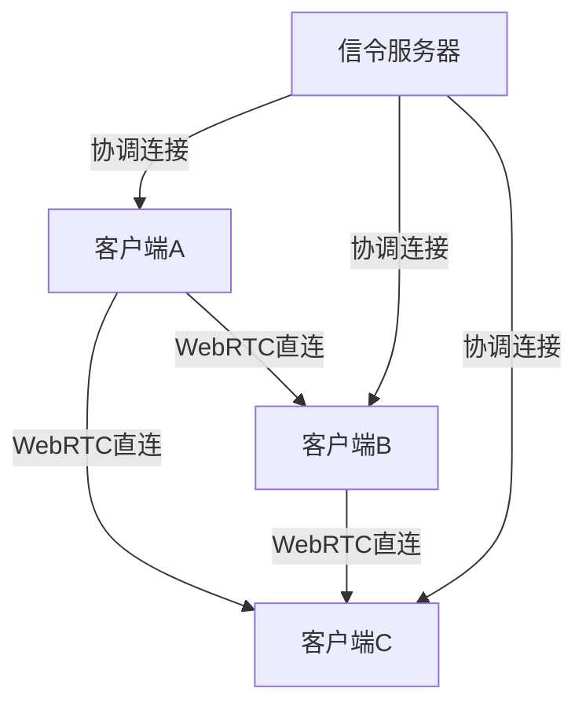
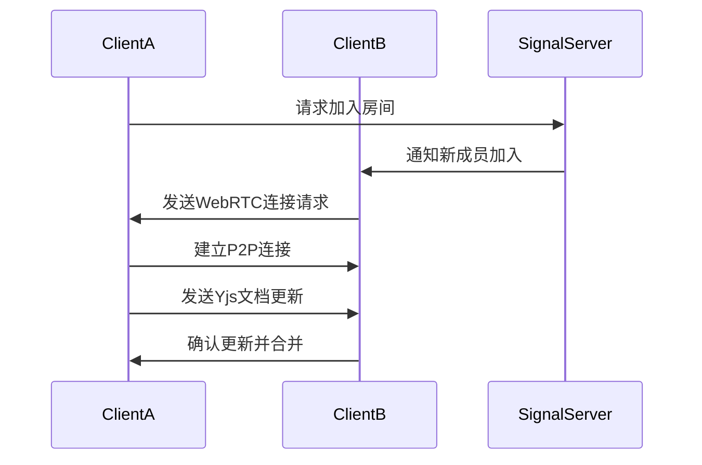
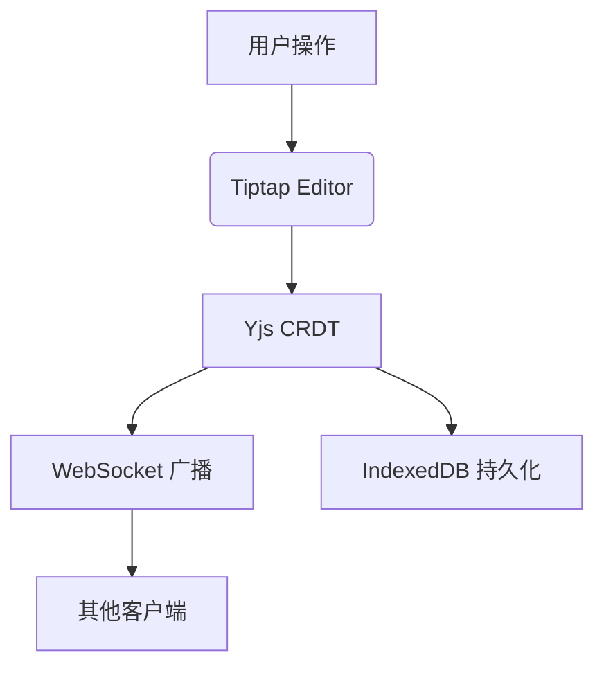
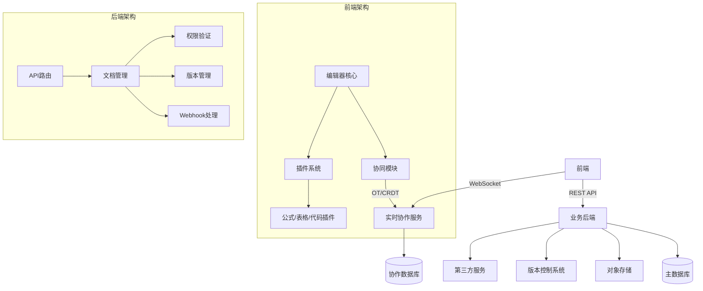

# 基础

## 亮点

项目上

-   低代码编辑器，处理多人协同，时间仓，语法树，selecto，页面渲染器，流式渲染，可视区渲染，分时分片，懒加载，xtpl 模板引
    擎，包含弹幕组件，抽奖组件
-   数据可视化，echarts，爬虫解析，埋点监控，echarts 进行分片渲染 largeThresholud，渐进渲染 progressive，包含小程序商城
    各种商城
-   传输：分片，断点，切片啥的
-   管线节点编辑器【react flow + zustand，customNode 自定义节点，addNode 动态添加节点，Handle 负责控制输入输出端口和规则
    】，低代码转小程序平台，也有各种丰富的组件，涂鸦，对比，全景，运动轨迹，复杂联动之类，AI 创作平台，一开始用的 stable
    diffusion 后面升级复刻,复刻即梦，Mj【双向滑动列表】，可灵之类，生图/视频【FFmpeg】/3d[threeJs]/音频生成平台还有编辑
    平台[openArt]，也是比较大型复杂的，可以涂鸦重绘扩图，智能切割，对象识别【智能切割为二维点阵数组】之类，镜头控制等，
    此外还有创收的 Psd 编辑器
-   自动训练管线平台
-   360 可视化插件，弹幕，角子老虎机，水印啥的
-   客户端上云，操作文件夹，File System Access API，存储文件夹句柄，

```js
getDirectoryHandle，
createWritable，
if ('showDirectoryPicker' in window) {
  // 支持现代API
} else {
  // 降级方案
  alert('请使用最新版Chrome/Edge浏览器');
}
// 文件夹操作耗时监控
const observer = new PerformanceObserver((list) => {
  list.getEntries().forEach(entry => {
    if (entry.initiatorType === 'filesystem') {
      console.log(`文件操作耗时: ${entry.duration}ms`);
    }
  });
});
observer.observe({ entryTypes: ['resource'] });

用户隐私保护：所有文件操作必须经过用户明确授权
数据持久化：重要数据需自行实现备份机制
性能优化：大文件操作建议使用流式处理
错误恢复：实现操作日志和撤销/重做功能

大文件流式写入：
async function writeLargeFile(dirHandle, filename, contentStream) {
  const fileHandle = await dirHandle.getFileHandle(filename, { create: true });
  const writable = await fileHandle.createWritable();

  const reader = contentStream.getReader();
  while (true) {
    const { done, value } = await reader.read();
    if (done) break;
    await writable.write(value);
  }

  await writable.close();
}


```

-   SDK， Error EvalError RangeError ReferenceError SyntaxError（语法错误） TypeError URIError

1. trycath 只能抓同步的运行时错误，语法错误抓不了，异步请求错误也抓不了，比如 setTimeout 里面的错误抓不了
2. Promise.catch()抓异步错误，所以改写 Promise.catch 可以进行错误上报，但 promise.catch 同样抓不了语法错误和异步任务
3. unhandledrejection unhandledrejection：当 Promise 被 reject 且没有 reject 处理器的时候，会触发 unhandledrejection 事
   件
4. Iframe,onerror,
5. 跨端脚本，对 script 标签增加一个 crossorigin=”anonymous”
6. sourceMap 定位错误文件

-   webpack 插件，压缩图片【 遍历遍历图片然后压缩然后上传到 OSS，伪造请求头向 tiny 发起请求，下载图片后直接上传到 oss 后
    再删除】，babel，自定义组件库按需加载 babel-import-node，以前 webpack 优化开启可以直接加 **cacheDirectory** 缓存下来
-   多核多线程：**threadLoader 和 happypack**，

基建上：

-   oclif 开发脚手架，组件库配置按需加载，rush monorepo, CI、CD 打包部署优化
-   各种处理打包的 loader 插件和 plugin 插件，require.context 自动引入组件

代码编程上:

-   时序上，资源上，感观体验上，代码上，懒加载，按需加载，提高请求优先级，Transform 之类开启硬件加速
-

## react-redux, mobx, zustand 原理

zustand: 使用闭包，然后用一个状态管理器，可以通过 subscribe 订阅状态变化，然后用内置 const [, forceUpdate] =
useState({});轻质刷新相关有订阅到相关变量组件 react-redux: 使用 redux 的 connect，connect 返回一个组件，也是通过事件总集
进行发布订阅然后通知 mobx: 使用 mobx 的 observable，observable 返回一个高阶组件，组件里面订阅变量并且执行强制刷新逻辑

## 杰数据结构

# 常见数据结构及其特点

线性数据结构：数组、链表、栈、队列树形数据结构：二叉树、B 树、B+树、红黑树等图结构：有向图、无向图散列结构：哈希表堆：最
大堆、最小堆

## 1. 线性数据结构

### 数组(Array)

-   **特点**：
    -   连续内存空间存储，支持随机访问
    -   插入/删除需要移动元素(O(n))
    -   查找性能高(O(1))，适合读多写少场景
    -   大小通常固定(静态数组)
-   **应用**：需要快速查找和索引的场景，如查表

### 链表(Linked List)

-   **特点**：
    -   非连续存储，通过指针连接
    -   插入/删除高效(O(1))，无需移动元素
    -   查找需要遍历(O(n))
    -   动态扩容，无空间限制
-   **变体**：单链表、双链表、循环链表
-   **应用**：频繁插入删除的场景、实现其他数据结构

### 栈(Stack)

-   **特点**：
    -   后进先出(LIFO)原则
    -   只允许在一端(栈顶)操作
    -   所有操作都是 O(1)时间复杂度
-   **应用**：函数调用、表达式求值、浏览器历史记录

### 队列(Queue)

-   **特点**：
    -   先进先出(FIFO)原则
    -   一端入队，另一端出队
    -   基本操作时间复杂度为 O(1)
-   **变体**：双端队列、优先队列、循环队列
-   **应用**：任务调度、消息缓冲、广度优先搜索

## 2. 树形数据结构

### 二叉树(Binary Tree)

-   **特点**：
    -   每个节点最多有两个子节点
    -   具有层次结构
    -   平衡树的操作复杂度为 O(log n)
-   **变体**：
    -   二叉搜索树(BST)：左<根<右
    -   AVL 树：自平衡的 BST
    -   红黑树：近似平衡的 BST，插入删除效率高
-   **应用**：搜索、排序、数据库索引

### B 树与 B+树

-   **特点**：
    -   多路平衡查找树，降低树高
    -   每个节点可以有多个子节点
    -   B+树所有数据都在叶节点，内部节点只有索引
    -   I/O 次数少，适合磁盘操作
-   **应用**：数据库索引、文件系统

### 堆(Heap)

-   **特点**：
    -   完全二叉树结构
    -   最大堆：父节点值大于等于子节点值
    -   最小堆：父节点值小于等于子节点值
    -   插入和删除操作时间复杂度为 O(log n)
    -   获取最值操作为 O(1)
-   **应用**：优先队列、堆排序、事件调度

### 字典树(Trie)

-   **特点**：
    -   用于存储字符串的树形结构
    -   查找前缀效率高
    -   空间换时间
-   **应用**：前缀匹配、自动补全、拼写检查

## 3. 图结构(Graph)

### 图(Graph)

-   **特点**：
    -   由节点(顶点)和边组成
    -   可表示复杂的关系网络
    -   有向图/无向图、加权图/非加权图
-   **表示方式**：
    -   邻接矩阵：空间复杂度 O(V²)
    -   邻接表：空间复杂度 O(V+E)
-   **应用**：社交网络、地图导航、网络拓扑

## 4. 哈希结构

### 哈希表(Hash Table)

-   **特点**：
    -   通过哈希函数将键映射到数组索引
    -   平均查找/插入/删除时间为 O(1)
    -   可能存在哈希冲突，需要解决方案(链地址法、开放寻址法)
    -   空间换时间的典型例子
-   **应用**：缓存系统、数据库索引、集合实现

## 5. 其他重要数据结构

### 集合(Set)

-   **特点**：
    -   不重复元素的集合
    -   常见操作：并集、交集、差集
    -   查找效率高(通常基于哈希表实现)
-   **应用**：去重、成员测试

### 跳表(Skip List)

-   **特点**：
    -   基于链表的一种数据结构
    -   多层索引加速查找
    -   平均复杂度为 O(log n)
    -   实现简单，但效率接近平衡树
-   **应用**：Redis 中的有序集合实现

### 布隆过滤器(Bloom Filter)

-   **特点**：
    -   空间效率高的概率型数据结构
    -   用于判断元素是否在集合中
    -   可能有假阳性，但没有假阴性
    -   无法删除元素
-   **应用**：缓存穿透防止、网页爬虫 URL 去重

每种数据结构都有其独特的优势和适用场景，选择合适的数据结构对算法效率至关重要。

## 杰多人协同

-   快速上线：选 Liveblocks，2 小时即可完成集成 【逻辑上最后一次写入的有效】【Presence API：实时用户状态（光标位置等）
    Storage API：文档数据存储（JSON/CRDT） Broadcast API：自定义事件推送 History API：操作历史管理】 原理： A 发送操作到
    LiveBlocks Server ，LS 转化为操作，再广播给其他用户，其他用户收到后，应用 A 的变更后合并后返回给 LS，Ls 返回合并后的
    状态给 A 离线时可以先把操作包放到 indexDB 里面

createClient 进入同一个房间，时间仓：

```js
// 回退到历史版本
room.history.seek(timestamp, {
    onUpdate: (snapshot) => {
        documentView.render(snapshot);
    },
});
```

-   隐私优先：选 Yjs + WebRTC，数据完全 P2P 传输 【CRDT 去中心化，最终一致，适合离线优先应用】

-   大规模应用：选 ShareDB + OT，支持万人级别协同 【OT，需要中心服务器当裁判，适合小规模实时协作】
-   已有云服务：直接使用 Firebase 实时数据库

-   开发个扫描图片并压缩上传然后替换成云地址的插件

```js
import { createFilter } from "vite";
import fs from "fs";
import path from "path";
import sharp from "sharp"; // 图片压缩工具
import { uploadToCloud } from "./cloud-upload"; // 假设有一个上传到云存储的工具函数

export default function imageUploadPlugin() {
    const imageFilter = createFilter(/\.(png|jpg|jpeg|webp)$/); // 匹配图片文件

    return {
        name: "vite-plugin-image-upload",

        async transform(code, id) {
            if (!imageFilter(id)) return; // 只处理图片文件

            try {
                // 1. 压缩图片
                const compressedImageBuffer = await sharp(id)
                    .resize(800) // 调整大小
                    .toFormat("webp") // 转换为 webp 格式
                    .toBuffer();

                // 2. 上传到云存储
                const cloudUrl = await uploadToCloud(compressedImageBuffer, path.basename(id));

                // 3. 返回替换后的代码
                return {
                    code: `export default "${cloudUrl}";`, // 替换为云地址
                    map: null,
                };
            } catch (error) {
                console.error(`Failed to process image ${id}:`, error);
                return null;
            }
        },

        async generateBundle(options, bundle) {
            // 在生成最终 bundle 时，确保所有图片都已处理
            for (const file in bundle) {
                const chunk = bundle[file];
                if (chunk.type === "asset" && imageFilter(chunk.fileName)) {
                    // 替换 bundle 中的图片路径
                    const compressedImageBuffer = await sharp(chunk.source).resize(800).toFormat("webp").toBuffer();
                    const cloudUrl = await uploadToCloud(compressedImageBuffer, chunk.fileName);
                    chunk.source = `export default "${cloudUrl}";`;
                }
            }
        },
    };
}
```

### 杰 Yjs

原理： Y.Text 富文本编辑 insert(), delete() 维护文本顺序和格式 Y.Array 列表型数据（评论、待办） push(), unshift() 保持元
素顺序 Y.Map 键值元数据 set(), get() 快速键值访问 Y.Xml 结构化文档 createElement() XML 格式数据支持 Y.Number 数值类型
add(), subtract() 自动合并数值修改

需要解释 Yjs 的核心数据结构，如 Y.Doc、Y.Text、Y.Array、Y.Map，以及它们各自的适用场景。例如，Y.Text 适用于富文本编辑，而
Y.Array 适合列表类型的结构。新增的数据应根据类型选择合适的数据结构存储。

然后，具体实现步骤可能需要代码示例，比如如何初始化 Y.Doc，如何通过 WebRTC 同步数据，如何绑定到编辑器界面。同时，要强调
WebRTC 的使用需要处理信令服务器，但 Y-WebRTC 可能简化了这一过程。

存储方面，需要注意 Yjs 的数据结构是共享的，所有操作都会自动同步到其他客户端。新增的数据应该直接通过 Yjs 的数据结构进行操
作，比如使用 insert 来添加内容，而不是传统的数组 push，因为 CRDT 需要确保操作的顺序和合并正确。

可能还需要提到离线支持，Yjs 允许离线编辑，并在重新连接时自动同步。数据持久化方面，可能需要将 Yjs 的状态保存到数据库，并
在加载时恢复。

用户可能关心性能问题，比如大量数据时的处理，或者如何优化同步效率。需要说明 Yjs 的数据结构经过优化，适合实时协同，而
WebRTC 的点对点传输减少了服务器负担。

最后，要总结步骤，明确存储新增数据的方法，确保用户理解如何选择正确的 Yjs 数据结构和操作方式。同时，提醒潜在的注意事项，
比如信令服务器的设置、数据持久化的处理，以及如何处理可能出现的网络问题。

在使用 **Yjs + WebRTC** 实现多人协同文档编辑时，数据存储和同步机制是其核心。以下是详细实现方案和新增数据的存储形式：

---

### 一、技术架构原理



#### 核心组件：

-   **Y.Doc**: 协同文档的 CRDT 数据结构容器
-   **Y.Text**: 处理富文本协同的专业类型
-   **WebRTC Provider**: 实现 P2P 数据同步
-   **CRDT 算法**: 自动解决操作冲突

---

### 二、新增数据的存储形式

#### 1. **文本内容** - 使用 `Y.Text`

```javascript
import { Y } from "yjs";

// 创建文本类型
const ydoc = new Y.Doc();
const ytext = ydoc.getText("content");

// 插入新内容（自动同步）
ytext.insert(0, "Hello World");

// 监听修改
ytext.observe((event) => {
    event.delta.forEach((op) => {
        if (op.insert) {
            console.log("新增文本:", op.insert);
        }
    });
});
```

#### 2. **结构化数据** - 使用 `Y.Array`

```javascript
const yarray = ydoc.getArray("comments");

// 新增评论
yarray.push([
    {
        id: Date.now(),
        author: "user1",
        content: "这是新评论",
    },
]);

// 查询数据
console.log(yarray.toJSON());
// 输出: [{id: 1629..., author: 'user1', content: '...'}]
```

#### 3. **键值对数据** - 使用 `Y.Map`

```javascript
const ymap = ydoc.getMap("metadata");

// 新增元数据
ymap.set("version", "1.0.0");
ymap.set("lastModified", Date.now());

// 获取数据
console.log(ymap.get("version")); // 输出: 1.0.0
```

---

### 三、完整实现流程

#### 步骤 1：初始化协同文档

```javascript
import * as Y from "yjs";
import { WebrtcProvider } from "y-webrtc";

// 创建文档实例
const ydoc = new Y.Doc();

// 连接WebRTC Provider
const provider = new WebrtcProvider("my-room", ydoc, {
    password: "room-password", // 房间密码
    signaling: ["wss://yjs-signal.example.com"], // 信令服务器
});
```

#### 步骤 2：绑定 UI 编辑器

```javascript
import { MonacoBinding } from "y-monaco";
import * as monaco from "monaco-editor";

// 创建Monaco编辑器
const editor = monaco.editor.create(document.getElementById("editor"), {
    value: "",
    language: "plaintext",
});

// 绑定Yjs文本类型
const ytext = ydoc.getText("content");
new MonacoBinding(ytext, editor.getModel(), new Set([editor]), provider.awareness);
```

#### 步骤 3：数据同步流程



---

### 四、数据类型选择指南

| 数据类型     | 适用场景                 | 示例操作               | 存储特点           |
| ------------ | ------------------------ | ---------------------- | ------------------ |
| **Y.Text**   | 富文本编辑               | `insert()`, `delete()` | 维护文本顺序和格式 |
| **Y.Array**  | 列表型数据（评论、待办） | `push()`, `unshift()`  | 保持元素顺序       |
| **Y.Map**    | 键值元数据               | `set()`, `get()`       | 快速键值访问       |
| **Y.Xml**    | 结构化文档               | `createElement()`      | XML 格式数据支持   |
| **Y.Number** | 数值类型                 | `add()`, `subtract()`  | 自动合并数值修改   |

---

### 五、冲突处理机制

#### 1. 插入冲突解决

```javascript
// 客户端A在位置0插入"A"
ytext.insert(0, "A");

// 客户端B在位置0插入"B"
ytext.insert(0, "B");

// 最终结果: "BA" (基于向量时钟排序)
```

#### 2. 属性冲突解决

```javascript
const ymap = ydoc.getMap("config");

// 客户端A设置
ymap.set("theme", "dark");

// 客户端B设置
ymap.set("theme", "light");

// 最终结果: 最后一次有效设置
```

---

### 六、性能优化策略

#### 1. 数据分片存储

```javascript
// 按章节分片
const chapters = ydoc.getMap("chapters");
chapters.set("chap1", new Y.Text());
chapters.set("chap2", new Y.Text());

// 独立同步不同分片
provider.setSyncedHandler((encodedState, origin) => {
    if (origin !== "chap1") return;
    // 处理指定分片同步
});
```

#### 2. 操作批处理

```javascript
ydoc.transact(() => {
    ytext.insert(0, "Hello");
    ytext.insert(5, " World");
    ymap.set("version", 2.0);
});
```

#### 3. 二进制编码优化

```javascript
// 使用Uint8Array传输
const encoder = new encoding.createEncoder();
encoding.writeVarUint(encoder, ytext.length);
provider.send(encoding.toUint8Array(encoder));
```

---

### 七、数据持久化方案

#### 1. 浏览器端存储

```javascript
// 保存到IndexedDB
const updateHandler = (update) => {
    indexedDB.put("yjs-data", update);
};
ydoc.on("update", updateHandler);

// 恢复数据
const savedUpdate = await indexedDB.get("yjs-data");
Y.applyUpdate(ydoc, savedUpdate);
```

#### 2. 服务端持久化

```javascript
import { LeveldbPersistence } from "y-leveldb";

// 服务端存储
const persistence = new LeveldbPersistence("./db", "my-room");

// 保存文档
persistence.storeUpdate(ydoc, update);

// 加载文档
const savedState = await persistence.getStateVector("my-room");
const update = await persistence.getDiff("my-room", savedState);
Y.applyUpdate(ydoc, update);
```

---

### 八、安全防护措施

#### 1. 数据加密传输

```javascript
const provider = new WebrtcProvider("my-room", ydoc, {
    password: "secret",
    signalingEncryption: true, // 启用信令加密
    crypto: new Y.encryption.AesGcmCrypto(), // AES-GCM加密
});
```

#### 2. 权限控制

```javascript
provider.awareness.setLocalState({
    user: "alice",
    permissions: {
        edit: true,
        comment: false,
    },
});

provider.awareness.on("change", (changes) => {
    // 检查其他用户的权限
    const states = provider.awareness.getStates();
    states.forEach((state) => {
        if (!state.permissions.edit) {
            disableEditingForUser(state.user);
        }
    });
});
```

---

### 九、完整示例代码

```html
<!DOCTYPE html>
<html>
    <head>
        <script src="https://cdn.jsdelivr.net/npm/yjs@latest/yjs.js"></script>
        <script src="https://cdn.jsdelivr.net/npm/y-webrtc@latest/dist/y-webrtc.js"></script>
    </head>
    <body>
        <textarea id="editor"></textarea>

        <script>
            const ydoc = new Y.Doc();
            const provider = new Y.WebrtcProvider("demo-room", ydoc);
            const ytext = ydoc.getText("content");

            // 绑定textarea
            const editor = document.getElementById("editor");
            ytext.observe((event) => {
                editor.value = ytext.toString();
            });

            editor.addEventListener("input", () => {
                ytext.delete(0, ytext.length); // 先清空
                ytext.insert(0, editor.value); // 插入新内容
            });
        </script>
    </body>
</html>
```

---

### 十、常见问题解决

#### 1. **数据不同步问题**

-   检查信令服务器连接状态
-   验证 WebRTC 穿透是否成功

```javascript
provider.on("status", (event) => {
    console.log("连接状态:", event.status); // connected/disconnected
});
```

#### 2. **大文档性能优化**

-   使用分页加载 (`y-pagination`)
-   启用增量同步 (`provider.enableIncrementalSync = true`)

#### 3. **离线恢复策略**

```javascript
// 保存最后同步状态
const lastSyncedState = Y.encodeStateAsUpdate(ydoc);
localStorage.setItem("lastState", lastSyncedState);

// 恢复时合并变更
const savedState = localStorage.getItem("lastState");
const newState = Y.encodeStateAsUpdate(ydoc);
const mergedUpdate = Y.mergeUpdates([savedState, newState]);
Y.applyUpdate(ydoc, mergedUpdate);
```

---

通过以上方案，Yjs + WebRTC 可实现：

1. **去中心化协同**：无需中央服务器
2. **自动冲突解决**：基于 CRDT 算法
3. **低延迟传输**：P2P 直连架构
4. **离线编辑支持**：本地存储自动合并
5. **灵活数据模型**：支持多种数据结构

新增数据的存储应根据具体场景选择 `Y.Text`、`Y.Array` 或 `Y.Map`，通过标准的 API 操作数据，所有变更会自动同步到其他客户端
。

## 杰任务队列

```js
/**
 * 依次顺序执行一系列任务
 * 所有任务全部完成后可以得到每个任务的执行结果
 * 需要返回两个方法，start用于启动任务，pause用于暂停任务
 * 每个任务具有原子性，即不可中断，只能在两个任务之间中断
 * @param  {...Function} tasks 任务列表，每个任务无参，异步
 * @returns
 */
function processTasks(...tasks) {
    let i = 0;
    let isRunning = false;
    let result = [];
    return {
        start() {
            if (isRunning) return;
            isRunning = true;
            return new Promise(async (resolve, reject) => {
                while (i < tasks.length) {
                    const task = tasks[i];
                    const r = await task();
                    result.push(r);
                    i++;
                    if (!isRunning) {
                        return;
                    }
                }
                isRunning = false;
                resolve(result);
            });
        },
        pause() {
            isRunning = false;
        },
    };
}

const tasks = [];
for (let i = 0; i < 10; i++) {
    tasks.push(() => {
        console.log(`任务${i + 1}开始`);
        return new Promise((resolve, reject) => {
            setTimeout(() => {
                resolve(i);
                console.log(`任务${i + 1}结束`);
            }, 2000);
        });
    });
}
const hejie = processTasks(...tasks);
hejie.start();
setTimeout(() => {
    hejie.pause();
}, 2000);
setTimeout(() => {
    hejie.start();
}, 5000);
```

## 代码

-   杰深拷贝 function deepCopy(obj) { if (typeof obj !== "object" || obj === null) { return obj; }

        const newObj = Array.isArray(obj) ? [] : {};
        Object.setPrototypeOf(newObj, Object.getPrototypeOf(obj));

        for (const key in obj) {
            if (Object.prototype.hasOwnProperty.call(obj, key)) {
                newObj[key] = deepCopy(obj[key]);
            }
        }

        return newObj;

    }

-   // 两个相同的数字异或为 0,0 为任何数字异或为那个数字 // 利用这点实现在一个数组里面找唯一只出现一次的数字 function
    findUniqueNumber(nums) { return nums.reduce((a,b) => a ^ b, 0) }

## 高阶

```js
正则前瞻运算符 /(?=\B(\d{3}+$)/g，将 1000000 => 1000,000 ?= 代表匹配到的字符串中的前面一个虚拟的空格，可以将这个位置替换
成任何你要的，需要处理什么，\b 代表单词边界，\B 非单词边界

面试题 1.指向的是内存空间的地址 var a = { n: 1 }; var b = a; a.x = a = { n: 2 };
a.x = a = { n: 2 }; 先算 a = {n:2}, 然后左边的a.x的a不会实时变，记录的是一开始a的引用，也就是和b是一样的指向

console.log(`TCL: hejiea`, a.x); undefined; console.log(`TCL: hejieb`, b.x); { n: 2; }


1. 对象添加属性，一般为了效率，key为字符串的会被前移，此外obj[1]和obj['1']没有任何区别，对象的key只有字符串和symbol两种

const obj = {a: 0},
obj['1'] = 0
obj[++obj.a] = obj.a ++
const values = Object.values(obj)
obj[values[1]] = obj.a
console.log(obj)

!总之，赋值时obj[a++] = ++a, 两边基本都是同时执行的，所以obj[++a]那一时刻为obj[1] = 1，计算完成后a变成了2，所以obj['a'] = 2
// ==> {'1': 1,'2': 2, a: 2}

js标识符，可以break直接跳到顶层循环
outer: for (let i = 0; i < 10; i++) {
    for (let j = 0; j < 10; j++) {
        if (i === j) {
            break outer;
        }
    }
}

维护版权可以用零宽字符等做水印，指那些看不到但真实存在的字符 \u200d是其中一个

位运算实现权限组合
const read = 0b1; // 00001
const write = 0b10; // 00100
const exec = 0b100; // 01000
const delete1 = 0b1000; // 10000
const root = read | write | exec;
console.log(`TCL: hejieroot`, root.toString(2)); // 0111

addEventListener后，如果要阻止e的默认事件，记得第三个参数传入{passive: false} 代表可以操作e里面的默认行为

鼠标事件移动距离，clientX, pageX, movementX

消除函数二义性，函数内部用new.target 来判断是不是使用new fn来调用的

让下面的代码成立
const [a, b] = {a:3, b:4}

正常会报错 {a: 3, b: 4}is not iterable
可迭代对象需要满足一个条件，
1. 对象具备[Symbol.iterator]这个属性，是一个迭代函数，
2. 迭代函数：需要return一个迭代器对象[里面包含next方法，next方法返回一个对象，这个对象有value属性，代表当前值，done属性代表是否遍历完成]，
数组的迭代函数调用后就可以得出一个迭代器，yield* 【可以得出一个可遍历对象的迭代器】，可以直接借用，此外也可以自定义迭代函数进行遍历，比如
Object.prototype[Symbol.iterator] = function () {
 let index = 0;
 return {
     next: () => {
         return {
             value: index++,
             done: index > 3
         }
     }
 }

const [a, b] = arr 这种解构赋值说白了就是等同于
const iter = arr[Symbol.iterator]
然后iter.next().value 赋值给a, 再继续iter.next().value 赋值给b

所以上诉问题的解法可以是
Object.prototype[Symbol.iterator] = function() {
    var arr = Object.values(this) // 这里返回对象的所有属性值的数组，数组里面自带有一个迭代器
    const iter = arr[Symbol.iterator]()
    return iter
}

结合yield生成器函数还可以用更简便的写法
Object.prototype[Symbol.iterator] = function*() {
    return yield* Object.values(this)
}

yield* 和 yield 的区别
yield 用于在*函数内暂停和返回结果，yield 后面的值就是该函数下一次next后的值，原封不动， 调用后返回这个值，如果有值的话，done 为false，没有值done才为false标志已经迭代完成了
yield* 用于在*函数内暂停，用于在*函数内去得到另一个对象b的迭代器然后不断迭代出b的值
function* g1() {
  yield 2
  yield 3
}

function* g2() {
  yield 1
  yield g1()
  yield* g1()
  yield [4, 5]
  yield* [6, 7]
}

const iterator = g2()

console.log(iterator.next()) // { value: 1, done: false }
console.log(iterator.next()) // { value: {}, done: false }
console.log(iterator.next()) // { value: 2, done: false }
console.log(iterator.next()) // { value: 3, done: false }
console.log(iterator.next()) // { value: [4, 5], done: false }
console.log(iterator.next()) // { value: 6, done: false }
console.log(iterator.next()) // { value: 7, done: false }
console.log(iterator.next()) // { value: undefined, done: true }

比较字符串
const str1 = '123-445-34-44'
const str2 = '123-445-94-44'
针对这些需要逐步双指针去判断的，可以先把两个字符串转为两个迭代器，然后循环比较，根据迭代器的done值判定边界
s1 > s2 return 1, s1 < s2 return -1, s1 === s2 return 0

function* walk(str) {
    let part = ''
    for(let i = 0; i < str.length; i++) {
        if(str[i] !== '-') {
            part += str[i]
        } else {
            yield +part
            part = ''
        }
    }
    if(part) {
        yield +part
    }
}
function compare() {
    const iter1 = walk(str1)
    const iter2 = walk(str2)
    while(true) {
        const n1 = iter1.next()
        const n2 = iter2.next()
        if(n1.done && n2.done) {
            return 0 // 相等
        } else if(n1.done) {
            return -1 // s1 < s2
        } else if(n2.done) {
            return 1
        } else if(n1.value > n2.value) {
            return 1
        } else if(n1.value < n2.value) {
            return -1
        }
    }

}


递归转循环的思路模板
const arr = [1,2,3,4] // 对数组求和，不能用循环和数组中的方法
// 递归解法
function sum(arr, i = 0) {
    if(arr.length === i) return 0
    return arr[i] + sum(arr, i + 1)
}
循环转递归一般思路
for(初始条件；条件代码；循环自增) {
    循环体
}

递归模板
function m() {
    初始代码
    function _m() {
        if(!条件) return
        // 循环体
        // 循环自增
        _m()
    }
    _m()
}

视口观察
const ob = new IntersectionObserver(callback, {root: null, threshold: 0.5}) 元素在窗口即将出现或即将消失一半时触发，也叫与视口交叉一半时触发
ob.observe(dom)
利用这个API，实现一个懒加载的图片，当图片出现在视口时，才加载图片，避免图片过多导致卡顿,也可以实现下拉加载更多之类，看到loading图标就加载下一页


Promise.resolve(1)
.then(res => {
    console.log(`TCL: hejie000`)
    return Promise.resolve(4)
}).then(res => {
    console.log(`TCL: hejieres`,res)
})
Promise.resolve().then(() => {
    console.log(`TCL: hejie111`)
}).then(() => {
    console.log(`TCL: hejie222`)
}).then(() => {
    console.log(`TCL: hejie333`)
}).then(() => {
    console.log(`TCL: hejie55`)
})

output:
TCL: hejie000
TCL: hejie111
TCL: hejie222
TCL: hejie333
TCL: hejieres 4
TCL: hejie55


```

## CSS

```css
clientWidth 内容 + padding
offsetWidth 内容 + padding + border等所有可见宽度
scrollWidth offsetWidth + 滚动条超出的最真实宽度
getBoundingClientRect() 返回元素的大小和相对于视口的位置

逻辑边距，会根据排列方向自动调整
margin-block-start,margin-block-end 距离上一个元素的边距，
text-combine-upright: all

动画暂停
animation-play-state: paused; 暂停 running运行

逐帧动画，雪碧图
animation: move 1s steps(12) infinite; steps(12, jump-none)

aspect-ratio: 4 / 3 // 保持元素宽高比

js和css联动
<p data-hejie='12px'>文本</p>
.css {
    font-size: attr(data-hejie);
}

scss 循环
@for $i from 1 through 12 {
    &:nth-of-type(#{$i}) {
        transform: translateY(#{$i * 50px});
    }
}

混合模式
mix-blend-mode: difference; screen


立体文字，可以text-shadow 同时设置多个阴影实现

/* 可以给图片里面东西边界加阴影 */
filter: drop-shadow(0 0 10px #000);

```

## Js 数据类型，js 基本类型和复杂类型

基本数据类型：Boolean, String, Number, Null, Undefine, Symbol（代表创建后独一无二且不可变的数据类型，它的出现我认为主 要
是为了解决可能出现的全局变量冲突的问题。）引用数据类型：Object, Array, Function typeof 可以检测出基本数据类型（除了
null，typeof null 结果是 object，这个是 bug），会返回 string, boolean, number, object , function,undefined， typeof NaN
// number,NaN 比较特殊，是唯一一个与自身不相等的，NaN != NaN

## JavaScript 的基本类型和复杂类型存在哪⾥的？(基站复堆)

基本类型：存在栈（空间小，大小固定，存放频繁需要的数据，存太多会影响运行性能），但是⼀旦被闭包引⽤则成为常住内存，会储存
在内存堆中。复杂类型：存在堆（一个优先队列，空间大，大小不固定），会储存在内存堆中，但是指针会存在栈中，指向自身

栈（Stack）和堆（Heap）是计算机内存管理中两种不同的区域，它们主要在数据存储和管理上有所不同。以下是栈和堆之间的一些主要
区别：

内存分配方式：

栈：栈内存是自动管理的，其内存是由编译器在函数调用时自动分配和释放的。栈的内存分配采用的是 LIFO（Last In, First Out，后
进先出）原则。堆：堆内存是动态管理的，通常由程序员手动分配和释放（例如使用 malloc 和 free 在 C 语言中，new 和 delete 在
C++中）。如果程序员没有显式释放内存，可能会导致内存泄漏。存储内容：

栈：通常用于存储局部变量、函数参数和返回地址。栈内存的大小一般较小，但访问速度比较快。堆：用于存储动态分配的内存块，这些
内存块在程序运行时可以改变大小。堆内存的大小一般比栈大，但由于需要手动管理，访问速度通常比栈慢。生命周期：

栈：栈中分配的内存在函数调用结束后会自动释放，不需要程序员手动管理。堆：堆中分配的内存在程序员明确释放之前会一直存在，程
序员需要负责管理这部分内存。线程安全：

栈：每个线程都有自己的栈，因此是线程安全的。堆：堆在进程中是共享的，如果多个线程同时访问堆内存，可能需要进行同步操作。内
存碎片：

栈：由于是 LIFO 结构，内存不会出现碎片。堆：频繁的分配和释放可能导致内存碎片化，影响性能。

## 杰数组，改变数组

改变数组：splice,push,pop,unshift,shift,sort,reverse,fill,copyWithin 不改变数组
：slice,map,forEach,filter,some,reduce,find,concat,every,some,entries

```
splice，变化原数组
arr.splice( index, 选中的索引项以及后面几项要被覆盖，‘覆盖为新的什么值’)
删除: arr.splice(i,1)

Some,find,every
Some = find,只不过some返回true、false，find返回数据项，every对每一个进行检测，返回布尔值


Shift弹出返回第一个，unshift插入第一个
pop，push

concat，返回新数组
join 返回字符串
arr.flatMap（i） 打平几层
```

## Object.prototype.toString.call() 、 instanceof 以及 Array.isArray()区别

Object.prototype.toString 适用于任何变量，instanceof，isArray 只能判断对象类型，原始类型不可，isArray 性能会稍微高点

## 杰 instanceof

instanceof 运算符用于判断构造函数的 prototype 属性是否出现在对象的原型链中的任 何位置。

```js
function myInstanceof(left, right) {
    let proto = Object.getPrototypeOf(left); // 获取对象的原型
    let prototype = right.prototype;
    while (true) {
        if (!proto) return false;
        if (proto === prototype) return true;
        proto = Object.getPrototypeOf(proto);
    }
}
```

## 判断类型，获取类型

```js
getType(val) {
  return Object.prototype.toString.call(val).slice(8, -1).toLowerCase()
},
```

## 杰 new，实现 new，new 做了什么

new 做了三步

1. let obj = {}
2. obj._proto_ = Father.prototype
3. Father.apply(obj,参数) 调用构造器初始化

```js
实现：
let newMethod = function (Parent, ...rest) {
    // 1.以构造器的prototype属性为原型，创建新对象；
    let child = Object.create(Parent.prototype);
    // 2.将this和调用参数传给构造器执行
    let result = Parent.apply(child, rest);
    // 3.如果构造器没有手动返回对象，则返回第一步的对象
    return typeof result  === 'object' ? result : child;
};
```

## 杰分时函数，杰分片，渲染大量节点优化

分时函数,把 一次性渲染 1000 个拆分分成每 200 毫秒渲染其中 8 个

```js
timeThunk(ary, fn, count,delay = 200) {
  let timer
  let start = function () {
    for (let i = 0; i < Math.min(count || 1, ary.length); i++) {
      let obj = ary.shift()
      fn(obj)
    }
  }
  return function () {
    timer = setInterval(() => {
      if (ary.length === 0) {
        return clearInterval(timer)
      }
      start()
    }, delay)
  }
},
大量节点渲染优化，分时渲染，验证后发现直接用innerHTML性能比createDocumentFragment文档碎片好
var ary = []
for (var i = 1; i <= 1000; i++) {
  ary.push(i)
}
var renderFriendList = timeChunk(
  ary,
  function (n) {
    var div = document.createElement("div")
    div.innerHTML = n
    document.body.appendChild(div)
  },
  8
)
renderFriendList()

```

## 杰防抖,debounceto

```js
<!-- 自用 -->
export function debounce(func, wait = 200, needRunAtFirst = false) {
  // 缓存一个定时器id
  let timer = 0;
  let firstTime = needRunAtFirst;
  // 这里返回的函数是每次用户实际调用的防抖函数 // 如果已经设定过定时器了就清空上一次的定时器 // 开始一个新的定时器，延迟执行用户传入的方法
  return function (...args) {
    const _this = this;
    if (firstTime) {
      func.apply(_this, args);
      firstTime = false;
    } else {
      if (timer) clearTimeout(timer);
      timer = setTimeout(() => {
        func.apply(_this, args);
        firstTime = needRunAtFirst;
      }, wait);
    }
  };
}
```

## 杰节流

```js
//  这种时间时间的定时器，可以自带runAtFirst，完美解决第一次需要运行的问题，用setTimeout实现的话要处理首次运行的问题比较多
function throttle(fn, delay = 5000) {
    let old = 0;
    return function (...args) {
        const _this = this;
        const now = Date.now();
        if (now - old > delay) {
            fn.apply(_this, args);
            old = now;
        }
    };
}
```

## react 实现防抖输入框

```js
function debounce(fn, wait) {
    let timer = null;
    return function () {
        let _this = this,
            args = arguments; // 如果此时存在定时器的话，则取消之前的定时器重新记时
        if (timer) {
            clearTimeout(timer);
            timer = null;
        }
        // 设置定时器，使事件间隔指定事件后执行
        timer = setTimeout(() => {
            fn.apply(_this, args);
        }, wait);
    };
}

class SearchInput extends React.Component {
    constructor(props) {
        super(props);
        this.state = {
            value: "",
        };
        this.handleChange = this.handleChange.bind(this);
        this.callAjax = debounce(this.callAjax, 500, true);
    }

    handleChange(e) {
        this.setState({
            value: e.target.value,
        });
        this.callAjax();
    }

    callAjax() {
        此处根据输入值调用服务端接口;
        console.log(this.state.value);
    }

    render() {
        return <input type="text" value={this.state.value} onChange={this.handleChange} />;
    }
}
```

## 杰正则，

1. 只有正则表达式才有 exec,和 test 的方法，字符串才有 match
2. exec 和 replace 的结果用...args 打印出来都可以知道第一个结果是总体的匹配结果，后面是$1 和$2 之类的

reg: test,exec,exec(eval(动态模板正则)) str: match

常用

1. str.replace(reg, (最终匹配的结果，结果里面的$1, $2 分组之类) => { return $1 + ' ' + $2})
2. str.match(reg) 返回一个结果数组['aaa','bbb','cc']，接下来就是数组的操作了
3. 匹配连续相同的字符，(\w)\1,()和\1 配合使用可以筛选连续的重复字符，然后(\w) \1 + 代表贪婪尽可能多匹配，不加代表非贪婪
   ，只匹配两个，还可以(\w)\1{2,},匹配 2 次以上（不含 2 次）

```js
let a = '/name=hahah&geg=erwer&e=fsdfsfd&name=hejie'
const arg = 'name'
const reg = eval(`/${arg}=([^&]*)/gi`)
const val = a.match(reg)
let ret = []
let res = []
while((res = reg.exec(a))) {
  console.log('TCL: res',res)
//   [
//   'name=hejie',
//   'hejie',
//   index: 32,
//   input: '/name=hahah&geg=erwer&e=fsdfsfd&name=hejie',
//   groups: undefined
// ]
  ret.push(res[1])
}
console.log('TCL: hevall',ret)


正则表达式里面，括号是分组，括起来了的东西会成为$1,$2变量可直接用
let reg = /（(.*)）/g
let str = "2019-02 （2）"

string.replace(reg,'$1'),2019-02 2  $1必须直接作用于“”内，如果直接这里变成函数参数的话失效
string.replace(reg,函数（$1）) 不生效，下面写法把它解析出来才可以生效
string.replace(reg,（match, $1, $2）=> {  return ‘**’ + $1 + “***"} ) 2019-02 ***2***

经常会遇到动态拼接正则表达式的例子，正则配合模板语言的话要注意特殊符号要\\两个杠，然后用eval( )才能将它转正真的正则表达式
let reg=`/\\?${arg}=([^&]*)/gi`;
if(url.match(eval(reg))){
tmp=url.replace(eval(reg),"要替换的文本");

字符串中连续出现最多的字符和个数
let str = "abbkejsbccc78wqaaaa"

function test() {
  let reg = /(\w)\1+/g
  let match = str.match(reg)
  if (!match || match.length < 1) {
    console.log("TCL: 并没有找到连续相同的字符")
    return
  }
  let res = match.reduce((pre, next) => {
    if (next.length > pre.length) {
      return next
    } else {
      return pre
    }
  }, match[0])
  console.log("TCL: ", res[0])
  return res[0]
}
test()
```

## this 指向问题，点调用问题

1. 普通函数 a. 直接看有没有 new 或挥洒后端返者 call 绑定 this，没有的话下一步 b. 直接看执行的时候前面是谁点调用的，默认
   就是 window
2. 箭头函数直接向上一层找，直接找到外面有一层是 "普通函数" (如果只是单纯的对象包着就算作平级的就要继续往上找)包着的，没
   有的话就代表是 window，this 指向就跟上一层的这个指向是一样的

```js
var obj = {
  x: 22,
  aaa() {
    let fn = () => {
      console.log("aa", this)
    }
    fn()
  },
  bbb: () => {
    console.log("bb", this)
  },
  ccc: () => {
    let fn = () => {
      console.log("ccc", this)
    }
    fn()
  }
}
obj.aaa() this => obj
obj.bbb() this => window
obj.ccc() this => window

var student = {
  name: "若川",
  doSth: function() {
    console.log(this.name)
    return () => {
      console.log("arrowFn:", this.name)
    }
  }
}
var person = {
  name: "person"
}
student.doSth().call(person) '若川'  'arrowFn:' '若川'
student.doSth.call(person)() 'person' 'arrowFn:' 'person'

obj.methods.say()
obj.methods.say2()

const shape = {
  radius: 10,
  normal() {
    console.log("this1", this)
    return this.radius * 2
  },
  arrow: () => {
    console.log("TCL: ", this)
    return 2 * Math.PI * this.radius
  }
}
下列语句的返回值分别是什么？
正常函数下，判断this直接看函数执行前是谁点调用的，没有就是默认window

console.log((func => func())(shape.normal)) NaN
console.log((s => s.normal())(shape)) 20
console.log((s => s.arrow())(shape)) NaN this => window
console.log("TCL:箭头 ", shape.arrow()) NaN
const c = new shape.normal() shape.normal is not a constructor，应该吧normal改写成普通的normal：function(){}而不能用简写的normal()
```

## 经典 foo 问题

[https://www.cnblogs.com/laojun/p/8287399.html](https://www.cnblogs.com/laojun/p/8287399.html)

```js
function Foo() {
  console.log("TCL: ", this)
  getName = function() {
    console.log(1)
  }
  return this
}

Foo.getName = function() {
  console.log(2)
}

Foo.prototype.getName = function() {
  console.log(3)
}

var getName = function() {
  console.log(4)
}

function getName() {
  console.log(5)
}

输出以下的输出结果

函数Foo的静态方法
console.log("TCL: Foo -> Foo", Foo)

Foo.getName() 2

function getName有提前声明的规则，声明后被var getName= 。。覆盖，则getName为4
getName() 4

Foo()的return this为window，window.getName 在Foo里面被覆盖，则输出1
Foo().getName() 1

同上，因调用了Foo();window的getName被覆盖
getName() 1
依然只是调用了Foo对象上的getName,又因为Foo.getNname，所以相当于
function a(){console.log(2)};
new a();
new Foo.getName() 2

先执行了new Foo()；返回一个对象，这个对象的getName为prototype上的getName,相当于(new Foo()).getName();
new Foo().getName() 3
new new Foo().getName() 3

<!-- 额外练习 -->
function Foo() {
    Foo.a = function() {
        console.log(1)
    }
    this.a = function() {
        console.log(2)
    }
}
Foo.prototype.a = function() {
    console.log(3)
}
Foo.a = function() {
    console.log(4)
}
Foo.a();
let obj = new Foo();
obj.a();
Foo.a();
-- 4  2  1
```

## 杰 bind

```js
Function.prototype.bind = function (ctx) {
    var self = this;
    return function () {
        return self.apply(ctx, arguments);
    };
};
```

call 传多个，apply 传数组

## 杰 call

```js
Function.prototype.call = function(context) {
  var context = context || window; 因为传进来的context有可能是null
  context.fn = this;
  var args = [];
  for (var i = 1; i < arguments.length; i++) {
      args.push("arguments[" + i + "]"); 不这么做的话 字符串的引号会被自动去掉 变成了变量 导致报错
  }
  args = args.join(",");

  var result = eval("context.fn(" + args + ")"); 相当于执行了context.fn(arguments[1], arguments[2]);

  delete context.fn;
  return result; 因为有可能this函数会有返回值return
}
```

## 杰 apply

```js
Function.prototype.apply2 = function(context, arr) {
  var context = context || window; 因为传进来的context有可能是null
  context.fn = this;
  var args = [];
  var params = arr || [];
  for (var i = 0; i < params.length; i++) {
      args.push("params[" + i + "]"); 不这么做的话 字符串的引号会被自动去掉 变成了变量 导致报错
  }
  args = args.join(",");

  var result = eval("context.fn(" + args + ")"); 相当于执行了context.fn(arguments[1], arguments[2]);

  delete context.fn;
  return result; 因为有可能this函数会有返回值return
}

```

## 杰继承 to，原型链 to，原型 to

[继承](https://segmentfault.com/a/1190000015766680)

## JavaScript 的作⽤域链理解吗？✨

JavaScript 属于静态作⽤域，即声明的作⽤域是根据程序正⽂在编译时就确定的，有时也称为词法作⽤域。其本质是 JavaScript 在执
⾏过程中会创造可执⾏上下⽂，可执⾏上下⽂中的词法环境中含有外部词法环境的引⽤，我们可以通过这个引⽤获取外部词法环境的变量
、声明等，这些引⽤串联起来⼀直指向全局的词法环境，因此形成了作⽤域链。

## es5 的主要继承方式

寄生组合式继承

## 继承的几种方式

主要有三种，原型链继承，借用构造函数继承，寄生组合式继承寄生组合式继承思想：强行把爸爸儿子的副本抢回来变成子类自己的儿子
，同时也要给儿子洗脑，跟儿子说他的构造者就是子类自己

```
//父类
function SuperType(name){
    //父类实例属性
    this.name = name;
    this.colors = ["red", "blue", "green"];
}
//父类原型方法
SuperType.prototype.sayName = function(){
    alert(this.name);
};
//子类
// 1. 借用构造函数：继承父类的实例属性；
function SubType(name, age){
    SuperType.call(this, name);
    this.age = age;
}
// 2. 寄生组合式继承：将父类原型的副本强制赋值给子类原型，实现继承父类的原型方法。
inherit(SubType, SuperType);

SubType.prototype.sayAge = function(){
    alert(this.age);
};

function inherit(subType, superType){
    var prototype = Object.create(superType.prototype); //创建父类原型的副本
    prototype.constructor = subType; //将该副本的constructor属性指向子类
    subType.prototype = prototype; //将子类的原型属性指向副本
}
```

-   原型链继承基本思想：利用原型让一个引用类型继承另一个引用类型的属性和方法，即让原型对象等于另一个类型的实例
    ，Son.prototype = new Father() 缺点：最主要的问题来自包含引用类型值的原型，它会被所有实例共享第二个问题是，创造子类
    型的实例时，不能向超类型的构造函数中传递参数

-   借用构造函数继承基本思想：在子类型构造函数的内部调用超类型构造函数，通过使用 apply()和 call()方法可以在将来新创建的
    对象上执行构造函数 `function Son() { Father.call(this) }` 优点：可以传参缺点：方法都在构造函数中定义，函数无法复用；
    在超类型中定义的方法，子类型不可见，结果所有类型都只能使用构造函数模式

-   组合继承上面两种的结合，使用原型链实现对原型属性和方法的继承，用借用构造函数模式实现对实例属性的继承。

    ```
    function Subtype(name,age){
        \\继承属性
        Supertype.call(this,name);
        this.age  = age;
    }
    \\继承方法
    Subtype.prototype = new Supertype();
    Subtype.prototype.constructor = Subtype;
    ```

    优点：既通过在原型上定义方法实现了函数复用，又能保证每个实例都有自己的属性缺点：无论在什么情况下，都会调用两次超类型
    构造函数，一次是在创建子类型原型的时候，一次是在子类型构造函数的内部

-   原型式继承 object.create(父类实例，可选参：复写的属性) 优：可以直接根据已有的对象创建新对象缺：创造两个相似的对象，
    但是包含引用类型的值的属性始终会共享响应的值

-   寄生式继承思想：与原型式继承紧密关联的一种思路，它实质上把原型继承的过程封装起来，直接 Object.create(father)，然后直
    接给它新增一些属性增强对象，最后再返回对象。缺：使用寄生式继承来为对象添加函数，会因为做不到函数复用而降低效率，这个
    与构造函数模式类似

-   寄生组合式继承思想：本质上，就是使用寄生式继承来继承超类型的原型，然后再将结果指定给子类型的原型只调用了一次
    supertype 构造函数，因此避免在 subtype.prototype 上创建不必要的，多余的属性，与此同时，原型链还能保持不变，还能正常
    使用 instanceof 和 isPrototypeOf()，因此，寄生组合式继承被认为是引用类型最理想的继承范式。

## 杰继承， ES5 的继承和 ES6 的继承有什么区别

1. ES5 继承通过构造函数和原型链实现：

在 ES5 中，继承通常是通过构造函数和原型链来实现的。你需要手动设置子类的原型为父类的一个实例，并使用 call 或 apply 方法在
子类的构造函数中调用父类的构造函数。实现步骤：

创建父类构造函数。创建子类构造函数，并在其中调用父类构造函数。使用 Object.create 设置子类的原型为父类的原型。手动设置子
类构造函数的 prototype.constructor 为子类自身。

```js
function Parent(name) {
    this.name = name;
}

Parent.prototype.sayName = function () {
    console.log(this.name);
};

function Child(name, age) {
    Parent.call(this, name); // 调用父类构造函数
    this.age = age;
}

Child.prototype = Object.create(Parent.prototype);
Child.prototype.constructor = Child;

var child = new Child("Alice", 10);
child.sayName(); // Alice
```

2. ES6 继承使用 class 和 extends 关键字：

ES6 引入了 class 语法，用于更简洁地创建类和实现继承。extends 关键字用于实现子类继承父类，super 关键字用于调用父类的构造
函数及其方法。实现步骤：

使用 class 关键字定义父类。使用 extends 关键字定义子类，并在子类构造函数中使用 super 调用父类构造函数。

```js
class Parent {
    constructor(name) {
        this.name = name;
    }

    sayName() {
        console.log(this.name);
    }
}

class Child extends Parent {
    constructor(name, age) {
        super(name); // 调用父类构造函数
        this.age = age;
    }

    sayAge() {
        console.log(this.age);
    }
}

let child = new Child("Alice", 10);
child.sayName(); // Alice
child.sayAge(); // 10
```

## 杰 promise，可链式调用 prosmise

```js
const PENDING = "pending";
const FULFILLED = "fulfilled";
const REJECTED = "rejected";

class MyPromise {
    constructor(executor) {
        // 初始化状态
        this.state = "pending"; // pending, fulfilled, or rejected，Promise/A+规定的三种态
        this.value = undefined; // resolved value or rejection reason
        this.callbacks = []; // 存储待处理的回调函数集

        // resolve函数用于将Promise状态变为fulfilled
        const resolve = (value) => {
            if (this.state === "pending") {
                this.state = "fulfilled";
                this.value = value;
                this.callbacks.forEach((callback) => {
                    callback.onFulfilled(value);
                });
            }
        };

        // reject函数用于将Promise状态变为rejected
        const reject = (reason) => {
            if (this.state === "pending") {
                this.state = "rejected";
                this.value = reason;
                this.callbacks.forEach((callback) => {
                    callback.onRejected(reason);
                });
            }
        };

        // 执行executor并捕获异常
        try {
            executor(resolve, reject);
        } catch (error) {
            reject(error);
        }
    }

    // then方法用于注册fulfilled和rejected的回调
    then(onFulfilled, onRejected) {
        // 默认回调函数，如果没有传递
        onFulfilled = typeof onFulfilled === "function" ? onFulfilled : (value) => value;
        onRejected =
            typeof onRejected === "function"
                ? onRejected
                : (reason) => {
                      throw reason;
                  };

        // 返回一个新的Promise以支持链式调用
        return new MyPromise((resolve, reject) => {
            // 处理成功态
            const handleFulfilled = (value) => {
                try {
                    const result = onFulfilled(value);
                    if (result instanceof MyPromise) {
                        result.then(resolve, reject);
                    } else {
                        resolve(result);
                    }
                } catch (error) {
                    reject(error);
                }
            };

            // 处理失败态
            const handleRejected = (reason) => {
                try {
                    const result = onRejected(reason);
                    if (result instanceof MyPromise) {
                        result.then(resolve, reject);
                    } else {
                        resolve(result);
                    }
                } catch (error) {
                    reject(error);
                }
            };

            if (this.state === "fulfilled") {
                // 异步执行以保持一致性
                setTimeout(() => handleFulfilled(this.value), 0);
            } else if (this.state === "rejected") {
                setTimeout(() => handleRejected(this.value), 0);
            } else {
                // 如果pending则推入队列
                this.callbacks.push({
                    onFulfilled: handleFulfilled,
                    onRejected: handleRejected,
                });
            }
        });
    }

    // catch方法只是then方法的语法糖
    catch(onRejected) {
        return this.then(null, onRejected);
    }
}

// 用法示例
let promise = new MyPromise((resolve, reject) => {
    setTimeout(() => resolve("Hello, World!"), 1000);
});

promise
    .then((result) => {
        console.log(result);
        return result + " Chained.";
    })
    .then((result) => {
        console.log(result);
    })
    .catch((error) => {
        console.error(error);
    });
```

## 杰 promise.race,实现 promise.all,promise.catch,promise.finally,promise.allSettled

这些方法接受一个数组作为参数，p1、p2、p3 都是 Promise 实例，如果不是，就会先调用下面讲到的 Promise.resolve 方法，将参数
转为 Promise 实例，再进一步处理。

```js
Promise.prototype.race = arr =>
  new Promise((resolve, reject) => {
    arr.forEach(item => {
      item.then(resolve, reject)
    })
  })
Promise.prototype.all = function (promiseArr) {
  let results = [];
  return new Promise((resolve, reject) => {
    let i = 0, n = 0;
    // 执行所有的 Promise 对象
    while (n < promiseArr.length) {
      promiseArr[n].then(res => {
        results[n] = res;
        i++;
        if (i === promiseArr.length) {
          resolve(results);
        }
      }).catch(err => {
        reject(err);
      });
      n++;
    }
  })
}
Promise.prototype.catch = function(onRejected) {
  return this.then(null, onRejected)
}
Promise.prototype.finally = function (cb) {
  return this.then(val => {
    cb()
    return val
  }).catch(err => {
    cb()
    return err
  })
}

静态的resolve方法
static resolve(value) {
  if(value instanceof MyPromise) return value
  // 根据规范, 如果参数是Promise实例, 直接return这个实例
  return new MyPromise(resolve => resolve(value))
}
//静态的reject方法
static reject(reason) {
  return new MyPromise((resolve, reject) => reject(reason))
}

Promise.prototype.allSettled = (funcArr) => {
  return new Promise((resolve) => {
    let sttled = 0
    let result = []
    for(let index = 0;index<funcArr.length;index++){
      const element = funcArr[index]
      element
      .then(res => {
        result[index] = {
          status: 'fulfilled',
          value: res
        }
      })
      .catch(err => {
        result[index] = {
          status: 'rejected',
          reason: err
        }
      })
      .finally(() => { ++sttled === funcArr.length && resolve(result) })
    }
  })
}
```

## 杰 async/await

Async await 如何通过同步实现异步， async 包住的函数实际上相当于一个 Generator 函数，通过 yield 和 next 实现暂停和继续向
下调用

```js
function run(gen) {
    var g = gen(); //由于每次gen()获取到的都是最新的迭代器,因此获取迭代器操作要放在_next()之前,否则会进入死循环

    function _next(val) {
        //封装一个方法, 递归执行g.next()
        var res = g.next(val); //获取迭代器对象，并返回resolve的值
        if (res.done) return res.value; //递归终止条件
        res.value.then((val) => {
            //Promise的then方法是实现自动迭代的前提
            _next(val); //等待Promise完成就自动执行下一个next，并传入resolve的值
        });
    }
    _next(); //第一次执行
}
function run(gen) {
    //把返回值包装成promise
    return new Promise((resolve, reject) => {
        var g = gen();

        function _next(val) {
            //错误处理
            try {
                var res = g.next(val);
            } catch (err) {
                return reject(err);
            }
            if (res.done) {
                return resolve(res.value);
            }
            //res.value包装为promise，以兼容yield后面跟基本类型的情况
            Promise.resolve(res.value).then(
                (val) => {
                    _next(val);
                },
                (err) => {
                    //抛出错误
                    g.throw(err);
                }
            );
        }
        _next();
    });
}
```

## 杰 generator

原理是 yield 会将代码大概转换成下面三个步骤，用 switch 来执行不同步骤的函数，核心点在于每次运行后对上下文的保存，下次再
使用时直接根据上下文执行下一步的函数，所以 yield 看起来想挂载了，其实并没有，只是保存了上下文从而知道该执行哪一块的函数
而已

1. 我们定义的 function\*生成器函数被转化为以上代码
2. 转化后的代码分为三大块：
   gen$(_context)由yield分割生成器函数代码而来
context对象用于储存函数执行上下文
invoke()方法定义next()，用于执行gen$(\_context)
   来跳到下一步

3. 当我们调用 g.next()，就相当于调用 invoke()方法，执行 gen\$(\_context)，进入 switch 语句，switch 根据 context 的标识，
   执行对应的 case 块，return 对应结果当生成器函数运行到末尾（没有下一个 yield 或已经 return），switch 匹配不到对应代码
   块，就会 return 空值，这时 g.next()返回{value: undefined, done: true}

生成器函数根据 yield 语句将代码分割为 switch-case 块，后续通过切换\_context.prev 和\_context.next 来分别执行各个 case

```js
function gen$(_context) {
    while (1) {
        switch ((_context.prev = _context.next)) {
            case 0:
                _context.next = 2;
                return "result1";

            case 2:
                _context.next = 4;
                return "result2";

            case 4:
                _context.next = 6;
                return "result3";

            case 6:
            case "end":
                return _context.stop();
        }
    }
}

低配版context;
var context = {
    next: 0,
    prev: 0,
    done: false,
    stop: function stop() {
        this.done = true;
    },
};

低配版invoke;
let gen = function () {
    return {
        next: function () {
            value = context.done ? undefined : gen$(context);
            done = context.done;
            return {
                value,
                done,
            };
        },
    };
};
```

## 杰微任务，宏任务，先微再宏，只不过一开始的 script 块也可以算是宏任务

宏任务：script 中代码、setTimeout、setInterval、I/O、UI render。微任务: promise.then、nexttick,
Object.observe、MutationObserver。

很多人有个误区，认为微任务快于宏任务，其实是错误的。因为宏任务中包括了 script ，浏览器会先执行一个宏任务，接下来有异步代
码的话就先执行微任务。所以正确的一次 Event loop 顺序是这样的

1. 执行同步代码，这属于宏任务
2. 执行栈为空，查询是否有微任务需要执行
3. 执行所有微任务
4. 必要的话渲染 UI
5. 然后开始下一轮 Event loop，执行宏任务中的异步代码

<!-- todo -->

## node 的事件循环机制，浏览器的循环机制和区别

Node.js 是单进程单线程应用程序，但是因为 V8 引擎提供的异步执行回调接口，通过这些接口可以处理大量的并发，所以性能非常高。

Node.js 和浏览器中的事件循环机制有很多相似之处，因为它们都遵循 ECMAScript 规范中的事件循环模型。然而，由于 Node.js 和浏
览器的运行环境及其需求不同，它们在具体实现上也存在一些关键区别。以下是 Node.js 与浏览器事件循环机制的主要区别：

-   共同点单线程模型：JavaScript 在 Node.js 和浏览器中都是单线程的，这意味着它们的事件循环都是围绕单个线程设计的。宏任务
    和微任务：在 Node.js 和浏览器中，任务分为宏任务（如 setTimeout）和微任务（如 Promise 的回调）。微任务优先于宏任务执
    行。

-   不同点

1. 在浏览器中，微任务会在每个宏任务后执行，UI 渲染之前。在 Node.js 中，微任务会在每个事件循环阶段完成后执行，而不是在每
   个宏任务后。

2. Node.js 的环境：

Node.js 没有 UI 渲染的概念，因此不需要处理浏览器中涉及的 UI 更新。 Node.js 的事件循环需要处理更多与文件系统、网络 I/O 相
关的任务，这些任务在浏览器中通常由 Web APIs 处理。

事件循环阶段：

浏览器：事件循环在每个轮次中处理完微任务后，会检查 UI 渲染以及处理宏任务。 Node.js：事件循环分为多个阶段，每个阶段处理特
定类型的回调。常见的阶段包括：

Timers：执行 setTimeout 和 setInterval 的回调。 I/O callbacks：处理一些之前的 I/O 操作的回调。 Idle, prepare：系统内部使
用。 Poll：检索新的 I/O 事件；执行 I/O 回调。 Check：执行 setImmediate 的回调。 Close callbacks：执行一些关闭操作的回调
，如 socket.on('close', ...)。 **setImmediate vs setTimeout**：在 Node.js 中，setImmediate 是设计为在当前事件循环的
check 阶段执行的回调，因此通常会在当前循环结束后立即执行。 setTimeout 的回调是在事件循环的 timers 阶段被处理的，可能会有
一些延迟，即使是 setTimeout(..., 0)。微任务的执行时机：

-   浏览器的很简单，直接先执行同步代码，然后再去执行异步栈里面的任务，先微再宏，【一个代码块里先微再宏，setTimeout 的回
    调也算是一个代码块】
-   node 的 eventLoop https://blog.csdn.net/xgangzai/article/details/89647029

    > 在 node 11 版本中，node 下 Event Loop 已经与浏览器趋于相同【和浏览器一样】,较低版本有所不同【较低版本中】

-   开始本轮循环: 先执行同步代码，执行微任务: 先 process.nextTick，再执行.then 里面的东西，
-   进入次轮循环，开始 timers --> IO 回调(普通的回调) --> poll 阶段（读取文件，网络操作等） --> check(执行
    setImmediate，其中 immediate 可能慢过 setTimeout()，因为 setTimeout 默认是 1ms 那样) --> 关闭回调

1. 同步代码 — 任务 loop【上一轮的 then 回调函数】
2. Timers（执行到点的 setTimeout()、setInterval()的回调 ）
3. I/O 回调
4. poll 轮询阶段，会适当阻塞执行 I/O 事件以及事件回调，但如果等待超过了某个 timer 的极限等待时间，就会返回 timers 阶段去
   执行 timers 事件
5. Check 阶段，回调里面有 setImmediate 的话会优先执行
6. close 回调，关闭 socket 之类 porcess.nextTicked 会比其他任务更快

```js
async function async1() {
    console.log("async1 start");
    await async2();
    console.log("async1 end");
}
async function async2() {
    console.log("async2");
}
console.log("script start");
setTimeout(function () {
    console.log("setTimeout0");
}, 0);
setTimeout(function () {
    console.log("setTimeout3");
}, 3);
setImmediate(() => console.log("setImmediate"));
process.nextTick(() => console.log("nextTick"));
async1();
new Promise(function (resolve) {
    console.log("promise1");
    resolve();
    console.log("promise2");
}).then(function () {
    console.log("promise3");
});
console.log("script end");
```

## 杰 flatten，打平数组,数组扁平化

-   普通实现

```js
function flatten(arr) {
    let arrs = [...arr];
    let newArr = [];
    while (arrs.length) {
        let item = arrs.shift();
        if (Array.isArray(item)) {
            arrs.unshift(...item);
        } else {
            newArr.push(item);
        }
    }
    return newArr;
}
```

-   递归实现

```js
function flatten(arr) {
    let arrs = [];
    arr.map((item) => {
        if (Array.isArray(item)) {
            arrs.push(...flatten(item));
        } else {
            arrs.push(item);
        }
    });
    return arrs;
}
```

## 数组去重，扩展将数组打平并且去重升序

Array.from(new Set(arr.flat(Infinity))).sort((a, b) => { return a - b （降序是 b - a） })

## 如何求数组的最大值和最小值？

1. 快排
2. `var arr = [6, 4, 1, 8, 2, 11, 23];console.log(Math.max.apply(null, arr))`

## 求最大公约数和最小公倍数

`基本思想是采用辗转相除的方法，用大的数去除以小的那个数，然后再用小的数去除以的得到的 余数，一直这样递归下去，直到余数为 0 时，最后的被除数就是两个数的最大公约数。 function getMaxCommonDivisor(a, b) { if (b === 0) return a; return getMaxCommonDivisor(b, a % b);}`

`基本思想是采用将两个数相乘，然后除以它们的最大公约数 function getMinCommonMultiple(a, b){ return a * b / getMaxCommonDivisor(a, b);}`

## js 内置对象

（1）值属性，这些全局属性返回一个简单值，这些值没有自己的属性和方法。例如 Infinity、 NaN、undefined、null 字面量 （2）函
数属性，全局函数可以直接调用，不需要在调用时指定所属对象，执行结束后会将结果 直接返回给调用者。例如
eval()、parseFloat()、parseInt() 等 （3）基本对象，基本对象是定义或使用其他对象的基础。基本对象包括一般对象、函数对象和
错误对象。例如 Object、Function、Boolean、Symbol、Error 等 （4）数字和日期对象，用来表示数字、日期和执行数学计算的对象。
例如 Number、Math、Date （5）字符串，用来表示和操作字符串的对象。例如 String、RegExp （6）可索引的集合对象，这些对象表示
按照索引值来排序的数据集合，包括数组和类型数组， 以及类数组结构的对象。例如 Array （7）使用键的集合对象，这些集合对象在
存储数据时会使用到键，支持按照插入顺序来迭代元 素。例如 Map、Set、WeakMap、WeakSet （8）矢量集合，SIMD 矢量集合中的数据
会被组织为一个数据序列。例如 SIMD 等 （9）结构化数据，这些对象用来表示和操作结构化的缓冲区数据，或使用 JSON 编码的数据。
例如 JSON 等 （10）控制抽象对象例如 Promise、Generator 等 （11）反射，例如 Reflect、Proxy （12）国际化，为了支持多语言处
理而加入 ECMAScript 的对象。例如 Intl、Intl.Collator 等（13）WebAssembly （14）其他 例如 arguments

## js 中整数的安全范围是多少？

安全整数指的是，在这个范围内的整数转化为二进制存储的时候不会出现精度丢失，能够被 “安全”呈现的最大整数是 2^53 - 1，即
9007199254740991，在 ES6 中被定义为 Number.MAX_SAFE_INTEGER。最小整数是-9007199254740991，在 ES6 中被定义为
Number.MIN_SAFE_INTEGER。 如果某次计算的结果得到了一个超过 JavaScript 数值范围的值，那么这个值会被自动转 换为特殊的
Infinity 值。如果某次计算返回了正或负的 Infinity 值，那么该值将无法参与 下一次的计算。判断一个数是不是有穷的，可以使用
isFinite 函数来判断。

## escape,encodeURI,encodeURIComponent 有什么区别？

encodeURI 是对整个 URI 进行转义，将 URI 中的非法字符转换为合法字符，所以对于一些在 URI 中有特殊意义的字符不会进行转义。
encodeURIComponent 是对 URI 的组成部分进行转义，所以一些特殊字符也会得到转义。 escape 和 encodeURI 的作用相同，不过它们
对于 unicode 编码为 0xff 之外字符的时候会 有区别，escape 是直接在字符的 unicode 编码前加上 %u，而 encodeURI 首先会将字符
转 换为

## set 和 weakset，map 和 weakmap

set 类似于数组，但无重复，map，类似于对象，但键值不限定，包括对象也可以做键值 weakset 和 weakMap 能存放的只能是引用类型
，好处是 weakSet 和 weakMap 是弱集的意思，就是存放的东西只能是引用类型，且集合里的引用类型数据没被引用到的话会被直接回收
掉，可以自动释放内存，避免很多内存泄漏的问题，所以说用 weakSet 和 weakMap 主要是可以方便自动化释放内存，而不用我们手动去
清理一下内从销毁

## Reflect 对象创建目的

简单来说就是将对象最原始默认的一些方法和行为对应备份起来，这样我在后面即使用 proxy 去改变拦截高阶化原始默认事件后，我还
是可以通过 reflect 来找到并调用最原先的代码

## 使用闭包实现每隔一秒打印 1,2,3,4

```js
for (var i = 0; i < 5; i++) {
    (function (i) {
        setTimeout(function () {
            console.log(i);
        }, i * 1000);
    })(i);
} // 使用 let 块级作用域
for (let i = 0; i < 5; i++) {
    setTimeout(function () {
        console.log(i);
    }, i * 1000);
}
```

<!-- endjs -->

# 杰亮点，hejieto

-   编辑器，可视区加载【interaction】，并发限制，传输，弹幕，canvas
-   预览器，流式渲染结合 express 的缓存中间件，renderToNodeStream,懒加载，预加载，分时
-   性能优化，时序上，资源上，感观体验上，代码上，指标
-   SDK，位运算，订阅者模式，观察者模式，单例模式
-   webpack 插件，压缩图片，babel，自定义组件库按需加载 babel-import-node
-   devops
-   异常监控系统

```
- 错误类型
  Error
  EvalError
  RangeError
  ReferenceError
  SyntaxError（语法错误）
  TypeError
  URIError

1. trycath 只能抓同步的运行时错误，语法错误抓不了，异步请求错误也抓不了，比如 setTimeout 里面的错误抓不了
2. Promise.catch()抓异步错误，所以改写 Promise.catch 可以进行错误上报，但 promise.catch 同样抓不了语法错误和异步任务
3. unhandledrejection unhandledrejection：当 Promise 被 reject 且没有 reject 处理器的时候，会触发 unhandledrejection 事件
4. Iframe,onerror,
5. 跨端脚本，对 script 标签增加一个 crossorigin=”anonymous”
6. sourceMap 定位错误文件
```

-   webp 优化，传输，骨架屏，高并发，流程上传工作的自动化，脚手架，图像处理，全景，组件

## 流式渲染

```js
app.use("*", (request, response) => {
    // 通过过滤器（transform streams）创建了缓存
    let cacheStream = createCacheStream(request.path);
    // cachesStream接上Response
    cacheStream.pipe(response);
    //先把首部分写到cacheStream
    cacheStream.write('<html><head><title>Page</title></head><body><div id="root">');
    // 创建了渲染流
    const renderStream = renderToNodeStream(<Frontend />);
    // 渲染流接上cacheStream
    renderStream.pipe(cacheStream, { end: false });
    renderStream.on("end", () => {
        // 一旦结束渲染则做剩余部分的输出
        cacheStream.end("</div></body></html>");
    });
});
```

## 杰懒加载 to，视图内加载，可视区内加载

https://mp.weixin.qq.com/s/XIuINjn6t0uY6kALqEQMaQ

```js
import React, { useEffect, useState } from "react";
import VideoItem from "components/VideoItem";
import styles from "./videoList.less";

const data = [
    // 视频列表
];

function VideoList(props) {
    useEffect(() => {
        let observerVideo = new IntersectionObserver(
            (entries, observer) => {
                entries.forEach((entry) => {
                    // 当移入指定区域内后，播放视频
                    if (entry.intersectionRatio === 1) {
                        // 一些操作
                        return;
                    }
                    // 停止监听
                    // observer.unobserve(entry.target);
                });
            },
            {
                root: document.getElementById("scrollView"),
                rootMargin: "-180px 0px -180px 0px",
                threshold: 1,
            }
        );
        document.querySelectorAll(".video-item").forEach((video) => {
            observerVideo.observe(video);
        });
    }, []);
    return (
        <div className={styles.videoWrap}>
            <div className={styles.list} id="scrollView">
                {data.map((item) => {
                    return <VideoItem src={item} groupName="video-item" key={item} />;
                })}
            </div>
        </div>
    );
}

export default VideoList;
```

## 杰动态加载 to，importthento，异步加载原理

**原理** 本质上就是调用 require.ensure

> webpack 在编译时，会静态地解析代码中的 require.ensure()，同时将模块添加到一个分开的 chunk 当中。这个新的 chunk 会被
> webpack 通过 jsonp 来按需加载。首先，webpack 遇到 import 方法时，会将其当成一个代码分割点，也就是说碰到 import 方法了
> ，那么就去解析 import 方法。

然后，import 引用的文件，webpack 会将其编译成一个 jsonp，也就是一个自执行函数，然后函数内部是引用的文件的内容，因为到时
候是通过 jsonp 的方法去加载的。

具体就是，import 引用文件，会先调用 require.ensure 方法(打包的结果来看叫 require.e)，这个方法主要是构造一个 promise，会
将 resolve，reject 和 promise 放到一个数组中，将 promise 放到一个队列中。

然后，调用 require.load(打包结果来看叫 require.l)方法，这个方法主要是创建一个 jsonp，也就是创建一个 script 标签，标签的
url 就是文件加载地址，然后塞到 document.head 中，一塞进去，就会加载该文件了。

加载完，就去执行这段 jsonp，主要就是把 moduleId 和 module 内容存到 modules 数组中，然后再去走 webpack 内置的 require。

webpack 内置的 require，主要是先判断缓存，这个 moduleId 是否缓存过了，如果缓存过了，就直接返回。如果没有缓存，再继续往下
走，也就是加载 module 内容，然后最终内容会挂在都 module,exports 上，返回 module.exports 就返回了引用文件的最终执行结果。

## 杰性能优化 to

1. wepack 打包层面打包层面：webpack: babel-import,svg 化为组件后按需导入，bundle-analyzer 打包分析
   ，babel-transform-runtime 代替 babel-pollyfill，treeShaking,cache-loader，threadLoader 和 happypack

2. 指标：通过 chrome 的 performance webvitals 里面查看关键数据：(FCP)：测量页面开始加载到某一块内容显示在页面上的时间。
   Largest contentful paint (LCP)：测量页面开始加载到最大文本块内容或图片显示在页面中的时间。 DomContentLoaded
   Event：DOM 解析完成时间。 OnLoad Event：页面资源加载完成时间。

3. 工具：

-   用谷歌浏览器的 Lighthouse 先检查网站，先修复减少问题资源大小
-   用谷歌 performance 工具火山图查看性能瓶颈

4. 步骤：

-   大小上：chrom devtools 的 coverage 覆盖率，适当用 critters（可以自动按需内联节点，剔除不需要的样式）内联首屏样式
    ，splitChunks 拆分代码，项目中有个自己的 svg 库比较大，配合 babel-import 改造成可按需引入的，tree-shaking,小图转
    base64，其他图 webp 处理，图片 tiny 插件，moment 去国际化，cdn 预热（主动请求和）和刷新，图片根据不同设备设置不同图
    片 srcset

```js

```

-   时序上：路由懒加载，react-lazy 拆分，判断浏览器是否可以 prefetch 进行预加载，lazyload 图片懒加载，图片并发控制，为防
    止埋点阻塞，可以延迟合并上报，用 navigator.sendBeacon(url, data)上报，请求终止，.abort,axios 就是
    cancelToken，requestIdleCallback 进行资源的预加载，Window.cancelIdleCallback() 取消，safari 不兼容，要做判断
-   代码上，重绘回流：在 performance 里面的 frames 火山图和 screensnots 里面可以看到详细的页面抖动情况，针对抖动进行布局
    的优化，动画硬件加速（transform，opacity，filter，will-change 可以触发加速）
-   感观体验上：骨架屏（HTMLWebpackPlugin 里面可以插入骨架图）

## 常用优化代码块

```js

<!-- 请求终止，终止请求 -->
sendRequest () {
  this.source = this.axios.CancelToken.source(); // 这里初始化source对象
  this.axios.get(url, {
    cancelToken: this.source.token // 这里声明的cancelToken其实相当于是一个标记，
    // 当我们要取消请求的时候，可以通过这个找到该请求
  })
cancel () {
  this.source.cancel('这里你可以输出一些信息，可以在catch中拿到')
}

<!-- prefetchto -->
const isPrefetchSupported = () => {
  const link = document.createElement('link');
  const { relList } = link;

  if (!relList || !relList.supports) {
    return false;
  }
  return relList.supports('prefetch');
};
const prefetch = () => {
  const isPrefetchSupport = isPrefetchSupported();
  if (isPrefetchSupport) {
    const link = document.createElement('link');
    link.rel = 'prefetch';
    link.as = type;
    link.href = url;
    document.head.appendChild(link);
  } elseif (type === 'script') {
          // load script
  }
};

<!-- webpto -->
// 检测是否支持webp
function checkWebp() {
  try {
    return document.createElement('canvas').toDataURL('image/webp').indexOf('data:image/webp') === 0
  } catch (e) {
    return false
    //TODO handle the exception
  }
}

function getWebpImageUrl(url) {
  if (!url) {
    throw Error('url不能为空')
  }
  if (url.startsWith('data:')) return url
  if (!checkWebp) return url
  return (url = '?x-oss-process****')
}
<!-- 二维数组 -->
Array.from(new Array(20),() => [1,2,3]（一个填充函数）)

<!-- 杰并发限制，杰高并发 -->
高并发控制，promise.race结合链式调用

function limitLoad(urls, handler, limit) {
  const sequence = [].concat(urls)
  let promises = []
  promises = sequence.splice(0, limit).map((url, index) => {
    return handler(url).then(() => {
      return index
    })
  })
  let p = Promise.race(promises)
  // <!-- sequence经过splice后会剔除掉已经请求的数据 -->
  // <!-- 然后下面的操作是把promise串起来串成一个promise串 -->
  for (let i = 0; i < sequence.length; i++) {
    p = p.then(res => {
      promises[res] = handler(sequence[i]).then(() => {
        return res
      })
      return Promise.race(promises)
    })
  }
}

function loadImg(url) {
  return new Promise((resolve, reject) => {
    let time = Math.random() * 1000
    setTimeout(() => {
      console.warn(`${url}加载完成`)
      resolve(`${url}加载完成`)
    }, time)
  })
}
let tmp = new Array(19).fill(0).map((i, d) => d)
limitLoad(tmp, loadImg, 3)

<!-- 杰计时装饰器 -->
export function measure(target,name,descriptor){
  const oldValue = descriptor.value
  descriptor.value = async function(){
    console.time(name)
    const res = await oldValue.apply(this,arguments)
    console.timeEnd(name)
    return res
  }
  return descriptor
}
```

## 编辑器

-   虚拟长列表优化，官方推荐 react-virtualized 比较全   和  react-tiny-virtual-list 比较轻巧实现：先给定头和尾的预估高度
    ，撑开容器，用绝对定位可以减少页面回流抖动带来的不好的体验，当滚动到对应的分页时，先 setState（prev => {设置当前页为
    可见}）加载相应的数据，然后动态更新这一页的高度，将这一页设置 isComputed 计算过了

    除了这几个基础组件外，react-virtualized 还提供了几个高阶组件，比如 ArrowKeyStepper
    、AutoSizer、CellMeasurer、InfiniteLoader 等，本文具体介绍常用的 AutoSizer、CellMeasurer 和 InfiniteLoader。
    AutoSizer：使用于一个子元素的情况，通过 AutoSizer 包含的子元素会根据父元素 Resize 的变化，自动调节该子元素的可视区的
    宽度和高度，同时调节的还有该子元素可视区真实渲染的 dom 元素的数目。 CellMeasurer：这个高阶组件可以动态的改变子元素的
    高度，适用于提前不知道长列表中每一个子元素高度的情况。 InfiniteLoader：这个高阶组件用于 Table 或者 List 的无限滚动，
    适用于滚动时异步请求等情况

-   懒加载，滑动到特定的地方才加载
-   抽奖，ctx.globalCompositeOperation = 'destination-out',设置画笔路径经过的地方变透明
    ，ctx.beginPath();ctx.moveTo(event.offsetX,event.offsetY)绘制
-   视差滚动
-   九宫格，预先算出衰减因子和步骤
-   定义弹幕池，不断轮询推送弹幕，用 transition 加 transform 实现
-   3D transform-style: preserve-3d,perspective: 500 定义视角
-   爬虫，cheerio，node-fetch,正则，轮询 onLoad 判定图片高度
-   canvas.arc 绘制圆形扇形, 浏览器可以优化并行的动画动作，更合理的重新排列动作序列，并把能够合并的动作放在一个渲染周期
    内完成，从而呈现出更流畅的动画效果。 requestAnimationFrame 可以循环递归调用，生成的动画经过浏览器优化，动画更流畅；
    窗口没激活时，动画将停止，省计算资源; 可以调节重新渲染，大幅提高网页性能。其中最重要的，它可以将某些代码放到下一次重
    新渲染时执行。避免短时间内触发大量 reflow
-   图片处理，用 canvas,drawImage，绘制水印，操作然后 toDataUrl 转为 base64，canvas.drawImage,然后 getImageData 可以获得
    一个二维矩阵，矩阵有四个数组，代表 RGBA 四个通道的数组，对像素点的通道进行处理, background-blend-mode

## 杰 webpack,webpack 原理

:https://oola-web.oss-cn-shenzhen.aliyuncs.com/oolaimgs/oolam/repo/webpack-study.png

1. 先实现一个解析器单独分析一个模块，读取配置，找入口依赖文件，babel-parser 解析成 ast 抽语法树，然后用 babel-traverse
   遍历所有的依赖，生成该模块的依赖数组，然后用 babel-core 和 babel-preset-env 把 ast 转为 code，至此一个模块就解析完成
   了，返回{filename, code, dependiences}
2. 开始递归分析依赖数组并递归解析，解析所有模块
3. 开始输出代码，按照 webpack 的最终 IIFE 的输出格式，将生成的对象直接 JSON.stringify 字符串然后拼接上去，eval 执行即可

## 开发插件，开发 pluginto

hint: 遍历遍历图片然后压缩然后上传到 OSS，伪造请求头向 tiny 发起请求，下载图片后直接上传到 oss 后再删除

一个类，apply 入口，可以拿到 compiler 参数，compiler.plugin('done', (compilation 编译结果) => {}),常用的钩子有 emit 即将
打包，compile 编译中，done 打包完成，

## 自定义 loader

hint: 用来检查判断 addEventlistner 后有没 removeEventListener 以及其他的一些规则就是一个函数，可以解析到 source 对象，然
后对 source 进行操作后 return 出去就是了，

## 杰开发脚手架 to

https://mp.weixin.qq.com/s/4h-PnP-kCWvq05ejLCBiGg 用 oclif 开发脚手架

https://mp.weixin.qq.com/s/TFP6bKADnY5zPDX5bqQqEA hint: 前期用 handlebars 模板引擎生成 vue 文件并刷新路由，后面直接工程
自动化后 require.context 自动化引入后就不需要手动刷新路由了

npm init,package.json 里面 bin 指向脚本文件，npm link 进行关联，本地联调没问题后，直接 npm publish 即可

1. commander.js 提示用户输入内容，Inquirer.js 让用户单选多选或回答 n 或 y，最终生成用户的一个项目配置对象后
   （inquirer.prompt）
2. 接下来就是动态生成 package.json 文件，定义一个 pck 对象，各选项的模板放在 lib/generator 下，比如 lib/generator/vuex
   文件夹，vuex 目录：模板文件 template/src/store，入口文件，入口文件功能差不多，接受一个 generator 参数
   ，generator.injectImports/injectRootOptions 针对 main.js 注入 import store from './store'语句，
   generator.extendPackage 向 pck 对象写入该功能模块需要的依赖包, generator.render 渲染模板,在该功能模块文件夹下的
   template 目录下的东西全都用 ejs 渲染出来，ejs 可以条件渲染
3. 提取独立配置文件，比如 babel.config.js,可以用 generator.extractConfigFiles()提取
4. 生成文件，这时的 package.json 和模板文件还是在内存中要用 writeFileSync 生成写入
5. 下载依赖，用 execa 调用子进程

## 开发 npm 包，组件库

1. yarn add @vue/cli -D 安装 vuecli3 最新的脚手架
2. npx vue create mycli
3. 创建完项目后，我们改一下目录结构

-   将 src 改为 examples，
-   新建一个 packages 存放组件代码
-   lib 文件夹存放打包出来的文件

4. 写入口文件，用 require.context 自动引入注册 Vue 组件
5. package.json 编写打包命令,script 添加 lib 命令，打包出 dist
6. 复制一份 package.json 到 dist 文件夹里面，然后在 package.json 里面配置 main 入口和证书

```
"name": "hejie-plugins",
"version": "0.1.0",
"private": false,  // 要设置成非私有化的
"license": "MIT",  // license协议
"main": "dist/hejie-plugin-demo.umd.js", // 入口
```

打包风格 commonJs 的 require 风格

## 杰断点传输，杰分片传输

-   普通上传 ctx.request.files，ranameSync 进行上传
-   多文件，input 标签 multiple，ctx.request.files.forEach
-   多文件，进度 js 内处理增加进度处理的监听函数 xhr.upload.onprogress event.lengthComputable 这是一个状态，表示发送的长
    度有了变化，可计算 event.loaded 表示发送了多少字节 event.total 表示文件总大小根据 event.loaded 和 event.total 计算进
    度，渲染 div.progress
-   大文件分片上传

1. file.slice 进行切割,切割成多个 blob 二进制数据块，放到 chunks 数组里面
2. 针对每个 blob 发起请求,new formData 对象，new formDara.append()可以添加自定义的字段，最后一个添加个 type= merge 的字
   段请求合并
3. node 端接收到 body.type === merge 时，设置一条读的流，设置不结束，对文件分片进行合并，合并完成后 fs.unlink 掉即可，服
   务端直接监听后用读写流直接合并，占用空间更小效率越快

```js
//  分片
for (var i = 0; i < chunkCount; i++) {
    var fd = new FormData(); //构造FormData对象
    fd.append("token", token);
    fd.append("f1", chunks[i]);
    fd.append("index", i);
    xhrSend(fd, function () {
        sendChunkCount += 1;
        if (sendChunkCount === chunkCount) {
            //上传完成，发送合并请求
            console.log("上传完成，发送合并请求");
            var formD = new FormData();
            formD.append("type", "merge");
            formD.append("token", token);
            formD.append("chunkCount", chunkCount);
            formD.append("filename", name);
            xhrSend(formD);
        }
    });
}
//合并文件
function fnMergeFile() {
    var fname = `${folder}${cindex}-${fileToken}`;
    var readStream = fs.createReadStream(fname);
    readStream.pipe(writeStream, { end: false });
    readStream.on("end", function () {
        fs.unlink(fname, function (err) {
            if (err) {
                throw err;
            }
        });
        if (cindex + 1 < chunkCount) {
            cindex += 1;
            fnMergeFile();
        }
    });
}
```

-   断点传输 localstorage：文件名和大小唯一确定一个文件，记录该文件已经上传成功的分片索引数组上传记录可以存在客户端或者
    服务端第一种：id 是文件名加大小，通过分片索引数组确定文件已经上传成功的分片部分，已经上传过直接跳过第二种：id 用
    spark-md5 生成

-   文件取消上传为取消按钮绑定事件，调用 xhr.abort();终止上传使用 window.URL.createObjectURL 预览图片，在图片加载成功后
    需要清除使用的内存 window.URL.revokeObjectURL(this.src); 请求的状态，取消请求 XHR.readyState == 状态
    （0，1，2，3，4），而且状态也是不可逆的： 0：请求未初始化，还没有调用 open()。 1：请求已经建立，但是还没有发送，还没
    有调用 send()。 2：请求已发送，正在处理中（通常现在可以从响应中获取内容头）。 3：请求在处理中；通常响应中已有部分数
    据可用了，没有全部完成。 4：响应已完成；您可以获取并使用服务器的响应了。

```js
var abortFn = function () {
    if (xhr && xhr.readyState !== 4) {
        //取消上传
        xhr.abort();
    }
};
xhr.onreadystatechange = function () {
    //调用 abort 后，state 立即变成了4,并不会变成0
    //增加自定义属性  xhr.uploaded
    if (xhr.readyState == 4 && xhr.uploaded) {
        var obj = JSON.parse(xhr.responseText); //返回值
        console.log(obj);
        if (obj.fileUrl.length) {
            //alert('上传成功');
        }
    }
};
```

-   拖拽上传 document.addEventListener('drop',(e)=>{ e.preventDefault() // 取消默认的浏览器行为 e.dataTransfer.files; //
    获取拖拽列表 })
-   剪切板上传页面内增加一个可编辑的编辑区域 div.editor-box,开启 contenteditable 为 div.editor-box 绑定 paste 事件处理
    paste 事件，从 event.clipboardData || window.clipboardData 获得数据将数据转换为文件 items[i].getAsFile() 实现在编辑
    区域的光标处插入内容 insertNodeToEditor 方法

-   node 上传图片读取文件 buffer fs 构建 form-data form-data 上传文件 node-fetch

## 杰优化，杰 webpack 优化，webpackto

-   babelrc 里面配置开发环境 dynamic-import-node 动态引入
-   alias: 缓存目录，避免重复寻址；
-   **UglifyJsPlugin**: 压缩、混淆代码；**optimize-css-assets-webpack-plugin**: CSS 代码去重；
-   打包分割(Bundle Splitting)：使用 **webpack-bundle-analyzer**: 代码分析，**打包分析**，结合 optimization 里面进行
    splitChunks 代码分割；此外，optimization 官网上还有其他优化项，具体项目具体决定
    https://webpack.js.org/plugins/split-chunks-plugin/
-   **dllPlugin 和 DLLReferencePlugin** 动态链接库，将不变的包打包成静态库，配合 AddAssetHtmlPlugin({ filepath:路径 })插
    入到 html 中
-   代码分割（Code Splitting）：路由懒加载和按需加载
    1. 使用动态 **import** 或者 require.ensure 语法
    2. 使用 babel-plugin-import 插件按需引入一些组件库
-   Tree shaking 摇树，webpack5 内置摇树而且还会对模块内也进行摇树 `usedExports: true`
-   缓存：_Cache-loader_ 或者 _HardSourceWebpackPlugin_,webpack5 不再需要，webpack5 直接可以开启持久性缓存,babel-loader
    可以直接加 **cacheDirectory** 缓存下来
-   多核多线程：**threadLoader 和 happypack**
-   includes/exclude: 指定搜索范围/排除不必要的搜索范围；alias: 缓存目录，避免重复寻址；
-   按需引入 pollyfill 兼容 API，用 **babel-pollyfill 或者 babel-transform-runtime,**使用和区别看下面解说
-   **speed-measure-webpack-plugin** 分析编译具体耗时，打包分析，速度分析
-   分离 css，**purgecss-webpack-plugin 和 mini-css-extract-plugin** 配合使用
-   **terser-webpack-plugin** 多进程并行压缩代码，不过没必要单独装，现在 webpack 默认有了
-   Module 选项配置 **noParse**，对一些没有 AMD/commonJS 规范的包不进行转化和解析，比如 noParse: /jquery|lodash/
-   使用 **IgnorePlugin** 忽略一些语言包，比如 moment 的本地语言包这些，可以忽略后，按需引入自己需要的语言包
-   **Externals**，可将一些 cdn 包直接用外链形式引入
-   生产关闭 source-map
-   使用 **fast-sass-loader** 和 fast-css-loader，fast-sass-loader 原理是去重编译，舍弃 sourceMap 提升性能（因此也不支持
    @import 语法），fast-css-loader 也是剔除了 sourceMap 以及用正则和一些小技巧来实现 css 解析
-   **CompressionWebpackPlugin** 开启 Gzip

## webpack 工作流程 (加载 - 编译 - 输出)

-   1、读取配置文件，按命令 初始化 配置参数，创建 Compiler 对象；
-   2、调用 plugin 的 apply 方法 挂载插件 监听，然后从入口文件开始执行编译；
-   3、按文件类型，调用相应的 Loader 对模块进行 编译，并在合适的时机点触发对应的事件，调用 Plugin 执行，最后再根据模块依
    赖查找 到所依赖的模块，递归执行第三步；
-   4、将编译后的所有代码包装成一个个代码块 (Chuck)， 并按依赖和配置确定 输出内容。这个步骤，仍然可以通过 Plugin 进行文
    件的修改;
-   5、最后，根据 Output 把文件内容一一写入到指定的文件夹中，完成整个过程；

## 杰 babel 插件 to，babelto

Babel 是一个广泛使用的 JavaScript 编译器，它的主要功能是将现代 JavaScript 代码（比如 ECMAScript 6/7/8/9 等语法）转译成向
后兼容的 JavaScript 代码，能够在老旧的浏览器或 JavaScript 环境中运行。Babel 还支持插件机制，可以扩展其功能。

开发 Babel 插件的步骤：安装 Babel 相关依赖： 首先，需要安装 Babel 的开发依赖（比如 @babel/core 和 @babel/preset-

创建插件文件： Babel 插件是一个 JavaScript 文件，通常是一个返回对象的函数。这个对象定义了插件的行为，最基本的结构如下：

module.exports = function () { return { visitor: { // 你可以在这里定义如何转换代码 } }; }; 编写插件逻辑： Babel 插件的核
心是“访问者（visitor）”对象，visitor 对象中可以定义不同的钩子方法（如 enter、exit），每个钩子会在抽象语法树（AST）遍历过
程中触发。你可以在这些钩子中定义如何修改节点。

例如，假设你想创建一个插件，把 console.log 调用转换成 alert：

javascript module.exports = function () { return { visitor: { CallExpression(path) { if (path.node.callee.name ===
'console' && path.node.arguments[0].value === 'log') { path.node.callee.name = 'alert'; } } } }; }; 在上面的代码中
，CallExpression 访问者会捕捉到所有函数调用的节点，然后判断是否是 console.log，如果是，就将其转换成 alert。

配置 Babel 使用插件： 如果你在项目中使用 Babel，你可以通过配置文件 .babelrc 或者 babel.config.js 来指定你的插件。示例配
置如下：

json { "plugins": ["./path/to/your/plugin.js"] } 这样，当 Babel 编译代码时，它会加载并使用你创建的插件。

运行 Babel 转译： 你可以通过命令行运行 Babel 来转译你的代码：

bash npx babel src --out-dir lib 这个命令会将 src 目录下的文件转译并输出到 lib 目录。

babelType：类似 lodash 那样的工具集，主要用来操作 AST 节点，比如创建、校验、转变等。举例：判断某个节点是不是标识符
(identifier)。 path：AST 中有很多节点，每个节点可能有不同的属性，并且节点之间可能存在关联。path 是个对象，它代表了两个节
点之间的关联。你可以在 path 上访问到节点的属性，也可以通过 path 来访问到关联的节点（比如父节点、兄弟节点等） state：代表
了插件的状态，你可以通过 state 来访问插件的配置项。 visitor：Babel 采取递归的方式访问 AST 的每个节点，之所以叫做
visitor，只是因为有个类似的设计模式叫做访问者模式，不用在意背后的细节。 Identifier、ASTNodeTypeHere：AST 的每个节点，都
有对应的节点类型，比如标识符（Identifier）、函数声明（FunctionDeclaration）等，可以在 visitor 上声明同名的属性，当 Babel
遍历到相应类型的节点，属性对应的方法就会被调用，传入的参数就是 path、state。链接
：https://juejin.cn/post/6844903616080281614

```js
export default function({ types: babelTypes }) {
  return {
    visitor: {
      Identifier(path, state) {},
      ASTNodeTypeHere(path, state) {}
    }
  };
};

// plugin.js
<!-- 把所有let bad 的声明变成let good -->
module.exports = function({ types: babelTypes }) {
  return {
    name: "deadly-simple-plugin-example",
    visitor: {
      Identifier(path, state) {
        if (path.node.name === 'bad') {
          path.node.name = 'good';
        }
      }
    }
  };
};
```

## 杰按需加载插件，babel-import-node 按需加载原理，使用它按需加载自己的组件库

```js
<!-- 原理：  -->
import { Button } from 'antd';
      ↓ ↓ ↓ ↓ ↓ ↓

var _button = require('antd/lib/button');

<!-- 实现：  -->
1. 创建 UI 库项目
创建一个基础的 UI 组件库结构：

bash
my-ui-library/
  ├── src/
  │   ├── Button/
  │   │   ├── Button.js
  │   │   └── index.js
  │   ├── Input/
  │   │   ├── Input.js
  │   │   └── index.js
  │   └── index.js
  ├── package.json
  ├── babel.config.js
  └── rollup.config.js (或者 webpack 配置)
2. 组件开发
在 src 目录下创建每个组件的目录和文件，比如 Button 组件：
export default {
  input: 'src/index.js',
  output: {
    file: 'dist/my-ui-library.js',
    format: 'esm',
  },
  external: ['react', 'react-dom'],
};
3.2 配置 package.json
在 package.json 中配置主入口和按需加载的入口：

json
{
  "main": "dist/my-ui-library.js",
  "module": "dist/my-ui-library.esm.js",
  "exports": {
    ".": "./dist/my-ui-library.js",
    "./Button": "./src/Button"
  }
}
4. 开发 Babel 插件支持按需引入
可以通过编写 Babel 插件来支持按需引入（通常需要 babel-plugin-import 插件来实现）。

4.1 安装 babel-plugin-import
bash
npm install babel-plugin-import --save-dev
4.2 配置 babel-plugin-import
在你的项目的 .babelrc 或 babel.config.js 中添加配置：

json
{
  "plugins": [
    [
      "babel-plugin-import",
      {
        "libraryName": "my-ui-library",
        "libraryDirectory": "src",
        "camel2DashComponentName": false
      }
    ]
  ]
}
5. 打包和发布
使用 Rollup 或 Webpack 来打包你的 UI 库，并发布到 npm：

bash
npm run build
npm publish
6. 使用 UI 库并按需引入
在你的应用中，安装并按需引入组件：

bash
npm install my-ui-library
javascript
import { Button } from 'my-ui-library';
// 只引入了 Button 组件，其他组件不会被打包进来
总结
组件开发：按文件和目录结构独立开发每个组件。
按需引入：通过 babel-plugin-import 实现按需加载，减小打包体积。
打包配置：使用 Rollup 或 Webpack 打包组件库，支持 esm 格式。
配置 Babel：使用 babel-plugin-import 插件来支持按需引入功能。
通过这些步骤，你就能创建自己的业务 UI 库，并支持按需引入，优化最终打包的大小。
```

配置完后就可以按需加载了 `import { Button } from 'hejie-lego';`

## 杰微前端 to，乾坤

https://mp.weixin.qq.com/s/HG8yxYCYIX6-TA_vBim0ag

-   registerMicroApps, start
-   加载应用（html-loader）
-   css 污染
    1. 每个子应用用不同的 css 前缀
    2. 动态样式表
    3. shadow dom
    4. css in js
    5. scoped css
-   js 沙箱
    1. eval()内部执行 js，完成封装
    2. window.\*\* = 123 proxy window
    3. window 快照，每次应用加载前记录一下，应用卸载的时候恢复一下
-   路由切换
    1. addEventlistener,拦截一下 hashchange,popstate(history)记录
-   公共依赖的加载
-   预加载
-   父子通信
-   子应用并行

使用：

1. registerMicroApps 注册微应用（beforeLoad，afterMount 钩子）
2. 各子应用按要求在入口文件导出 bootstrap,mount,unmount 三个生命周期钩子函数
3. 子应用 webpack 配置输出文件

```js
output: {
   // 微应用的包名，这里与主应用中注册的微应用名称一致
   library: "VueMicroApp",
   // 将你的 library 暴露为所有的模块定义下都可运行的方式
   libraryTarget: "umd",
   // 按需加载相关，设置为 webpackJsonp_VueMicroApp 即可
   jsonpFunction: `webpackJsonp_VueMicroApp`,
 },
```

## viteto,esbuildto

内核：esbuild

-   Go 语言编写：esbuild 使用 Go 语言开发，Go 的并发性能和编译速度优于 JavaScript，适合处理高并发任务。

-   并行处理：esbuild 充分利用多核 CPU，将解析、转换、打包等任务并行化，大幅提升构建速度。

-   最小化 AST 操作：esbuild 避免复杂的 AST 操作，直接生成代码，减少中间步骤，提升效率。

-   零运行时依赖：esbuild 不依赖第三方库，所有功能内置，减少加载和初始化开销。

-   缓存机制：esbuild 通过缓存已处理文件，避免重复工作，加快后续构建速度。

1. 生产环境下，还是需要打包才能运行的（因为 vue-cli 脚手架基于 webpack 的热更新，所以必须打包才能在生产环境上运行，而
   vite 基于缓存的热更新，立即编译当前修改文件，还会使用 http 缓存机制来加载内容）
2. ES Modules 模块系统本身就存在环境兼容问题，兼容问题
3. 零碎的模块化划分太颗粒化，js 和 css 的模块化也会被划分，请求数太多

主要区别在于，对于 Vite，在开发过程中没有捆绑。源代码中的 ES Import 语法直接提供给浏览器，浏览器通过原生
的<script module>支持解析这些语法，并为每次导入发起 HTTP 请求。dev 服务器拦截请求，并在必要时执行代码转换。例如，导入到
\*.vue 文件的内容在发送回浏览器之前被即时编译。省略打包的不走这种方法有几个优点：因为没有打包工作要做，所以服务器冷启动
非常快。代码是按需编译的，因此只有在当前页面上实际导入的代码才会编译。我们不必等到整个应用程序打包后才开始开发，这对于有
几十个页面的应用程序来说是一个巨大的不同。热模块更新（HMR）的性能与模块总数解耦。这使得无论应用程序有多大，HMR 都能保持
快速。

原理：

1. plugin,大致分为自定义 plugin，hmr,htmlRewrite,moduleRewrite,vue,esbuild,assetPath,serveState,cssPlugin 这些，利用 koa
   中间件的机制，进行处理

## 自动化测试 BDD 风格

-   测试框架 mocha + 断言库 chai（expect-toBe) + sinon(mock 库) + karma（模拟运行环境）+ istanbul(覆盖率)

## node 处理高并发

-   原理：java 多线程是每个请求开个线程连接，开关连接都需要开销，一个人干一件事，node 单线程，所有的请求都是在一条线程上
    发起，只不过 node 通过事件轮询机制，将异步操作放在一个单独的线程去轮询，且 V8 提供的接口可以很高效地同时处理多个异步
    操作，其他同步的代码同步执行，等到哪个异步操作完成后立刻执行对应的回调，以此达到无缝镶接类似多线程，一个人干全部的事
-   单线程的好处就是：无需像多线程那样去关注线程之间的状态同步问题没有线程切换所带来的开销没有死锁存在

-   当然单线程也有许多坏处：无法充分利用多核 CPU（最直白解决方案就是使用 child_process 核心模块或者
    cluster：child_process）大量计算占用 CPU 会导致应用阻塞(即不适用 CPU 密集型) 错误会引起整个应用的退出（nginx 负载均
    衡，错误捕捉，崩溃重启,pm2）

处理高并发：

-   事件驱动架构：

基于事件循环（Event Loop），非阻塞 I/O 操作，避免线程等待，高效处理大量请求。

-   异步 I/O：

文件读写、网络请求等操作异步执行，不阻塞主线程，提升吞吐量。

-   单线程 + Worker Threads：

主线程处理 I/O 密集型任务，CPU 密集型任务通过 Worker Threads 分配到多线程执行，避免阻塞。

-   集群模式（Cluster）：

利用多核 CPU，启动多个进程（通过 cluster 模块），共享端口，提升并发能力。

```js
const cluster = require("cluster");
const os = require("os");
const http = require("http");

if (cluster.isMaster) {
    // 主进程：根据 CPU 核心数创建子进程
    const numCPUs = os.cpus().length;
    for (let i = 0; i < numCPUs; i++) {
        cluster.fork();
    }
} else {
    // 子进程：创建 HTTP 服务器
    http.createServer((req, res) => {
        res.end("Hello from worker " + process.pid);
    }).listen(3000);
}

cpu密集型任务;
const { Worker, isMainThread, parentPort } = require("worker_threads");

if (isMainThread) {
    // 主线程：创建 Worker
    const worker = new Worker(__filename);
    worker.on("message", (result) => {
        console.log("Worker result:", result);
    });
    worker.postMessage("start"); // 发送任务给 Worker
} else {
    // Worker 线程：处理 CPU 密集型任务
    parentPort.on("message", (message) => {
        if (message === "start") {
            let sum = 0;
            for (let i = 0; i < 1e9; i++) sum += i; // 模拟 CPU 密集型任务
            parentPort.postMessage(sum); // 返回结果
        }
    });
}
```

-   负载均衡：

使用 Nginx 或 PM2 等工具分发请求，避免单点压力过大。

```js
pm2 start app.js -i max
```

核心优势：事件驱动 + 异步 I/O 是 Node.js 高并发的关键，适合 I/O 密集型场景。

1. async.mapLimit(fetchUrlArr, 5,执行函数，回调函数) async.mapLimit 作用：限制并发数，批量处理数组中的异步任务。

适用场景：需要控制并发数量的批量任务（如批量请求 API）。

```js
const async = require("async");

const data = [1, 2, 3, 4, 5]; // 数据数组
const concurrency = 2; // 并发数

// 异步任务函数
const asyncTask = (item, callback) => {
    setTimeout(() => {
        console.log("Processing:", item);
        callback(null, item * 2); // 返回处理结果
    }, 1000);
};

// 使用 mapLimit 控制并发
async.mapLimit(data, concurrency, asyncTask, (err, results) => {
    if (err) console.error(err);
    else console.log("Results:", results); // 输出所有结果
});
```

2. async.queue 作用：创建一个任务队列，按顺序处理异步任务，支持并发控制。

适用场景：需要按顺序处理任务，同时限制并发数（如文件上传、爬虫）。

```js
const async = require("async");

// 创建队列，并发数为 2
const queue = async.queue((task, callback) => {
    console.log("Processing task:", task);
    setTimeout(() => {
        callback(); // 任务完成
    }, 1000);
}, 2);

// 监听队列空事件
queue.drain(() => {
    console.log("All tasks completed");
});

// 添加任务到队列
queue.push(1);
queue.push(2);
queue.push(3);
queue.push(4);
```

-   做中间层用 dubbo 远程进程共享，对数据进行进一层封装，解决跨域，处理高并发

## PIXIJS，游戏，飞机大战

1. 创建 canvas 场景，用到 vue/runtime-core 的 createRenderer 创建渲染器
2. root = renderer.createApp(gameComponent)，root.mount(game.stage 游戏舞台)

```js
stage: PIXI.Application({
    width: stage.width,
    height: stage.height,
});
```

3. 调用 vue/runtime-core 的 h 函数进行绘制，其实就是 createElement，页面里面调用 vue3 的各种复合式 api， h, ref,
   defineComponent, watch，onMounted，onUnmounted，setup 进行开发

## 杰 domdiffto

以下是 **React 18** 和 **Vue 3** 的 Diff 算法的详细对比，以 Markdown 文本格式呈现：

### **React 18 的 Diff 算法**

#### **核心机制**

1. **基于 Fiber 架构**：

    - React 18 使用 Fiber 架构，将渲染任务拆分为多个小任务，支持可中断的异步渲染。
    - Fiber 节点是一个链表结构，包含组件的类型、props、state 等信息。

2. **双缓存机制**：

    - React 维护两棵 Fiber 树：当前树（Current）和工作树（WorkInProgress）。
    - Diff 算法在工作树上进行，完成后替换当前树，减少页面闪烁。

3. **Diff 策略**：

    - **同级比较**：只比较同一层级的节点。
    - **类型不同直接替换**：如果节点类型不同，直接销毁旧节点，创建新节点。
    - _类型相同则更换属性_
    - **Key 值优化**：通过 `key` 标识节点，识别节点的移动、添加或删除。

4. **批量更新**：
    - React 将多次状态更新合并为一次，减少 DOM 操作。

---

### **Vue 3 的 Diff 算法**

#### **核心机制**

1. **基于 Proxy 的响应式系统**：

    - Vue 3 使用 Proxy 实现响应式，比 Vue 2 的 `Object.defineProperty` 更高效。

2. **静态标记（Patch Flag）**：

    - Vue 3 在编译阶段对模板进行静态分析，标记动态节点（如 `class`、`style`、`props`）。
    - Diff 时只比较动态部分，减少不必要的操作。

3. **Diff 策略**：

    - **双端比较**：从列表的头和尾同时开始比较，减少移动次数。
    - **最长递增子序列（LIS）**：通过 LIS 算法找到最少的节点移动次数。

4. **Block Tree**：
    - Vue 3 将模板划分为多个 Block，每个 Block 是一个独立的更新单元。
    - Diff 时只更新变化的 Block，提升性能。

#### **示例**

```vue
<template>
    <ul>
        <li v-for="item in items" :key="item">{{ item }}</li>
    </ul>
    <button @click="reverseItems">Reverse</button>
</template>

<script>
import { ref } from "vue";

export default {
    setup() {
        const items = ref([1, 2, 3]);

        const reverseItems = () => {
            items.value = [...items.value].reverse();
        };

        return {
            items,
            reverseItems,
        };
    },
};
</script>
```

-   **解释**：点击按钮后，Vue 通过 `key` 和双端比较算法，高效更新 DOM。

---

### **React 18 和 Vue 3 Diff 算法的对比**

| **特性**      | **React 18**               | **Vue 3**                          |
| ------------- | -------------------------- | ---------------------------------- |
| **架构**      | Fiber 架构，支持异步渲染   | 基于 Proxy 的响应式系统            |
| **Diff 策略** | 同级比较，类型不同直接替换 | 双端比较，最长递增子序列（LIS）    |
| **优化手段**  | Key 值优化，批量更新       | 静态标记（Patch Flag），Block Tree |
| **适用场景**  | 复杂应用，需要精细控制渲染 | 中小型应用，开发效率高             |

---

### **总结**

-   **React 18**：通过 Fiber 架构和 Key 值优化，适合复杂应用，支持精细控制。
-   **Vue 3**：通过静态标记和双端比较，适合中小型应用，开发效率高。

---

-   react15 https://blog.csdn.net/qq_36407875/article/details/84965311 游标，新旧两个数组，遍历新数组，默认游标是 0，如
    果发现有同样可以复用的元素则直接移动老元素到新的位置，并且将游标记录标志位老元素的索引，游标名为 LastIndex（结果数组
    里面最后一个节点在老数组里面的索引），顾名思义，如果后续看到可以复用的节点，且节点在老数组里面索引小于 lastIndex 的
    （代表这节点在旧数组里面是排在前面的，但我们是按顺序遍历新数组的，所以必然应该是排在后面的，所以需要进行移动操作），
    直到全部遍历完成，将多出的或者欠缺的补上或者删除同样有 key 问题

key 的作用是用在 sameNode 里面，type 和 key 相同才是可复用的节点

结论：三句箴言所以经过这么一分析 react diff 的三大策略，我们能够在开发中更加进一步的提高 react 的渲染效率。箴言一：在开
发组件时，保持稳定的 DOM 结构会有助于性能的提升；箴言二：使用 shouldComponentUpdate()方法节省 diff 的开销箴言三：在开发
过程中，尽量减少类似将最后一个节点移动到列表首部的操作，当节点数量过大或更新操作过于频繁时，在一定程度上会影响 React 的
渲染性能。

-   react16 16 的算法和 vue3 的一样，对于 children 也是直接从头开始比对消消乐，两个树同时开始移动，多退少补，只是采用的
    数据结构不同，16 加多了一点，如果判断节点不可复用（key 不同），fiber 会从 chidren 和 sibling 里面去尽量寻找同 key 的
    ，以达到最大化的复用

-   vue2 每个循环都是：新旧两个数组头尾四种匹配相互消消乐，能消就消，不能的话进入 planB，直接找新数组第一个是不是在老数
    组有可复用的，有的话进行相应的移动操作，没有的话新建插入即可，进行下一个循环，直到新老有一条全部遍历完成，将多出的或
    者欠缺的补上或者删除 key 除了用在 sameVnode 里面外，key 和 sel（标签选择器）相同时才认为是否可复用还可以用在头尾相消
    无果进入 planB 后，可以直接按索引来找而不用再遍历寻找

-   vue3 https://www.jb51.net/article/189862.htm vue3 的 diff 做了些优化，做法不一样了，直接头头相消，尾尾相消，开始向中
    间靠拢而不再头尾比较,头尾相消后，剩下的老节点那些不确定的部分开始待确定，遍历老节点，建立一个数组
    newIndexToOldIndexMap，每个子元素都是[ 0, 0, 0, 0, 0, 0, ] 里面的数字是老节点的索引，索引位置是新节点的索引，比如老
    ： abcd 新：dacb 建立 newIndexToOldIndexMap： [3,0,2,1],然后找最长递增子序列，可以得出是[0,1],也就代表着老节点树的
    0,1 也就是 ab 不用动，然后 c,d 参照着进行移动，从而得出最小的操作数

## Vue 原理，Vueto

1. new Vue 的时候对 data 的对象进行遍历，将 data 代理给虚拟机，在 Vue 类里面的 observe 方法里面进行观察每个可变数据都进
   行监听响应，响应函数如下对每个数据新建一个依赖类对象,总观察者用来通知 dep，dep 再去通知所有订阅的 watch 进行更新

```js
obeserve函数：
// 遍历对象
Object.keys(value).forEach(key => {
    this.defineReactive(value, key, value[key])
    // 同时代理到vm上，作用是相当于this.showFlag会相当于this.$data.showFlag
    this.proxyData(key);

})
proxyData(key) {
 Object.defineProperty(this, key, {
     get(){
         return this.$data[key];
     },
     set(newVal){
       this.$data[key] = newVal;
     }
 })
}


defineReactive(obj, key, val) {
  <!-- 这一句比较重要，每个数据里面定义个管家，管家相当于数组，后面手动this.showFlag这样调用时，会触发下面的get，然后将相应的watcher的回调更新器推进去 -->
   const dep = new Dep();
   Object.defineProperty(obj, key, {
       get(){
           // 将Dep.target添加到dep中
           Dep.target && dep.addDep(Dep.target)
           return val;
       },
       set(newVal){
         if (newVal !== val) {
             val = newVal;
             // console.log(`${key}更新了：${newVal}`);
             dep.notify();
         }
       }
   })
   // 递归
   this.observe(val);
}
```

2. 执行 compile 方法对节点进行递归遍历，对 nodeType 进行判断，区分文本节点，对节点上的语法进行解析进行逻辑的处理，利用正
   则表达式，解析出相应的指令，然后收集依赖调用 this.update()去订阅,每个更新器 new 一个 watcher,watcher 记录一下相应的
   updater 推入回调数组

```js
 Array.from(childNodes).forEach(node => {
   // 判断节点类型
   if (node.nodeType === 1) {
     // element节点
     // console.log('编译元素节点'+node.nodeName);
     this.compileElement(node);
   }
   <!-- 如果是文本节点，比如节点与节点间的空格也是 -->
   else if (this.isInterpolation(node)) {
     // 插值表达式
     this.compileText(node);
   }
   // 递归子节点
   if (node.childNodes && node.childNodes.length > 0) {
     this.compile(node);
   }
 });
```

3. 由于 data 的某个 key 在⼀个视图中可能出现多次，所以每个 key 都需要⼀个管家 Dep 来管理多个 Watcher
4. 将来 data 中数据⼀旦发⽣变化，会⾸先找到对应的 Dep，通知所有 Watcher 执⾏更新函数

## 杰 fiber

1. 非阻塞渲染
2. 高效的中断与恢复机制
3. 一致性保障双树结构确保用户永远看到的是一致的 UI 状态：

即使渲染被中断多次用户也不会看到"半完成"的 UI 提交阶段是同步且不可中断的，确保 DOM 更新的原子性 4. 内存复用提升性能 5.
支持并发模式 6. 更精确的调度控制 7. 更好的调试能力 8. 可回退能力

## Vue3to

原理：实现三个函数： effect：将回调函数保存起来备用，立即执行一次回调函数触发它里面一些响应数据的 getter track：getter
中调用 track，把前面存储的回调函数和当前 target,key 之间建立映射关系 trigger：setter 中调用 trigger，把 target,key 对应
的响应函数都执行一遍

用 proxy 进行结合 reflect 进行开发

```js
<!-- 这下面两句是用来解决重复代理的问题 -->
const toProxy = new WeakMap() // 形如obj:observed
const toRaw = new WeakMap() // 形如observed:obj

// 嵌套对象不能响应，用递归来添加响应
const isObject = val => val !== null && typeof val === 'object'

function reactive(obj) {
  if (!isObject(obj)) { return obj }
  // 查找缓存，避免重复代理
  if (toProxy.has(obj)) {
    return toProxy.get(obj)
  }
  if (toRaw.has(obj)) {
    return obj
  }
  // Proxy相当于在对象外层加拦截 // http://es6.ruanyifeng.com/#docs/proxy
  const observed = new Proxy(obj, {
    get(target, key, receiver) {
      const res = Reflect.get(target, key, receiver)
      console.log(`获取${key}:${res}`)
      return isObject(res) ? reactive(res) : res // 如果是对象需要递归
    },
    set(target, key, value, receiver) {
      const res = Reflect.set(target, key, value, receiver)
      console.log(`设置${key}:${value}`)
      return res
    },
    deleteProperty(target, key) {
      const res = Reflect.deleteProperty(target, key)
      console.log(`删除${key}:${res}`)
      return res
    }
  })
  // 缓存代理结果
  toProxy.set(obj, observed)
  toRaw.set(observed, obj)

  return observed
}

```

### **React Hook 的原理**

React Hook 是 React 16.8 引入的特性，允许在函数组件中使用状态（state）和其他 React 特性（如生命周期、上下文等）。以下是
其核心原理：

---

#### **1. Hook 的实现原理**

-   **链表结构**：

    -   React 使用链表来管理 Hook。每个 Hook 都有一个对应的节点，节点中存储了 Hook 的状态（如 `useState` 的值）和指向下
        一个 Hook 的指针。
    -   例如：
        ```javascript
        const [state1, setState1] = useState(0); // Hook 节点 1
        const [state2, setState2] = useState(1); // Hook 节点 2
        ```
        -   React 会按照 Hook 的调用顺序，将这些节点连接成一个链表。

-   **当前 Hook 指针**：

    -   React 内部维护一个“当前 Hook 指针”，指向当前正在处理的 Hook 节点。
    -   每次调用 Hook 时，React 会根据指针找到对应的节点，并更新指针。

-   **状态存储**：
    -   Hook 的状态存储在 Fiber 节点中。Fiber 是 React 的渲染单元，每个组件对应一个 Fiber 节点。

---

#### **2. Hook 的工作流程**

1. **首次渲染**：
    - React 初始化 Hook 链表，并将状态存储在 Fiber 节点中。
2. **更新渲染**：
    - React 根据 Hook 的调用顺序，从 Fiber 节点中读取状态，并更新 Hook 链表。
3. **提交阶段**：
    - React 将更新后的状态应用到 DOM。

---

#### **3. 为什么 Hook 前面不能写逻辑？**

-   **Hook 的调用顺序必须一致**：

    -   React 依赖 Hook 的调用顺序来管理状态。如果在条件语句或循环中使用 Hook，可能会导致 Hook 的调用顺序不一致，从而引
        发错误。
    -   例如：
        ```javascript
        if (condition) {
            const [state1, setState1] = useState(0); // 可能不会每次都调用
        }
        const [state2, setState2] = useState(1); // 调用顺序可能被打乱
        ```
        -   如果 `condition` 为 `false`，`state1` 不会被调用，导致 `state2` 的 Hook 节点错位。

-   **React 的规则**：
    -   React 要求 Hook 必须在函数组件的顶层调用，不能在条件语句、循环或嵌套函数中使用。
    -   这是为了确保每次渲染时，Hook 的调用顺序一致。

---

#### **4. 如何解决条件逻辑问题？**

-   **将条件逻辑移到 Hook 内部**：

    ```javascript
    const useCustomHook = (condition) => {
        const [state1, setState1] = useState(0);
        if (condition) {
            // 条件逻辑
        }
        return state1;
    };
    ```

-   **使用 `useEffect` 处理副作用**：
    ```javascript
    useEffect(() => {
        if (condition) {
            // 条件逻辑
        }
    }, [condition]);
    ```

---

#### **5. 示例代码**

```javascript
function App() {
    const [count, setCount] = useState(0);

    // 错误示例：Hook 不能在条件语句中使用
    // if (count > 0) {
    //   const [state2, setState2] = useState(1);
    // }

    // 正确示例：将条件逻辑移到 useEffect 中
    useEffect(() => {
        if (count > 0) {
            console.log("Count is greater than 0");
        }
    }, [count]);

    return (
        <div>
            <p>{count}</p>
            <button onClick={() => setCount(count + 1)}>Increment</button>
        </div>
    );
}
```

---

### **总结**

-   **Hook 的原理**：基于链表结构管理状态，依赖调用顺序。
-   **Hook 的规则**：必须在函数组件的顶层调用，不能有条件逻辑。
-   **解决方法**：将条件逻辑移到 Hook 内部或使用 `useEffect`。

---

## 杰日志监控，前端日志监控，异常上报，性能监控,异常 to

-   错误类型 Error EvalError RangeError ReferenceError SyntaxError（语法错误） TypeError URIError

1. trycath 只能抓同步的运行时错误，语法错误抓不了，异步请求错误也抓不了，比如 setTimeout 里面的错误抓不了
2. Promise.catch()抓异步错误，所以改写 Promise.catch 可以进行错误上报，但 promise.catch 同样抓不了语法错误和异步任务
3. unhandledrejection unhandledrejection：当 Promise 被 reject 且没有 reject 处理器的时候，会触发 unhandledrejection 事
   件

```js
window.addEventListener("unhandledrejection", function (e) {
    console.log(e);
});
```

4. window.onerror，window.addEventListener，不能抓 Promise 错误和语法错误和 iframe 异常，其他的可以

```js
window.onerror = function (message, source, lineno, colno, error) {
    console.log("捕获到异常：", { message, source, lineno, colno, error });
};
```

5. iframe 异常

```js
window.frames[0].onerror = function (message, source, lineno, colno, error) {
    console.log("捕获到 iframe 异常：", {
        message,
        source,
        lineno,
        colno,
        error,
    });
    return true;
};
```

6. react ErrorBoundary,可以处理任务 js 错误
7. vue Vue.config.errorHandler 同上，可以处理 promise 链错误
8. 跨端脚本无法准确捕获异常解决方案：对 script 标签增加一个 crossorigin=”anonymous”，并且服务器添加
   Access-Control-Allow-Origin。 <script src="http://cdn.xxx.com/index.js" crossorigin="anonymous"></script>
9. 开发环境下开启 source-map 可以定位错误文件

### **实现一个异常监控系统**

异常监控系统用于捕获前端应用中的各种错误（如 JavaScript 错误、资源加载错误、Promise 异常等），并将错误信息上报到服务器。
以下是实现步骤：

---

#### **1. 捕获 JavaScript 错误**

使用 `window.onerror` 和 `window.addEventListener('error')` 捕获全局 JavaScript 错误。

```javascript
// 捕获同步错误
window.onerror = function (message, source, lineno, colno, error) {
    const errorInfo = {
        type: "JavaScript Error",
        message,
        source,
        lineno,
        colno,
        stack: error?.stack,
    };
    reportError(errorInfo);
    return true; // 阻止默认错误提示
};

// 捕获资源加载错误（如图片、脚本加载失败）
window.addEventListener(
    "error",
    (event) => {
        if (event.target && (event.target.src || event.target.href)) {
            const errorInfo = {
                type: "Resource Error",
                message: `Failed to load resource: ${event.target.src || event.target.href}`,
                source: event.target.src || event.target.href,
            };
            reportError(errorInfo);
        }
    },
    true
); // 使用捕获模式
```

---

#### **2. 捕获 Promise 异常**

使用 `window.onunhandledrejection` 捕获未处理的 Promise 异常。

```javascript
window.onunhandledrejection = function (event) {
    const errorInfo = {
        type: "Promise Error",
        message: event.reason?.message || "Unhandled Promise Rejection",
        stack: event.reason?.stack,
    };
    reportError(errorInfo);
};
```

---

#### **3. 捕获 React 错误边界**

在 React 中，使用 `Error Boundary` 捕获组件树中的错误。

```javascript
class ErrorBoundary extends React.Component {
    state = { hasError: false };

    static getDerivedStateFromError(error) {
        return { hasError: true };
    }

    componentDidCatch(error, errorInfo) {
        const errorData = {
            type: "React Error",
            message: error.message,
            stack: error.stack,
            componentStack: errorInfo.componentStack,
        };
        reportError(errorData);
    }

    render() {
        if (this.state.hasError) {
            return <h1>Something went wrong.</h1>;
        }
        return this.props.children;
    }
}

// 使用 ErrorBoundary 包裹组件
<ErrorBoundary>
    <MyComponent />
</ErrorBoundary>;
```

---

#### **4. 捕获跨域脚本错误**

跨域脚本错误无法通过 `window.onerror` 捕获完整信息，需要在脚本标签上添加 `crossorigin` 属性，并确保服务器返回正确的 CORS
头。

```html
<script src="https://example.com/script.js" crossorigin></script>
```

---

#### **5. 上报错误信息**

将捕获的错误信息通过 HTTP 请求上报到服务器。

```javascript
function reportError(errorInfo) {
    const url = "https://your-server.com/api/log-error";
    const data = {
        timestamp: new Date().toISOString(),
        ...errorInfo,
    };

    // 使用 fetch 上报
    fetch(url, {
        method: "POST",
        headers: {
            "Content-Type": "application/json",
        },
        body: JSON.stringify(data),
    }).catch((err) => {
        console.error("Failed to report error:", err);
    });

    // 或者使用 navigator.sendBeacon（适合页面卸载时上报）
    if (navigator.sendBeacon) {
        const blob = new Blob([JSON.stringify(data)], { type: "application/json" });
        navigator.sendBeacon(url, blob);
    }
}
```

---

#### **6. 捕获用户行为**

为了辅助排查问题，可以记录用户的操作行为（如点击、输入等）。

```javascript
function trackUserAction(event) {
    const actionInfo = {
        type: "User Action",
        eventType: event.type,
        target: event.target?.tagName,
        timestamp: new Date().toISOString(),
    };
    reportError(actionInfo);
}

document.addEventListener("click", trackUserAction);
document.addEventListener("input", trackUserAction);
```

---

#### **7. 防止循环上报**

如果上报逻辑本身出错，可能会导致循环上报。可以通过标记或限制上报频率来避免。

```javascript
let isReporting = false;

function reportError(errorInfo) {
    if (isReporting) return;
    isReporting = true;

    const url = "https://your-server.com/api/log-error";
    const data = {
        timestamp: new Date().toISOString(),
        ...errorInfo,
    };

    fetch(url, {
        method: "POST",
        headers: {
            "Content-Type": "application/json",
        },
        body: JSON.stringify(data),
    })
        .finally(() => {
            isReporting = false;
        })
        .catch((err) => {
            console.error("Failed to report error:", err);
        });
}
```

---

#### **8. 完整的异常监控系统**

将以上代码整合到一个模块中：

```javascript
class ErrorMonitor {
    constructor() {
        this.init();
    }

    init() {
        // 捕获 JavaScript 错误
        window.onerror = this.handleError.bind(this);
        window.addEventListener("error", this.handleResourceError.bind(this), true);

        // 捕获 Promise 异常
        window.onunhandledrejection = this.handlePromiseError.bind(this);

        // 捕获用户行为
        document.addEventListener("click", this.trackUserAction.bind(this));
        document.addEventListener("input", this.trackUserAction.bind(this));
    }

    handleError(message, source, lineno, colno, error) {
        const errorInfo = {
            type: "JavaScript Error",
            message,
            source,
            lineno,
            colno,
            stack: error?.stack,
        };
        this.reportError(errorInfo);
        return true;
    }

    handleResourceError(event) {
        if (event.target && (event.target.src || event.target.href)) {
            const errorInfo = {
                type: "Resource Error",
                message: `Failed to load resource: ${event.target.src || event.target.href}`,
                source: event.target.src || event.target.href,
            };
            this.reportError(errorInfo);
        }
    }

    handlePromiseError(event) {
        const errorInfo = {
            type: "Promise Error",
            message: event.reason?.message || "Unhandled Promise Rejection",
            stack: event.reason?.stack,
        };
        this.reportError(errorInfo);
    }

    trackUserAction(event) {
        const actionInfo = {
            type: "User Action",
            eventType: event.type,
            target: event.target?.tagName,
            timestamp: new Date().toISOString(),
        };
        this.reportError(actionInfo);
    }

    reportError(errorInfo) {
        const url = "https://your-server.com/api/log-error";
        const data = {
            timestamp: new Date().toISOString(),
            ...errorInfo,
        };

        if (navigator.sendBeacon) {
            const blob = new Blob([JSON.stringify(data)], { type: "application/json" });
            navigator.sendBeacon(url, blob);
        } else {
            fetch(url, {
                method: "POST",
                headers: {
                    "Content-Type": "application/json",
                },
                body: JSON.stringify(data),
            }).catch((err) => {
                console.error("Failed to report error:", err);
            });
        }
    }
}

// 初始化异常监控
new ErrorMonitor();
```

---

### **总结**

通过以上步骤，可以实现一个完整的异常监控系统，能够捕获 JavaScript 错误、资源加载错误、Promise 异常、React 错误以及用户行
为，并将错误信息上报到服务器。

## 性能监控

1. DOMContentLoaded 统计首屏时间 document.addEventListener('DOMContentLoaded', function() { console.log("DOM 挂载时间:
   ", Date.now() - timerStart); // 性能日志上报 });
2. window.performance

## 日志上报

-   一种是构造空的 Image 对象的方式，其原因是请求图片并不涉及到跨域的问题； var url = 'xxx'; new Image().src = url; 复制
    代码
-   利用 Ajax 上报日志，必须对日志服务器接口开启跨域请求头部 Access-Control-Allow-Origin:\*，这里 Ajax 就并不强制使用
    GET 请求了，即可克服 URL 长度限制的问题。 if (XMLHttpRequest) { var xhr = new XMLHttpRequest(); xhr.open('post',
    'https://log.xxx.com', true); // 上报给 node 中间层处理 xhr.setRequestHeader('Content-Type', 'application/json'); //
    设置请求头 xhr.send(JSON.stringify(errorObj)); // 发送参数 }
-   可以延迟合并上报，用 navigator.sendBeacon(url, data)上报

# 杰设计模式 to，

## 单例模式，单一职责模式，中介者模式，策略模式，代理模式（中间件），

```js
let getSingle = function (fn) {
    let instance;
    return function () {
        return instance || (instance = fn.apply(this, arguments));
    };
};
```

## 高阶函数实现 AOP（面向切面编程，即各种中间件）,函数中间件

```js
Function.prototype.before = function (beforeFn) {
    let _this = this;
    return function () {
        beforeFn.apply(this, arguments);
        return _this.apply(this, arguments);
    };
};
Function.prototype.after = function (afterFn) {
    let _this = this;
    return function () {
        let ret = _this.apply(this, arguments);
        afterFn.apply(this, arguments);
        return ret;
    };
};

let func = function () {
    console.log("TCL: ", 2);
};
func = func
    .before(function () {
        console.log("TCL: ", 1);
    })
    .after(function () {
        console.log("TCL: ", 3);
    });

func();
```

## 科利华,柯里化，部分求值，传入的参数先存起来，到最后才一次性求

1. 柯里化函数，首先第一层的函数可以理解是一个闭包变量，可存储的，
2. 然后再 return 一个函数，这个函数的函数参数便是接下来一层的函数，只要做相应的处理即可，最后还要返回这个函数
3. 递归去按同样的逻辑解析剩下来所有参数，自己看一下下面的 a,b 打印就知道了

-   常见 add 柯里化

```js
function add(a) {
  console.log("TCL: a", a)
  function sum(b) {
    console.log("TCL: b", b)
    使用闭包
    a = a + b 累加
    return sum
  }
  sum.toString = function() {
    重写toString()方法
    return a
  }
  return sum 返回一个函数
}

console.log("TCL: ", add(1)) 1
console.log("TCL: ", add(1)(2)) 3
console.log("TCL: ", add(1)(2)(3)) 6
console.log("TCL: ", add(1)(2)(3)(4)) 10

```

-   通用柯里化函数

```js
function curry(fn) {
  return function curried() {
    var args = [].slice.call(arguments)
    // arguments ==> [传入参数，length:长度]  例如：【1，2，3，length:0]
    之所以写上面那句是为了把长度去掉，变成纯传入参数的数组
    结果： 【1，2，3】

    return args.length >= fn.length
      ? fn.apply(null, args)
      : function() {
          var rest = [].slice.call(arguments)
          return curried.apply(null, args.concat(rest))
        }
  }
}

let curry = fn => {
  let curried = (...args) => {
    if (args.length >= fn.length) {
      return fn.apply(null, args)
    } else {
      return (...rest) => {
        return curried.apply(null, args.concat(rest))
      }
    }
  }
  return curried
}

function foo(a, b, c, d) {
  return a + b + c + d
}
let testCurry = curry(foo)
console.log("TCL: ", testCurry(1, 2, 3, 6))
console.log("TCL: ", testCurry(1)(2)(3, 6))
console.log("TCL: ", testCurry(1)(2)(3)(6))

```

## 策略模式

## 代理模式，缓存代理

a.保护代理，不直接访问 b.虚拟代理，在真正需要的时候再加载然后代理缓存代理，构建一个代理函数，每次都保存计算的结果

```js
let mult = (...args) => {
    let a = 1;
    for (let i = 0; i < args.length; i++) {
        a = a * args[i];
    }
    return a;
};
let createProxyFactory = (fn) => {
    let cache = {};
    return (...args) => {
        let nums = args.join(",");
        if (cache[nums]) {
            console.log("from cache ", cache[nums]);
            return cache[nums];
        } else {
            cache[nums] = fn.apply(this, args);
            return cache[nums];
        }
    };
};

let proxyMult = createProxyFactory(mult);

console.log("TCL: ", proxyMult(1, 2, 3, 4));
console.log("TCL: ", proxyMult(1, 2, 3, 4));
```

## 观察者和发布订阅模式的区别

总体来说很相似，但观察者模式更是我直接观察你，做出响应，我一个人专门针对你一个而发布订阅模式多需要一个中间代理，我发布事
件，我一个事件可以给全球人用，代理记录下来，别人订阅触发事件，代理做触发

## 常见设计模式

单例模式: 弹框，一个类只能构造出唯一实例

观察者模式: vue 双向绑定，当观察对象发生变化时自动调用相关函数

发布-订阅模式：eventBus,宏观上的观察者模式

中介者模式: 测试结果告知，对象和对象之间借助第三方中介者进行通信

策略模式: 动画库里的算法函数，根据不同参数可以命中不同的策略

代理模式: 图片预加载，代理对象和本体对象具有一致的接口

装饰者模式：高阶函数，动态地给函数赋能

享元模式:jquery 共享原型对象的方法， 减少创建实例的个数

迭代器模式能获取聚合对象的顺序和元素 each([1, 2, 3], cb)

命令模式不同对象间约定好相应的接口按钮和命令的分离

组合模式组合模式在对象间形成一致对待的树形结构扫描文件夹

模板方法模式父类中定好执行顺序咖啡和茶

职责链模式通过请求第一个条件，会持续执行后续的条件，直到返回结果为止 if else 优化

状态模式每个状态建立一个类，状态改变会产生不同行为电灯换挡

适配者模式一种数据结构改成另一种数据结构枚举值接口变更

<!-- endshejimoshi -->

## 拦截器 to

```js
class InterceptorManager {
    constructor() {
        this.handlers = [];
    }
    use(fulfilled, rejected) {
        this.handlers.push({
            fulfilled,
            rejected,
        });
    }
}

class Axios {
    constructor(config) {
        this.axios = config;
        this.interceptors = {
            request: new InterceptorManager(),
            response: new InterceptorManager(),
        };
    }
    dispatchRequest(config) {
        // 返回一个 promise 队列
        return new Promise((resolve, reject) => {
            resolve({
                status: 200,
                statusText: "OK",
            });
        });
    }
    request = (config) => {
        // 创建一个 promise 对象
        let promise = Promise.resolve(config);
        // 创建一个数组
        const chains = [this.dispatchRequest, undefined];
        // 处理拦截器
        // 请求拦截器 将请求拦截器的回调 压入到 chains 的前面  request.handles = []
        this.interceptors.request.handlers.forEach((item) => {
            chains.unshift(item.fulfilled, item.rejected);
        });

        // 响应拦截器
        this.interceptors.response.handlers.forEach((item) => {
            chains.push(item.fulfilled, item.rejected);
        });

        // console.log(chains);
        // 遍历
        while (chains.length > 0) {
            promise = promise.then(chains.shift(), chains.shift());
        }
        return promise;
    };
}

// 创建实例
let _axios = new Axios({});
// 创建 axios 函数
let axios = _axios.request;
//将 context 属性 config interceptors 添加至 axios 函数对象身上
Object.keys(_axios).forEach((key) => {
    axios[key] = _axios[key];
});

// 拦截器管理器构造函数

axios.interceptors.request.use(
    function one(config) {
        console.log("请求拦截器成功 1");
        return config;
    },
    function (error) {
        console.log("请求拦截器失败 1");
        return Promise.reject(error);
    }
);

axios.interceptors.request.use(
    function two(config) {
        console.log("请求拦截器成功 2");
        return config;
    },
    function (error) {
        console.log("请求拦截器失败 2");
        return Promise.reject(error);
    }
);

// 设置响应拦截器
axios.interceptors.response.use(
    function (response) {
        console.log("响应拦截器成功 1");
        return response;
    },
    function (error) {
        console.log("响应拦截器失败 1");
        return Promise.reject(error);
    }
);

axios.interceptors.response.use(
    function (response) {
        console.log("响应拦截器成功 2");
        return response;
    },
    function (error) {
        console.log("响应拦截器失败 2");
        return Promise.reject(error);
    }
);

// 发送请求
axios({
    method: "GET",
    url: "http://localhost:3000/posts",
}).then((response) => {
    console.log(response);
});
```

# httpto，

## 网络模型，7 层模型，tcp,udp,socket

TCP,UDP 是运输层的(TCP 连接需要保证数据完整性和有序性,UDP 不需要保证完整有序性，只管发送就好) TCP 拥塞控制拥塞处理和流量
控制不同，后者是作用于接收方，保证接收方来得及接受数据。而前者是作用于网络，防止过多的数据拥塞网络，避免出现网络负载过大
的情况。拥塞处理包括了四个算法，分别为：慢开始（窗口慢慢指数级扩大），拥塞避免（慢慢降低调整窗口），快速重传，快速恢复。

介于运输层和应用层（http 协议）之间的一个抽象接口就是 socket（套接字编程），简单来讲就是一个抽象的说法，用于封装成 api
然后连接两个层的东西

HTTP 是应用层协议，定义的是传输数据的内容的规范，

### **网络七层模型（OSI 模型）**

OSI（Open Systems Interconnection）模型是一个标准化的网络通信框架，将网络通信过程分为七层。每一层都有特定的功能和协议。
以下是七层的详细说明：

---

#### **1. 物理层（Physical Layer）**

-   **功能**：负责在物理介质上传输原始比特流（0 和 1）。
-   **协议**：以太网、光纤、电缆等。
-   **设备**：网线、集线器（Hub）、中继器（Repeater）。

---

#### **2. 数据链路层（Data Link Layer）**

-   **功能**：将比特流组织成帧（Frame），并提供物理地址（MAC 地址）寻址和错误检测。
-   **协议**：以太网（Ethernet）、Wi-Fi（802.11）、PPP（点对点协议）。
-   **设备**：交换机（Switch）、网桥（Bridge）。

---

#### **3. 网络层（Network Layer）**

-   **功能**：负责数据包的路由和转发，实现不同网络之间的通信。
-   **协议**：IP（Internet Protocol）、ICMP（Internet Control Message Protocol）、ARP（Address Resolution Protocol）。
-   **设备**：路由器（Router）。

---

#### **4. 传输层（Transport Layer）**

-   **功能**：提供端到端的可靠数据传输，负责流量控制、错误恢复和数据分段。
-   **协议**：TCP（Transmission Control Protocol）、UDP（User Datagram Protocol）。
-   **设备**：无特定设备，由操作系统实现。

---

#### **5. 会话层（Session Layer）**

-   **功能**：管理应用程序之间的会话（Session），负责建立、维护和终止会话。
-   **协议**：RPC（Remote Procedure Call）、NetBIOS。
-   **设备**：无特定设备，由应用程序实现。

---

#### **6. 表示层（Presentation Layer）**

-   **功能**：负责数据的格式化、加密、解密和压缩，确保数据能够被接收方正确解析。
-   **协议**：SSL/TLS（加密）、JPEG（图像压缩）、ASCII（字符编码）。
-   **设备**：无特定设备，由应用程序实现。

---

#### **7. 应用层（Application Layer）**

-   **功能**：为应用程序提供网络服务接口，直接与用户交互。
-   **协议**：HTTP（Web）、FTP（文件传输）、SMTP（电子邮件）、DNS（域名解析）。
-   **设备**：无特定设备，由应用程序实现。

---

### **七层模型的总结**

| **层数** | **名称**   | **功能**                           | **协议示例**         | **设备示例** |
| -------- | ---------- | ---------------------------------- | -------------------- | ------------ |
| 1        | 物理层     | 传输原始比特流                     | 以太网、光纤         | 网线、集线器 |
| 2        | 数据链路层 | 组织帧、MAC 地址寻址、错误检测     | 以太网、Wi-Fi、PPP   | 交换机、网桥 |
| 3        | 网络层     | 数据包路由、转发                   | IP、ICMP、ARP        | 路由器       |
| 4        | 传输层     | 端到端可靠传输、流量控制、错误恢复 | TCP、UDP             | 无           |
| 5        | 会话层     | 管理应用程序会话                   | RPC、NetBIOS         | 无           |
| 6        | 表示层     | 数据格式化、加密、解密、压缩       | SSL/TLS、JPEG、ASCII | 无           |
| 7        | 应用层     | 提供网络服务接口                   | HTTP、FTP、SMTP、DNS | 无           |

---

### **实际应用中的简化模型（TCP/IP 模型）**

在实际应用中，通常使用 TCP/IP 模型，它将 OSI 模型的七层简化为四层：

1. **网络接口层**（对应 OSI 的物理层和数据链路层）。
2. **网络层**（对应 OSI 的网络层）。
3. **传输层**（对应 OSI 的传输层）。
4. **应用层**（对应 OSI 的会话层、表示层和应用层）。

--

:https://oola-web.oss-cn-shenzhen.aliyuncs.com/oolaimgs/oolam/repo/http-modal.png

## 三次握手，HTTPS 握手过程中，客户端如何验证证书的合法性

https://blog.csdn.net/qq_39057033/article/details/91361464

1. 【你好，我小 A 要连接了】客户端使用 https 的 url 访问 web 服务器,要求与服务器建立 ssl 连接
2. 【 你好，我小 B 收到了，你可以开始连接了，我把我的认证报文给你，里面有公钥 key-pub【公钥私钥是非对称算法】和证书】web
   服务器收到客户端请求后, 会将网站的证书(包含公钥)传送一份给客户端
3. 【 好，我确认了证书了，没问题，我先用对称加密算法生成我的关键会话秘钥 key1，然后用你给我的公钥 key-pub 进行加密生成
   hash 发给你】客户端收到网站证书后会使用公钥检查证书的颁发机构以及过期时间, 如果没有问题就随机产生一个秘钥，利用公钥将
   会话秘钥加密, 并传送给服务端
4. 【服务器用私钥解密那个发送过来的随机串，如果能解密成功就代表成功，之后用秘钥串 key1 通信】服务端利用自己的私钥解密出
   会话秘钥，之后服务器与客户端使用秘钥加密传输

## 四次挥手

1. 第一次挥手：【我客户端没有数据要发给你了】客户端发送一个 FIN=M，用来关闭客户端到服务器端的数据传送，客户端进入
   FIN_WAIT_1 状态。意思是说"我客户端没有数据要发给你了"，但是如果你服务器端还有数据没有发送完成，则不必急着关闭连接，可
   以继续发送数据。
2. 第二次挥手：【你的请求我收到了，但是我还没准备好，您等一下】服务器端收到 FIN 后，先发送 ack=M+1，告诉客户端，你的请求
   我收到了，但是我还没准备好，请继续你等我的消息。这个时候客户端就进入 FIN_WAIT_2 状态，继续等待服务器端的 FIN 报文。
3. 第三次挥手： 【我这边好了，数据也发完了，准备关了】当服务器端确定数据已发送完成，则向客户端发送 FIN=N 报文，告诉客户
   端，好了，我这边数据发完了，准备好关闭连接了。服务器端进入 LAST_ACK 状态。
4. 第四次挥手：【我不确定你真的关了，所以我试探性发一句再问你关了吗，如果你没回答证明你关了】客户端收到 FIN=N 报文后，就
   知道可以关闭连接了，但是他还是不相信网络，怕服务器端不知道要关闭，所以发送 ack=N+1 后进入 TIME_WAIT 状态，如果 Server
   端没有收到 ACK 则可以重传。服务器端收到 ACK 后，就知道可以断开连接了。客户端等待了 2MSL 后依然没有收到回复，则证明服
   务器端已正常关闭，那好，我客户端也可以关闭连接了。最终完成了四次握手。

## 中间人攻击过程如下：

1. 服务端把证书和公钥发给客户端【设服务器的这一对公钥和私钥为 p-s】
2. 这时被拦截，攻击者自己生成一套非对称的公私钥【fp-fs】,然后把 fp 发给客户端
3. 客户端收到 fp 以为是合法的，就拿 fp 加密自己的大宝贝生成 hash 然后返回【大宝贝设为 key，即会话秘钥，是对称加密生成的
   】
4. 此时又被拦截，攻击者拿到 hash 后，自然可以用 fs 解密拿到最终想要的 key，同时为了阉人耳目，还得原封不动用合法公钥 p 加
   密 key 返回服务端
5. 服务端收到后，用 s 可以解出来，从而代表这个 key 是合法的，所以开启通道，用 key 进行通信
6. 攻击者得逞，因为它拿到 key 了，可以为所欲为了

## 杰 http1,http1.1,http2,http1/2,http3，

核心区别：

HTTP 1.1:

-   持久连接
-   管道化请求
-   队头阻塞问题

HTTP 2:

-   二进制分帧
-   多路复用
-   服务器推送
-   Header 压缩

HTTP 3:

-   基于 QUIC 协议(UDP)
-   0-RTT 建连
-   连接迁移
-   更好的丢包恢复

TLS: 一种安全协议，TLS 保护的 http 通信叫做 https

> HTTP1.0 【一个请求就要单独开一条连接，复用极差】

tcp 连接无法复用，因为没有头部标志来源什么的，导致一个网页里面如果有多少请求就会再单独建立多少条 tcp 连接，而不是在一条
连接上完成，不支持文件断点传输，效率极差

> HTTP1.1 【keep-alive 开启长连接，然后可以将多请求串一串，一个下载完再去下载下一个，还提供了身份认证，状态管理，缓存机
> 制等请求头和响应头，缺点：线头阻塞的问题，连接数量限制，header 首部内容相同也多，没压缩，为了减少请求，需要做大文件合
> 并增加了请求的内容】：

Pipeling 解决方式为，若干个请求排队串行化单线程处理，后面的请求等待前面请求的返回才能获得执行机会，一旦有某请求超时等，
后续请求只能被阻塞，毫无办法，也就是人们常说的线头阻塞；支持久连接，HTTP 1.1 在继承了 HTTP 1.0 优点的基础上，也克服了
HTTP 1.0 的性能问题。比如请求头增加 host 字段标志来源，这样就能判断同一页面多个请求都是同一个对象，Connection 请求头的值
为 Keep-Alive 时，代表持续连接，连接后不立即关闭，从而实现在复用 tcp 连接，只在一条连接就可以加载完成页面内所有连接，此
外 HTTP 1.1 还提供了与身份认证、状态管理和 Cache 缓存等机制 to，的请求头和响应头, 一些状态码 404 什么的，一般同域同时请
求限制都在 4-10 个

> HTTP2.0

1. 二进制分帧 http2.0 所有数据流都在一个连接通道里，数据会被切分成很多小块，能实现低延迟和高吞吐量，由于单通道去请求数据
   ，所以网络阻塞会小很多，丢包恢复更快
2. 多路复用，数据被切割成一块一块，标志属于哪个流，服务端收到后根据流的头拼接起来，因此一条连接上可以发多个请求，数据随
   便传，解决线头阻塞的问题，
3. 支持服务端顺便推送可能需要的资源
4. 首部压缩
5. 可以在不断开连接的情况下取消某个请求
6. 可以给某个数据请求流设置优先级
7. 流量控制，可以限制通信的流量
8. http1 做的什么雪碧图什么的都不再需要了，不需要关注请求多的问题了

> http3 传输层采用不需要建立连接的的 udp，应用层在 udp 协议上新增了 quic,quic 协议集成了安全加密，流量复用等技术，将安全
> 校验操作搬到应用层，而且 quic 一旦完成交易连接会将 sessionId 缓存起来，重连页面时 TLS 连接几乎不耗时，速度会大大提升大
> 大缩短连接建立时间改进的拥塞控制无线头阻塞的多路复用前向纠错连接迁移

> SSL/TLS SSL:安全套接层(Secure Sockets Layer) TLS:传输层安全协议(Transport Layer Security) SSL 标准化后叫做 TLS 只是不
> 同阶段的叫法，用来解决 http 明文传出问题 SSL 直接在传输控制协议 (TCP) 基础上高效运行 TLS 与 SSL 在传输层与应用层之间对
> 网络连接进行加密

## 杰网络攻击，网络安全，网络攻击，网络防御

DDoS 攻击 流量清洗、限流、高防服务器 SQL 注入 参数化查询、输入验证、最小权限原则 XSS 攻击 输入输出过滤、CSP、HttpOnly
Cookie CSRF 攻击 CSRF Token、SameSite Cookie、验证 Referer 中间人攻击 HTTPS、证书校验、HSTS 钓鱼攻击 用户教育、域名验证
、多因素认证暴力破解 强密码策略、登录限制、双因素认证零日漏洞攻击 及时更新、入侵检测系统、最小化攻击面社会工程学攻击 安
全意识培训、验证身份、信息保护

1. xss 攻击

-   queryString 进行 urlEncode 处理
-   浏览器默认 x-xss-protection
-   CSP(content-security-policy)内容安全协议，只允许加载本站的东西， ctx.set('Content-Security-Policy','default-src
    self')
-   重要的东西进行，比如 cookie setHttpOnly
-   将用户输入以及注入的节点进行特殊符转义，

2. csrf 跨站请求伪造

用户 A 登录了自己常用的网站 www.yinhang.com, 登录成功后，cookie 中会包含 A 的登录信息。骗子 利用广告或者链接等诱导你打开
网站 www.jiamao.com。该网站中会利用form表单或者其他方式，向网站 www.yinhang.com 发送请求，网站的接口请求格式一般很容易获
取到，例如 www.yinhang.com/api/zhuanzhang?account=A&count=10000&to=pianzi 发送的请求会自动携带
上www.yinhang.com的cookie信息，即你的身份验证信息 服务器端在收到请求后，检验身份信息是正确的，然后整个攻击就完成了

-   禁止第三方携带 cookie，有兼容性问题所以不推荐
-   referrer check, 后端判断请求的 referral
-   验证码
-   sessionId 不在 URL 中暴露，仅存在 cookie 中

> Csrf 同源伪造为什么 cookie 可以被 csrf 劫持，而 token 不会简单来说，就是因为 csrf 多是利用 form 进行同源请求的，但这种
> 请求只能携带同源 cookie，不会携带 token，后端接口一般都会根据 token 和 cookie 做对比判断的，如果请求没有 token 自然知
> 道是黑客

1. click injecting(点击劫持，视觉欺诈)

-   x-frame-options:设置 SAMEORIGIN 只在同域下可以用 iframe，或者添加域名白名单

4. SQL 注入

-   限制前端数据库操作权限，不用拼接字符串操作数据库
-   后端检查出入数据，正则匹配处理
-   对特殊字符转义，loadash 库都能处理

5. 请求劫持，http 劫持，dns 劫持（直接把你重定向）

-   比如运营商劫持，升级 https

6. DDOS（不是一种攻击，是一类攻击的总称，发生在网络传输各个环节）

-   备份网站
-   用一些高防 ip，比如阿里云之类，服务器，防火墙
-   带宽扩容+cdn

7. HTTP 首部注入

-   在 http 首部通过插入换行符号来伪造 set-cookie 头部

8. 权限控制

-   SSO 单点登录
-   OAuth 授权
-   sessionId 加密处理

## 杰网络防御，加密算法

核心防御手段：

XSS 防御:

-   转义特殊字符
-   CSP 内容安全策略
-   HttpOnly Cookie

CSRF 防御:

-   CSRF Token
-   Same-site Cookie
-   验证 Origin/Referer

点击劫持:

-   X-Frame-Options
-   frame-ancestors

其他:

-   输入验证
-   限制请求频率
-   HTTPS
-   密码加盐存储
-   敏感信息加密传输

注：以上大部分需要配合后端实现

1. 设置头部信息

如非必要不开启 CORS 定义详细的白名单，不使用通配符，仅配置所需要的头配置 Vary: Origin 头部如非必要不使用
Access-Control-Allow-Credentials 限制缓存的时间

```
res.setHeader({
'Access-Control-Allow-Credentials', 'true'
"Access-Control-Allow-Origin": "http://localhost:3000",
"Access-Control-Allow-Headers": "X-Token,Content-Type",
"Access-Control-Allow-Methods": "PUT"
})
```

2. 密码安全

-   用 crypto, 分 md5 加密和 sha1 加密（md5 本来是不能反推的，但可以用彩虹表来收集所有简单的密码，从而反推出来，加盐可以
    防止被破解）
-   人机检测

```js
const crypto = require('crypto')
const hash = (type, str) => crypto.createHash(type).update(str).digest('hex')

const md5 = str => hash('md5',str)
const sha1 = str => hash('sha1',str)
<!-- 加盐 -->
const encryptPassword = (salt, password) => md5(salt + 'abced@#4@%#$7' + password)
const psw = '11111'
console.log('md5', md5(psw))
console.log('sha1', sha1(psw))
module.exports = encryptPassword

```

2. 密码学

-   对称算法 DES 拿到钥匙即可破解，所以单纯的对称加密不安全，通常都是对对称加密的秘钥进行非对称加密，然后给别人
-   非对称
    1. RSA（大质数），背包算法，Rabin,D-H,ECC(比特币的椭圆曲线加密)
    2. 公钥和私钥，公钥加密，私钥解密，私钥无法解开说明公钥无效 （抗抵赖，计算复杂，性能比对称算法慢几倍）
-   摘要算法（哈希算法）sha1,md5

3. 传输安全 https = http + ssl 购买证书
4. Node.js 安全框架 koa-helmet 给网址加头盔

```js
  // 参数出现在HTML内容或属性浏览器会拦截
  ctx.set('X-XSS-Protection', 1) // 默认开启，会开启现代浏览器对跨站脚本的过滤
  ctx.set('Content-Security-Policy', "default-src 'self'")  // 只信任同源的网站，防止受到跨站脚本攻击
  ctx.set('X-FRAME-OPTIONS', 'DENY')  // 防止点击劫持
  指定content-type明确返回类型，防止浏览器使用MIME=sniffing来确定响应的类型

```

5. CSP 策略设置 default-src,img-src，connect-src,child-crc,script-src 等的安全性

## 返回头

1. 通用字段名

-   Cache-Control（控制缓存行为: Cache-control 和 Expires 强制控制缓存时间
-   Connection（逐跳首部、连接的管理）: Keep-Alive 保持长连接
-   Date（创建报文的日期时间）
-   Pragma（报文指令）: no-cache，那时 cache-control 还没出来，就用这个
-   Transfer-Encoding（指定报文传输主体的编码方式）
-   Upgrade（升级为其他协议）
-   Via（走过哪些代理器）
-   Warning（错误通知）

2. 请求首部字段，请求头

-   Accept（用户代理可以处理的媒体类型）
-   Accept-Charset（优先的字符集）
-   Accept-Encoding（优先的内容编码）：gzip, deflate, cpmpress, identity,最左边优先级越高
-   Authorization（Web 认证信息）
-   if-Match（比较实体标记（ETag））：强缓存失效后直接用协商缓存，etag + if-no-match 优先级 > if-Modified-Since +
    Last-Modified
-   if-Modified-Since（比较资源的更新时间）
-   User-Agent（客户端的信息）
-   Range（实体的字节范围请求）： <unit>=<range-start>-<range-end>, <range-start>-<range-end>
-   Referer（来源）
-   TE（传输编码的优先级）
-   Except（期待服务器的特定行为）
-   Host

3. 响应头

-   Accept-Ranges（是否接受字节范围请求）：none | bytes
-   ETag（资源的匹配信息）
-   Age（推算资源创建经过的时间）
-   Location（令客户端重定向至指定 UPI）
-   Proxy-Authenticate（代理服务器对客户端的认证信息）
-   WWW-Authenticate（服务器对客户端的认证信息）
-   Server（HTTP 服务器的安装信息）
-   Vary（代理服务器的管理信息）：简单来说就是可以使代理服务器更智能，更加容易区分哪些请求是可以直接从代理服务器自己这里
    返回的而不用每次都到源服务器那里去，假设 vary: Accept-Encoding,代表着如果下次客户端请求还是有带这个 Accept-Encoding
    头的，直接代理服务器自己返回

4. 实体首部，实体头

-   Allow（资源可支持的 HTTP 方法）
-   Content-Type（实体主体的媒体类型）
-   Expires（实体主体过期的日期时间）
-   Last-Modified（资源的最后修改日期时间）
-   Content-Encoding（实体主体适用的编码方式）
-   Content-Language
-   Content-Length
-   Content-Location（替代对应资源的 URI）
-   Content-MD5（实体主体的报文摘要）
-   Content-Range（实体主体的位置范围）

## 请求方法

HTTP1.0 定义了三种请求⽅法： GET, POST 和 HEAD ⽅法 HTTP1.1 新增了五种请求⽅法：OPTIONS, PUT, DELETE, TRACE 和 CONNECT
这些⽅法的具体作⽤是什么？ GET: 通常⽤于请求服务器发送某些资源 HEAD: 请求资源的头部信息, 并且这些头部与 HTTP GET ⽅法请
求时返回的⼀致. 该请求⽅法的⼀个使⽤场景是在下载⼀个⼤⽂件前先获取其⼤⼩再决定是否要下载, 以此可以节约带宽资源 OPTIONS:
⽤于获取⽬的资源所⽀持的通信选项 POST: 发送数据给服务器 PUT: ⽤于新增资源或者使⽤请求中的有效负载替换⽬标资源的表现形式
DELETE: ⽤于删除指定的资源 PATCH: ⽤于对资源进⾏部分修改 CONNECT: HTTP/1.1 协议中预留给能够将连接改为管道⽅式的代理服务
器 TRACE: 回显服务器收到的请求，主要⽤于测试或诊断

## 301 和 302

http 状态码 301 永久重定向，302 临时重定向 301 重定向是永久的重定向，a 到 b, 搜索引擎抓取的地址和内容会完全变成 b 302 重
定向只是暂时的重定向，a 到 b，搜索引擎识别的是旧地址，但内容是新地址的内容，即会认为链接是 a，但内容是 b 的内容

## GET 和 POST 有什么区别？

-   GET 请求在浏览器回退和刷新时是无害的，而 POST 请求会告知用户数据会被重新提交；
-   GET 请求可以收藏为书签，POST 请求不可以收藏为书签；
-   GET 请求可以被缓存，POST 请求不可以被缓存，除非在响应头中包含合适的 Cache-Control/Expires 字段，但是不建议缓存 POST
    请求，其不满足幂等性，每次调用都会对服务器资源造成影响；
-   GET 请求一般不具有请求体，因此只能进行 url 编码，而 POST 请求支持多种编码方式。
-   GET 请求的参数可以被保留在浏览器的历史中，POST 请求不会被保留；
-   GET 请求因为是向 URL 添加数据，不同的浏览器厂商，代理服务器，web 服务器都可能会有自己的长度限制，而 POST 请求无长度
    限制； (7) GET 请求只允许 ASCII 字符，POST 请求无限制，支持二进制数据； (8) GET 请求的安全性较差，数据被暴露在浏览器
    的 URL 中，所以不能用来传递敏感信息，POST 请求的安全性较好，数据不会暴露在 URL 中； (9) GET 请求具有幂等性(多次请求
    不会对资源造成影响)，POST 请求不幂等； (10) GET 请求一般不具有请求体，请求中一般不包含 100-continue 协议，所以只会发
    一次请求，而 POST 请求在发送数据到服务端之前允许双方"握手"，客户端先发送 Expect:100-continue 消息，询问服务端是否愿
    意接收数据，接收到服务端正确的 100-continue 应答后才会将请求体发送给服务端，服务端再响应 200 返回数据。（幂等的概念
    是指同⼀个请求⽅法执⾏多次和仅执⾏⼀次的效果完全相同），⽽ POST 是⾮安全⾮幂等

## 前端加密的常见场景和方法

前端密码传输过程中如果不加密，在日志中就可以拿到用户的明文密码，对用户安全不太负责。

几种方法：

1. 前端使用 Base64 / Unicode+1 等方式加密成非明文，后端解开之后再存它的 MD5/MD6 。
2. 直接使用 MD5/MD6 之类的方式取 Hash ，让后端存 Hash 的 Hash
3. 使用 https
4. 将文本内容进行展示层加密，利用字体的引用特点，把拿给爬虫的数据变成“乱码”
    > [《Web 端反爬虫技术方案》](https://juejin.im/post/5b6d579cf265da0f6e51a7e0)

## https 用哪些端口进行通信，这些端口分别有什么用

-   443 端口用来验证服务器端和客户端的身份，比如验证证书的合法性
-   80 端口用来传输数据（在验证身份合法的情况下，用来数据传输）

# 老码农的心得

## 如何终止请求

XMLHttpRequest 对象有 abort()方法利用 axios 请求的 config 参数，向 axios 添加一个包含 cancelToken 的 config 配置对象

```js
const CancelToken = axios.CancelToken;
const source = CancelToken.source();

axios
    .get("/user/12345", {
        cancelToken: source.token,
    })
    .catch(function (thrown) {
        if (axios.isCancel(thrown)) {
            console.log("Request canceled", thrown.message);
        } else {
            // handle error
        }
    });

axios.post(
    "/user/12345",
    {
        name: "new name",
    },
    {
        cancelToken: source.token,
    }
);

// cancel the request (the message parameter is optional)
source.cancel("Operation canceled by the user.");
```

## 格式化金额

`function format(number) { return number && number.replace(/(?!^)(?=(\d{3})+\.)/g, ",");}`

## 从输入 URL 到页面加载全过程，敲下 url 发生了什么

1. 首先做 DNS 查询，如果这一步做了智能 DNS 解析的话，会提供访问速度最快的 IP 地址回来
2. 接下来是 TCP 握手，应用层会下发数据给传输层，这里 TCP 协议会指明两端的端口号，然后下发给网络层。网络层中的 IP 协议会
   确定 IP 地址，并且指示了数据传输中如何跳转路由器。然后包会再被封装到数据链路层的数据帧结构中，最后就是物理层面的传输
   了
3. TCP 握手结束后会进行 TLS 握手，然后就开始正式的传输数据
4. 数据在进入服务端之前，可能还会先经过负责负载均衡的服务器，它的作用就是将请求合理的分发到多台服务器上，这时假设服务端
   会响应一个 HTML 文件
5. 首先浏览器会判断状态码是什么，如果是 200 那就继续解析，如果 400 或 500 的话就会报错，如果 300 的话会进行重定向，这里
   会有个重定向计数器，避免过多次的重定向，超过次数也会报错
6. 浏览器开始解析文件，如果是 gzip 格式的话会先解压一下，然后通过文件的编码格式知道该如何去解码文件
7. 文件解码成功后会正式开始渲染流程，先会根据 HTML 构建 DOM 树，有 CSS 的话会去构建 CSSOM 树。如果遇到 script 标签的话，
   会判断是否存在 async 或者 defer ，前者会并行进行下载并执行 JS，后者会先下载文件，然后等待 HTML 解析完成后顺序执行，如
   果以上都没有，就会阻塞住渲染流程直到 JS 执行完毕。遇到文件下载的会去下载文件，这里如果使用 HTTP 2.0 协议的话会极大的
   提高多图的下载效率。
8. 初始的 HTML 被完全加载和解析后会触发 DOMContentLoaded 事件
9. CSSOM 树和 DOM 树构建完成后会开始生成 Render 树，这一步就是确定页面元素的布局、样式等等诸多方面的东西
10. 在生成 Render 树的过程中，浏览器就开始调用 GPU 绘制，合成图层，将内容显示在屏幕上了

## flexto，

flex 实现左右宽度固定，中间用 flex1 的时候，如果要处理文本溢出，需要加上 min-width:0 以及 width:0 设置宽度

## 为什么 for 性能高于 forEach

-   for 循环没有任何额外的函数调用栈和上下文；
-   forEach 函数签名实际上是 array.forEach(function(currentValue, index, arr), thisValue) 它不是普通的 for 循环的语法糖
    ，还有诸多参数和上下文需要在执行的时候考虑进来，这里可能拖慢性能；

## webSocketto,

**使用**

```js
// server.js
var app = require("express")();
var http = require("http").Server(app);
var io = require("socket.io")(http);

app.get("/", function (req, res) {
    res.sendFile(__dirname + "/index.html");
});

io.on("connection", function (socket) {
    console.log("a user connected");

    //响应某用户发送消息
    socket.on("chat message", function (msg) {
        console.log("chat message:" + msg);
        // 广播给所有人
        io.emit("chat message", msg);
        // 广播给除了发送者外所有人
        // socket.broadcast.emit('chat message', msg)
    });

    socket.on("disconnect", function () {
        console.log("user disconnected");
    });
});

http.listen(3000, function () {
    console.log("listening on *:3000");
});

// client.html
<script
    src="https://cdn.socket.io/4.4.1/socket.io.min.js"
    integrity="sha384-fKnu0iswBIqkjxrhQCTZ7qlLHOFEgNkRmK2vaO/LbTZSXdJfAu6ewRBdwHPhBo/H"
    crossorigin="anonymous"
></script>;
var socket = io();
$("form").submit(function (e) {
    e.preventDefault(); // 避免表单提交行为
    // 发送
    socket.emit("chat message", $("#m").val());
    $("#m").val("");
    return false;
});
// 接收
socket.on("chat message", function (msg) {
    $("#messages").append($("<li>").text(msg));
});
```

-   跨页面通信方式，多页面通信，页面间通信

1. window.open window.postMessage
2. websocket
3. Service worker
4. localStorage window.onstorage
5. shared Worker（只有 chrome 实现了）, indexedDB, cookie 用 setInterval 轮询

-   如果我们能够获得对应标签页的引用，通过 postMessage 方法也是可以实现多个标 签页通信的。
-   回答： 实现多个标签页之间的通信，本质上都是通过中介者模式来实现的。因为标签页之间没有 办法直接通信，因此我们可以找一
    个中介者， 让标签页和中介者进行通信，然后让这个中介者来进行消息的转发。

    1. 第一种实现的方式是使用 websocket 协议，因为 websocket 协议可以实现服务器推送， 所以服务器就可以用来当做这个中介者
       。 标签页通过向服务器发送数据，然后由服务器向 其他标签页推送转发。
    2. 第二种是使用 ShareWorker 的方式，shareWorker 会在页面存在的生命周期内创建一个 唯一的线程，并且开启多个页面也只会
       使 用同一个线程。这个时候共享线程就可以充当中 介者的角色。标签页间通过共享一个线程，然后通过这个共享的线程来实现
       数据的交换。
    3. 第三种方式是使用 localStorage 的方式，我们可以在一个标签页对 localStorage 的变化 事件进行监听，然后当另一个标签页
       修改数据的时候，我们就可以通过这个监听事件来获取到数据。这个时候 localStorage 对 象就是充当的中介者的角色。

    ```js
    window.addEventListener("storage", function (e) {
        alert(e.newValue);
    });
    ```

4. 还有一种方式是使用 postMessage 方法，如果我们能够获得对应标签页的引用，比如 iframe，我们 就可以使用 postMessage 方法
   ，进行通信。

-   websocket 如何兼容低版本浏览器？ Adobe Flash Socket 、 ActiveX HTMLFile (IE) 、 基于 multipart 编码发送 XHR 、 基于
    长轮询的 XHR

## 浏览器架构

-   用户界面 _ 主进程 _ 内核* 渲染引擎 * JS 引擎* 执行栈 * 事件触发线程 _ 消息队列 _ 微任务 \* 宏任务
-   网络异步线程 \* 定时器线程

## 常用 meta

常用的 meta 标签 <meta> 元素可提供有关页面的元信息（meta-information），比如针对搜索引擎和更新频度 的描述和关键词。

<meta> 标签位于文档的头部，不包含任何内容。<meta> 标签的属性定义了与文档相关联 的名称/值对。

<!DOCTYPE html> H5 标准声明，使用 HTML5 doctype，不区分大小写 <head lang=”en”> 标准的 lang 属性写法 <meta charset=’utf-8′> 声明文档使用的字符编码
<meta http-equiv=”X-UA-Compatible” content=”IE=edge,chrome=1″/> 优先使用 IE 最新版 本和 Chrome
<meta name=”robots” content=”index,follow”/> 搜索引擎抓取 
<meta name=”viewport” content=”initial-scale=1, maximum-scale=3, minimum-scale=1, user-scalable=no”> 为移动设备添加 viewport 
<meta name=”apple-mobile-web-app-title” content=”标题”> iOS 设备 begin 
<meta name=”apple-mobile-web-app-capable” content=”yes”/> 添加到主屏后的标题（iOS 6 新增） 是否启用 WebApp 全屏模式，删除苹果默认的工具栏和菜单栏 
<meta name=”apple-itunes-app” content=”app-id=myAppStoreID, affiliate-data=myAffiliateData, app-argument=myURL”> 添加智能 App 广告条 Smart App Banner（iOS 6+ Safari） <meta name=”apple-mobile-web-app-status-bar-style” content=”black”/> <meta name=”format-detection” content=”telphone=no, email=no”/> 设置苹果工具栏颜色 
<meta name=”renderer” content=”webkit”> 启用 360 浏览器的极速模式(webkit) 
<meta http-equiv=”X-UA-Compatible” content=”IE=edge”> 避免 IE 使用兼容模式 
<meta http-equiv=”Cache-Control” content=”no-siteapp” /> 不让百度转码
<meta name=”HandheldFriendly” content=”true”> 针对手持设备优化，主要是针对一些 老的不识别 viewport 的浏览器，比如黑莓
<meta name=”MobileOptimized” content=”320″> 微软的老式浏览器
<meta name=”screen-orientation” content=”portrait”> uc 强制竖屏 
<meta name=”x5-orientation” content=”portrait”> QQ 强制竖屏
<meta name=”full-screen” content=”yes”> UC 强制全屏 
<meta name=”x5-fullscreen” content=”true”> QQ 强制全屏 
<meta name=”browsermode” content=”application”> UC 应用模式 
<meta name=”x5-page-mode” content=”app”> QQ 应用模式 
<meta name=”msapplication-tap-highlight” content=”no”> windows phone 点击无高光 
<meta http-equiv=”pragma” content=”no-cache”> <meta http-equiv=”cache-control” content=”no-cache”> <meta http-equiv=”expires” content=”0″>设置页面不缓存

## 为什么 for 性能高于 forEach

-   for 循环没有任何额外的函数调用栈和上下文；
-   forEach 函数签名实际上是 array.forEach(function(currentValue, index, arr), thisValue) 它不是普通的 for 循环的语法糖
    ，还有诸多参数和上下文需要在执行的时候考虑进来，这里可能拖慢性能

## 类型转换,undefined==null

1. 如果是直接+号跟一个值，就会先转为数字，比如+"1" === 1
2. 如果是两值相加，就会先 toString 尽量转为字符串
3. 如果是其他运算符的话，就尽量转为数字运算

```js
1 + "1" ==》 11
2 * "2" ==》 4
[1, 2] + [2, 1] ==》 1，2，2，1
"a" + + "b" ==》 等于 a + (+ b) ==> a + NaN ==> aNaN
```

null 和 undefined 和谁 == 都是 false，除了 null == undefined :true,这个比较特殊，不过 null === undefined 为 false

## 隐式转换，隐式转换会调用本类型 toString 或 valueOf 方法.

这题考察的应该是类型的隐式转换,考引用类型在比较运算符时候, valueOf 优于 toString,有 valueOf 就不会执行 toString 重写
toString 和 valueOf 所有对象继承了两个转换方法：第一个是 toString()方法，改变一个对象或者函数的值第二个是 valueOf(),返回
相应的原始值

{} 和 [] 的 valueOf 和 toString 的结果是什么？ {} 的 valueOf 结果为 {} ，toString 的结果为 "[object Object]" [] 的
valueOf 结果为 [] ，toString 的结果为 ""

```js
问：
var a = ?;
if (a == 1 && a == 2 && a == 3) {
  console.log(1)
}

利用toString
let a = {
  i: 1,
  toString() {
    console.log("TCL: xixi")
    return a.i++
  }
}
利用valueOf
let a = {
  i: 1,
  valueOf () {
    return a.i++
  }
}
数组这个就有点妖了
var a = [1,2,3];
a.join = a.shift;

```

## 对象借用数组的方法

数组会根据 length 来进行 push 操作。例如以上的 obj 会根据 length==2 来更新下标，也就是 push 会从 2（length==2，意味着
在[0,1,***]后添加）开始然而下标值又是 key 值，所以会把 key 值为 2，3 的 value 替换成 1，2 然后打印出来的之所以是一个伪数
组是因为这是开发者工具 devtool 的判断依据，如果有 splice 方法和 length，devtools 就会判断成数组

```js
var obj = {
  "2": 3,
  "3": 4,
  length: 2,
  splice: Array.prototype.splice,
  push: Array.prototype.push
}
obj.push(1)
obj.push(2)
console.log(obj)
res: [empty × 2, 1, 2, splice: ƒ, push: ƒ]

```

## 实现(5).add(3).minus(2) 功能

Number.prototype.add = function(n) { return this.valueOf() + n } Number.prototype.minus = function(n) { return
this.valueOf() - n }

## proxy 实现数据绑定,Object.defindProperty 与 proxy

Object.defineProperty 与 proxy

1. Object.defineProperty 无法监控到数组下标的变化，导致通过数组下标添加元素，不能实时响应；
2. Object.defineProperty 只能劫持对象的属性，从而需要对每个对象，每个属性进行遍历，如果，属性值是对象，还需要深度遍历
   。Proxy 可以劫持整个对象，并返回一个新的对象。
3. Proxy 不仅可以代理对象，还可以代理数组。还可以代理动态增加的属性。

```js
const data = { count: 0 };
const proxy = new Proxy(data, {
    get(target, property) {
        return target[property];
    },
    set(target, property, value) {
        target[property] = value;
        render(value);
    },
});

render(proxy.count);

function render(value) {
    document.getElementById("count").innerHTML = value;
}

function increase() {
    proxy.count += 1;
}

function decrease() {
    proxy.count -= 1;
}
```

## 对象键名转换

这题考察的是对象的键名的转换。对象的键名只能是字符串和 Symbol 类型。其他类型的键名会被转换成字符串类型。对象转字符串默认
会调用 toString 方法。

```js
// example 1
var a={}, b='123', c=123;
a[b]='b';
a[c]='c';
console.log(a[b]);

example 2
var a={}, b=Symbol('123'), c=Symbol('123');
a[b]='b';
a[c]='c';
console.log(a[b]);

example 3
var a={}, b={key:'123'}, c={key:'456'};
// b.toString() [object,object]
a[b]='b';
a[c]='c';
console.log(a[b]);

```

## 函数传参，函数参数，形参，对象传参问题

函数的形参是值的传递，传递对象的话，函数接受的是这个对象的指针。

1. 函数形参如果是一个对象的话，相当于 o 只是一个复制的指针，指向那个对象，o 的操作会影响那个对象
2. 当 o 的指向变了的时候，操作的东西都是在新指向的那个东西了，就跟旧对象无关了

```js
function changeObjProperty(o) {
  o.siteUrl = "http:www.baidu.com"
  o = new Object() 这是一个新的对象
  o.siteUrl = "http:www.google.com"
}
let webSite = new Object()
changeObjProperty(webSite)

console.log(webSite.siteUrl)
www.baidu.com
```

## input 框中文输入问题

其实看过 elementui 框架源码的童鞋都应该知道，elementui 是通过 compositionstart & compositionend 做的中文输入处理： to，
代码： { /\* <input ref="input" @compositionstart="handleComposition" @compositionupdate="handleComposition"
@compositionend="handleComposition"

> \*/ }

## 递归实现翻转,颠倒数组，实现 reverse

```js
function fun(num) {
    let num1 = num / 10;
    let num2 = num % 10;
    if (num1 < 1) {
        return num;
    } else {
        num1 = Math.floor(num1);
        return `${num2}${fun(num1)}`;
    }
}
var a = fun(12345);
console.log(a);
console.log(typeof a);
```

## 连续赋值，点赋值

```js
var a = { n: 1 };
var b = a;
a.x = a = { n: 2 };

console.log(a.x);
console.log(b.x);
// 结果:
undefined;
{
    n: 2;
}
```

<!-- 假设涉及到对象的都用内存地址来记录 -->

执行第一行 a => ex1 执行第二行 b => a => ex1 执行第三行 先执行点运算，点运算优先级更高也就是先 ex1 => {n: 1, x:
undefined} 然后执行 a = { n: 2 } a 的地址变成 ex2 ： a => ex2 => {n: 2}, 把结果赋给上面的 x 所以 ex1 => {n: 1, x: { n :
2}}

最终 b => ex1【{n: 1, x: { n : 2}}】 a => ex2 【{ n: 2 }】

## pwa 原理

https:blog.csdn.net/weixin_33692284/article/details/88027509

## 实现请求函数，可以设置最大请求次数，请求成功则不再请求，请求失败则继续请求直到超过最大次数

```js
function request(url, body, successCallback, errorCallback, maxCount = 3) {
    return fetch(url, body)
        .then((response) => successCallback(response))
        .catch((err) => {
            if (maxCount <= 0) return errorCallback("请求超时");
            return request(url, body, successCallback, errorCallback, --maxCount);
        });
}

// 调用
request(
    "https://some/path",
    { method: "GET", headers: {} },
    (response) => {
        console.log(response.json());
    },
    (err) => console.error(err)
);
```

## map(parseInt)问题

解惑["1", "2", "3"].map(parseInt) 为何返回[1, NaN, NaN] map(parseInt) 相当于 map((item,index) => parseInt(item,index))
两个参数 p1，p2,parseInt 函数的第二个参数 p2，如果 p2== 0 或者没设置，则基数默认就是 10 如果 p2==1 或者> 36 或者 p1>p2
是 NaN 否则可以正常解析，为第一个参数减 10 加上第二个基数，比如 parseInt('17',8) = 15 (因为 7 + 8)

## 位运算，与运算

用位运算与运算代替除法和求摩会有一点性能的提升左乘右除与摩尔 5>>2 相当于 5 除以 2 的 2 次方也就是 5/4 5<<2 相当于 5 乘以
2 的 2 次方也就是 5\*4 5 & 1 相当于 5 摩 2

## 解决 ios 手机 fixed 问题键盘

https://blog.csdn.net/zyg1515330502/article/details/79207334

```
inputLoseFocus () {
  setTimeout(() => {
    // 获取clientHeight直接触发重绘，用来解决键盘收起时底部空白的问题
    document.body.clientHeight
    // 下面这个scrollTo也是用来解决键盘回收问题，不过亲测没用，并且会导致直接滑到顶部，所以注释掉
    // window.scrollTo(0, 0)
    // document.documentElement.scrollTop = document.body.scrollTop = 0
  }, 100)
},
```

## 前端图片转 base64，转格式，转 blob，上传的总结

https://blog.csdn.net/wangzhanzheng/article/details/78923013

## URL 截取 URLto，

https://www.cnblogs.com/zhabayi/p/6419938.html

```js
function getQueryString(name) {
    var reg = new RegExp("(^|&)" + name + "=([^&]*)(&|$)", "i");
    var r = window.location.search.substr(1).match(reg);
    if (r != null) {
        return unescape(r[2]);
    }
    return null;
}
```

## 存储 cookie 存储对象

https://www.cnblogs.com/DSC1991/p/9232325.html

```js
// 设置过期时间，以毫秒为单位，比如存1秒:1*1000,1小时:1*60*60*1000,1天:1*24*60*60*1000
setCookie(name, value, time='', path='/', domain='') {
    var exp = new Date();
    exp.setTime(exp.getTime() + time)
    let expires = time ? ";expires="+exp.toGMTString() : ''
    let tmp = value ? escape(value) : ""
    document.cookie = name + "=" + tmp + expires + ";path=" + path + (domain ? `;domain=${domain}` : "");
},
getCookie(key) {
    let value;
    let cookies = document.cookie.split(';');
    for (let i = 0, len = cookies.length; i < len; i++) {
        let cur = cookies[i];
        if (key.trim() === cur.split('=')[0].trim()) {
            value = cur.split('=')[1];
            break;
        }
    }
    return value ? unescape(value) : '';
},
delCookie(name) { 
    var exp = new Date(); 
    exp.setTime(exp.getTime() - 60 * 60 * 1000); 
    var cval = getCookie(name); 
    if (cval != null) 
        document.cookie = name + "=" + cval + ";expires=" + exp.toGMTString() + ";path=/"; 
},

```

## rem 适配，class 匹配

`[class^="iconfont-"], [class*=" iconfont-"]` 这份 rem.js 可以完美兼容所有的机型，如果是简易版计算字体大小的话，会出现一
些系统字体设置到从而带来的问题

```js
<meta content="width=device-width, initial-scale=1.0, maximum-scale=1.0, minimum-scale=1.0, user-scalable=no" name="viewport">
<meta content="telephone=no" name="format-detection">
<script>
!(function(doc, win, designWidth, rem2px) {
  var docEl = doc.documentElement,
    defaultFontSize = adapt(designWidth, rem2px),
    resizeEvt = 'orientationchange' in window ? 'orientationchange' : 'resize',
    recalc = function() {
      var clientWidth =
        win.innerWidth ||
        doc.documentElement.clientWidth ||
        doc.body.clientWidth
      if (!clientWidth) return
      if (clientWidth < 750) {
        docEl.style.fontSize =
          (((clientWidth / designWidth) * rem2px) / defaultFontSize) * 100 + '%'
      } else {
        docEl.style.fontSize = '625%'
      }
    }
  if (!doc.addEventListener) return
  recalc()
  win.addEventListener(resizeEvt, recalc, false)
  doc.addEventListener('DOMContentLoaded', recalc, false)
  function adapt(designWidth, rem2px) {
    var d = window.document.createElement('div')
    d.style.width = '1rem'
    d.style.display = 'none'
    var head = window.document.getElementsByTagName('head')[0]
    head.appendChild(d)
    var defaultFontSize = parseFloat(
      window.getComputedStyle(d, null).getPropertyValue('width')
    )
    return defaultFontSize
  }
})(document, window, 750, 100)
</script>
```

## gitto，

-   工作树：工作目录，空间即是工作树，
-   索引：/.git/index 是个庞大的二进制文件，记录着每条分支的详细信息，时间蹉什么的
-   HEAD: 指向当前分支最后一次操作的提交的引用和指针

```js
回退：git reset —hard 提交号，然后直接git push -f强制推送即可
修剪提交记录：git reset 提交号，然后直接git push -f强制推送即可

打标签：gt tag =>  git tag test，然后再sourcetree上可以看到标签
标签直接检出，然后git checkout -b 新分支名，检出一条分支
或者右键查看标签信息（git show 标签名）查看提交号，直接回退

变基rebase: git rebase -i head~7 修剪最近7个分叉,s合并，e修改信息，期间如果有中断的话直接git add .,git commit -m ’’,git rebase —continue继续即可，git rebase —abort放弃变基也可以
git rebase origin/test正确，git rebase origin test 错误

挑拣：git cherry-pick commitid 将随便的一个提交检出然后合到自己的分支上

暂存：git stash, git stash pop

git reflog 可以查看所有分支的所有操作记录（包括已经被删除的 commit 记录和 reset 的操作）
例如执行 git reset --hard HEAD~1，退回到上一个版本，用git log则是看不出来被删除的commitid，用git reflog则可以看到被删除的commitid，我们就可以买后悔药，恢复到被删除的那个版本。
```

## gitfork

1. 进入项目的 Gitlab 主页，  点击 fork 按钮
2. 统一将主仓库命名为 upstream：git remote rename origin upstream
3. 添加新的远端仓库：git remote add origin fork 出来的仓库地址执行之后，git remote -v 查看本地关联的所有远端仓库：之后的
   开发步骤跟之前一样，创建分支，开发。唯一的区别是：开发完毕，push 代码时推送到个人的 origin 仓库，而不是 upstream 仓库
   。代码通过 PR 合并到 upstream 分支，以后会禁用直接往 upstream 仓库 push 分支。更新代码拉取 upstream 仓库所有更新：git
   fetch upstream 拉取 upstream 仓库 master 分支的更新：git fetch upstream master 拉取所有远端仓库的所有更新：git fetch
   --all 多人协同办公如果两个人，RD1 和   RD2 协同开发，需要往同一个分支提交代码怎么办？此时，可以两人的代码都提交到 RD1
   仓库中的分支 featureA。对 RD2 来说，需要在本地关联 RD1 的仓库：git remote add RD1 xxx 开发完毕，不是往 upstream 仓库
   提 PR，而是往 RD1 仓库的 featureA 分支。

## Object.assignto，深拷贝浅拷贝

缺点：assign 只能对第一层进行深拷贝，第一层的东西直接覆盖目标，也就是说如果目标有个属性是对象的，会直接整个都被覆盖掉

```js
let tmpa = { txt: "nih", obj: { haha: 666 } };
let tmpb = {
    obj: {
        test: 666,
    },
};
let res = Object.assign({}, tmpa, tmpb); // 第二层之后的对象都是直接覆盖不是深拷贝的
res: {
    obj: {
        test: 666;
    }
    txt: "nih";
}
```

## redux 和 vuex 的区别和设计思想

1. 第一层都是 dispatch，redux dispatch 直接派发到 reducer，vuex dispatch 是派发 actions,commit 才是最终提交

2. redux 很包容，不依赖任何框架，哪里都能用，而 vuex 依赖于 vue

v-model 和 vuex 一起使用

```
computed: {
    message: {
        set (value) {
            this.$store.dispatch('updateMessage', value);
        },
        get () {
            return this.$store.state.obj.message
        }
    }
}
mutations: {
    UPDATE_MESSAGE (state, v) {
        state.obj.message = v;
    }
}
actions: {
    update_message ({ commit }, v) {
        commit('UPDATE_MESSAGE', v);
    }
}
```

## 为什么 Vuex 的 mutation 和 Redux 的 reducer 中不能做异步操作

因为更改 state 的函数必须是纯函数，纯函数既是统一输入就会统一输出，没有任何副作用；如果是异步则会引入额外的副作用，导致
更改后的 state 不可预测；

## 杰 JSONP

可以解决跨域，用 script src 去发请求，然后在 query 加上一个 callback 回调函数（也可以不叫 callback，只是约定），这样请求
后端就会最后运行 callback 函数
:https://oola-web.oss-cn-shenzhen.aliyuncs.com/oolaimgs/oolam/repo/jsonp.png

```js
function jsonp(url, params, callback) {
    // 判断是否含有参数
    let queryString = url.indexOf("?") === "-1" ? "?" : "&"; // 添加参数
    for (var k in params) {
        if (params.hasOwnProperty(k)) {
            queryString += k + "=" + params[k] + "&";
        }
    } // 处理回调函数名
    let random = Math.random().toString().replace(".", ""),
        callbackName = "myJsonp" + random;
    // 添加回调函数
    queryString += "callback=" + callbackName;
    // 构建请求
    let scriptNode = document.createElement("script");
    scriptNode.src = url + queryString;
    window[callbackName] = function () {
        // 调用回调函数
        callback(...arguments);
        // 删除这个引入的脚本
        document.getElementsByTagName("head")[0].removeChild(scriptNode);
    }; // 发起请求
    document.getElementsByTagName("head")[0].appendChild(scriptNode);
}
```

## 杰 cmd，模块化发展 amd,cmd,commonjs,esmodule

:https://oola-web.oss-cn-shenzhen.aliyuncs.com/oolaimgs/oolam/repo/img-module.png

-   commonJs node.js 的规范，**服务端专用，同步的来 require，会阻塞，但对于服务端来说文件都在本地，所以同步加载带来的阻
    塞忽略不计**
-   amd 规范 代表：requireJs，客户端的 **推崇依赖前置，异步并行加载，一加载完就运行模块，所以多个依赖时不能保证模块的运
    行顺序，核心原理是通过动态创建 script 脚本来异步引入模块，然后对每个脚本 的 load 事件进行监听，如果每个脚本都加载完
    成了，再调用回调函数。**
-   cmd 规范 代表：seaJs， 支持动态引入依赖文件**推崇就近依赖，也是异步并行加载，不过只是先下载，然后再回调里，碰到需要
    的块才运行对应的块，解决了 amd 的问题**
-   es6 模块化规范 import，export **和上面的三种完全不一样，commonJs 模块输出的是包的拷贝，而 import 模块只是输出值的引
    用，所以 import 下，改变包的内容会同步影响刷新，而 require 不会，此外，commonJs 是运行时加载，就是先下载包，然后运行
    时执行需要的方法，而 es6 import 更多只是作为一个接口定义，告诉编译打包工具需要打包的方法**
-   umd 兼容 amd 和 comonjs 的语法

amd 示例

```js
// AMD 默认推荐 define(["./a", "./b"], function(a, b) { // 依赖必须一开始就写好 a.doSomething(); // 此处略去 100 行 b.doSomething(); // ...});
```

cmd 示例

```js
// CMDdefine(function(require, exports, module) {
  var a = require("./a");
  a.doSomething();
  var b = require("./b");
  // 依赖可以就近书写
  b.doSomething(); });
```

## 杰缓存 to，浏览器缓存，缓存机制

https://juejin.im/post/5c22ee806fb9a049fb43b2c5?utm_source=gold_browser_extension

-   调用 Service Worker 的 fetch 事件响应
-   查看 memory cache
-   查看 disk cache。这里又细分：
    1. 如果有强制缓（Cache-control 和 Expires 强制控制缓存时间）存且未失效，则使用强制缓存，不请求服务器。这时的状态码全
       部是 200
    2. 如果有强制缓存但已失效，使用对比协商缓存，比较后确定 304 还是 200（ETag 和 If-None-Match > Last-Modified &
       If-Modified-Since）
-   发送网络请求，等待网络响应
-   把响应内容存入 disk cache (如果 HTTP 头信息配置可以存的话)
-   把响应内容 的引用 存入 memory cache (无视 HTTP 头信息的配置)
-   把响应内容存入 Service Worker 的 Cache Storage (如果 Service Worker 的脚本调用了 cache.put())

Memory cache，即时的，几乎所有请求都会进来，不过一关即消， Disk cache,持久的，请求进来后，如果以后再次请求的话会从 disk
cache 里面拿

:https://oola-web.oss-cn-shenzhen.aliyuncs.com/oolaimgs/oolam/repo/img-cache.png

选择合适的缓存策略,对于大部分的场景都可以使用强缓存配合协商缓存解决，但是在一些特殊的地方可能需要选择特殊的缓存策略

-   对于某些不需要缓存的资源，可以使用 Cache-control: no-store ，表示该资源不需要缓存
-   对于频繁变动的资源，可以使用 Cache-Control: no-cache 并配合 ETag 使用，表示该资源已被缓存，但是每次都会发送请求询问
    资源是否更新。
-   对于代码文件来说，通常使用 Cache-Control: max-age=31536000 并配合策略缓存使用，然后对文件进行指纹处理，一旦文件名变
    动就会立刻下载新的文件。

## BFCto，IFC，GFC,FFC

1. BFC（Block formatting contexts）：块级格式上下文

通俗一点来讲，可以把 BFC 理解为一个封闭的大箱子，箱子内部的元素无论如何翻江倒海，都不会影响到外部。只要元素满足下面任一
条件即可触发 BFC 特性：

-   body 根元素
-   浮动元素：float 除 none 以外的值
-   绝对定位元素：position (absolute、fixed)
-   display 为 inline-block、table-cells、flex
-   overflow 除了 visible 以外的值 (hidden、auto、scroll)

2. IFC（Inline formatting contexts）：内联格式上下文

IFC 的 line box（线框）高度由其包含行内元素中最高的实际高度计算而来（不受到竖直方向的 padding/margin 影响)IFC 中的 line
box 一般左右都贴紧整个 IFC，但是会因为 float 元素而扰乱。float 元素会位于 IFC 与与 line box 之间，使得 line box 宽度缩短
。 同个 ifc 下的多个 line box 高度会不同，IFC 中时不可能有块级元素的，当插入块级元素时（如 p 中插入 div）会产生两个匿名
块与 div 分隔开，即产生两个 IFC，每个 IFC 对外表现为块级元素，与 div 垂直排列。

水平居中：当一个块要在环境中水平居中时，设置其为 inline-block 则会在外层产生 IFC，通过 text-align 则可以使其水平居中。

3. GFC（GrideLayout formatting contexts）：网格布局格式化上下文

当为一个元素设置 display 值为 grid 的时候，此元素将会获得一个独立的渲染区域，我们可以通过在网格容器（grid container）上
定义网格定义行（grid definition rows）和网格定义列（grid definition columns）属性各在网格项目（grid item）上定义网格行
（grid row）和网格列（grid columns）为每一个网格项目（grid item）定义位置和空间。那么 GFC 有什么用呢，和 table 又有什么
区别呢？首先同样是一个二维的表格，但 GridLayout 会有更加丰富的属性来控制行列，控制对齐以及更为精细的渲染语义和控制。

4. FFC（Flex formatting contexts）:自适应格式上下文 display 值为 flex 或者 inline-flex 的元素将会生成自适应容器（flex
   container），可惜这个牛逼的属性只有谷歌和火狐支持，不过在移动端也足够了，至少 safari 和 chrome 还是 OK 的，毕竟这俩在
   移动端才是王道。Flex Box 由伸缩容器和伸缩项目组成。通过设置元素的 display 属性为 flex 或 inline-flex 可以得到一个伸缩
   容器。设置为 flex 的容器被渲染为一个块级元素，而设置为 inline-flex 的容器则渲染为一个行内元素。伸缩容器中的每一个子元
   素都是一个伸缩项目。伸缩项目可以是任意数量的。伸缩容器外和伸缩项目内的一切元素都不受影响。简单地说，Flexbox 定义了伸
   缩容器内伸缩项目该如何布局。

## 为什么用图片埋点打点

1. 能够完成整个 HTTP 请求+响应（尽管不需要响应内容）
2. 触发 GET 请求之后不需要获取和处理数据、服务器也不需要发送数据
3. 跨域友好
4. 执行过程无阻塞
5. 相比 XMLHttpRequest 对象发送 GET 请求，性能上更好
6. GIF 的最低合法体积最小（最小的 BMP 文件需要 74 个字节，PNG 需要 67 个字节，而合法的 GIF，只需要 43 个字节

## js 按引用传参，js 传参

Js 传对象时，按共享传递，本质上还是按值传递，如果传入一个对象，会复制对象的引用地址然后传进来，在函数内改变对象的某一个
属性，则外部对象也会改变，但是如果直接把对象赋值为另一个值，则外部对象不会改变，这种现象是，复杂类型的传递其实本质上也是
传的值，不过传的是引用的内存地址值，如果改变的是栈内同一个地址，则会同步变化，如果是直接改成别的值，地址不一样自然不相互
影响，

## call 和 apply,bind 的区别是什么，哪个性能更好一些

1. apply 传数组，call 不固定, bind 作用一样，不过是返回一个新的函数
2. call 比 apply 的性能要好，平常可以多用 call, call 传入参数的格式正是内部所需要的格式

## 动态挂载节点,动态添加节点，js 创建节点

-   第一种，直接用 render 渲染组件

```js
export default function (Component, props) {
    const instance = new Vue({
        render(h) {
            return h(Component, { props });
        },
    }).$mount();
    // 将生成dom元素追加至body
    document.body.appendChild(instance.$el);
    const comp = instance.$children[0];
    comp.remove = () => {
        // 从body中移除dom
        document.body.removeChild(instance.$el);
        instance.$destroy();
    };
    return comp;
}
```

-   第二种 new Vue.extend({})

```js
const Modal = Vue.extend({
    template: "<baseLogin v-model='showLogin' :redirectUrl='redirectUrl'></baseLogin>",
    components: { baseLogin },
    data() {
        return {
            showLogin: false,
            redirectUrl: redirect,
        };
    },
    methods: {},
});
this._phoneLoginModalDom = new Modal({ el, store, router });
```

## resolvepath

```
function resolve(dir) {
  return path.join(__dirname, dir)
}

```

## cdn 原理

分布式，就近原则取资源，此外，一般同源情况下发送请求都会带上 cookie，这会导致数据量很大，但非同源下 cookie 就不会携带过
去，这叫 cookie 隔离，所以静态资源之类放在 cdn，请求就不用带 cookie，这就是 cdn 的优势

## 常用正则

常用正则表达式 // （1）匹配 16 进制颜色值 var regex = /#([0-9a-fA-F]{6}|[0-9a-fA-F]{3})/g; // （2）匹配日期，如
yyyy-mm-dd 格式 var regex =
/^[0-9]{4}-(0[1-9]|1[0-2])-(0[1-9]|[12][0-9]|3[01])$/; // （3）匹配 qq 号 var regex = /^[1-9][0-9]{4,10}$/g; // （4）手
机号码正则 var regex = /^1[34578]\d{9}$/g; // （5）用户名正则 var regex = /^[a-zA-Z\$][a-zA-Z0-9_\$]{4,16}$/;

## 解决跨域

1. 通过 jsonp 跨域
2. document.domain + iframe 跨域 i. location.hash + iframe i. window.name + iframe 跨域
3. postMessage 跨域
4. 跨域资源共享（CORS)
5. nginx 代理跨域
6. nodejs 中间件代理跨域
7. WebSocket 协议跨域

<!-- endxinde -->

# HTMLto,h5to

## 让 div 水平垂直居中

```
<div class="parent">
  <div class="child"></div>
</div>
div.parent {
    display: flex;
    justify-content: center;
    align-items: center;
}

div.parent {
    position: relative;
}
div.child {
    position: absolute;
    top: 50%;
    left: 50%;
    transform: translate(-50%, -50%);
}
/* 或者 */
div.child {
    width: 50px;
    height: 10px;
    position: absolute;
    top: 50%;
    left: 50%;
    margin-left: -25px;
    margin-top: -5px;
}
/* 或 */
div.child {
    width: 50px;
    height: 10px;
    position: absolute;
    left: 0;
    top: 0;
    right: 0;
    bottom: 0;
    margin: auto;
}
div.parent {
    display: grid;
}
div.child {
    justify-self: center;
    align-self: center;
}
```

## 实现一个比例的长方形

1. 第一种方式是利用 vw 来实现\_/ .square { width: 10%; height: 10vw; background: tomato; }
2. 第二种方式是利用元素的 margin/padding 百分比是相对父元素 width 的性质来实现 .square { width: 20%; height: 0;
   padding-top: 20%; background: orange; } 原理，padding，margin 如果设置百分比的话，是相对于父级来计算百分比的，所以可
   以用 padding-top20%撑开

## 实现三角形

/_三角形的实现原理是利用了元素边框连接处的等分原理。_/ .triangle { width: 0; height: 0; border-width: 100px;
border-style: solid; border-color: tomatotransparenttransparenttransparent; }

## 一个自适应矩形，水平垂直居中，且宽高比为 2:1

/_实现原理参考自适应正方形和水平居中方式_/ .box { position: absolute; top: 0; right: 0; left: 0; bottom: 0; margin:
auto; width: 10%; height: 0; padding-top: 20%; background: tomato; }

## css 实现瀑布流

两行 css 如下:

```js
<style scoped>
  .waterfall-container {

     /*分几列*/

    column-count: 2;
  }
  .waterfall-item {

     /*不留白，不知道什么意思可以取消这个样式试试*/

    break-inside: avoid;
  }

</style>
/*列间距，可有可无，默认30px*/
/*column-gap: 0;*/

```

## 标准盒子模型和怪异盒模型

现代浏览器默认都是标准盒模型，宽度不包含 padding 和 border，而 IE 怪异盒子模型（即 box-sizing:border-box）很多情况下比较
有用，是宽度包含 padding 和 border

## 设置元素不可见

分析比较 opacity: 0、visibility: hidden、display: none Display:none 会导致重排，其他两个只是改变可见度，其中 visibility:
hidden 没有连带性，也就是说最外层即使设置 visibility: hidden，只要子孙设置 visibility: visable，照样可以看到，其他两个的
话只要设置那么子孙怎样都不会显示

## Defer 和 async 的区别

加了 defer 和 async 的脚本会和 dom 渲染同时下载，区别点在于 defer（异步）会下载后 dom 渲染完后再执行，而 asycn 则加载完
后立即执行默认： dom 加载 — 加载脚本 — 运行脚本 — 再进行接下来的 dom 加载而加载 defer 和 async 后，代表脚本加载和 dom 渲
染操作并行执行，dom 加载和脚本加载同时进行，不同点是，defer 下，脚本加载后会等到 dom 完全加载完后再执行，而 async 则脚本
加载完后立即执行

## css 实现按比例显示

```js
vw 会把视口的宽度平均分为100份
.square {
    width: 10vw;
    height: 10vw;
    background: red;
}
方法2：利用margin或者padding的百分比计算是参照父元素的width属性
.square {
    width: 10%;
    padding-bottom: 10%;
    height: 0; // 防止内容撑开多余的高度
    background: red;
}

```

## addEventListener 第三个参数,addEventlistenterto，capture，事件捕获，冒泡

https://www.jianshu.com/p/9a75744b523d

-   事件模型： **开始捕获** window -> document -> documentElement -> body -> wrapper -> 目标 **开始冒泡** -> wrapper ->
    body -> documentElement -> document -> window 每次点击每个元素都会经历捕获和冒泡两个阶段，addEventListener 第三个参
    数默认都是 false，将事件绑在冒泡阶段运行，低版本 ie 没 addEventListener，有 attachEvent，attachEvent 不能指定绑定事
    件发生在捕获阶段还是冒泡阶段

-   addEventListener 第三个参数默认 false 冒泡，设置为 true 就捕获阶段执行，也可以是一个对象，三个默认都是 false，{
    capture:是不是在捕获阶段就执行, once 是不是只执行一次，passive 是不是一定会触发浏览器默认事件，比如滚动 } **节点可以
    同时设置两个事件，addEventListener true 和 false，来设置捕获和冒泡阶段的事件** passive 为 true 时才有意义，可以干掉
    一切 preventDefault 事件从而保证一些默认行为交互一定触发，chrom 为了性能，在 touchstart，touchmove 针对
    window,document,document.body 设置为 true，因为 dom 渲染可能会触发 preventDefault 来阻塞渲染进程，设置为 true 的话就
    保证滑动不会被打断

-   e.stopPropagation()阻止事件传播，既可以是在冒泡阶段，也可以是在捕获阶段.e.stopPropagation()很少用到在捕获阶段去阻止
    事件的传播，大家就以为 e.stopPropagation()只能阻止事件在冒泡阶段传播。

-   e.preventDefault()可以阻止事件的默认行为发生，默认行为是指：点击 a 标签就转跳到其他页面、拖拽一个图片到浏览器会自动
    打开、点击表单的提交按钮会提交表单等等，因为有的时候我们并不希望发生这些事情，所以需要阻止默认行为。

## hybrid

https://juejin.im/post/5cc26dfef265da037b611738#heading-7

## 1px 问题

:https://oola-web.oss-cn-shenzhen.aliyuncs.com/oolaimgs/oolam/repo/img-1px.png

box-shadow 0 -1px 1px -1px #e5e5e5, //上边线 1px 0 1px -1px #e5e5e5, //右边线 0 1px 1px -1px #e5e5e5, //下边线 -1px 0
1px -1px #e5e5e5; //左边线

-   第二种，不适用 border 画出来 1px 高的线，在标准模式和怪异模式下都一致效果
    `<div style="height:1px;overflow:hidden;background:red"></div>`

## Ts 工具,ts 实用工具

http://www.typescriptlang.org/docs/handbook/utility-types.html#partialt

-   Partial<T>
-   Readonly<T>
-   Record<K,T>
-   Pick<T,K>
-   Omit<T,K>
-   Exclude<T,U>
-   Extract<T,U>
-   NonNullable<T>
-   Parameters<T>
-   ConstructorParameters<T>
-   ReturnType<T>
-   InstanceType<T>
-   Required<T>
-   ThisParameterType
-   OmitThisParameter
-   ThisType<T>

## 栈模拟队列，队列模拟栈

1. 栈模拟队列两个栈 stack1,stack2 入队在 stack1，出队在 stack2。如果入队时 stack2 不为空，那么 stack2 必须先清空（数据转
   移至 stack1）。如果出队时 stack2 不为空，直接出栈。如果 stack2 为空，则需要把 stack1 中的数据全部转移到 stack2 中
2. 队列模拟栈两个队列 q1，q2 入栈在 q1,。q2 作为一个缓冲队列。出栈时，将 q1 除最后一个外，全部入队列 q2。q1 出队即是出栈
   。

## Mvvm，mvc，mvp 区别

mvc：视图层，model 层处理数据业务，这两层都用了观察者模式，model 层改变后会通知 view 层更新，而 controller 处理用户点击
交互事件，并触发 model，model 更改后再通知 view，controller 不能直接对接 view 更新，只能对接 model mvp：将 controller 改
为 presenter，presenter 可以同时对接 model 和 view，负责将 model 和 view 的绑定起来，从而解耦 mvvm：其实就是 mvp 的自动
化，相当于将 mvp 中 p 层数据双向绑定的事变成自动化完成，比如 vue 用的数据劫持来完成响应

## 什么是 VirtualDOM？为什么 VirtualDOM 比原生 DOM 快？

我认为 Virtual DOM 这种方法对于我们需要有大量的 DOM 操作的时候，能够很好的提高我们 的操作效率，通过在操作前确定需要做的
最小修改，尽可能的减少 DOM 操作带来的重流和重绘 的影响。其实 Virtual DOM 并不一定比我们真实的操作 DOM 要快，这种方法的目
的是为了提 高我们开发时的可维护性，在任意的情况下，都能保证一个尽量小的性能消耗去进行操作。

## 为什么要用 transform 而不用 margin

transform 不会发生重绘，是用重新复合生成一个新的帧，而 margin 会，比较耗性能

## Href 和 src 的区别

Href 只是代表文件内关联关系，src 则是加载目标资源，会卡住进程直至下载完

## Positionto，布局 to，

1. position: static static(没有定位)是 position 的默认值，元素处于正常的文档流中，会忽略 left、top、right、bottom 和
   z-index 属性。
2. position: relative relative(相对定位)是指给元素设置相对于原本位置的定位，元素并不脱离文档流，因此元素原本的位置会被保
   留，其他的元素位置不会受到影响。
3. position: absolute absolute(绝对定位)是指给元素设置绝对的定位，相对定位的对象可以分为两种情况：

-   设置了 absolute 的元素如果存在有祖先元素设置了 position 属性为 relative 或者 absolute，则这时元素的定位对象为此已设
    置 position 属性的祖先元素。
-   如果并没有设置了 position 属性的祖先元素，则此时相对于 body 进行定位。

3. position: fixed 可以简单说 fixed 是特殊版的 absolute，fixed 元素总是相对于 body 定位的。
4. inherit 继承父元素的 position 属性，但需要注意的是 IE8 以及往前的版本都不支持 inherit 属性。
5. Sticky position 属性中最有意思的就是 sticky 了，设置了 sticky 的元素，在屏幕范围（viewport）时该元素的位置并不受到定
   位影响（设置是 top、left 等属性无效），当该元素的位置将要移出偏移范围时，定位又会变成 fixed，根据设置的 left、top 等
   属性成固定位置的效果。

## 前端如何进行 seo 优化

-   合理的 title、description、keywords：搜索对着三项的权重逐个减小，title 值强调重点即可；description 把页面内容高度概
    括，不可过分堆砌关键词；keywords 列举出重要关键词。
-   语义化的 HTML 代码，符合 W3C 规范：语义化代码让搜索引擎容易理解网页
-   重要内容 HTML 代码放在最前：搜索引擎抓取 HTML 顺序是从上到下，保证重要内容一定会被抓取
-   重要内容不要用 js 输出：爬虫不会执行 js 获取内容
-   少用 iframe：搜索引擎不会抓取 iframe 中的内容
-   非装饰性图片必须加 alt
-   提高网站速度：网站速度是搜索引擎排序的一个重要指标

## eslint

1. 配置 eslint-loader

```
{
test: /\.(js|vue)$/,
loader: 'eslint-loader',
enforce: 'pre',
include: [resolve('src')],
options: {
formatter: require('eslint-friendly-formatter')
}
},
```

2. 新建.eslintrc.js

```
module.exports = {
  root: true,
  // 改版解析规则应该这样配置
  parserOptions: {
    parser: "babel-eslint"
  },
  // 在Vue项目里面要配置Vue的lint插件，单纯配standard是不足够的，会解析不了vue文件
  extends: ["plugin:vue/essential", "standard"],
  // 配置需要检查的文件，需要安装对应的插件，跟着提示来就可以了
  plugins: ["html", "vue"],
  rules: {
    // 自定义个别规则写在这，0忽略，1警告，2报错
    // allow paren-less arrow functions
    "arrow-parens": 0,
    // allow async-await
    "generator-star-spacing": 0,
    // 方法名和括号之前不需要空格
    "space-before-function-paren": 0,
    // 将”未使用的变量“调整为警告级别，原为错误级别，更多规则请看官网
    "no-unused-vars": 1,
    // 结尾是不是要分号
    semi: ["error", "never"],
    // 单引号还是双引号
    quotes: ["error", "double"]
    // // allow debugger during development
    // 'no-debugger': process.env.NODE_ENV === 'production' ? 2 : 0
    // "no-console": ["off"],
    // curly: ["error"],
    // "no-floating-decimal": ["error"],
    // "no-undef": ["error"],
    // "no-unused-vars": [
    //   "error",
    //   {
    //     vars: "local",
    //     args: "none"
    //   }
    // ],
    // "no-var": "error",
    // indent: [
    //   "error",
    //   4,
    //   {
    //     SwitchCase: 1
    //   }
    // ],
    // "comma-dangle": ["error", "never"],

    // "brace-style": [
    //   "error",
    //   "1tbs",
    //   {
    //     allowSingleLine: true
    //   }
    // ],
    // "array-bracket-spacing": ["error", "never"],
    // "block-spacing": ["error", "always"],
    // "arrow-parens": ["error", "always"],
    // "arrow-spacing": [
    //   "error",
    //   {
    //     before: true,
    //     after: true
    //   }
    // ],
    // "no-duplicate-imports": [
    //   "error",
    //   {
    //     includeExports: true
    //   }
    // ],
    // "space-in-parens": ["error", "never"],
    // "quote-props": ["error", "as-needed"],
    // "keyword-spacing": [
    //   "error",
    //   {
    //     before: true,
    //     after: true
    //   }
    // ],
    // "key-spacing": ["error"]
  },
  env: {
    es6: true,
    browser: true,
    node: true,
    worker: true,
    mocha: true,
    phantomjs: true,
    serviceworker: true
  }
}

```

3. 安装提示要安装的插件，然后加上修复 lint 命令

```
"lint": "eslint --fix --ext .js,.vue src”

"eslint": "^7.0.0",
"eslint-config-standard": "^14.1.1",
"eslint-friendly-formatter": "^4.0.1",
"eslint-loader": "^4.0.2",
"eslint-plugin-html": "^6.0.2",
"eslint-plugin-import": "^2.20.2",
"eslint-plugin-node": "^11.1.0",
"eslint-plugin-promise": "^4.2.1",
"eslint-plugin-standard": "^4.0.1",
"eslint-plugin-vue": "^6.2.2",
```

## 短路求值，不利用第三个值来交换值

-   短路求值 arr.push(item || (item=666))
-   取整,|0 即可 `let val = 1.12312|0`
-   不利用第三个值来交换两个值

```js
let num1 = 5,num2 = 6
<!-- 利用数组来换值 -->
num1 = [num2, num2 = num1][0]
```

## 图片二值化，图形算法，正片叠底

```js
<canvas id="canvas"></canvas>


window.onload = () => {
  var canvas = document.getElementById("canvas")
  var c = canvas.getContext("2d")
  let imgNode = this.$refs.imgNode
  canvas.width = imgNode.width
  canvas.height = imgNode.height
  c.drawImage(imgNode, 0, 0, canvas.width, canvas.height)
  showInfo(c)
}

function showInfo(c) {
  var imgData = c.getImageData(0, 0, canvas.width, canvas.height)
  console.log("showInfo -> imgData", imgData)
  var index = 255 / 2 //阈值
  for (var i = 0; i < imgData.data.length; i += 4) {
    var R = imgData.data[i] //R(0-255)
    var G = imgData.data[i + 1] //G(0-255)
    var B = imgData.data[i + 2] //B(0-255)
    var Alpha = imgData.data[i + 3] //Alpha(0-255)
    var sum = (R + G + B) / 3
    if (Alpha === 0) {
      continue
    }
    if (sum < index) {
      imgData.data[i] = 132
      imgData.data[i + 1] = 123
      imgData.data[i + 2] = 178
      imgData.data[i + 3] = Alpha
    } else {
      imgData.data[i] = 0
      imgData.data[i + 1] = 0
      imgData.data[i + 2] = 0
      imgData.data[i + 3] = 0
    }
  }
  c.putImageData(imgData, 0, 0)
}
```

## 阻止页面滚动

```js
shouldPageScroll(can = true) {
  if (can) {
    document.body.removeEventListener('touchmove', this.preventDefultScroll)
  } else {
    document.body.addEventListener('touchmove', this.preventDefultScroll, {
      passive: false
    })
  }
}
```

## 移动端初始化样式，完美阻止 ios 回弹效果，inobounce

**最佳实践是方案一和方案二一起使用，可以解决所有 ios 机型的回弹以及滚动之类的问题**

1. 方案一：使用 inobounce,inobounce 会禁用掉 ios 的回弹，但也意味着整个页面不能滑动，如果需要滑动的页面，则需要对滚动区
   域设置固定的高度，即 height、max-height，同时也要设置 overflow: auto，实现页面滑动。为防止 iOS 端页面滚动发生卡顿现象
   ，需要对滚动区域设置 -webkit-overflow-scrolling: touch 属性

https://zhuanlan.zhihu.com/p/142216988?from_voters_page=true

2. 方案二（推荐）： body 设置为相对布局

```css
<body>
    <!-- 内容区 -->
    <div id="app"></div>
</body>

/* 基本样式 */
html,
body {
    width: 100%;
    height: 100%;
    overflow: hidden;
}
body {
    box-sizing: border-box;
    position: relative;
}
/* 超出滚动 */
#app {
    width: 100%;
    height: 100%;
    overflow-y: auto;
}

子页面用全屏类 .full-page {
    // 正常情况可以滚动，而且高度是自动扩充的，不会像100vh一样出现下面多出一点的情况
    width: 100%;
    min-height: 100%;
    background: white;
    position: relative;
    text-align: left;
    box-sizing: border-box;
    overflow: auto;
    // 禁止滑动
    &.full-noscroll {
        overflow: hidden;
    }
    // 给定的高度，在容器内可以滚动，但切记要给容器添加一个最小高度
    &.full-overscroll {
        overflow: scroll;
        -webkit-overflow-scrolling: auto !important; // 设置为auto的话可以用来解决ios下position:fixed的一些元素的定位问题
    }
}
```

## sass 循环

```scss
@for $i from 1 through 4 {
    @for $j from 1 through 7 {
        &_#{$i}_#{$j} {
            bottom: $i + rem;
            left: $j + rem;
        }
    }
}
```

## 按顺序执行命令脚本，串行命令

```
安装npm-run-all可以串行命令，concurrently是并行命令
"scripts": {
  "build": "NODE_ENV=production webpack --mode=production",
  "build:dev": "NODE_ENV=development webpack --mode=development",
  "start": "webpack-dev-server --mode=development",
  串行："dev": "npm-run-all build:dev start",
  并行："dev": "concurrently \"npm run build:dev\" \"npm run start\"",
  "test": "jest"
},

```

## DOCTYPE 的作用是什么？标准模式与兼容模式的区别

1. <!DOCTYPE>声明位于 HTML 文档中的第一行，处于 <html> 标签之前。告知浏览器的 解析器用什么文档标准解析这个文档。 DOCTYPE 不存在或格式不正确会导致文档以兼容模式呈现。 <!DOCTYPE> 声明一般位于文档的第一行，它的作用主要是告诉浏览器以什么样的模 式来解析文档。一般指定了之后会以标准模式来 进行文档解析，否则就以兼容模式进行解析。在标准模式下，浏览器的解析规则都是按 照最新的标准进行解析的。而在兼容模式下，浏 览器会以向后兼容的方式来模拟老式浏览器的行为，以保证一些老的网站的正确访问。
2. 在 html5 之后不再需要指定 DTD 文档，因为 html5 以前的 html 文档都是基于 SGML 的，所以需要通过指定 DTD 来定义文 档中允
   许的属性以及一些规则。而 html5 不再基于 SGML 了，所以不再需要使用 DTD。

3. 标准模式的渲染方式和 JS 引擎的解析方式都是以该浏览器支持的最高标准运行。在兼 容模式中，页面以宽松的向后兼容的方式显示
   ，模拟老式浏览器的行为以防止站点无法工作。

## SGML、HTML、XML 和 XHTML 的区别？

SGML 是标准通用标记语言，是一种定义电子文档结构和描述其内容的国际标准语言， 是所有电子文档标记语言的起源。 HTML 是超文本
标记语言，主要是用于规定怎么显示网页。 XML 是可扩展标记语言是未来网页语言的发展方向，XML 和 HTML 的最大区别就在于 XML 的
标签是可以自己创建的，数量无限多，而 HTML 的标签都是固定的而且数量有限。 XHTML 也是现在基本上所有网页都在用的标记语言，
他其实和 HTML 没什么本质的区 别，标签都一样，用法也都一样，就是比 HTML 更严格，比如标签必须都用小写，标签都 必须有闭合标
签等。

## 行内元素与块级元素的区别？

HTML4 中，元素被分成两大类：inline （内联元素）与 block （块级元素）。 （1） 格式上，默认情况下，行内元素不会以新行开始
，而块级元素会新起一行。 （2） 内容上，默认情况下，行内元素只能包含文本和其他行内元素。而块级元素可以 包含行内元素和其他
块级元素。 （3） 行内元素与块级元素属性的不同，主要是盒模型属性上：行内元素设置 width 无 效，height 无效（可以设置
line-height），设置 margin 和 padding 的上下不会对其他元素 产生影响。

## link 和@import 有什么区别

1. 从属关系区别。 @import 是 CSS 提供的语法规则，只有导入样式表的作用；link 是 HTML 提供的标签，不仅可以加载 CSS 文件，
   还可以定义 RSS、rel 连接属性、引入网 站图标等。
2. link 同时加载，@import 页面加载完后才加载
3. 兼容性区别。@import 是 CSS2.1 才有的语法，故只可在 IE5+ 才能识别；link 标 签作为 HTML 元素，不存在兼容性问题。
4. DOM 可控性区别。可以通过 JS 操作 DOM ，插入 link 标签来改变样式；由于 DOM 方法是基于文档的，无法使用 @import 的方式插
   入样式。

## 杰重绘与回流，重绘和回流 to，

重绘: 只是影响元素的外观、风格，而不会影响布局，比如 background color，我们将这样的操作称为重绘。回流：当渲染树中的一部
分（或全部）因为元素的规模尺寸、布局、隐藏等改变而需要重新构建的操作，会影响到布局常见引起回流属性和方法： 任何会改变元
素几何信息（元素的位置和尺寸大小）的操作，都会触发回流。

1. 添加或者删除可见的 DOM 元素；
2. 元素尺寸改变——边距、填充、边框、宽度和高度
3. 内容变化，比如用户在 input 框中输入文字
4. 浏览器窗口尺寸改变——resize 事件发生时
5. 计算 offsetWidth 和 offsetHeight 属性
6. 设置 style 属性的值

回流必定会发生重绘，重绘不一定会引发回流。回流所需的成本比重绘高的多，改变父节 点里的子节点很可能会导致父节点的一系列回
流。

减少回流

-   多次操作合并为一次；
-   减少对计算属性的访问；例如 offsetTop， getComputedStyle 等，因为浏览器需要获取最新准确的值，因此必须立即进行重排，这
    样会破坏了浏览器的队列整合，尽量将值进行缓存使用；
-   大量操作时，可将 dom 脱离文档流或者隐藏，待操作完成后再重新恢复；
-   使用 DocumentFragment / cloneNode / replaceChild 进行操作；

## DOMContentLoaded 事件和 Load 事件的区别？

当初始的 HTML 文档被完全加载和解析完成之后，DOMContentLoaded 事件被触发， 而无需等待样式表、图像和子框架的加载完成。Load
事件是当所有资源加载完成后触发的。

## 浏览器内核

mozilla 内核 （firefox,flock 等） -moz webkit 内核 （safari,chrome 等） -webkit opera 内核 （opera 浏览器） -o trident
内核 （ie 浏览器） -ms

## 让页面里的字体变清晰

webkit 内核的私有属性：-webkit-font-smoothing，用于字体抗锯齿，使用后字体看起来会更 清晰舒服。 在 MacOS 测试环境下面设置
-webkit-font-smoothing:antialiased;但是这个属性仅仅是面向 MacOS，其他操作系统设 置后无效。

## 图片格式

1. gif,适用颜色要求不高体积也小
2. bmp 无损压缩，体积大
3. jpeg 有损压缩，体积比 gif 大
4. png,无损压缩，体积比 jpeg 大比 gif 小
5. webp 又小又好，就是兼容性不好

## html5 新增了那些特性，HTML5 有哪些新特性、移除了那些元素？

HTML5 现在已经不是 SGML 的子集，主要是关于图像，位置，存储，多任务等功能 的增加。新增的有：

1. 绘画 canvas; 用于媒介回放的 video 和 audio 元素;
2. 本地离线存储 localStorage 长期存储数据，浏览器关闭后数据不丢失; sessionStorage 的数据在浏览器关闭后自动删除;
3. 语意化更好的内容元素，比如 article、footer、header、nav、section; 表单控件，calendar、date、time、email、url、search;
4. 新的技术 webworker, websocket;
5. 新的文档属性 document.visibilityState 移除的元素有： 纯表现的元素：basefont，big，center，font, s，strike，tt，u; 对
   可用性产生负面影响的元素：frame，frameset，noframes；
6. getCurrentPosition()获取用户当前位置

## HTML5 新增的表单元素有？

datalist 规定输入域的选项列表，通过 option 创建！ keygen 提供一种验证用户的可靠方法，密钥对生成器，私钥存于客户端，公钥
发到服务器， 用于之后验证客户端证书！ output 元素用于不同类型的输出！

## html5 离线缓存，离线存储

后当网络在处于离线状态下时，浏览器会通过被离线存储的数据进行页面展示。

1. 创建一个和 html 同名的 manifest 文件，然后在页面头部像下面一样加入一个 manifest 的属性。
 <html lang="en" manifest="index.manifest">
2. 在如下 cache.manifest 文件的编写离线存储的资源。

```js
CACHE MANIFEST #v0.11 CACHE: js/app.js css/style.css NETWORK: resourse/logo.png FALLBACK: / /offline.html
```

CACHE: 表示需要离线存储的资源列表，由于包含 manifest 文件的页面将被自动离线 存储，所以不需要把页面自身也列出来。
NETWORK: 表示在它下面列出来的资源只有在在线的情况下才能访问，他们不会被离 线存储，所以在离线情况下无法使用这些资源。不过
，如果在 CACHE 和 NETWORK 中有一 个相同的资源，那么这个资源还是会被离线存储，CACHE 的优先级更高。 FALLBACK: 表示如果访问
第一个资源失败，那么就使用第二个资源来替换他，比如上 面 这 个 文 件 表 示 的 就 是 如 果 访 问 根 目 录 下 任 何 一 个资
源 失 败 了 ， 那 么 就 去 访 问 offline.html 。

3. 在离线状态时，操作 window.applicationCache 进行离线缓存的操作。

-   如何更新缓存： （1）更新 manifest 文件 （2）通过 javascript 操作 （3）清除浏览器缓存
-   注意事项：
-   浏览器对缓存数据的容量限制可能不太一样（某些浏览器设置的限制是每个站点 5MB）。
-   如果 manifest 文件，或者内部列举的某一个文件不能正常下载，整个更新过程都将 失败，浏览器继续全部使用老的缓存。
-   引用 manifest 的 html 必须与 manifest 文件同源，在同一个域下。
-   FALLBACK 中的资源必须和 manifest 文件同源。
-   当一个资源被缓存后，该浏览器直接请求这个绝对路径也会访问缓存中的资源。
-   站点中的其他页面即使没有设置 manifest 属性，请求的资源如果在缓存中也从缓存 中访问。
-   当 manifest 文件发生改变时，资源请求本身也会触发更新。

## 增删查改 dom，dom 操作，domto

1. 创建新节点 `createDocumentFragment(node);createElement(node);createTextNode(text); `
2. 添加、移除、替换、插入 `appendChild(node)removeChild(node)replaceChild(new,old)insertBefore(new,old )`
3. 查找
   `getElementById();getElementsByName();getElementsByTagName();getElementsByCl assName();querySelector();querySelectorAll();`
4. 属性操作 `getAttribute(key);setAttribute(key, value);hasAttribute(key);removeAttribute(key);`

## 移动端为什么点击事件的有延迟，时间是多久，为什么？

移动端点击有 300ms 的延迟是因为移动端会有双击缩放的这个操作，因此浏览器在 click 之 后要等待 300ms，看用户有没有下一次点
击，来判断这次操作是不是双击。有三种办法来解决这个问题：

1. 通过 meta 标签禁用网页的缩放。
2. 通过 meta 标签将网页的 viewport 设置为 ideal viewport。
3. 调用一些 js 库，比如 FastClick

## offsetWidth/offsetHeight,clientWidth/clientHeight 与 scrollWidth/scrollHeight 的区别？

-   clientWidth/clientHeight 返回的是元素的内部宽度，它的值只包含 content + padding， 如果有滚动条，不包含滚动条。
-   clientTop/left 返回的是上边、左边框的宽度。
-   offsetWidth/offsetHeight 返回的是元素的布局宽度，它的值包含 content + padding + border 包含了滚动条。 offsetTop 返回
    的是当前元素相对于其 offsetParent 元素的顶部的距离。
-   offsetLeft 返回的是当前元素相对于其 offsetParent 元素的左部的距离。
-   scrollWidth/scrollHeight 返回值包含 content + padding + 溢出内容的尺寸。
-   scrollTop 属性返回的是一个元素的内容垂直滚动的像素数。 scrollLeft 属性返回的是元素滚动条到元素左边的距离。
<!-- endh5 -->

# v8to

## v8 运行机制

源代码-→ 抽象语法树-→ 字节码-→JIT-→ 本地代码(V8 引擎没有中间字节码)

Script 类编译 js 后生成本地代码 -- Compile 类协调负责调用相应的 Parse 解析器 -- Parse 解析成 ast 抽象语法树，用 AstNode
类针对每个语法节点生成本地代码，并用 Zone 类分配内存 -- FullCodeGenerator 遍历语法树并生成本地代码

在 V8 中，函数是一个基本单位，当某个 JavaScript 函数被调用时，V8 会查找该函数是否已经生成本地代码，如果已经生成，则直接
调用该函数。否则，V8 引擎会生成属于该函数的本地代码。这就节约了时间，减少了处理那些使用不到的代码的时间。其次 Runtime 类
提供来辅组创建对象，分配内存以及一些辅助函数来完成功能，最后，将不用的空间进行标记清除和垃圾回收。

## 杰垃圾回收机制，内存机制，内存 to，

1. 前端的内存处理

-   内存的生命周期
-   内存分配：声明变量函数的时候，js 自动分配内存
-   内存使用：调用，使用的时候
-   内存回收：以前： 引用计数，缺陷：a 引用 b，b 引用 a 时循环引用就出问题了，都会被保留下来了现在： 标记清除：清理无法
    达到的对象 a. 运行时给存储在内存的所有变量加上标记 b. 从根部出发，能触及的就把标记清掉 c. 哪些还被标记的就代表即将要
    被删除

2. 怎么更好地处理内存问题

-   全局变量 window.a =
-   未清除的计时器 clearTimeout()
-   闭包
-   dom 的引用 const element = { image: document.getElementById('asd') }
    document.body.removeChild(document.getElementById('asd')) element.image = null
-   避免内存泄漏减少不必要的全局变量，及时清除引用

3. V8 的内存图内存机制,主要将内存分为新生代和老生代两代。新生代中的对象存活时间较短的对象，老生代中的对象存活时间较长，
   或常驻内存的对象。

【 新生代内存空间： semi space (from) | semi space(to) | 老生代内存空间：---------- | 大对象空间 】

总的内存，64 位是 1.4GB，32 位是 0.7G 64 位下新生代 64MB,老生代 1400MB 32 位下新生代 16MB,老生代 700MB

-   为什么内存不设置大一点呢？

1.  js 设计是在浏览器上跑的，浏览器的 js 不持久，1.4G 完全够用
2.  js 回收垃圾的时候，会暂停所有代码的执行，如果加大的话，回收垃圾的时候会影响代码的执行

-   回收算法闭包和全局变量会造成 v8 无法立即回收内存

1. 新生代的回收算法新生代采用 Scavenge 算法进行垃圾回收，将内存一分为二，分为 from(使用中)，to（闲置）两部分，每次回收时
   复制 from 里面活的对象到 to 中，把 from 的东西都搞掉，下次循环，把 to 和 from 空间交换

简单来说这种分区的算法就是，我只管拿出活的到新区，然后另一个区全搞掉，这种算法牺牲空间换时间假设如果不采用这种分区的方法
，直接采用一个区，那么我保留活的只搞死的，那么我还要整理磁盘碎片空间，就比较耗时间

2. 老生代采用标记清+标记整理 mark-sweep 遍历标记活的值，只清理死的对象简单来说，老生代用的就是上面提及过的如果新生代不用
   分区的那种方法问题：标记清除算法会带来内存碎片问题，解决的方法是每次标记死亡后，将活的对象往一端靠拢，然后清掉外面没
   用的值

-   常见内存泄漏原因以及排查方法闭包，全局变量，node 的事件监听，当同一个事件重复监听忘记移除时会出现，排查：尽可能模拟
    排查，实在不行可以用 heapdump 保存内存快照排查

-   什么时候放在老生代什么时候放在新生代新变量是放在新生代的，假设 b 变量成功存活了，被复制到 to 里面了，久而久之，to 空
    间超过 25%了不能再放进来，再新来的变量，如果是有资格的可以存活的话，就会进入老生代

-   V8 是如何处理变量的，如何标记的

1. 局部变量当程序执行结束是，且没有引用的话就会随着一起消失

## 杰 v8 优化

-   优化回滚：因为 V8 是基于 AST 直接生成本地代码，没有经过中间表示层的优化，所以本地代码尚未经过很好的优化。于是，V8 引
    入了新的编译器-Crankshaft。它主要针对热点函数进行优化，它是基于 JS 源码分析的，预测这些代码比较稳定，变量类型不会发
    生变化，所以能够生成高效的本地代码；但是，js 是一个弱类型的语言，变量类型也可能在执行的过程中进行改变，鉴于这种情况
    ，V8 会将该编译器做的想当然的优化进行回滚，称为优化回滚，优化回滚很耗时，所以应该尽量避免

```js
let counter = 0;
function test() {
    counter++;
    if (counter < 100000) return "hehe";
    console.log(unknown);
}
```

比如上面代码，v8 一开始会预测这个函数的可能要到 unknown 这个变量，已经预测到了可能访问到这里，于是也进行了优化，但当真正
运行时一直没跑到下面时，v8 就会自我怀疑，就会重新回滚优化代码

-   隐藏类：v8 将不同的对象划分成不同的组，拥有同样属性名和属性值的对象分到同一组，也就是隐藏类，这些对象共享这个类型信
    息，这样，访问到具体某一个对象时，就可以通过隐藏类的偏移值快速定位访问，但是如果对象 a.z = 1 这样赋予新的属性后，就
    不再认为是同一个组了，就会变成一个新的隐藏类
    :markdown/2021-11-21-13-09-37.png- 内存缓存：正常访问一个对象的属性时，会
    直接先获取隐藏类的地址，然后拿值之后缓存起来，下次访问时对比是不是同一个隐藏类，是的话就直接返回缓存，所以如果一个对
    象的属性值很多的话，任何一个属性的类型变化都很容易导致这个对象的隐藏类发生变化，缓存就会失效，所以应该尽量避免不定或
    者增减变量的对象操作

-   内存管理 Zone: zone 管理小块内存，自己申请一块内存，小内存块被分配之后不能被 Zone 回收，只能一次性回收所有小内存块，
    当一个过程中需要很多内存,Zone 分配大量内存却又不能及时回收时就会导致内存不足的情况

-   快照：V8 引擎开始启动的时候，需要加载很多内置的全局对象，同时也要建立内置的函数，比如 Array、String、Math 等；为了让
    引擎更加整洁，加载对象与建立函数等任务都是使用 JS 文件来实现的，V8 引擎负责在编译和执行输入的 JavaScript 代码之前，
    先加载他们；快照机制就是将一些内置的对象和函数加载之后的内存保存并序列化；序列化之后经过快照机制的启动，可以缩短启动
    时间；

-   绑定和扩展：V8 提供两种机制来扩展引擎的能力，第一是 Extension 机制，就是通过 V8 提供的基类 Extension 来达到扩展
    JavaScript 能力的目的；第二是绑定，使用 IDL 文件或者接口文件来生成绑定文件，然后将这些文件同 V8 引擎代码一起编译。

## v8 代码优化实践

-   创建对象隐藏类的优化，不要破坏隐藏类，尽量在构造函数中初始化所有对象成员，不要在以后更改类型，以保证对象的结构不变，
    从而让 V8 可以优化对象。
-   以相同的顺序初始化对象成员

```js
const obj = {a:1} 隐藏类被创建   const obj2 = { a: 1} 复用前面那个隐藏类
```

-   数据表示：v8 数据是有句柄加实际内容组成的，句柄是固定的，而内容是会变得，这样可以减少额外指针的开销，整数直接从句柄
    中获取指针，而其他则从堆中分配指针指向它，这样可以减少内存使用并增加数据访问速度，所以对于数值来说，只要能用整数的，
    尽量用整数不用浮点数

-   数组初始化：初始化使用数组常量小型固定大小的数组

-   内存：对不再使用的对象的变量设置为 null,引入 delete 删除无用对象

-   不要书写出触发优化回滚的代码，否则会大幅降低代码性能，执行多次后，不要出现修改对象类型的语句

# webpackto，

## 自定义 loaderto

Schema-utils 校验入参，loderUtils 获取 loader 的 options 参数

```js
const loaderUtils = require("loader-utils")
const schemaValidata = require("schema-utils")

const schema = {
  type: "object",
  properties: {
    name: {
      type: "string"
    }
  }
}

module.exports = function (source) {
  const options = loaderUtils.getOptions(this)
  schemaValidata(schema, options)
  return source.replace(/World/g, options.name)

  <!-- 直接return source是同步的操作同步的返回，如果要支持异步的话可以以回调的方式调用 -->
  let _res = transform(source)
  <!-- 第一种，异步loader，someAsyncOperation是webpack自带的函数，可以直接调用 -->
  someAsyncOperation(null, function(err,res){
    callback(null,_res,sourceMap)
  })
  <!-- 第二种，同步形式返回，加上sourceMap -->
  this.callback(null,_res,sourceMap)
  <!-- 第三种，单纯同步返回处理后的语言 -->
  return _res
}

使用：
test: /\.(mov|mp4)$/,
use: [{
  loader: 'file-loader',
  options: {
    name: utils.assetsPath('img/[name].[ext]')
  }
}],

test: /[\\/]node_modules[\\/]/,
// 当 webpack 处理文件路径时，它们始终包含/在 Unix 系统和\Windows 上。这就是为什么[\\/]在{cacheGroup}
// .test 字段中使用 in 来表示路径分隔符的原因。/ 或\in { cacheGroup }.test 会在跨平台使用时引起问题。
```

## 自定义插件，自定义 pluginto

插件系统是 Webpack 成功的一个关键性因素。在编译的整个生命周期中，Webpack 会触发许多事件钩子，Plugin 可以监听这些事件，根
据需求在相应的时间点对打包内容进行定向的修改。

```js

// 1. 一个最简单的 plugin 是这样的:
class Plugin{
   // 注册插件时，会调用 apply 方法
   // apply 方法接收 compiler 对象
   // 通过 compiler 上提供的 Api，可以对事件进行监听，执行相应的操作
   apply(compiler){
     compiler.hooks钩子有几个常用的，emit（即将打包），compile（编译中）,done(已经打包完成)
     compiler.plugin('done',compilation[编译结果] => {})

      // compilation 是监听每次编译循环
      // 每次文件变化，都会生成新的 compilation 对象并触发该事件
      compiler.plugin('compilation',function(compilation) {})
   }
}
// 2. 注册插件:

// webpack.config.js
module.export = {
plugins:[
new Plugin(options),
]
}

```

## 杰 webpack 如何工作，工作流程

工作流程 (加载 - 编译 - 输出)

-   1、读取配置文件，按命令 初始化 配置参数，创建 Compiler 对象；
-   2、调用插件的 apply 方法 挂载插件 监听，然后从入口文件开始执行编译；
-   3、按文件类型，调用相应的 Loader 对模块进行 编译，并在合适的时机点触发对应的事件，调用 Plugin 执行，最后再根据模块依
    赖查找 到所依赖的模块，递归执行第三步；
-   4、将编译后的所有代码包装成一个个代码块 (Chuck)， 并按依赖和配置确定 输出内容。这个步骤，仍然可以通过 Plugin 进行文
    件的修改;
-   5、最后，根据 Output 把文件内容一一写入到指定的文件夹中，完成整个过程；

打包风格 commonJs 的 require 风格

## babel-pollyfillto 和 babel-transform-runtimeto 区别

pollyfill：优点全局受用，新增属性会作用在原型链上，全能，能避免一些不必要的错误，不过比较大 Babel-transform-runtime: 按
需动态引入，比较小，不过不会污染全局，不会影响原型

pollyfill 使用：第一种：entry: ["babel-polyfill", './src/app.js’]，然后 index.js import 'babel-polyfill’ 第二种
：.babelrc 里面配置 transform-runtime 使用：

1. 引入 babel-plugin-tranform-runtime 包；
2. 在.babelrc 文件 plugins 中添加 babel-plugin-tranform-runtime: "plugins": ["transform-runtime"];

## 匹配文件夹下所有特定后缀的文件，webpackCopy 复制前先压缩所有的 js

chainWebpack 中有时会有一种场景，比如复制前先压缩所有特定文件夹下的 js 文件，可用**代替所有子目录， skeleton/**/\*.js 代
表匹配所有 skeleton 文件夹下所有的 js 文件

```js
// 复制静态骨架屏的文件前先进行压缩
config.plugin("copy").tap((args) => {
    args[0][0].ignore.push("skeleton/**/*.js");
    args[0].push({
        from: resolve("public/skeleton/**/*.js"),
        to: resolve("dist/"),
        context: "public/",
        ignore: [".DS_Store"],
        transform: function (content) {
            return Uglify.minify(content.toString()).code; //压缩js文件
        },
    });
    return args;
});
```

## 杰热更新

Webpack 的热更新机制：

文件监控：Webpack-dev-server 监控项目文件的变化。当检测到文件变化时，触发重新编译过程。

WebSocket 通信：Webpack-dev-server 与浏览器之间建立 WebSocket 连接，实时通信。当编译完成后，服务器通过 WebSocket 向浏览
器发送更新信号。

模块替换：浏览器接收到更新信号后，执行热更新逻辑，通过 Hot Module Replacement（HMR）机制加载新的模块，替换旧的模块。

HMR 实现：HMR 允许在运行时替换、添加或删除模块。Webpack 生成的代码中包含 HMR runtime，用于处理模块的加载和替换。

Vite 的热更新机制：

文件监控：Vite 的开发服务器监控项目文件的变化，当检测到文件变化时，触发更新。

WebSocket 通信：Vite 通过 WebSocket 与浏览器保持通信。当文件变化后，服务器发送更新信号到浏览器。

ES 模块动态加载：Vite 利用浏览器对 ES 模块的支持，动态导入新的模块。浏览器接收到更新信号后，加载变化的模块，并替换旧的模
块。

简化的更新过程：由于 Vite 基于 ES 模块，不需要像 Webpack 那样进行复杂的打包和 HMR 配置，更新过程更加简洁高效。

对比总结：

共同点：Webpack 和 Vite 都采用文件监控和 WebSocket 通信来实现热更新。不同点：模块系统：Vite 基于 ES 模块，更新更高效
；Webpack 基于 HMR，需要更多配置和 runtime 支持。打包过程：Vite 无需打包，直接运行；Webpack 需要打包过程，增加了复杂性。
更新速度：Vite 通常更快，因其基于 ES 模块的特性和简化的流程。

## webpack 优化

https://webpack.js.org/configuration/optimization/#optimizationusedexports
:https://oola-web.oss-cn-shenzhen.aliyuncs.com/oolaimgs/oolam/repo/webpack-optimize.png

## Webpack5 和 webpack4 的区别

webpack5 做了哪些事情？

-   使用长期缓存提升编译速度
-   使用更好的算法和默认值来改善长期缓存
-   通过更好的 Tree Shaking 和 Code Generation 来改善 bundle 大小
-   重构内部结构，在不引入任何重大更改的情况下实现 v4 的功能
-   通过引入重大更改来为将来的功能做准备，以使我们能够尽可能长时间地使用 v5

1. 不再需要 cache-loader,使用持久性缓存，持久性缓存用法和 cacheDirectory 相同

```js
const path = require("path");

module.exports = {
    //...
    cache: {
        type: "filesystem",
        cacheDirectory: path.resolve(__dirname, ".temp_cache"),
    },
};
```

2. 动态加载的文件有名字而不再是一串 id
3. 自动 tree-shaking
4. 模块内部也会 tree-shaking
5. 可以根据不同文件分别设置 splitChunks 打包的大小，默认情况下值针对 js 包进行打包分离
6. webpack5 提供了两种缓存方式，一种是持久缓存将文件缓存在文件系统，另一种是缓存在内存里
7. 还有很多，具体看https://github.com/webpack/changelog-v5/blob/master/README.md7
 <!-- endwebpack -->

## 杰 treeshaking

Webpack 和 Vite 的 Tree-Shaking 对比特性 Webpack Vite 默认支持 生产模式下默认启用 生产模式下默认启用配置方式 通过
optimization.usedExports 配置 通过 build.rollupOptions 配置依赖模块语法 ES6 模块（import/export） ES6 模块
（import/export）副作用处理 通过 sideEffects 属性标记 通过 sideEffects 属性标记适用场景 适用于复杂项目，支持多种优化 适
用于现代项目，开发体验更佳

# Nodeto，

## node 单线程，node 特性，事件驱动，非阻塞 I/O

Node.js 是单进程单线程应用程序，但是因为 V8 引擎提供的异步执行回调接口，通过这些接口可以处理大量的并发，所以性能非常高。
Node.js 几乎每一个 API 都是支持回调函数的。 Node.js 基本上所有的事件机制都是用设计模式中观察者模式实现。 Node.js 单线程
类似进入一个 while(true)的事件循环，直到没有事件观察者退出，每个异步事件都生成一个事件观察者，如果有事件发生就调用该回调
函数.

node 单线程特性：事件驱动（event loop）非阻塞 I/O Js 都是单线程的，node 也是单线程的，只是底层还是多线程 I/O 实现非阻塞
的，同时，也支持 cluster 多核多进程处理，但多进程处理的话有一个问题，每个进程都是相互独立的，这也就意味着 token 什么的不
能放在内存中而应该在 redis 里面，因为每个进程相互独立，内存自然不能共享

### 杰 node 性能优化

1. **代码层面**

-   异步编程：使用 async/await
-   合理使用缓存：Redis/Memory Cache
-   数据库优化：索引/连接池/SQL 优化
-   Stream 流处理大文件

2. **进程管理**

-   PM2 多进程管理
-   cluster 模块开启多核
-   合理使用子进程 child_process

3. **系统层面**

-   nginx 反向代理/负载均衡
-   CDN 加速静态资源
-   gzip 压缩响应内容
-   合理设置请求超时时间

4. **监控告警**

-   错误日志收集
-   性能监控 APM
-   内存泄漏检测

5. **架构层面**

-   微服务拆分 按服务拆分模块
-   消息队列削峰 kafka
-   合理设置并发数

11. 处理 JSON，JSONStream 只读取部分 json 数据并直接以流形式传输
12. 使用 fast-json-stringify 加速 JSON 序列化
13. 尽量使用 redis 而不用大对象做缓存，因为会导致老生代的垃圾回收变慢
14. 使用流直接读写，可以用 stream 包里的 pipeline 管理流
15. 使用 node-clinic 快速定位性能问题
16. 利用多核，多进程共享端口，故障恢复
17. Keymetrics 在线监控 pm2 运行 https://id.keymetrics.io

-   处理 JSON，只读取 json 里面的某些数据，用 JSONStream

```js
const fs = require("fs");
const JSONStream = require("JSONStream");

(async () => {
    const readable = fs.createReadStream("./list.json", {
        encoding: "utf8",
        highWaterMark: 10,
    });
    const parser = JSONStream.parse("list.*");
    readable.pipe(parser);
    parser.on("data", console.log);
})();
```

-   使用 fast-json-stringify 加速 JSON 序列化 `const json = JSON.stringify(obj)` 在 JSON 序列化时，我们需要识别大量的字
    段类型，比如对于 string 类型，我们就需要在两边加上 "，对于数组类型，我们需要遍历数组，把每个对象序列化后，用 , 隔开
    ，然后在两边加上 [ 和 ]，诸如此类等等。但如果已经提前通过 Schema 知道每个字段的类型，那么就不需要遍历、识别字段类型
    ，而可以直接用序列化对应的字段，这就大大减少了计算开销，这就是 fast-json-stringfy 的原理。在 Node.js 的中间件业务中
    ，通常会有很多数据使用 JSON 进行传输，并且这些 JSON 的结构是非常相似的（如果你使用了 TypeScript，更是这样），这种场
    景就非常适合使用 JSON Schema 来优化。

```js
const fastJson = require("fast-json-stringify");
const stringify = fastJson({
    title: "Example Schema",
    type: "object",
    properties: {
        name: { type: "string" },
        age: { type: "integer" },
        books: {
            type: "array",
            items: {
                type: "string",
                uniqueItems: true,
            },
        },
    },
});

console.log(
    stringify({
        name: "Starkwang",
        age: 23,
        books: ["C++ Primer", "響け！ユーフォニアム～"],
    })
);
//=> {"name":"Starkwang","age":23,"books":["C++ Primer","響け！ユーフォニアム～"]}
```

-   尽量使用 redis 而不用大对象做缓存，因为会导致老生代的垃圾回收变慢

-   新生代空间不足，导致频繁垃圾回收（GC) Node.js 默认给新生代分配的内存是 64MB（64 位的机器，后同），但因为新生代 GC 使
    用的是 Scavenge 算法，所以实际能使用的内存只有一半，即 32MB。内存少，变量多，就会导致 v8 不得不频繁 GC,这时可以扩充
    v8 的启动内存 `node --max-semi-space-size=128 app.js` 随着内存的增大，GC 的次数减少，但每次 GC 所需要的时间也会增加
    ，所以并不是越大越好，具体数值需要对业务进行压测 profile 才能确定分配多少新生代内存最好。但一般根据经验而言，分配
    64MB 或者 128MB 是比较合理的。

-   使用流直接读写，可以用 pipeline 管理流

```js
const { pipeline } = require("stream");
const fs = require("fs");
const zlib = require("zlib");

pipeline(fs.createReadStream("archive.tar"), zlib.createGzip(), fs.createWriteStream("archive.tar.gz"), (err) => {
    if (err) {
        console.error("Pipeline failed", err);
    } else {
        console.log("Pipeline succeeded");
    }
});
```

-   使用 node-clinic 快速定位性能问题 node-clinic 是 NearForm 开源的一款 Node.js 性能诊断工具，可以非常快速地定位性能问
    题。

```
npm i -g clinic
npm i -g autocannon
使用的时候，先开启服务进程：

clinic doctor -- node server.js
autocannon http://localhost:3000
然后我们可以用任何压测工具跑一次压测，比如使用同一个作者的 autocannon（当然你也可以使用 ab、curl 这样的工具来进行压测。）：

压测完毕后，我们 ctrl + c 关闭 clinic 开启的进程，就会自动生成报告。比如下面就是我们一个中间件服务的性能报告：

```

-   尽可能利用多核，多进程共享端口，故障恢复，forkto,cluster **原理** net 模块会对进程进行判断，是 worker 还是 master,
    是 worker 的话进行 hack net.Server 实例的 listen 方法 worker 调用的 listen 方法是 hack 掉的，直接 return 0,不过会向
    master 注册一个 connection 接手的事件 master 收到客户端 connection 事件后，会轮询向 worker 发送 connection 上来的客
    户端句柄 worker 收到 master 发送过来客户端的句柄，这时候就可以处理客户端请求了 **实现**

```js
var cluster = require("cluster");
var os = require("os");
// 获取CPU 的数量
var numCPUs = os.cpus().length;
var process = require("process");
console.log("numCPUs:", numCPUs);
var workers = {};
if (cluster.isMaster) {
    // 主进程分支
    cluster.on("death", function (worker) {
        // 当一个工作进程结束时，重启工作进程
        delete workers[worker.pid];
        worker = cluster.fork();
        workers[worker.pid] = worker;
    });
    // 初始开启与CPU 数量相同的工作进程
    for (var i = 0; i < numCPUs; i++) {
        var worker = cluster.fork();
        workers[worker.pid] = worker;
    }
} else {
    // 工作进程分支，启动服务器
    var app = require("./app");
    app.use(async (ctx, next) => {
        console.log("worker" + cluster.worker.id + ",PID:" + process.pid);
        next();
    });
    app.listen(3000);
}
// 当主进程被终止时，关闭所有工作进程
process.on("SIGTERM", function () {
    for (var pid in workers) {
        process.kill(pid);
    }
    process.exit(0);
});
```

### 错误日志收集

-   Winston/Log4js 记录日志
-   ELK Stack 存储分析
-   Sentry 实时错误追踪
-   按级别分类：error/warn/info
-   记录关键信息：时间/接口/参数/堆栈

### 性能监控 APM

-   New Relic/Datadog 商业方案
-   Prometheus + Grafana 开源方案
-   监控指标：
    -   CPU/内存使用率
    -   请求响应时间
    -   吞吐量 QPS
    -   错误率
    -   GC 情况

### 内存泄漏检测

-   node-heapdump 生成堆快照
-   Chrome DevTools 分析
-   node --inspect 调试
-   常见泄漏：
    -   全局变量未释放
    -   闭包引用
    -   事件监听未解绑
    -   缓存无上限

```js
// 可以在低峰的时候结合监控系统，当内存使用超过阈值时生成快照
// 生成快照会暂停 V8 引擎
// 快照文件可能很大
// 建议在低峰期进行
// 及时清理旧的快照文件
const schedule = require("node-schedule");

const monitor = require("your-monitor-system");
if (process.memoryUsage().heapUsed > threshold) {
    heapdump.writeSnapshot();
    monitor.alert("High memory usage detected");
}
```

### 微服务拆分

-   按业务域拆分
-   服务独立部署/扩展
-   服务间通信：
    -   RPC(gRPC) 也可以用 dubbo
    -   REST API
    -   消息队列
-   服务治理：注册/发现/熔断在 Node.js 中，实现服务间的 RPC（Remote Procedure Call）通信，我们可以使用`grpc`库，它是一个
    高性能、开源和通用的 RPC 框架，由 Google 主导开发。以下是一个简要的示例，展示了如何在 Node.js 中设置一个简单的客户端
    和服务端进行 RPC 通信。 microservices-demo/ ├── user-service/ │ ├── server.js │ └── package.json ├── order-service/
    │ ├── server.js │ └── package.json └── README.md

### Node.js 服务间的 RPC 通信

#### RPC 是什么？

RPC（Remote Procedure Call，远程过程调用）是一种通信协议，允许一个程序调用另一个地址空间（通常是另一台机器上的服务）中的
函数或方法，就像调用本地函数一样。

### RPC 与 HTTP 通信的区别

| 特性           | RPC 通信                          | HTTP 通信                        |
| -------------- | --------------------------------- | -------------------------------- |
| **协议**       | 通常使用二进制协议（如 Protobuf） | 通常使用文本协议（如 JSON）      |
| **性能**       | 高性能，传输数据小，速度快        | 性能较低，传输数据较大，速度较慢 |
| **开发复杂度** | 调用远程服务像调用本地函数        | 需要手动处理请求和响应           |
| **强类型支持** | 支持强类型接口定义                | 通常无强类型支持                 |
| **跨语言支持** | 支持多种编程语言                  | 依赖 RESTful API，跨语言支持较弱 |
| **内置功能**   | 内置负载均衡、服务发现等功能      | 需要额外实现                     |
| **适用场景**   | 高性能、低延迟的内部服务通信      | 对外暴露 API，适合外部调用       |

---

### 安装 gRPC

首先，你需要安装`grpc`和`@grpc/proto-loader`。运行以下命令安装它们：

```sh
npm install grpc @grpc/proto-loader
```

### 定义服务协议（Protocol Buffers）

创建一个名为`helloworld.proto`的文件，定义服务接口和消息格式。

```proto
// helloworld.proto
syntax = "proto3";

package helloworld;

// 定义Greeter服务
service Greeter {
  // 定义一个SayHello RPC方法
  rpc SayHello (HelloRequest) returns (HelloReply) {}
}

// HelloRequest消息格式
message HelloRequest {
  string name = 1;
}

// HelloReply消息格式
message HelloReply {
  string message = 1;
}
```

### 创建服务端

创建一个名为`server.js`的文件，编写服务端代码。

```javascript
// server.js
const grpc = require("grpc");
const protoLoader = require("@grpc/proto-loader");
const packageDefinition = protoLoader.loadSync("helloworld.proto");
const helloProto = grpc.loadPackageDefinition(packageDefinition).helloworld;

// 实现Greeter服务
function sayHello(call, callback) {
    callback(null, { message: "Hello, " + call.request.name });
}

// 主函数
function main() {
    const server = new grpc.Server();
    server.addService(helloProto.Greeter.service, { sayHello: sayHello });
    server.bind("0.0.0.0:50051", grpc.ServerCredentials.createInsecure());
    console.log("Server running at http://0.0.0.0:50051");
    server.start();
}

main();
```

### 创建客户端

创建一个名为`client.js`的文件，编写客户端代码。

```javascript
// client.js
const grpc = require("grpc");
const protoLoader = require("@grpc/proto-loader");
const packageDefinition = protoLoader.loadSync("helloworld.proto");
const helloProto = grpc.loadPackageDefinition(packageDefinition).helloworld;

function main() {
    const client = new helloProto.Greeter("localhost:50051", grpc.credentials.createInsecure());
    client.sayHello({ name: "World" }, function (err, response) {
        console.log("Greeting:", response.message);
    });
}

main();
```

### 运行示例

首先，启动服务端：

```sh
node server.js
```

然后，在另一个终端窗口运行客户端：

```sh
node client.js
```

客户端将发送一个`SayHello` RPC 请求到服务端，服务端将响应一个消息，客户端接收到这个消息并打印出来。

这个例子简要展示了在 Node.js 中如何使用 gRPC 进行服务间的 RPC 通信。你可以根据实际需要调整`.proto`文件和服务逻辑。

### 消息队列削峰

-   RabbitMQ/Kafka
-   应用场景：
    -   异步处理
    -   流量削峰
    -   解耦服务
    -   日志处理
-   保证消息可靠性在 Node.js 服务中结合 Kafka 实现消息队列的削峰和数据流管理，主要涉及到与 Kafka 的交互，包括生产者
    （Producer）发送消息和消费者（Consumer）接收消息。这里以`kafkajs`这个库为例来展示如何在 Node.js 中实现 Kafka 的基本
    使用。`kafkajs`是一个广受欢迎的 Node.js 库，用于与 Kafka 交互。

### 1. 安装 `kafkajs`

首先，你需要安装`kafkajs`库：

```bash
npm install kafkajs
```

### 2. 创建 Kafka 生产者

生产者负责发送消息到 Kafka 中。

```javascript
const { Kafka } = require("kafkajs");

const kafka = new Kafka({
    clientId: "my-app",
    brokers: ["kafka1:9092", "kafka2:9092"],
});

const producer = kafka.producer();

const produce = async () => {
    await producer.connect();
    try {
        await producer.send({
            topic: "test-topic",
            messages: [{ value: "Hello KafkaJS user!" }],
        });
        console.log("Message sent successfully");
    } catch (err) {
        console.error("Failed to send message", err);
    } finally {
        await producer.disconnect();
    }
};

produce();
```

这段代码创建了一个生产者，连接到了 Kafka 集群，并向`test-topic`主题发送了一个消息。

### 3. 创建 Kafka 消费者

消费者负责从 Kafka 中接收消息。

```javascript
const kafka = new Kafka({
    clientId: "my-app",
    brokers: ["kafka1:9092", "kafka2:9092"],
});

const consumer = kafka.consumer({ groupId: "test-group" });

const consume = async () => {
    await consumer.connect();
    await consumer.subscribe({ topic: "test-topic", fromBeginning: true });

    await consumer.run({
        eachMessage: async ({ topic, partition, message }) => {
            console.log({
                value: message.value.toString(),
            });
        },
    });
};

consume();
```

这段代码创建了一个消费者，它连接到 Kafka 集群，订阅了`test-topic`主题，并打印接收到的每条消息。

### 注意事项

-   确保你的 Kafka 集群运行正常，并且`brokers`数组中的地址和端口号与你的 Kafka 集群匹配。
-   在生产环境中，可能需要根据 Kafka 集群的认证和加密方式配置更多的连接选项。
-   Kafka 中的 topic 需要提前创建，或者配置 Kafka 允许自动创建 topic。

通过这种方式，Node.js 服务可以利用 Kafka 进行消息的生产和消费，实现削峰、负载均衡等目的。

### Kafka 结合 Node.js 的具体应用场景

#### 1. **日志收集与分析**

-   **场景**：一个大型电商平台，每天产生大量用户行为日志（如点击、购买、浏览等）。
-   **解决方案**：Node.js 服务将日志实时发送到 Kafka，Kafka 将这些日志存储并分发给不同的消费者（如日志分析服务、监控服务
    等）。
-   **解决的问题**：集中管理日志，实时分析用户行为，快速发现问题。

#### 2. **实时推荐系统**

-   **场景**：一个视频网站需要根据用户的实时行为（如观看、点赞、评论）推荐相关视频。
-   **解决方案**：Node.js 服务将用户行为数据发送到 Kafka，推荐系统消费这些数据并实时生成推荐结果。
-   **解决的问题**：实现低延迟的个性化推荐，提升用户体验。

#### 3. **订单处理系统**

-   **场景**：一个外卖平台，高峰期订单量激增，需要保证订单处理的稳定性和及时性。
-   **解决方案**：Node.js 服务将订单数据发送到 Kafka，订单处理服务从 Kafka 消费订单并进行处理。
-   **解决的问题**：削峰填谷，避免系统过载，保证订单处理的稳定性。

#### 4. **事件驱动架构**

-   **场景**：一个微服务架构的电商系统，多个服务需要协同工作（如订单服务、库存服务、支付服务）。
-   **解决方案**：通过 Kafka 作为事件总线，Node.js 服务发布事件（如订单创建、库存更新），其他服务订阅并处理这些事件。
-   **解决的问题**：服务间解耦，提高系统的可扩展性和可维护性。

#### 5. **实时数据监控**

-   **场景**：一个在线游戏平台需要实时监控玩家的行为和系统状态。
-   **解决方案**：Node.js 服务将玩家行为和系统状态数据发送到 Kafka，监控服务消费这些数据并实时展示。
-   **解决的问题**：实时监控系统状态，快速响应异常情况。

### 核心部分

-   **Kafka**：作为消息中间件，负责高吞吐量的消息存储和分发。
-   **Node.js**：作为生产者或消费者，与 Kafka 交互，处理业务逻辑。

通过这些具体场景，可以更好地理解 Kafka 结合 Node.js 在实际项目中的应用和解决的问题。

### 并发控制

-   连接池管理
-   队列任务处理
-   限流策略：
    -   令牌桶
    -   漏桶算法
    -   计数器
-   根据服务器配置调整

## 杰 pm2to

**使用**

```bash
npm install -g
pm2 pm2 start app.js --watch -i 2 // watch 监听文件变化 // -i 启动多少个实例
pm2 stop all
pm2 list
pm2 start app.js -i max # 根据机器CPU核数，开启对应数目的进程
# 配置process.yml
apps:
  - script : app.js
    instances: 2
    watch : true
    env :
      NODE_ENV: production
```

## node 的 readFile 和 readFileSync 的区别

node 的所有方法都有自带的普通的异步和 Sync 后缀的同步的写法，同步的写法需要 try catch 捕获错误

```js
异步写法：
readFile(file,(err, data) => {
   if (err) {
   } else {

   }
})
同步写法
try {
   const content = fs.readFileSync(filepath);
} catch(err) {

}

```

## fs 和 fs-extra

fs-extra 包含 fs 所有功能，封装成 promise 形式的，同时还扩展了一些新功能 copy emptyDir ensureFile ensureDir ensureLink
ensureSymlink mkdirp mkdirs move outputFile outputJson pathExists readJson remove writeJson

## node 实现多进程

我们都知道 Node.js 是以单线程的模式运行的，但它使用的是事件驱动来处理并发，这样有助于我们在多核 cpu 的系统上创建多个子进
程，从而提高性能。

每个子进程总是带有三个流对象：child.stdin, child.stdout 和 child.stderr。他们可能会共享父进程的 stdio 流，或者也可以是独
立的被导流的流对象。

Node 提供了 child_process 模块来创建子进程，方法有：

-   child_process.spawn()： child_process.spawn 使用指定的命令行参数创建新进程，spawn()与 exec()、execFile()不同的是，后
    两者创建时可以指定 timeout 属性设置超时时间，一旦创建的进程超过设定的时间就会被杀死
-   child_process.fork(): child_process.fork 是 spawn()的特殊形式，用于在子进程中运行的模块，如 fork('./son.js') 相当于
    spawn('node', ['./son.js']) 。与 spawn 方法不同的是，fork 会在父进程与子进程之间，建立一个通信管道，用于进程之间的通
    信。(注：通过 fork()复制的进程都是独立的进程，内存不共享，有着全新的 V8 实例)
-   child_process.exec(): 启动一个子进程来执行命令，与 spawn()不同的是其接口不同，它有一个回调函数获知子进程的状况
-   child_process.execFlie(): 启动一个子进程来执行可执行文件，exec()与 execFile()不同的是，exec()适合执行已有命令
    ，execFile()适合执行文件。
-   用 pm2 实现

PM2 本质上还是用的原生的这些，只是内置了处理上述的逻辑，你不用再写这么多繁琐的代码了。只需这样一行： \$ pm2 start app.js
-I 4 如果有任何工作线程意外挂掉了，PM2 会立即重启他们，当前你可以在任何时候重启，只需 pm2 restart all pm2 scale app +3
会在当前基础上加 3 个工作线程 Pm2 restart app 名字，可以保证程序永不停止

## node 进程间通信

node 多进程状态共享，数据共享可以主进程 send 消息，然后 cluster 的进程 on 监听消息

```js
process.send({ cmd: "notifyRequest" });
worker_process.on("message", function (msg) {
    if (msg.cmd && msg.cmd == "notifyRequest") {
        data++;
        console.log("DATA VALUE : %d ", data);
    }
});
```

## exports.xxx=xxx 和 Module.exports={}有什么区别吗

结论 如果要输出一个键值对象{}，可以利用 exports 这个已存在的空对象{}，并继续在上面添加新的键值； 如果要输出一个函数或数
组，必须直接对 module.exports 对象赋值。 所以我们可以得出结论：直接对 module.exports 赋值，可以应对任何情况

## Nodejs 加载模块机制，模块加载机制，require 加载机制

编译： js 文件。通过 fs 模块同步读取文件后编译执行。 node 文件。这是用 C/C++编写的扩展文件，通过 dlopen()方法加载最后编
译生成的文件。 json 文件。通过 fs 模块同步读取文件后，用 JSON.parse()解析返回结果。其余扩展名文件，它们都被当成.js 文件
载入。每一个编译并执行成功的模块都会将其完整文件路径为索引缓存在 Module.\_cache 对象上，以提高二次引入的性能。

模块加载：

1.  首先从缓存上找
2.  沿路径向上逐级递归 node_modules 目录，直到根目录下的 node_modules 目录。
3.  Node 会按.js、.node、.json 的顺序补全扩展名，依次尝试。在传递给 require()的标识符中带上扩展名会快一些。另一个小诀窍
    ，同步配合缓存，可以大幅度缓解 Node 单线程中阻塞性调用的缺陷。
4.  在分析标识符的过程中，require()通过分析文件扩展名之后，可能没有查找到对应的文件，但却得到一个目录，这是很常见的事，
    此时 Node 会将目录当做一个包来处理。包处理的话首先会到 package.json 里面用 json.parse 去解析，然后找入口，如果没有
    package.json 或者出错，则找它的 index.js，index.node，index.json，如果还是没有找到就找下一个，到最后全部遍历完后没找
    到就抛错

### Node.js 的模块加载机制

#### 核心机制

1. **模块类型**：

    - **核心模块**：Node.js 自带的模块，如`fs`、`http`等。
    - **文件模块**：用户自定义的模块，通过路径引入。
    - **第三方模块**：通过`npm`安装的模块，存放在`node_modules`目录下。

2. **加载顺序**：

    - **缓存优先**：Node.js 会缓存已加载的模块，再次加载时直接从缓存中读取。
    - **核心模块**：优先加载核心模块。
    - **文件模块**：根据路径加载文件模块。
    - **第三方模块**：从`node_modules`目录中加载。

3. **模块查找规则**：

    - **核心模块**：直接加载，无需路径。
    - **文件模块**：
        - 如果是相对路径（如`./module`），从当前文件所在目录开始查找。
        - 如果是绝对路径（如`/path/to/module`），从根目录开始查找。
    - **第三方模块**：
        - 从当前目录的`node_modules`开始查找，逐级向上查找直到根目录。

4. **模块加载过程**：
    - **解析路径**：根据模块标识符解析出模块的绝对路径。
    - **加载模块**：根据路径加载模块文件。
    - **编译执行**：将模块文件编译成可执行代码并执行。
    - **缓存模块**：将加载的模块缓存起来，以便下次快速加载。

## node 调用 java,node 调用接口

1. 直接调用后端 java 接口进行操作，然后回调里面操作
2. RPC 同步调用（远程进程调用）实时性高 Rpc:dubbo

Node.js 如何通过 Dubbo 调用 Java

Node 这边通过 dubbo 调用 Java 的 provider 的接口，我们尝试调用了几个包：sofa-rpc-node，node-zookeeper-dubbo，和
dubbo2.js 。 其中 sofa-rpc-node 的对使用 egg.js 框架的比较友好，node-zookeeper-dubbo 使用起来跟 sofa-rpc-node 差不多；但
是有点麻烦的就是这两个包都需要写 proto3 的接口定义。 而 dubbo2.js 则比较方便，以下是使用 dubbo2.js 的示列

```js
const { Dubbo, java, setting } = require("dubbo2.js");
const interfaceName = "com.dubbo.learn.dubbo.TestProviderService";
const interfaceVersion = "1.0.0";
const dubboSetting = setting.match(interfaceName, {
    version: interfaceVersion,
});
const dubboService = (dubbo) =>
    dubbo.proxyService({
        dubboInterface: interfaceName,
        version: "1.0.0",
        methods: {
            Hello(who) {
                return [java.String(who)];
            },
        },
    });
const service = { dubboService };

// 实例化 Dubbo， 入参主要是名称和 dubbo 接口的设置
const dubbo = new Dubbo({
    application: { name: "dubbo-node-test" },
    register: "127.0.0.1:2181",
    dubboSetting,
    service,
});
module.exports = dubbo;
```

代码就是这么简单， 把 Java 服务里面通过 dubbo 提供出来的接口(包括接口名，接口版本信息，接口方法) 注册一下。 得到 Dubbo
实例之后，调用对应的 service 就可以使用。 如下： await dubbo.service.dubboService.Hello(who) 我们简单写了一个接口：

```js
const KoaRouter = require("koa-router");
const dubbo = require("./dubbo");
const router = new KoaRouter({ prefix: "/api/v1" });

router.use("/");

router.get("/testNodeDubbo", async (ctx, next) => {
    console.info(`[testNodeDubbo]:==:> start`);
    let { who } = ctx.request.query;
    const res = await dubbo.service.dubboService.Hello(who);
    ctx.body = res;
});
```

## 使用过的 koa 中间件

koa.js 并没有内置 Request Body 的解析器，当我们需要解析请求体时需要加载额外的中间件，官方提供的 koa-bodyparser 是个很不
错的选择，支持 x-www-form-urlencoded, application/json 等格式的请求体，但不支持 form-data 的请求体，需要借助 formidable
这个库，也可以直接使用 koa-body 或 koa-better-body Koa-views 支持模板引擎 Koa-session Koa-helmet 增加头盔 Koa-compress
类 gzip 一样的压缩 koa-convert 用来兼容 koa2 以下版本的写法

## 杰 koa，compose,中间件 to

将函数串联起来, [A,B,C] => A(B(C()))

```js
// 杰compose
const add = (x, y) => x + y;
const plus = (x) => x * x;
const square = (z) => z * z;
const compose = (fns) => {
    let res;
    return (...args) => {
        let _this = this;
        const test = (i, args) => {
            if (!fns[i]) return res;
            res = fns[i].apply(_this, args);
            return test(i + 1, [res]);
        };
        return test(0, args);
    };
};

const fn = compose([add, square, plus]);
console.log(fn(1, 2));

// 杰koacompose,杰compose
function compose(middlewares) {
    return function () {
        return dispatch(0); // 执行第0个
        function dispatch(i) {
            let fn = middlewares[i];
            if (!fn) {
                return Promise.resolve();
            }
            return Promise.resolve(
                fn(function next() {
                    // promise完成后，再执行下一个
                    return dispatch(i + 1);
                })
            );
        }
    };
}
async function fn1(next) {
    console.log("fn1");
    await next();
    console.log("end fn1");
}
async function fn2(next) {
    console.log("fn2");
    await delay();
    await next();
    console.log("end fn2");
}
function fn3(next) {
    console.log("fn3");
}
function delay() {
    return new Promise((reslove, reject) => {
        setTimeout(() => {
            reslove();
        }, 2000);
    });
}
const middlewares = [fn1, fn2, fn3];
const finalFn = compose(middlewares);
finalFn();

// 实现简易版koa
const http = require("http");
const context = require("./context");
const request = require("./request");
const response = require("./response");
class KKB {
    // 初始化中间件数组
    constructor() {
        this.middlewares = [];
    }
    listen(...args) {
        const server = http.createServer(async (req, res) => {
            const ctx = this.createContext(req, res);
            // 中间件合成
            const fn = this.compose(this.middlewares);
            // 执行合成函数并传入上下文
            await fn(ctx);
            res.end(ctx.body);
        });
        server.listen(...args);
    }
    use(middleware) {
        // 将中间件加到数组里
        this.middlewares.push(middleware);
    } // 合成函数
    compose(middlewares) {
        return function (ctx) {
            // 传入上下文
            return dispatch(0);
            function dispatch(i) {
                let fn = middlewares[i];
                if (!fn) {
                    return Promise.resolve();
                }
                return Promise.resolve(
                    fn(ctx, function next() {
                        // 将上下文传入中间件，mid(ctx, next)
                        return dispatch(i + 1);
                    })
                );
            }
        };
    }
    createContext(req, res) {
        // let ctx = Object.create(context);
        // ctx.request = Object.create(request);
        // ctx.response = Object.create(response);
        // ctx.req = ctx.request.req = req;
        // ctx.res = ctx.response.res = res;
        return {};
    }
}
module.exports = KKB;
```

## 实现限量重启，比如我最多让其在 1 分钟内重启 5 次，超过了就报警给运维

-   思路大概是在创建 worker 的时候，就判断创建的这个 worker 是否在 1 分钟内重启次数超过 5 次
-   所以每一次创建 worker 的时候都要记录这个 worker 创建时间，放入一个数组队列里面，每次创建 worker 都去取队列里前 5 条
    记录
-   如果这 5 条记录的时间间隔小于 1 分钟，就说明到了报警的时候了

## 实现一个 node 子进程被杀死，然后自动重启代码的思路

在创建子进程的时候就让子进程监听 exit 事件，如果被杀死就重新 fork 一下

```js

var createWorker = function(){
var worker = fork(\_\_dirname + 'worker.js')
worker.on('exit', function(){
console.log('Worker' + worker.pid + 'exited');
// 如果退出就创建新的 worker
createWorker()
})
}

```

## buffer 模块

buffer 乱码问题读取一份中文文件出现乱码，一般情况下，只需要设置 rs.setEncoding('utf8')即可解决乱码问题

## node 的问题

在 nodejs 开发的时候 处理过什么 windows 和 mac 的平台兼容性问题

-   兼容环境变量设置，用 cross-env，因为 export 和 set 有系统差异性
-   windows 不支持 & ,并行执行 npm-script 用 npm-run-all 或者 concurrently
-   异步同步化:util.promisify + async/await
-   不要直接用官网的 fs.readFileSync，用 fs-extra 去代替
-   拼接路径要用 path.join，Unix 系是/，Windows 是\

## 用 nodejs，将 base64 转化成 png 文件

```js
const fs = require("fs");
const path = "xxx/" + Date.now() + ".png";
const base64 = data.replace(/^data:image\/\w+;base64,/, ""); //去掉图片 base64 码前面部分 data:image/png;base64
const dataBuffer = new Buffer(base64, "base64"); //把 base64 码转成 buffer 对象，
fs.writeFile(path, dataBuffer, function (err) {
    //用 fs 写入文件
    if (err) {
        console.log(err);
    } else {
        console.log("写入成功！");
    }
});
```

一般你要是做出来了将 base64 转化成 png 文件，面试官又会坏坏的让你举一反三一下，会问你：实现一下将 png 文件，转化成
base64，来少年，实现一下

```js
const fs = require("fs");
const util = require("util");
const imageData = await util.promisify(fs.readFileSync(fileUrl)); // 例：xxx/xx/xx.png
const imageBase64 = imageData.toString("base64");
const imagePrefix = "data:image/png;base64,";
console.log(imagePrefix + imageBase64);
```

## node 开发脚手架

1. Npm init -y
2. 在 package.json 里面加入 bin 选项指向脚本文件
3. Npm link 进行关联
4. 直接运行 cli 这期间如果提示 env: node\r: No such file or directory 错误的话，这个是文件的问题，文件在 windows 上面建
   的，空格是用 dos 风格的，在 unix 上面会出错，直接新建一个文件即可，或者上谷歌
   https://stackoverflow.com/questions/30344858/node-script-executable-not-working-on-mac-env-node-r-no-such-file-or-directo
5. Npm login 登录 nrm use npm 源，然后账号 hejie3920，密码常规，
6. Npm publish

## 基于 vue-cli3 创建自己的 UI 组件库，开发 npm 包，开发脚手架

用 vue-cli3 创建一个空壳项目

1. yarn add @vue/cli -D 安装 vuecli3 最新的脚手架
2. npx vue create mycli
3. 创建完项目后，我们改一下目录结构

-   将 src 改为 examples，
-   新建一个 packages 存放组件代码
-   lib 文件夹存放打包出来的文件

4. 在 packags 里面开始写自己的代码和入口文件自动引入注册 Vue 组件

```js
./myplugin
index.js
const requireComponent = require.context('./', true, /\.vue$/)
const install = (Vue) => {
  if (install.installed) return
  install.installed = true
  requireComponent.keys().map((component) => {
    const config = requireComponent(component)
    new RegExp(/\.\/(.*)\.vue$/g).test(component)
    const componentName = RegExp.$1
    Vue.component(componentName, config.default || config)
  })
}
export default {
  install
}

```

5. package.json 编写打包命令,打出 lib 文件夹

```js

"scripts": {
 "serve": "vue-cli-service serve",
 ...
 "lib": "vue-cli-service build --target lib --name 包名 --dest lib src/myplugins/index.js",
},

--mode 指定环境模式 (default: production)
--dest 指定输出目录 (default: dist)
--modern 构建两个版本的 js 包：一个面向支持现代浏览器的原生 ES2015+ 包，以及一个针对其他旧浏览器的包。
--target 允许您以项目库或Web组件的形式在项目内部构建任何组件 app | lib | wc | wc-async (default: app) ???
--name lib或者web组件库的名称 (default: "name" in package.json or entry filename)
--no-clean 在构建项目之前不要删除输出目录(dist)
--report 生成report.html以帮助分析包内容
--report-json 生成report.json来帮助分析包内容
--watch 监听 - 当有改变时 自动重新打包~
```

6. 复制一份 package.json 到 lib 文件夹里面，然后在 package.json 里面配置入口和证书

```js
"name": "hejie-plugins",
"version": "0.1.0",
"private": false,  // 要设置成非私有化的
"license": "MIT",  // license协议
"main": "lib/hejie-plugin-demo.umd.js", // 入口
```

7. 然后 npm login,login 前先 nrm use npm，然后账号 hejie3920，密码常规不用大写
8. npm publish
9. 别人可以愉快使用

```js
npm install hejie-plugin-demo
import hejie from hejie-plugin-demo
有样式的话也要分开引入，import './lib/hejie-plugin-demo.css'
Vue.use(hejie)
```

## 开发 Node 脚手架

[node 开发脚手架命令行好文](https://www.kancloud.cn/outsider/clitool/313189#_0)

-   路径处理 path
-   文件处理 fs，用 fs-extra 是强化的工具 https://www.kancloud.cn/outsider/clitool/313189#_0 fs-extra 写同步异步是不需要
    加 Sync 之类，默认是同步，如果要异步则直接写回调函数即可，就会认为是异步操作
-   进程 process 主进程，子进程 child_process 【spwan,exexFileSync】
-   Shelljs，是 child_process 的封装工具
-   命令行参数处理 commander <>必选，[]可选
-   命令行交互 co-promt

```js

var co = require('co');
var prompt = require('co-prompt');

co(function\*() {
var username = yield prompt('username: ');
var pwd = yield prompt.password('password: ');
var desc = yield prompt.multiline('description:');
var ok = yield prompt.confirm('are you sure?(yes|no)');
console.log('hello %s %s\n', username, pwd);
console.log('you describe yourself as:\n' + desc);
console.log('answer: %s', ok);
process.exit();
});

shelljs
var shell = require('shelljs');

//判定 git 命令是否可用
if (!shell.which('git')) {
//向命令行打印 git 命令不可用的提示信息
shell.echo('Sorry, this script requires git');
//退出当前进程
shell.exit(1);
}

//先删除'out/Release'目录
shell.rm('-rf', 'out/Release');
//拷贝文件到'out/Release'目录
shell.cp('-R', 'stuff/', 'out/Release');

//切换当前工作目录到'lib'
shell.cd('lib');
//shell.ls('_.js')返回值是一个包含所有 js 文件路径的数组
shell.ls('_.js').forEach(function(file) {//遍历数组
//sed 命令用于文件内容的替换，这里是对每个文件都执行如下 3 步操作，更改版本信息
shell.sed('-i', 'BUILD*VERSION', 'v0.1.2', file);
shell.sed('-i', /^.\_REMOVE_THIS_LINE.*\$/, '', file);
shell.sed('-i', /._REPLACE_LINE_WITH_MACRO._\n/, shell.cat('macro.js'), file);
});
//切换当前工作目录到上一层
shell.cd('..');

//同步执行 git 命令提交代码
if (shell.exec('git commit -am "Auto-commit"').code !== 0) {
shell.echo('Error: Git commit failed');
shell.exit(1);
}

由于 exec()现在同步方法的实现占用了大量 CPU，所以，官方建议使用异步模式运行一个需要长时间保活的进程。
例子：
var version = exec('node --version', {silent:true}).stdout;

var child = exec('some*long_running_process', {async:true});
child.stdout.on('data', function(data) {
//  ... do something with data ... \_/
});

exec('some_long_running_process', function(code, stdout, stderr) {
console.log('Exit code:', code);
console.log('Program output:', stdout);
console.log('Program stderr:', stderr);
});

```

## 移除脚手架，脚手架删除，脚手架查找

vimbash mybin, ls, rm 脚手架，npm link 进行关联

<!-- endnode -->

# Eggjs

思维导图
:https://oola-web.oss-cn-shenzhen.aliyuncs.com/oolaimgs/oolam/repo/node-egg.png

# 微信开发

## 杰鉴权

### 常见的鉴权方式

在 Web 开发和分布式系统中，常见的鉴权方式有以下几种：

---

### 1. **Session-Cookie 鉴权**

-   **原理**：
    -   用户登录后，服务器生成一个 Session 并存储在服务器端（如内存、Redis）。
    -   服务器返回一个 Session ID 给客户端，客户端通过 Cookie 存储该 Session ID。
    -   后续请求中，客户端自动携带 Cookie，服务器通过 Session ID 验证用户身份。
-   **优点**：
    -   简单易用，适合传统 Web 应用。
-   **缺点**：
    -   服务器需要存储 Session，扩展性差。
    -   不适合分布式系统，因为 Session 需要共享。

---

### 2. **Token 鉴权（JWT）**

-   **原理**：
    -   用户登录后，服务器生成一个 JWT（JSON Web Token）并返回给客户端。
    -   JWT 包含用户信息和签名，客户端存储 JWT（通常放在 LocalStorage 或 Cookie 中）。
    -   后续请求中，客户端在请求头中携带 JWT，服务器验证签名并解析用户信息。
-   **优点**：
    -   无状态，适合分布式系统。
    -   不需要服务器存储 Session，扩展性好。
-   **缺点**：
    -   JWT 一旦签发，无法中途撤销（除非使用黑名单机制）。
    -   数据存储在客户端，可能存在安全问题。

---

### 3. **OAuth 2.0**

-   **原理**：
    -   用户通过第三方平台（如 Google、GitHub）登录。
    -   第三方平台返回一个授权码（Authorization Code），客户端用该授权码换取访问令牌（Access Token）。
    -   客户端使用 Access Token 访问受保护资源。
-   **优点**：
    -   支持第三方登录，用户体验好。
    -   适合开放平台和跨系统授权。
-   **缺点**：
    -   实现复杂，涉及多个角色（客户端、资源服务器、授权服务器）。
    -   需要处理令牌刷新和权限管理。

---

### 4. **API Key 鉴权**

-   **原理**：
    -   每个客户端分配一个唯一的 API Key。
    -   客户端在请求头或参数中携带 API Key，服务器验证该 Key 是否有效。
-   **优点**：
    -   简单易用，适合机器对机器（M2M）的通信。
-   **缺点**：
    -   API Key 容易被泄露，安全性较低。
    -   不适合用户级别的鉴权。

---

### 5. **HMAC 鉴权**

-   **原理**：
    -   客户端和服务器共享一个 Secret Key。
    -   客户端使用 Secret Key 对请求内容生成 HMAC 签名，并将签名放在请求头中。
    -   服务器使用相同的 Secret Key 验证签名。
-   **优点**：
    -   防止请求被篡改，安全性高。
-   **缺点**：
    -   实现复杂，需要严格的时间同步。
    -   不适合用户级别的鉴权。

---

### 6. **SSO（单点登录）**

-   **原理**：
    -   用户在一个系统中登录后，可以访问其他关联系统而无需重新登录。
    -   通常基于 OAuth 2.0 或 SAML 实现。
-   **优点**：
    -   提升用户体验，减少重复登录。
    -   适合企业内部的多系统集成。
-   **缺点**：
    -   实现复杂，需要统一的认证中心。

---

### 7. **SAML（安全断言标记语言）**

-   **原理**：
    -   用户通过身份提供商（IdP）登录，IdP 生成一个 SAML 断言。
    -   客户端将 SAML 断言发送给服务提供商（SP），SP 验证断言并允许访问。
-   **优点**：
    -   适合企业级单点登录。
    -   支持跨域身份验证。
-   **缺点**：
    -   实现复杂，依赖 XML 协议。

---

### 总结

| 鉴权方式      | 适用场景                | 优点                       | 缺点                       |
| ------------- | ----------------------- | -------------------------- | -------------------------- |
| **Session**   | 传统 Web 应用           | 简单易用                   | 扩展性差，不适合分布式系统 |
| **JWT**       | 分布式系统、前后端分离  | 无状态，扩展性好           | 无法中途撤销，安全性较低   |
| **OAuth 2.0** | 第三方登录、开放平台    | 用户体验好，适合跨系统授权 | 实现复杂                   |
| **API Key**   | 机器对机器（M2M）通信   | 简单易用                   | 安全性较低                 |
| **HMAC**      | 高安全性要求的 API 通信 | 防止篡改，安全性高         | 实现复杂                   |
| **SSO**       | 企业内部多系统集成      | 提升用户体验               | 实现复杂                   |
| **SAML**      | 企业级单点登录          | 支持跨域身份验证           | 实现复杂，依赖 XML         |

根据具体场景选择合适的鉴权方式，可以提升系统的安全性和用户体验！

1. const jwt = require("jsonwebtoken"); 加密 jsonwebtoken.sign({ data: user, // 设置 token 过期时间 exp:
   Math.floor(Date.now() / 1000) + (60 \* 60), }, secret)
1. const jwtAuth = require("koa-jwt"); 本质上是用 jsonwebtoken.verify(token, secret, opt))将 token 解密成用户信息
   koa-jwt 是封装而已

```js
   使用：用中间件解出token的信息
router.get('/auth/github/userinfo', jwtAuth({
    secret
}), async (ctx) => {
    // 验证通过，state.user
    console.log('jwt playload:', ctx.state.user)
    ctx.body = res.data
})


```

:https://oola-web.oss-cn-shenzhen.aliyuncs.com/oolaimgs/oolam/repo/wx-token.png
单点登录服务器有个 session，如果用户一旦登录成功了，服务器便会记录这个用户在一定时间内可以不需要在登录，那么用户在别的平
台再登录的时候，服务器发现已经登陆过了就可以自动登录

## 微信开发流程

:https://oola-web.oss-cn-shenzhen.aliyuncs.com/oolaimgs/oolam/repo/img-wechat.jpg

# Reactto，

[思维导图](https://www.processon.com/mindmap/5d593b3fe4b06e4919173d3b)

## react16.17,18 新增的优化点以及区别

-   15: 15 的痛点，React15 实现了 batchedUpdates（批量更新），因为 React15 的更新流程是同步执行的，一旦开始更新直到页面
    渲染前都不能中断，所以单次更新就很耗时，页面还是会卡顿（这在一个维护时间很长的大应用中是很常见的）。
-   16：协程架构，启发式更新，节点 fiber 的 update 根据 expirationTimes 过期时间设置优先级，过期时间离当前时间越近，优先
    级越高，缺点：但是 expirationTimes 模型不能满足 IO 操作（Suspense），高优先级的 IO 任务（Suspense）会中断低优先级
    CPU 任务。 expirationTimes 模型只能区分是否>=expirationTimes 这种情况，为了拓展 Concurrent Mode 能力边界，需要一种更
    细粒度的启发式优先级更新算法

1. render 可以返回数组或 fragment
2. 错误边界组件，可以捕捉组件错误更好的进行异常处理
3. Portals 传送门,使节点挂载到其他地方

```js
const Comp = () => {
    let node = document.createElement("div");
    return createPortal(<h3>nihaosdf</h3>, node);
};
```

4. 更小的体积
5. 新的生命周期 componentWillMount, componentWillReceiveProps,componentWillUpdate 这三个生命周期将会被抛弃
   componentWillMount, componentWillReceiveProps, componentWillUpdate 这三个生命周期被 getDerivedStateFromProps 替代，但
   并未删除分三个阶段，挂载阶段，更新阶段，卸载阶段挂载阶段 constructor —> getDerivedStateFromProps —> render —>
   componentDidMount —> componentWillUnmount 清除钩子更新阶段 getDerivedStateFromProps —> shouldComponentUpdate —>
   render —> getSnapshotBeforeUpdate —> componentDidUpdate 卸载阶段 componentWillUnmount
6. Fiber 架构,详见 fiber
7. Context 就是全局可以使用的变量，不需要通过 props 一层一层往下传，比如主题颜色
8. forwardRef API,使用场景为父组件需要将自己的 ref 传给子组件,

-   17：启发式更新，

1. 车道模型，指定一个连续的优先级区间，每次更新都会以区间内包含的优先级生成对应页面快照，购物中心每一层（不同优先级）都
   有一个露天停车场（lanes），停车场有多个车位（lane）。我们先开车到顶楼找车位（lane），如果没有车位优先级就下降到一楼继
   续找。直到找到空余车位
2. 事件不直接挂载在 document 顶层了，而是直接 addEventListener 到组件根部

## setState 原理

setState —> 更新器.addState(nextState) —> 更新队列（updateQueue）添加更新器 —> updateQueue.batchUpdate()批量更新 —> 更新
器.updateComponent —> shouldUpdate —> 组件的周期（shouldComponentUpdate, fourceUpdate, componentWillUpdate , render, 虚
拟节点 domdiff，didUpdate） On 监听的事件，生命周期里面的事件到最后才会触发 batchUpdate 批量更新这个操作（异步），其他情
况下都不会触发，这也就解答了之前为什么原生事件或者 setState 回调里面的东西是可以直接同步拿到最新值得

1. 在生命周期或者节点 on 触发的事件才会触发 react 的 batchUpdate 函数，才会使得 setState 异步批量处理其他情况下，比如
   setTimeout，或者 addEventListner，setState 回调里的 setState 都是同步的，立刻设置立刻 update
2. setState(),第一个参数可以为函数也可以直接为对象，函数的话相当于在 set 之前可以做什么，然后再返回 state 对象其中
   setState( (pre) => { pre 要特别注意，它代表这个语句之前的所有 setState 语句合并之后最新的一个 state 值，之后的
   setState 它是不会计算的 return {counter:pre.counter+1} })
3. setState 属性一旦更新就会触发 willMount，然后再执行 setState 的第二个回调

```js
import React, { Component } from "react";

class StateCop extends Component {
    constructor(props) {
        super(props);
        this.state = {
            a: 1,
            b: 1000,
            counter: 0,
        };
    }
    componentDidMount() {
        setTimeout(() => {
            this.setState({
                counter: this.state.counter + 1,
            });
            console.log("TCL: 2", this.state.counter); // 6.  ==> 2
        }, 300);
        // 批量操作：对同一个key多次操作会合并，会执行最后一次
        this.setState({ counter: this.state.counter + 1 });
        this.setState({ counter: this.state.counter + 7 });
        this.setState({ counter: this.state.counter + 100 }, () => {
            console.log("TCL: 1", this.state.counter); // 4.  ==> 1
        });
        console.log("TCL: 3", this.state.counter); // 1.  ==> 0
        this.setState((prev) => {
            console.log("TCL: 4", this.state.counter); // 3. ==> 0
        });
        setTimeout(() => {
            console.log("TCL: 5", this.state.counter); // 5.  ==> 1
        }, 280);
        this.setState((pre) => {
            console.log("TCL: 6", pre.counter); // 4.  ==> 100
        });
        console.log("TCL: 7", this.state.counter); // 2 ==> 0
        //  TCL: 3 0
        //  TCL: 7 0
        //  TCL: 4 0
        //  TCL: 6 100
        //  willUpdate
        //  didUdate
        //  TCL: 1 100
        //  TCL: 5 100
        //  willUpdate
        //  didUdate
        //  TCL: 2 101
        document.body.addEventListener("click", () => {
            this.setState({
                counter: 300,
            });
            console.log("TCL: ", this.state.counter); // 结果300
        });
    }
    onClickToSetA = () => {
        setTimeout(() => {
            this.setState(
                (pre) => {
                    console.log("TCL: 之前");
                    return { a: ++pre.a };
                },
                () => {
                    console.log("0000");
                }
            );
            console.log("1111");
            this.setState(
                {
                    b: Math.random(),
                },
                () => {
                    console.log("2222");
                }
            );
            console.log("3333");
        }, 0);
        //  willUpdate
        //  didUdate
        //  0000
        //  1111
        //  willUpdate
        //  didUdate
        //  2222
        //  3333
    };
    componentWillUpdate() {
        console.log("willUpdate");
    }
    componentDidUpdate() {
        console.log("didUdate");
    }
    render() {
        return (
            <div>
                <h2>setState原理</h2>
                <div key="div-1">
                    <button onClick={this.onClickToSetA}>点击我</button>
                </div>
                <div key="div-2">
                    <p key="1">a: {this.state.a}</p>
                    <p key="2">b: {this.state.b}</p>
                </div>
            </div>
        );
    }
}
export default StateCop;
```

## 合成事件

如果 DOM 上绑定了过多的事件处理函数，整个页面响应以及内存占用可能都会受到影响。React 为了避免这类 DOM 事件滥用，同时屏蔽
底层不同浏览器之间的事件系统差异，实现了一个中间层——SyntheticEvent。简单来说就是合成事件都统一在 document 进行代理，通过
冒泡执行，并且合成事件也做了一些优化处理，这时候如果原生事件写了 preventDefault 了，那就会阻挡了合成事件的发生，但如果合
成事件写了 preventDefault 并不会阻止原生事件，因为原生事件早已经发生了，然后再冒泡到 document 再执行合成事件

1. 当用户在为 onClick 添加函数时，React 并没有将 Click 事件绑定在 DOM 上面。
2. 而是在 document 处监听所有支持的事件，当事件发生并冒泡至 document 处时，React 将事件内容封装交给中间层
   SyntheticEvent（负责所有事件合成）
3. 所以当事件触发的时候，对使用统一的分发函数 dispatchEvent 将指定函数执行。

## react 浅比较，pureComponent 的原理

比较两个 props 的步骤：关键的一个 is 方法只能精准判断基本数据类型，对于引用类型的话直接都是不等的

1. 首先对基本数据类型进行比较，用===再处理 null !== null 以及+0 === -0 的特殊情况
2. 对数据类型的比较，先对键值长度进行比较，然后对每个属性进行比较，每个属性的比较的话只能基本类型可以精准比较，但如果是
   引用类型的话就不能精准比较了，比如，[0,1,2] === [0,1,2] // false
3. 综上，浅比较只会针对 props 第一层进行判断，属性如果是引用类型的话直接就不相等的，就不能达到 pure 的效果，也就是说属性
   如果有数组或者对象这种的话基本用 pure 是没用的

所以，如果是那种传进来的属性是一个数据对象的话还是要自己用 shouldComponentUpdate 来自己判断

:https://oola-web.oss-cn-shenzhen.aliyuncs.com/oolaimgs/oolam/repo/react-pure.png

## 杰 fiberto

[react 技术揭秘](https://react.iamkasong.com/process/fiber.html#fiber%E7%9A%84%E7%BB%93%E6%9E%84)

1. 架构

-   Scheduler（调度器）—— 调度任务的优先级，高优任务优先进入 Reconciler 既然我们以浏览器是否有剩余时间作为任务中断的标准
    ，那么我们需要一种机制，当浏览器有剩余时间时,其实部分浏览器已经实现了这个 API，这就是 requestIdleCallback,但由于浏览
    器兼容性，react 放弃使用，自己封装了一套，实现了功能更完备的 requestIdleCallbackpolyfill，这就是 Scheduler。除了在空
    闲时触发回调的功能外，Scheduler 还提供了多种调度优先级供任务设置
-   Reconciler（协调器）—— 负责找出变化的组件 React15 中 Reconciler 是递归处理虚拟 DOM 的，但 react16 中，Reconciler 与
    Renderer 不再是交替工作。当 Scheduler 将任务交给 Reconciler 后，Reconciler 会为变化的虚拟 DOM 打上代表增/删/更新的优
    先级标记，类似这样

```js
export const Placement = /*             */ 0b0000000000010;
export const Update = /*                */ 0b0000000000100;
export const PlacementAndUpdate = /*    */ 0b0000000000110;
export const Deletion = /*              */ 0b0000000001000;
```

整个 Scheduler 与 Reconciler 的工作都在内存中进行。只有当所有组件都完成 Reconciler 的工作，才会统一交给 Renderer。

-   Renderer（渲染器）—— 负责将变化的组件渲染到页面上第一二步的步骤随时可能由于以下原因被中断：有其他更高优任务需要先更
    新当前帧没有剩余时间由于前两部的工作都在内存中进行，不会更新页面上的 DOM，所以即使反复中断，用户也不会看见更新不完全
    的 DOM（即上一节演示的情况）。

-   Reconciler 工作的阶段被称为 render 阶段。因为在该阶段会调用组件的 render 方法。
-   Renderer 工作的阶段被称为 commit 阶段。就像你完成一个需求的编码后执行 git commit 提交代码。commit 阶段会把 render 阶
    段提交的信息渲染在页面上。
-   render 与 commit 阶段统称为 work，即 React 在工作中。相对应的，如果任务正在 Scheduler 内调度，就不属于 work。

2. fiber 的节点架构，分三层总的属性

```js
function FiberNode(tag: WorkTag, pendingProps: mixed, key: null | string, mode: TypeOfMode) {
    // 作为静态数据结构的属性
    this.tag = tag;
    this.key = key;
    this.elementType = null;
    this.type = null;
    this.stateNode = null;

    // 用于连接其他Fiber节点形成Fiber树
    this.return = null;
    this.child = null;
    this.sibling = null;
    this.index = 0;

    this.ref = null;

    // 作为动态的工作单元的属性
    this.pendingProps = pendingProps;
    this.memoizedProps = null;
    this.updateQueue = null;
    this.memoizedState = null;
    this.dependencies = null;

    this.mode = mode;

    this.effectTag = NoEffect;
    this.nextEffect = null;

    this.firstEffect = null;
    this.lastEffect = null;

    // 调度优先级相关
    this.lanes = NoLanes;
    this.childLanes = NoLanes;

    // 指向该fiber在另一次更新时对应的fiber
    this.alternate = null;
}
```

3. 工作原理 canvas 绘图中，每一帧绘制前都会调用 ctx.clearRect 清除上一帧的画面，但删除再重新绘制这个过程就有白屏时间，但
   如果直接将新的绘制图直接替换上一帧的图，就不会有白屏问题，这种在内存中构建并直接替换的技术叫做双缓存，React 使用“双缓
   存”来完成 Fiber 树的构建与替换——对应着 DOM 树的创建与更新。双缓存 fiber 树在 React 中最多会同时存在两棵 Fiber 树。当
   前屏幕上显示内容对应的 Fiber 树称为 current Fiber 树，正在内存中构建的 Fiber 树称为 workInProgress Fiber 树 React 应
   用的根节点通过使 current 指针在不同 Fiber 树的 rootFiber 间切换来完成 current Fiber 树指向的切换。最顶端的节点是
   fiberRootNode，每次渲染构建的树的定点叫 rootFiber，fiberRootNode 连接 current 树，每次更新，current 树和 workIn 树进
   行比对进行节点的复用，然后 current 指向 workIn，以此两棵树来更换交替
   :markdown/2021-11-22-12-00-46.png
4. render 阶段从 rootFiber 向下深度优先遍历，每个 fiber 节点执行 beginWork 完后递归 completeWork,如果有 sibling 兄弟节点
   则同样递归遍历，最后统一归到父节点从双缓存机制一节我们知道，除 rootFiber 以外， 组件 mount 时，由于是首次渲染，是不存
   在当前组件对应的 Fiber 节点在上一次更新时的 Fiber 节点，即 mount 时 current === null。

-   beginWork 的工作可以分为两部分： update 时：如果 current 存在，在满足一定条件时可以复用 current 节点，这样就能克隆
    current.child 作为 workInProgress.child，而不需要新建 workInProgress.child。更新时组件执行 beginWork 后会创建子
    Fiber 节点，节点上可能存在 effectTag mount 时：除 fiberRootNode 以外，current === null。会根据 fiber.tag 不同，创建
    不同类型的子 Fiber 节点不论走哪个逻辑，最终他会生成新的子 Fiber 节点并赋值给 workInProgress.child，作为本次
    beginWork 返回值 (opens new window)，并作为下次 performUnitOfWork 执行时 workInProgress 的传参 (opens new window)。
-   completeWork 和 beginWork 一样，我们根据 current === null ?判断是 mount 还是 update。同时针对 HostComponent，判断
    update 时我们还需要考虑 workInProgress.stateNode != null ?（即该 Fiber 节点是否存在对应的 DOM 节点）当 update 时
    ，Fiber 节点已经存在对应 DOM 节点，所以不需要生成 DOM 节点。需要做的主要是处理 props,更新 props mount 时，主要逻辑包
    括三个：

*   为 Fiber 节点生成对应的 DOM 节点
*   将子孙 DOM 节点插入刚生成的 DOM 节点中
*   与 update 逻辑中的 updateHostComponent 类似的处理 props 的过程

5. render 结束后 effectList 阶段 commit 阶段需要找到所有有 effectTag 的 Fiber 节点并依次执行 effectTag 对应操作，难道需
   要在 commit 阶段再遍历一次 Fiber 树寻找 effectTag !== null 的 Fiber 节点么？这显然是很低效的。为了解决这个问题，在
   completeWork 的上层函数 completeUnitOfWork 中，每个执行完 completeWork 且存在 effectTag 的 Fiber 节点会被保存在一条被
   称为 effectList 的单向链表中，effectList 中第一个 Fiber 节点保存在 fiber.firstEffect，最后一个元素保存在
   fiber.lastEffect，类似 appendAllChildren，在“归”阶段，所有有 effectTag 的 Fiber 节点都会被追加在 effectList 中，最终
   形成一条以 rootFiber.firstEffect 为起点的单向链表。至此，render 阶段全部工作完成。在 performSyncWorkOnRoot 函数中
   fiberRootNode 被传递给 commitRoot 方法，开启 commit 阶段工作流程。
   :markdown/2021-11-22-14-26-51.png fiber.updateQueue,将带有 effectTag 的
   fiber 挂载在父级 fiber 的 effectList 末尾，并返回下一个 workInProgress

6. commit 阶段从 Reactv16 开始，componentWillXXX 钩子前增加了 UNSAFE\_前缀。究其原因，是因为 Stack Reconciler 重构为
   Fiber Reconciler 后，render 阶段的任务可能中断/重新开始，对应的组件在 render 阶段的生命周期钩子（即
   componentWillXXX）可能触发多次 effectList 中保存了需要执行副作用的 Fiber 节点。其中副作用包括插入 DOM 节点
   （Placement）更新 DOM 节点（Update）删除 DOM 节点（Deletion）除此外，当一个 FunctionComponent 含有 useEffect 或
   useLayoutEffect，他对应的 Fiber 节点也会被赋值 effectTag

7. 单节点 diff，先判断 key，再判断 type，最后对比节点 child 内容
8. 多节点 diff

let i = 0，遍历 newChildren，将 newChildren[i]与 oldFiber 比较，判断 DOM 节点是否可复用。如果可复用，i++，继续比较
newChildren[i]与 oldFiber.sibling，可以复用则继续遍历。如果不可复用，分两种情况： key 不同导致不可复用，立即跳出整个遍历
，第一轮遍历结束。 key 相同 type 不同导致不可复用，会将 oldFiber 标记为 DELETION，并继续遍历如果 newChildren 遍历完（即
i === newChildren.length - 1）或者 oldFiber 遍历完（即 oldFiber.sibling === null），跳出遍历，第一轮遍历结束。

diff 原理

```

// 之前
abcd

// 之后
acdb

===第一轮遍历开始===
a（之后）vs a（之前）
key不变，可复用
此时 a 对应的oldFiber（之前的a）在之前的数组（abcd）中索引为0
所以 lastPlacedIndex = 0;

继续第一轮遍历...

c（之后）vs b（之前）
key改变，不能复用，跳出第一轮遍历
此时 lastPlacedIndex === 0;
===第一轮遍历结束===

===第二轮遍历开始===
newChildren === cdb，没用完，不需要执行删除旧节点
oldFiber === bcd，没用完，不需要执行插入新节点

将剩余oldFiber（bcd）保存为map

// 当前oldFiber：bcd
// 当前newChildren：cdb

继续遍历剩余newChildren

key === c 在 oldFiber中存在
const oldIndex = c（之前）.index;
此时 oldIndex === 2;  // 之前节点为 abcd，所以c.index === 2
比较 oldIndex 与 lastPlacedIndex;

如果 oldIndex >= lastPlacedIndex 代表该可复用节点不需要移动
并将 lastPlacedIndex = oldIndex;
如果 oldIndex < lastplacedIndex 该可复用节点之前插入的位置索引小于这次更新需要插入的位置索引，代表该节点需要向右移动

在例子中，oldIndex 2 > lastPlacedIndex 0，
则 lastPlacedIndex = 2;
c节点位置不变

继续遍历剩余newChildren

// 当前oldFiber：bd
// 当前newChildren：db

key === d 在 oldFiber中存在
const oldIndex = d（之前）.index;
oldIndex 3 > lastPlacedIndex 2 // 之前节点为 abcd，所以d.index === 3
则 lastPlacedIndex = 3;
d节点位置不变

继续遍历剩余newChildren

// 当前oldFiber：b
// 当前newChildren：b

key === b 在 oldFiber中存在
const oldIndex = b（之前）.index;
oldIndex 1 < lastPlacedIndex 3 // 之前节点为 abcd，所以b.index === 1
则 b节点需要向右移动
===第二轮遍历结束===

最终acd 3个节点都没有移动，b节点被标记为移动
```

demo2

```
// 之前
abcd

// 之后
dabc

===第一轮遍历开始===
d（之后）vs a（之前）
key改变，不能复用，跳出遍历
===第一轮遍历结束===

===第二轮遍历开始===
newChildren === dabc，没用完，不需要执行删除旧节点
oldFiber === abcd，没用完，不需要执行插入新节点

将剩余oldFiber（abcd）保存为map

继续遍历剩余newChildren

// 当前oldFiber：abcd
// 当前newChildren dabc

key === d 在 oldFiber中存在
const oldIndex = d（之前）.index;
此时 oldIndex === 3; // 之前节点为 abcd，所以d.index === 3
比较 oldIndex 与 lastPlacedIndex;
oldIndex 3 > lastPlacedIndex 0
则 lastPlacedIndex = 3;
d节点位置不变

继续遍历剩余newChildren

// 当前oldFiber：abc
// 当前newChildren abc

key === a 在 oldFiber中存在
const oldIndex = a（之前）.index; // 之前节点为 abcd，所以a.index === 0
此时 oldIndex === 0;
比较 oldIndex 与 lastPlacedIndex;
oldIndex 0 < lastPlacedIndex 3
则 a节点需要向右移动

继续遍历剩余newChildren

// 当前oldFiber：bc
// 当前newChildren bc

key === b 在 oldFiber中存在
const oldIndex = b（之前）.index; // 之前节点为 abcd，所以b.index === 1
此时 oldIndex === 1;
比较 oldIndex 与 lastPlacedIndex;
oldIndex 1 < lastPlacedIndex 3
则 b节点需要向右移动

继续遍历剩余newChildren

// 当前oldFiber：c
// 当前newChildren c

key === c 在 oldFiber中存在
const oldIndex = c（之前）.index; // 之前节点为 abcd，所以c.index === 2
此时 oldIndex === 2;
比较 oldIndex 与 lastPlacedIndex;
oldIndex 2 < lastPlacedIndex 3
则 c节点需要向右移动

===第二轮遍历结束===

```

可以看到，我们以为从 abcd 变为 dabc，只需要将 d 移动到前面。但实际上 React 保持 d 不变，将 abc 分别移动到了 d 的后面。从
这点可以看出，考虑性能，我们要尽量减少将节点从后面移动到前面的操作。

## scheduler

-   时间切片本质是模拟实现 requestIdleCallback 一个 task(宏任务) -- 队列中全部 job(微任务) -- requestAnimationFrame --
    浏览器重排/重绘 -- requestIdleCallback 退而求其次，Scheduler 的时间切片功能是通过 task（宏任务）实现的。最常见的
    task 当属 setTimeout 了。但是有个 task 比 setTimeout 执行时机更靠前，那就是 MessageChannel (opens new window)。所以
    Scheduler 将需要被执行的回调函数作为 MessageChannel 的回调执行。如果当前宿主环境不支持 MessageChannel，则使用
    setTimeout。

```js
var channel = new MessageChannel();
otherWindow.postMessage("Hello from the main page!", "*", [channel.port2]);
channel.port1.onmessage = handleMessage;
```

-   优先级调度

## 如何保证 Update 不丢失

在 render 阶段，shared.pending 的环被剪开并连接在 updateQueue.lastBaseUpdate 后面。实际上 shared.pending 会被同时连接在
workInProgress updateQueue.lastBaseUpdate 与 current updateQueue.lastBaseUpdate 后面。当 render 阶段被中断后重新开始时，
会基于 current updateQueue 克隆出 workInProgress updateQueue。由于 current updateQueue.lastBaseUpdate 已经保存了上一次的
Update，所以不会丢失。当 commit 阶段完成渲染，由于 workInProgress updateQueue.lastBaseUpdate 中保存了上一次的 Update，所
以 workInProgress Fiber 树变成 current Fiber 树后也不会造成 Update 丢失。

## 如何保证状态依赖的连续性

-   fiber 为什么要用双向链表双向链表：有两个指针，一个指向前一个节点，一个后一个节点。优点：可以找到前驱和后继，可进可退
    ；缺点：增加删除节点复杂，需要多分配一个指针存储空间。
-   为什么按深度遍历深度遍历可以减少回溯的步骤，假设按广度遍历，我从左到右之后还要返回最左右再进行下一层，比较耗时
-   数据结构 16 之前：基于树的深度遍历实现的 Reconciler: 一旦进入调用栈便无法暂停; fiber:基于链表实现的 Reconciler: 在
    while(true) {} 的循环中, 可以通过 currentNode 保存需要操作的开始节点，等下一次协调时从断点开始，赋值重新得到需要操作
    的节点，而在赋值之前便可以'暂停'来执行其它逻辑, 这也是 requestIdleCallback 能得以在 Fiber Reconciler 的原因。同层节
    点，sibling 是单向链表，父子节点间是双向链表

-   fiber 优先级离散事件（DiscreteEvent）：click、keydown、focusin 等，这些事件的触发不是连续的，优先级为 0。用户阻塞事
    件（UserBlockingEvent）：drag、scroll、mouseover 等，特点是连续触发，阻塞渲染，优先级为 1。连续事件
    （ContinuousEvent）：canplay、error、audio 标签的 timeupdate 和 canplay，优先级最高，为 2。事件优先级是在注册阶段被
    确定的，在向 root 上注册事件时，会根据事件的类别，创建不同优先级的事件监听（listener），最终将它绑定到 root 上去。

一个 update 会被一个 React 的更新任务执行掉，任务优先级被用来区分多个更新任务的紧急程度，它由更新优先级计算而来，举例来
说：

事件优先级、更新优先级、任务优先级、调度优先级，它们之间是递进的关系。事件优先级由事件本身决定，更新优先级由事件计算得出
，然后放到 root.pendingLanes，任务优先级来自 root.pendingLanes 中最紧急的那些 lanes 对应的优先级，调度优先级根据任务优先
级获取。几种优先级环环相扣，保证了高优任务的优先执行。

假设产生一前一后两个 update，它们持有各自的更新优先级，也会被各自的更新任务执行。经过优先级计算，如果后者的任务优先级高
于前者的任务优先级，那么会让 Scheduler 取消前者的任务调度；如果后者的任务优先级等于前者的任务优先级，后者不会导致前者被
取消，而是会复用前者的更新任务，将两个同等优先级的更新收敛到一次任务中；如果后者的任务优先级低于前者的任务优先级，同样不
会导致前者的任务被取消，而是在前者更新完成后，再次用 Scheduler 对后者发起一次任务调度。

-   副作用是什么首先解释纯函数（Pure function）：给一个 function 相同的参数，永远会返回相同的值，并且没有副作用；这个概
    念拿到 React 中，就是给一个 Pure component 相同的 props, 永远渲染出相同的视图，并且没有其他的副作用；纯组件的好处是
    ，容易监测数据变化、容易测试、提高渲染性能等；副作用（Side Effect）是指一个 function 做了和本身运算返回值无关的事，
    比如：修改了全局变量、修改了传入的参数、甚至是 console.log()，所以 ajax 操作，修改 dom 都是算作副作用的；评论

-   useRef 用来操作 dom，获取 dom 的引用
-   useEffect 的依赖项比较跟 pureComponent 一样，先直接 === 判断，然后不等的话就判断是不是类型，通过 Object.keys.length
    判断，长度相等在判断第一层的，所以说对象类型尽量都是简单的基本数据类型，引用类型的话容易被判定成不等

## hooksto

-   原理结构，类组件实例可以存储数据，对于函数组件，queue 存储在相对应的 fiber 中， fiber.memoizedState => 多个 hook（每
    个 hook 的 setState 产生的 update 存在各自 hook 里面的 queue 里面） **fiber 结构**

```js
// App组件对应的fiber对象
const fiber = {
    // 保存该FunctionComponent对应的Hooks单向非环形hooks链表
    memoizedState: null,
    // 指向App函数
    stateNode: App,
};
```

**hooks 链表，hook 结构**

```js
hook = {
    // 保存每个hook产生的update的队列
    queue: {
        pending: null,
    },
    // 保存hook对应的state
    memoizedState: initialState,
    // 与下一个Hook连接形成单向无环链表
    next: null,
};
```

**update 队列：** 每次更新都会产生一个 update，多个 update 形成一个环状链表，queue.pending 始终指向最后一个 update， 这
样做的好处是，要遍历时，queue.pending.next 永远都是指向第一个插入的 update

```js
const update = {
  // 更新执行的函数
  action,
  // 与同一个Hook的其他更新形成链表
  next: null
}

queue.pending = u1 ---> u0
                ^       |
                |       |
                ---------
```

有个 workInProgressHook 当前处理的 hook 的指针，每次 render 时，遇到一个 useState 的时候，就处理当前
workInProgressHook，处理完后就 workInProgressHook = workInProgressHook.next 处理下一个， fiber 的 memoizedState 指向
hook1(每个 hook 有 queue 数组记录历史 state，每个 hook 指向下一个 hook) => hook2 => hook 这也就是为什么不能再条件语句里
面写 hook，因为顺序问题所以要保证 useState 顺序和数量保持一致，不然会对不上

整个过程： 调用 useState 的时候，如果是初始化的话，直接新建一个 hook 对象，把最新 hook（workInProgressHook）设置为这个
hook，是更新的话直接拿最新 hook，处理这个 hook 里面的 update 环形队列，按顺序执行 update 然后清空实现 useState

```js
function useState(initialState) {
    let hook;
    if (isMount) {
        hook = {
            queue: {
                pending: null,
            },
            memoizedState: initialState,
            next: null,
        };
        if (!fiber.memoizedState) {
            fiber.memoizedState = hook;
        } else {
            workInProgressHook.next = hook;
        }
        workInProgressHook = hook;
    } else {
        hook = workInProgressHook;
        workInProgressHook = workInProgressHook.next;
    }

    let baseState = hook.memoizedState;
    if (hook.queue.pending) {
        let firstUpdate = hook.queue.pending.next;
        do {
            const action = firstUpdate.action;
            baseState = action(baseState);
            firstUpdate = firstUpdate.next;
        } while (firstUpdate !== hook.queue.pending.next);

        hook.queue.pending = null;
    }
    hook.memoizedState = baseState;

    return [baseState, dispatchAction.bind(null, hook.queue)];
}
```

```js
const [count,setCount] = useState(0)

快速点击连续触发五次setCount(count + 1) 后，五次打印的都还是1，这是因为
可见，当传值时，由于我们5次action为单纯的值，由源码可得，快速点击还来不及设置newState为新的值，所以一定时间内都是同一个值
而传函数时，会执行函数然后更新newState,类似函数触发的话入参都会保证有个先后顺序,这个action函数计算5次，则最终得到累加的结果。

let newState = baseState;
let update = hook.baseQueue.next;
// 遍历baseQueue中的每一个update
do {
  if (typeof update.action === 'function') {
    newState = update.action(newState);
  } else {
    newState = action;
  }
} while (update !== firstUpdate)
```

-   useState 像 setState 一样设置回调，可以配合 useEffect 使用来设置依赖从而触发回调

不编写 class 就能用 state 以及其他特性，

-   为什么 hook 只能写在最顶层最外层，不能写在条件语句里面：index 会乱，因为 hook 是存到数组上面去的

-   多个 hook 怎么保证有序 react 是根据 useState 出现的顺序来定的。wipFiber.hooks 是一个数组，每次
    updateFunctionComponent 函数的时候都会初始化或更新 state，并推入 hooks 数组，至于是哪个 state 是通过数组下标 index
    来取对应的

-   useMemo 和 useCallback: 判断是不是除此，是初次的话执行函数吧结果放在 hook.memorizeState 上面，下次查看依赖项是否有改
    变，没改变的话直接返回缓存值 useMemo 和 useCallback 比较类似，都是优化手段，useMemo 是用来存储函数运行得到的值
    ，useCallback 是为了存储某个函数的引用，依赖没改变，函数关联的组件不会重新改变

```js
useMemo(
    (n) => {
        return n * 2;
    },
    [count]
);
```

## react 性能优化，react 优化

-   浅比较，pureComponent,或者 memo 原理就是 shouldComponentUpdate 里面做，只是大多数情况下 PureComponent 和 memo 已经够
    用，实际上就是对基本值进行比较，对于对象值只比较属性长度，属性如果是数组或者对象的引用一旦变化浅比较就没意义了，那么
    优化点就在这里，不直接传给组件一个对象而用 ...给扩展开来，扩展成值 <Comment key={i} {...c} /> comment 里面直接 const
    {body, author} = this.props; 取出来即可，这样的实现把对象里面的值都扩展出来，pureComponent 就能更好地判断是不是需要
    重新渲染
-   虚拟化长列表 react-window 和 react-virtualized 是热门的虚拟滚动库。

-   用自定义的 ref 实现的 usePersistFn，可以不用写依赖

```js
function usePersistFn<T extends (...args: any[]) => any>(fn: T) {
  const ref = React.useRef<Function>(() => {
    throw new Error('Cannot call function while rendering.');
  });
  ref.current = fn;
  return React.useCallback(ref.current as T, [ref]);
}
// 建议使用 `usePersistFn`
const increment = usePersistFn(() => {
  setCount((n) => n + 1);
});
// 或者使用 useCallback
const increment = React.useCallback(() => {
  setCount((n) => n + 1);
}, []);
```

-   react 代码分割，路由懒加载 React.lazy 配合 suspend 进行路由懒加载
-   最小颗粒化精细化组件，render 函数里面不要有数据操作也不要有高阶组件，绑定事件用 this.会比()=>{this.\*\*\*}好一点点
-   添加 why-did-u-update 查看多余渲染

```js
function useWhyDidYouUpdate(name, props) {
    const previousProps = useRef();
    useEffect(() => {
        if (previousProps.current) {
            const allKeys = Object.keys({ ...previousProps.current, ...props });
            const changesObj = {};
            allKeys.forEach((key) => {
                if (previousProps.current[key] !== props[key]) {
                    changesObj[key] = {
                        from: previousProps.current[key],
                        to: props[key],
                    };
                }
            });
            if (Object.keys(changesObj).length) {
                console.log("[why-did-you-update]", name, changesObj);
            }
        }
        previousProps.current = props;
    });
}
const Counter = React.memo((props) => {
    useWhyDidYouUpdate("Counter", props);
    return <div style={props.style}>{props.count}</div>;
});
```

-   浏览器 performance 看 timing
-   map.get(), map.has()，与数组查找相比尤其高效
-   类组件用 immutable 单向数据可以方便地实现数据响应，对象添加属性就会自动响应，而不用像 redux 一样一定要返回一个
    {...state,newpeyload}，函数组件可以用 immer.js
-   能尽量用 props 传的就尽量用 props 传，redux 的话一些无关属性的变化可能会导致子孙也渲染

## JSX

是 react 的语法糖，会被 babel-loader 编译成 React.createElement(JSX)得到一个虚拟 dom 树

## React 复用，组件逻辑复用，react 各组件比较

-   高阶组件:
    -   属性代理
    -   反向继承
-   渲染属性
-   react-hooks 其中 mixin 已经被弃用

对比他们的优劣，Mixin,hoc,render props,hook 的优劣

-   mixin 有隐式耦合，也可能冲突，
-   hoc 比 mixin 耦合度更低，复杂度也低，但是扩展度也不高，而且 hoc 对使用者来说是黑盒，
-   render props 解决了 hoc 的这些问题，但是它使用繁琐，嵌套也深，
-   hook 解决了 hoc 和 render props 的问题，也更简洁，解耦也更好，缺点是内部是闭包可能值会引用到旧值，而且 memo 也不能完
    全像 pureComponent 一样，因为 memo 只针对 props 监听，监听不了内部 state

## React16 后的生命周期，react16to，

## react16 版本的 reconciliation 阶段和 commit 阶段是什么

-   reconciliation 阶段包含的主要工作是对 current tree 和 new tree 做 diff 计算，找出变化部分。进行遍历、对比等是可以中
    断，歇一会儿接着再来。
-   commit 阶段是对上一阶段获取到的变化部分应用到真实的 DOM 树中，是一系列的 DOM 操作。不仅要维护更复杂的 DOM 状态，而且
    中断后再继续，会对用户体验造成影响。在普遍的应用场景下，此阶段的耗时比 diff 计算等耗时相对短。

## React.children.map 迭代出来的节点是不能直接修改属性的，可以配合 React.cloneElement 进行扩展修改

-   React.cloneElement 克隆并返回一个新的 ReactElement （内部子元素也会跟着克隆），新返回的元素会保留有旧元素的
    props、ref、key，也会集成新的 props（只要在第二个参数中有定义）

## ForwardingRefs 有什么用

是父组件用来获取子组件的 dom 元素的

## 自己封装 antDesign 的表单，

```js

参考 hejie-react/react/study/learn/KFormTest.js

目的用法：
<FormItem validateStatus="error" help={unameError || ""}>
{getFieldDec("username", {
rules: [{ required: true, message: "Please input your username!" }]
})(<KInput type="text" prefix={<Icon type="user" />} />)}
</FormItem>

<!-- 关键用一个高阶函数生成， -->

// 包装函数：接收字段名和校验选项返回一个高阶组件
getFieldDec = (field, option) => {
this.options[field] = option; // 选项告诉我们如何校验


return InputComp => (

  <div>
  // 因为这里是个高阶函数，InputComp是入参，入参是无法直接修改属性的，所以这里用React.cloneElement来复制，就可以修改属性
    {React.cloneElement(InputComp, {
      name: field,
      value: this.state[field] || "",
      onChange: this.handleChange, //执行校验设置状态等
      onFocus: this.handleFocus //焦点处理
    })}
  </div>
);
};
```

## 类似 v-html 一样解析 html

`<div id='htmlStr' dangerouslySetInnerHTML={{ __html: htmlStr }}##</div##`

## 高阶 Hoc

-   有函数式高阶以及类组件高阶，其中在装饰器语法下
-   自定义 withState，状态提升高阶组件封装 input 框,实现双向绑定
-   路由懒加载高阶
-   hoist-non-react-statics 自动拷贝所有非 React 静态方法

## react-router

-   render/children/component,互斥的，优先执行 children > component > render exact 表明是独占路由 children 是匹配与否都
    会执行， render 和 component 就是匹配才执行， component 适合直接 component={组件名}而不适合 component={ () => z 组件
    }，会引起重复装载，这也就决定了它适合渲染写死不需要初始化给参数的组件，render 适合渲染动态要传参的组件 children 应用
    场景：有时候你可能只想知道访问地址是否被匹配，然后一旦匹 �� 就改变下样式之类，比如所有的页面我都会渲染导航，然后如果
    匹配到的话某个导航就高亮，这是一种典型的应用场景

**原理**

1. BrowserRouter：history 初始化及向下传递，对 location 变更监听
2. Route：路由配置，匹配检测，内容渲染
3. Link.js: 跳转链接，处理点击事件

**使用**

```js
// 1. 设定路由视图，相当于router-view
<BrowserRouter>content...</BrowserRouter>

// 2. 导航
<Link to="/">水果列表</Link>| <Link to="/add">添加水果</Link>

// 3. 路由
<Route exact path="/"
render={props => loading ?
 <div>数据加载中...</div> :
<FruitList fruits={fruits} /> } />
<Route path="/add" component={FruitAdd} />

// 在 redux 里面动态地改变路径查询参数
import { push } from "react-router-redux";
import qs from "query-string";

export const search = () => (dispatch) => {
  const query = { firstName: "John", lastName: "Doe" };
  const searchString = qs.stringify(query);
  dispatch(
    push({
      search: searchString,
    })
  );
};

```

## react 生命周期

:https://oola-web.oss-cn-shenzhen.aliyuncs.com/oolaimgs/oolam/repo/react-life.jpg

```js
export default class Lifecycle extends Component {
    constructor(props) {
        super(props);
        // 常用于初始化状态
        console.log("1.组件构造函数执行");
    }
    componentWillMount() {
        // 此时可以访问状态和属性
        console.log("2.组件将要挂载");
    }
    componentDidMount() {
        // 组件已挂载，可进行状态更新操作，可进行api调用等
        console.log("3.组件已挂载");
    }
    componentWillReceiveProps() {
        // 父组件传递的属性有变化，做相应响应
        console.log("4.将要接收属性传递");
    }
    shouldComponentUpdate(prevProps, prevState) {
        // 组件是否需要更新，需要返回布尔值结果，优化点
        console.log("5.组件是否需要更新？");
        return true;
    }
    componentWillUpdate() {
        // 组件将要更新，可做更新统计
        console.log("6.组件将要更新");
    }
    componentDidUpdate() {
        // 组件更新
        console.log("7.组件已更新");
    }
    componentWillUnmount() {
        // 组件将要卸载, 可做清理工作
        console.log("8.组件将要卸载");
    }
    render() {
        console.log("组件渲染");
        return <div>生命周期探究</div>;
    }
}
```

## 复合组件,react 插槽

```js

<div##
{React.Children.map(props.children, child =## {
  if (child.type === "p") {
    return
  }
  return child
})}
</div##
```

## reacthooks

-   useEffect

1. 第二个参数，如果想执行只运行一次的 effect（仅在组件挂载和卸载时执行），可以传递一个空数组（[]），注意：这时候在这里的
   state 的值一直是固定的，只会初始化一次，在 effct 里怎么 set 都只会从初始值开始 set
2. 第二个参数如果不设置，代表有变化就会触发，也可设置依赖数组
3. 模拟 didmount 之类的消除工作：可以 return 一个函数来清除一些副作用 useEffect 模拟各生命周期 useEffect 可以看成是
   componentDidMount，componentDidUpdate 和 componentWillUnmount 三者的结合。useEffect(callback, [source])接收两个参数，
   调用方式如下： useEffect(() => { console.log('mounted'); return () => { console.log('willUnmount'); } }, [source]);
   复制代码生命周期函数的调用主要是通过第二个参数[source]来进行控制，有如下几种情况： (1) [source]参数不传时，则每次都会
   优先调用上次保存的函数中返回的那个函数，然后再调用外部那个函数； (2) [source]参数传[]时，则外部的函数只会在初始化时调
   用一次，返回的那个函数也只会最终在组件卸载时调用一次； (3) [source]参数有值时，则只会监听到数组中的值发生变化后才优先
   调用返回的那个函数，再调用外部的函数。

-   useContext

```js

const HejieCtx = React.createContext()

父：
<HejieCtx.Provider value={{ list, dispatch }}##
子孙组件
</HejieCtx.Provider##

子孙：
const { dispatch, list } = useContext(HejieCtx)

```

-   useReducer

```js

function listReducer(state, action) {
switch (action.type) {
case "init":
return action.payload
case "add":
return [...state, action.payload]
default:
return state
}
}

use:
const [list, dispatch] = useReducer(listReducer, [])
dispatch({ type: "add", payload: ["西瓜", "菠萝"] })

```

-   自定义 hooke 就是自定义函数，函数命名 use\*\*\*,运用 useState 什么之类,return 而已，没什么好说

-   像 thunk 一样包装 dispatch，实现 react-thunk

```js
// 对dispatch函数进行封装，使其支持处理异步action
function wrapDispatch(dispatch) {
return function(action) {
  if (isPromise(action.payload)) {
    dispatch({ type: "loading_start" })
    action.payload.then(v =## {
      dispatch({ type: action.type, payload: v })
      dispatch({ type: "loading_end" })
    })
  } else {
    dispatch(action)
  }
}
}

```

-   函数式组件用 react-redux 的 connect

```js
1.
const FruitAdd = connect()(function({ dispatch }) {
});

1. 用法一样
connect(
mapStateToProps,
mapDispatchToProps
)(HookTest);
```

## reactcontext

-   使用

```js

const ThemeContext = React.createContext("light")
<ThemeContext.Provider value={this.state.count}##
子
</ThemeContext.Provider##

子：
用法一：设置静态属性
class ThemedButton extends React.Component {
static contextType = ThemeContext
<!-- 然后this.context就可以使用了 --##
...
}

用法二：使用 consumer
<ThemeContext.Consumer##{value =## <Button##{value}</Button##}</ThemeContext.Consumer##
```

# reduxto

## redux 原理,react-redux 原理，redux-thunk 原理

:https://oola-web.oss-cn-shenzhen.aliyuncs.com/oolaimgs/oolam/repo/react-all.png

:https://oola-web.oss-cn-shenzhen.aliyuncs.com/oolaimgs/oolam/repo/react-redux.jpg

## redux 原理，订阅者模式，composeto

1. createStore 创建 store 对象，里面有 subscribe 订阅器还有包装好了 dispatch 之类
2. !!!下面的 compose 方法是核心，applyMiddleware 允许对 dispatch 进行更进一步中间件处理，对 dispatch 中间件进行串行化
3. bindActionCreator

```js
export function createStore(reducer, enhancer) {
    if (enhancer) {
        return enhancer(createStore)(reducer);
    }
    let currentState = {};
    let currentListeners = [];
    function getState() {
        return currentState;
    }
    function subscribe(listener) {
        currentListeners.push(listener);
    }
    function dispatch(action) {
        currentState = reducer(currentState, action);
        currentListeners.forEach((v) => v());
        return action;
    }
    dispatch({ type: "@IMOOC/KKB-REDUX" });
    return { getState, subscribe, dispatch };
}
export function applyMiddleware(...middlewares) {
    return (createStore) =>
        (...args) => {
            const store = createStore(...args);
            let dispatch = store.dispatch;
            const midApi = {
                getState: store.getState,
                dispatch: (...args) => dispatch(...args),
            };
            const middlewareChain = middlewares.map((middleware) => middleware(midApi));
            dispatch = compose(...middlewareChain)(store.dispatch);
            return { ...store, dispatch };
        };
}
// reduxcomposeto,传参是柯里化形式的，需要对比koacomposeto，传参是数组形式的
export function compose(...funcs) {
    if (funcs.length == 0) {
        return (arg) => arg;
    }
    if (funcs.length == 1) {
        return funcs[0];
    }
    return funcs.reduce(
        (left, right) =>
            (...args) =>
                right(left(...args))
    );
}

function a(args) {
    console.log("TCL: 调用a");
    return "111:" + args;
}
function b(args) {
    console.log("TCL: 调用b");
    return "222:" + args;
}
const c = compose(a, b);
console.log("TCL: heji", c("name"));
// TCL: 调用a
// TCL: 调用b
// TCL: heji 222:111:name

function bindActionCreator(creator, dispatch) {
    return (...args) => dispatch(creator(...args));
}
export function bindActionCreators(creators, dispatch) {
    return Object.keys(creators).reduce((ret, item) => {
        ret[item] = bindActionCreator(creators[item], dispatch);
        return ret;
    }, {});
}
```

## react-redux,

> react-redux 只是针对 redux 更进一层的封装,方便开发者使用 **原理**

1. provider 提供 store
2. Connect 连接 react 和 redux，是个高阶函数，高阶目的：redux 的 subscribe 订阅器开始订阅组件的更新器函数
3. connect 后的组件监听 store 变化，connect 有缓存 state 属性的，有变化时就会触发 setState 操作使其子组件重新渲染

**使用**

```js
// 1. 安装： npm i redux react-redux -S
// 2. store.js 创建 store 实例
import { createStore } from "redux";
function fruitReducer(state = initial, action) {}
const store = createStore(fruitReducer);
export default store;

// 3. 注册该实例 Provider
import { Provider } from "react-redux";
import store from "./store";
import ReduxTest from "./ReduxTest";
<Provider store={store}>
  <App />
</Provider>;

// 4. 组件中使用状态 connect
import {connect} from 'react-redux';
// 简洁
// connect返回一个高阶组件，可以把redux状态作为属性注入到包装组件
@connect(
  state => ({
    tags: state.goods.tags,
    courses: state.goods.courses,
    loading: state.loading
  }),
  {
    getList: () => ({
      type: "goods/getList"
    }),
    addCart: (payload) => ({
      type: "cart/addCart",
      payload
    }),
  }
)
class Goods extends Component {
}

// 常规
// 子组件
const mapStateToProps = state => ({
list: state.goods.list
})
// 函数式
const mapDispatchToProps = dispatch => ({
add: payload => dispatch({ type: "add", payload }),
})
// 对象式
const mapDispatchToProps = {
add,
asyncFetch
}
@connect(mapStateToProps, mapDispatchToProps)

```

**源码**

```js
export const connect =
    (mapStateToProps = (state) => state, mapDispatchToProps = {}) =>
    (WrapComponent) => {
        return class ConnectComponent extends React.Component {
            static contextTypes = { store: PropTypes.object };
            constructor(props, context) {
                super(props, context);
                this.state = { props: {} };
            }
            componentDidMount() {
                const { store } = this.context;
                store.subscribe(() => this.update());
                this.update();
            }
            update() {
                const { store } = this.context;
                const stateProps = mapStateToProps(store.getState());
                const dispatchProps = bindActionCreators(mapDispatchToProps, store.dispatch);
                this.setState({
                    props: { ...this.state.props, ...stateProps, ...dispatchProps },
                });
            }
            render() {
                return <WrapComponent {...this.state.props}></WrapComponent>;
            }
        };
    };
export class Provider extends React.Component {
    static childContextTypes = { store: PropTypes.object };
    getChildContext() {
        return { store: this.store };
    }
    constructor(props, context) {
        super(props, context);
        this.store = props.store;
    }
    render() {
        return this.props.children;
    }
}
```

## redux 和 mobx 的区别

两者对比:

-   redux 将数据保存在单一的 store 中，mobx 将数据保存在分散的多个 store 中
-   redux 使用 plain object 保存数据，需要手动处理变化后的操作；mobx 适用 observable 保存数据，数据变化后自动处理响应的
    操作
-   redux 使用不可变状态，这意味着状态是只读的，不能直接去修改它，而是应该返回一个新的状态，同时使用纯函数；mobx 中的状
    态是可变的，可以直接对其进行修改
-   mobx 相对来说比较简单，在其中有很多的抽象，mobx 更多的使用面向对象的编程思维；redux 会比较复杂，因为其中的函数式编程
    思想掌握起来不是那么容易，同时需要借助一系列的中间件来处理异步和副作用
-   mobx 中有更多的抽象和封装，调试会比较困难，同时结果也难以预测；而 redux 提供能够进行时间回溯的开发工具，同时其纯函数
    以及更少的抽象，让调试变得更加的容易适用场景 mobx 更适合数据不复杂的应用: mobx 难以调试,很多状态无法回溯,面对复杂度
    高的应用时,往往力不从心. redux 适合有回溯需求的应用: 比如一个画板应用、一个表格应用，很多时候需要撤销、重做等操作，
    由于 redux 不可变的特性，天然支持这些操作. 当然，两者也可以配合工作

## MobXto

```js
// 1. 定义store.js
//homeStore.js
import { observable,action} from "mobx";
class HomeStore {
  @observable homeNum = 0;
  @action addNum() {
   this.homeNum += 1;
  }
  @action lessNum() {
   this.homeNum -= 1;
  }
}
export default HomeStore;

// 2. 融合导出
import HomeStore from "./homeStore";
import OneStore from "./oneStore";
let oneStore = new OneStore();
let homeStore = new HomeStore();
const stores = {
  oneStore,
  homeStore
};
/// 默认导出接口
export default stores;

// 3. 入口引入
import React from "react";
import { Provider } from "mobx-react";
import stores from "./store";
ReactDOM.render(
  <Provider {...stores}>
    <Router />
  </Provider>,
  document.getElementById("root")
);

// 4. 使用
import React, { Component } from "react";
import { observer, inject } from "mobx-react";
@inject("homeStore")
@observer
class Home extends Component {
  constructor(props) {
    super(props);
    this.state = {};
  }
  render() {
    return (
      <div>
        <h1>首页数据源的number为:{this.props.homeStore.homeNum}</h1>
         <button onClick={() => {this.props.homeStore.addNum()}} >
           点击添加
         </button>
         <button  onClick={() => {this.props.homeStore.lessNum()}}>
          点击删除
         </button>
      </div>
    );
  }
}
export default Home;

```

## redux-thunk

使得可以写异步 action，而且参数自带可以解析出 dispatch 和 getState，如果还要别的参数比如 axios，可以用 withExtraArgument
把 axios 传给 action applyMiddleware(thunk.withExtraArgument(serverAxios))

**原理**

-   判断如果是纯 action 对象则直接使用，如果是函数的话，将 state 作为参数传进去然后调用

```js
const thunk =
    ({ dispatch, getState }) =>
    (next) =>
    (action) => {
        if (typeof action == "function") {
            return action(dispatch, getState);
        }
        return next(action);
    };
export default thunk;
```

**使用**

```js
// 1. 引入
import { createStore, applyMiddleware } from "redux";
import logger from "redux-logger";
import thunk from "redux-thunk";
const store = createStore(fruitReducer, applyMiddleware(logger, thunk));

// 2. 定义异步方法，在store.js里面
// 这样这个action就能解析出来dispatch, $axios;
export const asyncFetch = (payload) => {
    return (dispatch, $axios) => {
        setTimeout(() => {
            dispatch({ type: "init", payload });
        }, 1000);
    };
};

// 3. 使用
import { asyncFetch } from "./store";
const mapDispatchToProps = { asyncFetch };
function ReduxTestContainer({ asyncFetch }) {}
```

## redux-saga

**比较** redux-thunk 的缺点在于 api 层与 store 耦合，优点是可以获取到各个异步操作时期状态的值，比较灵活，易于控制
redux-promise 的优点是 api 层与 store 解耦，缺点是对请求失败，请求中的情形没有很好的处理 redux-saga 的优点是 api 层与
store 解耦，对请求中，请求失败都有完善的处理，缺点是代码量较大

:https://oola-web.oss-cn-shenzhen.aliyuncs.com/oolaimgs/oolam/repo/react-saga.png

**简介**

-   就是个 redux 的中间价，如果过来的 action 在 saga 清单里面，则执行 saga 的方法，不在的话直接按原生执行

**使用**

```js
// 1. 创建任务清单
import { call, put, takeEvery, takeLatest } from "redux-saga/effects";
// call请求，put派发，takeEvery执行每个请求，takeLatest,并发有多个action时，只处理最后一个，类防抖

const UserService = {
    login(uname) {
        return new Promise((resolve, reject) => {});
    },
};

function* login(action) {
    try {
        yield put({ type: "requestLogin" });
        //这些put的名字派发者都是saga了，派发的这些事务也在user.redux.js里面写进去
        const result = yield call(UserService.login, action.uname);
        yield put({ type: "loginSuccess", result });
    } catch (message) {
        yield put({ type: "loginFailure", message });
    }
}

function* mySaga() {
    yield takeEvery("login", login);
}
export default mySaga;

// 2. 注册
import createSagaMiddleware from "redux-saga";
import mySaga from "./sagas";

const store = createStore(
    combineReducers({ fruit: fruitReducer, user }),
    applyMiddleware(logger, thunk, sagaMiddleware)
);
sagaMiddleware.run(mySaga);

// 3. 使用 saga 后，原来所有的 redux 都采用最纯粹的写法，直接 action 都是派发一个对象，不用函数了，所有的异步事务都在 saga 清单里面做
```

## React 的 O(n3)和 O(n)怎么计算出来的

确切地说，树的最小距离编辑算法的时间复杂度是 O(n^2m(1+logmn)), 我们假设 m 与 n 同阶， 就会变成 O(n^3)。

## Rn 的原理

通过 bridge 将 js 映射转换成各平台的原生代码

## reactssr 掘金好文

[总结分析 react 系所有的 ssr](https://juejin.im/post/5d9b57e35188252af43b7a4a)
[从 0 到 1 实现 react ssr](https://juejin.im/post/5d7deef6e51d453bb13b66cd)

## Egg + React + SSR 服务端渲染

[Egg + React + SSR 服务端渲染](http://ykfe.net/guide/ts.html)

## Next

-   内置组件，Head, Link,
-   getInitiateProps
-   类似微服务的 zone
-   [demo](https://segmentfault.com/a/1190000015578803)
-   next 官网比较简洁，其实没什么特别好记录的，和各种技术的配合项目直接看它的开源项目 demo 踩坑食用即可
    [所有技术配合合集](https://github.com/zeit/next.js/tree/7.0.0-canary.8/examples/with-redux)
-   withRedux [配合 redux](https://github.com/zeit/next.js/tree/7.0.0-canary.8/examples/with-redux)

-   head 组件自定义 tdt
-   getInitialProps 服务端获取数据
-   Link href 跳转，Router.push()跳转，prefetch 预加载 <Link href={{ pathname: '/about', query: { name: 'Zeit' }}}>
    scroll={false}防止滚动
-   拦截器

```js
import Router from "next/router";

Router.beforePopState(({ url, as, options }) => {
    // I only want to allow these two routes!
    if (as !== "/" || as !== "/other") {
        // Have SSR render bad routes as a 404.
        window.location.href = as;
        return false;
    }

    return true;
});
```

-   ./pages/ \_app.js getInitialProps 这里是全局文件，抽离出一个 layout 组件，然后可以用来包裹 redux \_document.js
    import Document, { Head, Main, NextScript } from 'next/document' \_error.js 内置错误页面 import Error from
    'next/error'

-   next.config.js 自定义配置 [https://github.com/zeit/](https://github.com/zeit/)

# tsto

```ts
// any、unknown 和 void 类型
// 函数传参可以用unknown配合类型断言
function divide(param: unknown) {
  return param as number / 2;
}

// 函数类型的定义
// 普通
function add(x:number, y:number = 100):number {
    return x + y
}
// 函数表达式
const add = (x: number, y: number): number => {
    return x + y
}

// interface
// 1. 表达函数
interface add {
  (x:number,y:number):number
}
const a:add3 = (x,y) => {
  return x * y
}

// 2. 定义组件类型
interface FunctionComponent<P = {}> {
  // 这一句相当于上面的interface表示函数
  (props: PropsWithChildren<P>, context?: any): ReactElement<any, any> | null;

  propTypes?: WeakValidationMap<P> | undefined;
  defaultProps?: Partial<P> | undefined;
  displayName?: string | undefined;
}

// 3. 枚举
const enum Direction {
    Up = 1,
    Down,
    Left,
    Right
}

// 拿出枚举值的所有键
type key =  keyof typeof Direction // "Up" | "Down" | "Left" | "Right"
// 拿出所有枚举值的值
type value = `${Direction}` // "1" | "2" | "3" | "4"
// 为了这个功能，老爷子在 TS 中新增了 uppercase, lowercase, capitalize, uncapitalize 这些关键字，用于对模板粒度字符串变量进行处理。
type value2 = `${Direction}-Haha` // "1-Haha" | "2-Haha" | "3-Haha" | "4-Haha"
type Cases<T extends string> = `${uppercase T} ${lowercase T} ${capitalize T} ${uncapitalize T}`;
type T11 = Cases<'bar'>;  // 'BAR bar Bar bar'

// 模板串配合infer使用
type MatchPair<S extends string> = S extends `[${infer A},${infer B}]` ? [A, B] : unknown;
type T20 = MatchPair<'[1,2]'>;  // ['1', '2']
type T21 = MatchPair<'[foo,bar]'>;  // ['foo', 'bar']

// type和interface区别
// interface（接口） 是 TS 设计出来用于定义对象类型的，可以对对象的形状进行描述。
// type 是类型别名，用于给各种类型定义别名，让 TS 写起来更简洁、清晰。
// type 可以声明基本类型、联合类型、交叉类型、元组，interface 不行
// interface可以合并重复声明，type 不行

// 取出一个类型中满足特定条件的键
type PickFuncProp<T> = {
  [P in keyof T]: T[P] extends Function ? P : never;
}[keyof T];

interface tt {
  fn: function;
  name: string;
  age: number;
}
type jin = PickFuncProp<tt>;

// extends用来约束传入的泛型

```

## 实现 ReturnType

```ts
type ReturnType<T> = T extends (...args: any[]) => infer R ? R : any;
```

## 实现 Pick

```ts
type MyPick<T, K> = {
    [k in K]: k extends keyof T ? T[k] : never;
};
```

# dockerto

https://mp.weixin.qq.com/s/Qp9jSzUNsJJrHeImXD9w6Q

# Umi+Dva

## dvato

1. 在 umi 的 plugin 里面加入 dva，使用 immer 模式，写得会很舒服
2. /src/models/写 model
3. 写法

**使用**

```js
// 1. 编写dva文件
import * as api from '../until/getpro';
export default{
	//命名空间
	namespace:'info',
	state:{
		name:'和杰',
		age:24,
		des:"真帅呀！！！",
		list:[]
	},
	//处理state－－同步
	reducers:{
		change(state,{payload}){
			return {...state,...payload}
		}
	},
	// 异步
	// yield表示后面的方法执行完以后 call表示调用一个api接口
	// put表示一个派发
	effects:{
		*getData(payload,{call,put}){
			console.log(payload)
			const result=yield call(api.getProList,payload.payload)
			console.log(result)
			yield put({
				type:'change',
				payload:{
					list:result.data.data
				}
			})
		}
}

// 2. 使用，跟redux一样**
import { connect } from "dva";
@connect((state) => ({
  goodsList: state.goods,
  // 获取指定命名空间的模型状态
}))
class Goods extends Component {}

```

## 所有配置

[基本包含 webpack 的所有配置](https://umijs.org/zh/config/#routes)

-   treeShaking，ssr，copy, proxy, ignoreMomentLocale, autoPrefixer....

## 运行时配置

-   src/app.js
-   patchRoutes 用于在运行时修改路由。
-   onRouteChange
-   rootContainer
-   modifyRouteProps

## start

-   yarn create umi yarn start umi g page index [官网各种例子](https://umijs.org/guide/examples.html#official)

## 结构

```
.
├── dist/            // 默认build的目录
├── mock/            // mock目录
├── config/
  ├── config.js    // umi配置文件, 也可以根目录.umirc.js，选一个
└── src/
  ├──layouts/index.js
  ├── pages/
      ├── .umi/       //temp directory, need to be added to .gitignore
      ├── .umi-production/
      ├── document.ejs            // HTML template
      ├── 404.js                  // 404 page
      ├── page1.js
      ├── page1.test.js
      └── page2.js
  ├── global.css
  ├── global.js            // can add polyfill here
├── .umirc.js   // umi configuration, choose one
├── .env          // environment variable
└── package.json

```

## mock

```js
export default {
    "POST /api/forms": (req, res) => {
        setTimeout(() => {
            res.send("Ok");
        }, 1000);
    },
};
```

## 路由

1. 在 umi 中，如果具有\$后缀，则动态路由是可选的动态路由。

```
+ pages/
+ users/
  - $id$.js
- index.js
路由配置将生成如下：

[
{ path: '/': component: './pages/index.js' },
{ path: '/users/:id?': component: './pages/users/$id$.js' },
]

```

2. 如果你喜欢使用配置的路线，你可以配置 routes 在配置文件中任一.umirc.(ts|js)或 config/config.(ts|js)，此配置项目不会被
   解析为 src/pages 目录
3. 路由过渡 import { TransitionGroup, CSSTransition } from "react-transition-group";
4. 面包屑 react-router-breadcrumbs-hoc
5. 确定是否滚动到 componentDidUpdate 布局组件的顶部
6. 跳转，<Link to="/list">Go to list page</Link> 或者 router.push('/list'); }

## umi-env 配置文件区分环境

```js
// .umirc.js
export default { a: 1, b: 2 };

// .umirc.cloud.js
export default { b: 'cloud', c: 'cloud' };

// .umirc.local.js
export default { c: 'local' };

```

## 按需加载

-   配置文件 plugin 里面配置 umi-plugin-react 实现路由懒加载
-   按需加载组件，通过该 umi/dynamic 接口实现
-   按需加载模块由 import().then 实现

# Vueto，

## vue 在 v-for 时给每项元素绑定事件需要用事件代理吗？为什么？

vue 并没有自动做事件代理，也是每个节点绑一个，同时事件代理在节点非常多的情况下才会看到优势，不然平常的话其实没什么大影响

## vue 技巧

1.  vue watch 设置 imediate 可以立刻触发，watch 立刻触发

```js
watch：{
    value: {
        handler:(newVal,oldVal) {},
        immediate:true
    }
}
```

3. render(h)函数实现组件化

```js
render: function (h, context) {
 return h('div', {
   class:{},
   domProps:{innerText:this.text},
   on: {
     click:this.domClick
   }
 })

}
```

4. 全局组件引用，require.context 工程化自动引入，正则取\$1

require.context 是 webpack 的语法，vue 自动集成了 webpack 的语法，可以直接使用可以用来自动读取指定位置的文件
，require.context 函数接受三个参数

directory {String} -读取文件的路径 useSubdirectories {Boolean} -是否遍历文件的子目录 regExp {RegExp} -匹配文件的正则语法
: require.context(directory, useSubdirectories = false, regExp = /^.//);

```js
const requireComponent = require.context(".", false, /\.vue$/);
requireComponent.keys().forEach((fileName) => {
    const config = requireComponent(fileName);
    new RegExp(/\.\/(.*)\.vue$/g).test(fileName);
    // 将组件转成驼峰
    const componentName = changeStr(RegExp.$1);
    Vue.component(componentName, config.default || config);
});
```

5. 全局自动化引入路由,路由自动引入，路由去中心化 ./router

-   index.js
-   login.routes.js
-   activities.routes.js

```js
import Vue from "vue";
import Router from "vue-router";
import Home from "../pages/Home.vue";
Vue.use(Router);
const routerList = [];
function importAll(r) {
    r.keys().forEach((key) => routerList.push(r(key).default));
}
importAll(require.context(".", true, /\.routes\.js/));
如果是开发还可以只加载自己想要的路由模块;
if (process.env.NODE_ENV === "development") {
    importAll(require.context(".", true, /animatedH5\.routes\.js/));
} else {
    importAll(require.context(".", true, /\.routes\.js/));
}

export default new Router({
    routes: [
        {
            path: "/",
            name: "home",
            component: Home,
        },
        ...routerList,
    ],
});
```

6. Vue.prototype 在原型上添加属性，v-directive 添加自定义指令

## Vue.use 和 Vue.mixin 开发插件

Vue.use(args) 如果 args 是个 function，则会直接调用，如果是个对象，则会调用 install 方法

```js
myplugin.js

class CopyDirWebpackPlugin {
  init(){
  }
  install(Vue){
  }
}

module.exports = CopyDirWebpackPlugin;

Vue.mixin({
  mounted(){
    代码1
  }
})
代码1会被混入到mounted钩子里，所有mounted都会触发
```

## 封装插件

1. 常规封装

```js
plugins / test.vue;

index.js;
import test from "./test.vue";
let plugins = {};
plugins.install = function (Vue) {
    Vue.component(test.name, test);
};
export default plugins;

main.js;
import plugins from "./plugins";
Vue.use(plugins);
```

2. 同上面全局组件引用，require

## 实现 Vue-router

```js
class HistoryRouter {
    constructor() {
        this.current = null;
    }
}

class vueRouter {
    constructor() {
        this.history = new HistoryRouter();
        this.mode = options.mode || "hash";
        this.routes = options.routes || [];
        this.routesMap = this.createMap(this.routes);
        this.init();
    }
    init() {
        if (this.mode === "hash") {
            location.hash ? "" : (location.hash = "/");
            window.addEventListener("load", () => {
                this.history.current = location.hash.slice(1);
            });
            window.addEventListener("hashchange", () => {
                this.history.current = location.hash.slice(1);
            });
        } else {
            location.hash ? "" : (location.hash = "/");
            window.addEventListener("load", () => {
                this.history.current = location.pathname;
            });
            window.addEventListener("popstate", () => {
                this.history.current = location.pathname;
            });
        }
    }
    createMap(routes) {
        return routes.reduce((memo, current) => {
            memo[current.path] = current.components;
            return memo;
        });
    }
}

vueRouter.install = function (Vue) {
    Vue.mixin({
        beforeCreate() {
            // 首页实例化Vue时所传过来的options
            if (this.$options && this.$options.router) {
                // 把当前实例挂载
                this._root = this;
                this._router = this.$options.router;
                // 第一个参数this,指向当前组件的实例，监听类的current属性
                Vue.util.definReactive(this, "current", this._router.history);
            }
            // 设置一个只可读的引用，只设置get，实现this.$router只能读
            Object.defineProperty(this, "$router", {
                get() {
                    return this._root._router;
                },
            });
            Object.defineProperty(this, "$route", {
                get() {
                    return this._root._router.history.current;
                },
            });
        },
    });
    Vue.components("router-view", {
        render(r, context) {
            let current = this._self._root._router.history.current;
            let routeMap = this._self._root._router.routeMap;
            return r(routeMap[current]);
        },
    });
};

module.exports = vueRouter;
```

## 封装插件异步按需引入

运用 import 异步加载需要的模块

```js
module.exports = {
    install: function () {
        Vue.mixin({
            created() {
                if (this.$options.isVuex) {
                    import("../store/modules/" + this.$options.name).then((res) => {
                        this.$store.registerModule(this.$options.name, res.default);
                    });
                }
            },
        });
    },
};
```

# 自动化测试

BDD 行为驱动开发 => 先开发，然后写测试案例来测试 TDD 测试驱动开发 => 先写测试案例，然后写预期测试结果然后来驱动开发

-   测试框架主流：mocha，适合 node，没有浏览器环境，而且需要自己装 mock 库 jest,基于 jasmine，对 react 友好
    ，jasmine，bdd 风格，自带 assert 和 mock(因为自带所以也不方便扩展) qunit，出自 jquery，后来独立
-   断言库，断言结果是多少 chai：支持所有风格 expect,should,assert，很全面 should，expect,一般般，没什么亮点
    ，assert，node 环境直接用
-   mock 库，提供模块模拟 sinon 一般用这个
-   test runner，模拟运行环境 karma
-   覆盖率工具 istanbul

使用：@vue/test-utils，可以更方便写测试用例

# 一些源码包的架构设计

## jquery 的架构

```js
@1
(function(window,undefined){
  @2 工厂模式
  function jquery(selector){
    return new jquery.fn.init()
  }
  jquery.prototype = {
    init():function(){

    }

  }
  @3
  jquery.prototype = jquery.prototype.init.prototype=jquery.fn

  @4
  jquery.extends = function(){}
  jquery.extends({
    css:function(){}
  })

  window.jquery = jquery
  window.$ = jquery

})(window,undefined)
```

1. 以前的架构喜欢把 window，undefined 传进去可以提高性能原因：可以直接将 window 和 undefined 传进去，避免 js 在逐级向上
   查找时耗费的时间，传 undefined 也同理，undefined 是一个变量，传进去可以避免诸暨查找的时间，而 null 不需要传是因为
   null 是关键字
2. 工厂模式
3. 共享原型，可以直接操作操作 fn 就能同步到其他的原型对象
   上`jquery.prototype = jquery.prototype.init.prototype=jquery.fn`
4. 模块划分

# 数据库

## mongoDB

```js
mongo
show dbs
库 -> 集合 -> 文档
use test（集合名）
增：
db.test.insert({name:"hejie"}) // 很可能被废弃
db.test.insertOne({name:"hejie",age:12})
db.test.insertMany([{name:"hejie",age:17},{name:"haha",age:12},{name:"xixi",age:20}])
db.test.find({name:'hejie'})
常用操作符
$lt小于, <
$lte小于等于, <
$rt大于, >
$rte大于等于, >
$ne不等于
$in 逻辑或|
$nin 逻辑非

查：
db.test.find({age:{$lte:16}})

逻辑或,17或者20
db.test.find({age:{$in:[17,20]}})
db.test.find({ $or:[{age:17},{age:20}] })
逻辑非
db.test.find({age:{$nin:[17,20]}})
正则
db.test.find({$where:function(){
  return this.name === '李四' || this.name === 'hejie'
} })


改：update
db.test.update({name:"hejie"},{$set:{age:28}})
db.test.update({name:"hejie"},{$set:{age:28}},{multi:true})

删：remove
db.test.remove({age:{$lte:19}})

删除集合
db.test.drop()

```

## mongoose

对于 mongoDB 的进一步封装，将其封装成方便异步操作 async await 风格的

## 杰微信小程序 to

-   小程序是双线程执行的,wxml 模块个 wxss 样式再渲染层进行运行。渲染层使用 webView 线程进行渲染.一个程序有多个页面,会使
    用多个 webView 的线程 js 脚本运行与=于逻辑层,逻辑层使用 jscore 进行 js 脚本界面渲染整体流程：  1.在渲染层，宿主环境
    会把 WXML 转化成对应的 JS 对象；  2.将 JS 对象再次转成真实 DOM 树，交由渲染层线程渲染；  3.数据变化时，逻辑层提供
    最新的变化数据，JS 对象发生变化比较进行 diff 算法对比；  4.将最新变化的内容反映到真实的 DOM 树中，更新 UI

# 算法 to，排序 to

剑指 offer https://www.nowcoder.com/ta/coding-interviews

LeetCode: https://leetcode-cn.com/problemset/all/

## 排序总结

-   快速排序在完全无序的情况下效果最好，时间复杂度为 O(nlogn)，在有 序情况下效果最差，时间复杂度为 O(n^2)。
-   初始数据集的排列顺序对算法的性能无影响的有堆排序，直接选择排序， 归并排序，基数排序。
-   合并 m 个长度为 n 的已排序数组的时间复杂度为 O(nmlogm)。 6. 7.
-   外部排序常用的算法是归并排序。
-   数组元素基本有序的情况下，插入排序效果最好，因为这样只需要比较大 小，不需要移动，时间复杂度趋近于 O(n)。
-   如果只想得到 1000 个元素组成的序列中第 5 个最小元素之前的部分排序 的序列，用堆排序方法最快。
-   插入排序和优化后的冒泡在最优情况（有序）都只用比较 n-1 次。
-   对长度为 n 的线性表作快速排序，在最坏情况下，比较次数为 n(n-1)/2。
-   下标从 1 开始，在含有 n 个关键字的小根堆（堆顶元素最小）中，关键 字最大的记录有可能存储在 [n/2]+2 位置上。 因为小根
    堆中最大的数一 定是放在叶子节点上，堆本身是个完全二叉树，完全二叉树的叶子节点的 位置大于 [n/2]。
-   拓扑排序的算法，每次都选择入度为 0 的结点从图中删去，并从图中删除 该顶点和所有以它为起点的有向边。
-   任何一个基于"比较"的内部排序的算法，若对 n 个元素进行排序，则在 最坏情况下所需的比较次数 k 满足 2^k > n!， 时间下界
    为 O(nlogn)
-   m 个元素 k 路归并的归并趟数 s=logk(m)，代入数据：logk(100)≦3
-   对 n 个记录的线性表进行快速排序为减少算法的递归深度，每次分区后， 先处理较短的部分。
-   在用邻接表表示图时，拓扑排序算法时间复杂度为 O(n+e)

## 杰算法复杂度，杰复杂度

:https://oola-web.oss-cn-shenzhen.aliyuncs.com/oolaimgs/oolam/repo/img-suanfa.png

### 常见排序算法的时间复杂度和空间复杂度对比

以下是常见排序算法的时间复杂度（最好、平均、最坏）和空间复杂度的对比：

---

| 排序算法     | 最好时间复杂度 | 平均时间复杂度 | 最坏时间复杂度 | 空间复杂度      | 是否稳定 |
| ------------ | -------------- | -------------- | -------------- | --------------- | -------- |
| **冒泡排序** | O(n)           | O(n²)          | O(n²)          | O(1)            | 是       |
| **选择排序** | O(n²)          | O(n²)          | O(n²)          | O(1)            | 否       |
| **插入排序** | O(n)           | O(n²)          | O(n²)          | O(1)            | 是       |
| **希尔排序** | O(n log n)     | O(n log² n)    | O(n log² n)    | O(1)            | 否       |
| **归并排序** | O(n log n)     | O(n log n)     | O(n log n)     | O(n)            | 是       |
| **快速排序** | O(n log n)     | O(n log n)     | O(n²)          | O(log n) ~ O(n) | 否       |
| **堆排序**   | O(n log n)     | O(n log n)     | O(n log n)     | O(1)            | 否       |
| **计数排序** | O(n + k)       | O(n + k)       | O(n + k)       | O(k)            | 是       |
| **桶排序**   | O(n + k)       | O(n + k)       | O(n²)          | O(n + k)        | 是       |
| **基数排序** | O(nk)          | O(nk)          | O(nk)          | O(n + k)        | 是       |

---

### 详细说明

#### 1. **冒泡排序（Bubble Sort）**

-   **原理**：重复遍历数组，比较相邻元素并交换。
-   **特点**：
    -   简单但效率低。
    -   稳定排序。

#### 2. **选择排序（Selection Sort）**

-   **原理**：每次从未排序部分选择最小元素，放到已排序部分的末尾。
-   **特点**：
    -   不稳定排序。
    -   时间复杂度固定为 O(n²)。

#### 3. **插入排序（Insertion Sort）**

-   **原理**：将未排序部分的元素插入到已排序部分的正确位置。
-   **特点**：
    -   对小规模数据或基本有序数据效率高。
    -   稳定排序。

#### 4. **希尔排序（Shell Sort）**

-   **原理**：改进的插入排序，通过分组插入排序逐步缩小间隔。
-   **特点**：
    -   不稳定排序。
    -   时间复杂度取决于间隔序列。

#### 5. **归并排序（Merge Sort）**

-   **原理**：分治法，将数组分成两半，分别排序后合并。
-   **特点**：
    -   稳定排序。
    -   需要额外空间。

#### 6. **快速排序（Quick Sort）**

-   **原理**：分治法，选择一个基准元素，将数组分为两部分并递归排序。
-   **特点**：
    -   不稳定排序。
    -   平均性能优秀，但最坏情况下退化为 O(n²)。

#### 7. **堆排序（Heap Sort）**

-   **原理**：将数组构建为堆，依次取出堆顶元素。
-   **特点**：
    -   不稳定排序。
    -   时间复杂度稳定为 O(n log n)。

#### 8. **计数排序（Counting Sort）**

-   **原理**：统计每个元素的出现次数，按顺序输出。
-   **特点**：
    -   稳定排序。
    -   适用于整数排序，范围较小的情况。

#### 9. **桶排序（Bucket Sort）**

-   **原理**：将元素分配到多个桶中，分别排序后合并。
-   **特点**：
    -   稳定排序。
    -   适用于数据分布均匀的情况。

#### 10. **基数排序（Radix Sort）**

-   **原理**：按位排序，从最低位到最高位依次排序。
-   **特点**：
    -   稳定排序。
    -   适用于整数或字符串排序。

---

### 总结

-   **时间复杂度**：
    -   平均性能最好的是 **快速排序**、**归并排序** 和 **堆排序**（O(n log n)）。
    -   **计数排序**、**桶排序** 和 **基数排序** 在特定条件下可以达到 O(n)。
-   **空间复杂度**：
    -   **归并排序** 和 **计数排序** 需要额外空间。
    -   **快速排序** 的空间复杂度取决于递归深度。
-   **稳定性**：
    -   **冒泡排序**、**插入排序**、**归并排序**、**计数排序**、**桶排序** 和 **基数排序** 是稳定的。

根据数据规模、分布和需求选择合适的排序算法！

## 杰归并排序

Onlogn,稳定 :markdown/2021-12-07-02-03-04.png 分而治之，先分后治

```js
function MergeSort(array) {
    let len = array.length;
    if (len <= 1) {
        return array;
    }
    let num = Math.floor(len / 2);
    let left = MergeSort(array.slice(0, num));
    let right = MergeSort(array.slice(num, array.length));
    return merge(left, right);

    // 最基础的两个小数组合并的方法，始终比对左右数组的第一项，小的先推入
    // 结果数组里面，直到左右数组有一方遍历完，剩下的另一方直接推入即可
    function merge(left, right) {
        let [l, r] = [0, 0];
        let result = [];
        while (l < left.length && r < right.length) {
            if (left[l] < right[r]) {
                result.push(left[l]);
                l++;
            } else {
                result.push(right[r]);
                r++;
            }
        }
        // 左右数组其中一方比对完后，讲剩下的直接推入后面即可，因为这时剩下的必定是有序的更大的
        result = [...result, ...left.slice(l), ...right.slice(r)];
        return result;
    }
}
```

## 杰快速排序（快排）

Onlogn,不稳定，On^2~Onlogn

```js
function quick_sort(arr) {
    if (arr.length <= 1) {
        return arr;
    }
    let pivot = arr[0];
    let left = [];
    let right = [];
    for (let i = 1; i < arr.length; i++) {
        if (arr[i] < pivot) {
            left.push(arr[i]);
        } else {
            right.push(arr[i]);
        }
    }
    return [...quick_sort(left), pivot, ...quick_sort(right)];
}
```

## 杰原地快排（省空间）

```js
var quickSort = function(arr, left, right) {
  <!-- 如果左边界比右边界大，返回结果，排序结束 -->
  if (left > right) {
    return
  }

  <!-- 默认值处理，如果有传入left和right参数，就赋值这个参数，否则就赋值后面的默认值 -->
  left = left || 0
  right = right || arr.length - 1

  <!-- 定义移动的左游标和右游标 -->
  var leftPoint = left
  var rightPoint = right

  <!-- 定义一个基准数 -->
  var temp = arr[left]

  <!-- 判断左右游标是否重合，如果重合，循环结束 -->
  while (leftPoint != rightPoint) {
    <!-- 从右到左，寻找小于基准数的数，且左游标要小于右游标 -->
    while (arr[rightPoint] >= temp && leftPoint < rightPoint) {
      rightPoint--
    }
    <!-- 从左到右，寻找大于基准数的数 -->
    while (arr[leftPoint] <= temp && leftPoint < rightPoint) {
      leftPoint++
    }

    <!-- 如果左游标小于右游标，则交换两个数字的位置 -->
    if (leftPoint < rightPoint) {
      var changeNumber = arr[leftPoint]
      arr[leftPoint] = arr[rightPoint]
      arr[rightPoint] = changeNumber
    }
    <!-- 进行下一次循环，直到两个游标重合位置 -->
  }

  <!-- 重合之后，交换基准数 -->
  arr[left] = arr[leftPoint]
  arr[leftPoint] = temp

  <!-- 递归操作左右两个数组 -->
  quickSort(arr, left, leftPoint - 1)
  quickSort(arr, leftPoint + 1, right)

  return arr
}


```

## 杰选择排序

实现思路跟冒泡排序差不多， 可以说是冒泡排序的衍生版本；
:markdown/2021-12-07-02-00-10.png 每一趟从起点位置开始获得区间内最小的数字，然
后与起点位置比对交换，起点位置+1 继续，就是冒泡排序的升级版

```js
function selectionSort(arr) {
    var len = arr.length;
    var minIndex, temp;
    console.time("选择排序耗时");
    for (var i = 0; i < len - 1; i++) {
        minIndex = i;
        for (var j = i + 1; j < len; j++) {
            if (arr[j] < arr[minIndex]) {
                // 寻找最小的数，将最小数的索引保存
                minIndex = j;
            }
        }
        temp = arr[i];
        arr[i] = arr[minIndex];
        arr[minIndex] = temp;
    }
    console.timeEnd("选择排序耗时");
    return arr;
}
```

## 杰冒泡排序

就是每一趟循环都相邻两两比对可以堆后一个这次循环理最大的数，一个一个冒出来，直到全都冒泡完了

```js
function BubbleSort(array) {
    let len = array.length;
    for (let i = 0; i < len; i++) {
        for (let j = 0; j < len - i - 1; j++) {
            if (array[j] > array[j + 1]) {
                [array[j], array[j + 1]] = [array[j + 1], array[j]];
            }
        }
    }
    return array;
}
```

## 杰动态规划 to

[动态规划推文](https://mp.weixin.qq.com/s/pg-IJ8rA1duIzt5hW1Cycw)

## 杰最长递增子序列，稳定子序列

给你一个整数数组 nums ，找到其中最长严格递增子序列的长度。

子序列是由数组派生而来的序列，删除（或不删除）数组中的元素而不改变其余元素的顺序。例如，[3,6,2,7] 是数组 [0,3,1,6,2,2,7]
的子序列。

```js
// <!-- 动态规划 -->
// 思路：dp[i]表示选择nums[i]，并且以nums[i]结尾的最长上升子序列的长度。两层循环，i：1～nums.length，
// j：0～i，如果nums[i] > nums[j]，则构成一个上升对，dp[i]就从dp[i], dp[j]+1两个种选择较大者，最后返回dp数组总的最大数
// 复杂度分析：时间复杂度O(n^2)，n是nums的长度，外层需要循环n次，dp[i]需要从dp[0~i-1],所以复杂度是O(n^2)。空间复杂度是O(n)，即dp数组的空间

var lengthOfLIS = function (nums) {
    // 保存长度
    let n = nums.length;
    if (n == 0) return 0;
    // 创建个对应长度的数组，并且都填充1,
    // 填充1是子数组最差也是包含自己，那么长度怎么都是1
    let dp = new Array(n).fill(1);
    // 需要返回的值
    let max = 0;
    // 遍历整个数组
    for (let i = 0; i < n; i++) {
        // 遍历[0,i-1]范围的数
        for (let j = 0; j < i; j++) {
            //如果成立nums[j] < nums[i]，那么这个数组就是递增的
            if (nums[j] < nums[i]) {
                // 对比下之前的长度，和这次能够生成的长度
                dp[i] = Math.max(dp[i], dp[j] + 1);
            }
        }
        max = Math.max(max, dp[i]);
    }
    return max;
};

// <!-- 贪心加二分法 -->
// 思路：准备tail数组存放最长上升子序列，核心思想就是越小的数字越要往前放，这样后面就会有更多的数字可以加入tails数组。将nums中的数不断加入tail，当nums中的元素比tail中的最后一个大时 可以放心push进tail，否则进行二分查找，让比较小的数二分查找到合适的位置，让后面有更多的数字与这个数形成上升子序列
// 复杂度：时间复杂度O(nlogn)，n为nums的长度，每次二分查找需要logn，所以是总体的复杂度是O(nlogn)。空间复杂度是O(n) ,tail数组的开销

var lengthOfLIS = function (nums) {
    let n = nums.length;
    if (n <= 1) {
        return n;
    }
    let tail = [nums[0]]; //存放最长上升子序列数组
    for (let i = 0; i < n; i++) {
        if (nums[i] > tail[tail.length - 1]) {
            //当nums中的元素比tail中的最后一个大时 可以放心push进tail
            tail.push(nums[i]);
        } else {
            //否则进行二分查找
            let left = 0;
            let right = tail.length - 1;
            while (left < right) {
                let mid = (left + right) >> 1;
                // >> 1 相当于除以2
                if (tail[mid] < nums[i]) {
                    left = mid + 1;
                } else {
                    right = mid;
                }
            }
            tail[left] = nums[i]; //将nums[i]放置到合适的位置，此时前面的元素都比nums[i]小
        }
    }
    return tail.length;
};
```

## 最长回文字符串，最长回文子序列

```js
动态规划
var longestPalindrome = function(s) {
    let n = s.length;
    let res = '';
    let dp = Array.from(new Array(n),() => new Array(n).fill(false));//初始化数组
    for(let i = n-1;i >= 0;i--){//循环字符串
        for(let j = i;j < n;j++){
          //dp[i][j]表示子串i～j是否是回文子串
          //回文子串必须满足s[i]，s[j]相等。并且向外扩展一个字符也相等，即dp[i+1][j-1]也是回文子串
          //j - i < 2表示子串小于等于1也是回文串
            dp[i][j] = s[i] == s[j] && (j - i < 2 || dp[i+1][j-1]);
            if(dp[i][j] && j - i +1 > res.length){//当前回文子串比之前的大，更新最大长度
                res = s.substring(i,j+1);
            }
        }
    }
    return res;
};

中心扩展算法
回文串一定是对称的
每次选择一个中心，进行中心向两边扩展比较左右字符是否相等
中心点的选取有两种
aba，中心点是b
aa，中心点是两个a之间
所以共有两种组合可能
left：i，right：i
left：i，right：i+1
/**
 * @param {string} s
 * @return {string}
 */
/**
 * @param {string} s
 * @return {string}
 */
var longestPalindrome = function(s) {
    let len = s.length;
    function getMax(left,right){
        while(left>=0&&right<len&&s[left]===s[right]){
            left--;
            right++
        }
        return{
            left:left+1,//因为while循环停止时left已经--，所以应该退一格，right同理
            right:right-1
        }
    }

    let start=0,end=0;
    for(let i=0;i<len;i++){
        let obj = getMax(i,i);//aba类型
        let obj2 = getMax(i,i+1);//abba类型
        let f = obj.right - obj.left > obj2.right - obj2.left;
        let maxObj = f?obj:obj2;
        if(maxObj.right-maxObj.left>end-start){
            start = maxObj.left;
            end = maxObj.right;
        }
    }
    return s.slice(start,end+1)
};


```

## 插入排序

```js
function binaryInsertionSort(array) {
    if (Array.isArray(array)) {
        console.time("二分插入排序耗时：");

        for (var i = 1; i < array.length; i++) {
            var key = array[i],
                left = 0,
                right = i - 1;
            while (left <= right) {
                var middle = parseInt((left + right) / 2);
                if (key < array[middle]) {
                    right = middle - 1;
                } else {
                    left = middle + 1;
                }
            }
            for (var j = i - 1; j >= left; j--) {
                array[j + 1] = array[j];
            }
            array[left] = key;
        }
        console.timeEnd("二分插入排序耗时：");

        return array;
    } else {
        return "array is not an Array!";
    }
}
```

## 杰二分 to

## 二分查找（递归）

```js
/**
 * @param {number[]} nums
 * @param {number} target
 * @return {number}
 */
var search = function (nums, target) {
    let left = 0;
    let right = nums.length - 1;
    while (left <= right) {
        const mid = Math.floor(left + (right - left) / 2);
        if (nums[mid] === target) {
            return mid;
        } else if (nums[mid] < target) {
            left = mid + 1;
        } else {
            right = mid - 1;
        }
    }
    return -1;
};
```

## 查找第一个不小于的数，用二分法而不用快排,Ologn

```js
function binarySearch(arr, target) {
    let left = 0,
        right = arr.length - 1,
        mid = 0;
    while (left <= right) {
        mid = left + (right - left) / 2;
        if (arr[mid] < target) {
            // 这里如果是查找第一个大于的话直接把<改成<=
            left = mid + 1;
        } else {
            right = mid;
        }
    }
    return right;
}
```

## 查找第一个大于的数，用二分法而不用快排,Ologn

```js
function binarySearch(arr, target) {
    let left = 0,
        right = arr.length - 1,
        mid = 0;
    while (left <= right) {
        mid = left + (right - left) / 2;
        if (arr[mid] <= target) {
            left = mid + 1;
        } else {
            right = mid;
        }
    }
    return right;
}
```

## 两个有序数组的中位数

```js
/**
 * @param {number[]} nums1
 * @param {number[]} nums2
 * @return {number}
 */
var findMedianSortedArrays = function (nums1, nums2) {
    let tmp = [...nums1, ...nums2];
    tmp = tmp.sort(function (a, b) {
        return b - a;
    }); //排序
    if (tmp.length % 2 == 0) {
        return (tmp[tmp.length / 2] + tmp[tmp.length / 2 - 1]) / 2; //中位数
    } else {
        return tmp[(tmp.length - 1) / 2];
    }
};
```

## 求两个有序数组的第 K ⼩数

【题⽬】给定两个有序数组 arr1 和 arr2，已知两个数组的⻓度分别为 m1 和 m2，求两个数组中的第 K ⼩数。要求时间复杂度
O(log(m1 + m2))。例如 arr1 = [1, 2,3]，arr2 = [3,4,5,6]，K = 4。则第 K ⼩数为 3. 例如 arr1 = [0,1,2]，arr2 =
[3,4,5，7，8]， K = 3; 则第 K ⼩数为 2.

解法：采⽤递归的⽅法不断缩⼩ K 的，把求第 K ⼩元素转化为第 (K-K/2) ⼩元素....

```js
public static int findKth(int[] arr1, int[] arr2, int k) {
if(arr1 == null || arr1.length < 1)
return arr2[k-1];
if(arr2 == null || arr2.length < 1)
return arr1[k-1];
// 注意这个函数的参数有7个，上⾯那个函数的参数只有3个，同名不同函数哈
return findKth2(arr1, 0, arr1.length - 1, arr2, 0, arr2.length - 1, k - 1);
 }
public static int findKth2(int[] arr1, int l1, int r1, int[] arr2, int l2,
int r2, int k) {
// 递归结束条件
if(l1 > r1)
return arr2[l2 + k];
if(l2 > r2)
return arr1[l1 + k];
if (k == 0)// 注意，k == 0的结束条件与上⾯两个结束条件不能颠倒。
return Math.min(arr1[l1],arr2[l2]);
int md1 = l1 + k/2 < r1 ? l1 + k/2 : r1;
int md2 = l2 + k/2 < (r2 - l1) ? l2 + k/2 : r2;
if(arr1[md1] < arr2[md2])
return findKth2(arr1, md1 + 1, r1, arr2, l2, r2, k - k / 2 - 1);
else if (arr1[md1] > arr2[md2])
return findKth2(arr1, l1, r1, arr2, md2 + 1, r2, k - k / 2 - 1);
else
return arr1[md1];//返回arr2[md2]也可以，⼀样的。
 }
// 测试
public static void main(String[] args) {
int[] arr1 = {1, 2, 3};
int[] arr2 = {0,4, 5, 6, 7, 8};
System.out.println(findKth(arr1, arr2, 2));
 }
```

## 搜索旋转数组，查找旋转数组特定值，二分法，旋转数组的某个数

时间必须要是 Ologn 题目要求时间复杂度为 logn，因此基本就是二分法了。 这道题目不是直接的有序数组，不然就是 easy 了。

首先要知道，我们随便选择一个点，将数组分为前后两部分，其中一部分一定是有序的。

具体步骤：

我们可以先找出 mid，然后根据 mid 来判断，mid 是在有序的部分还是无序的部分假如 mid 小于 start，则 mid 一定在右边有序部分
。假如 mid 大于等于 start， 则 mid 一定在左边有序部分。

注意等号的考虑

然后我们继续判断 target 在哪一部分， 我们就可以舍弃另一部分了我们只需要比较 target 和有序部分的边界关系就行了。 比如 mid
在右侧有序部分，即[mid, end] 那么我们只需要判断 target >= mid && target <= end 就能知道 target 在右侧有序部分，我们就可
以舍弃左边部分了(start = mid + 1)， 反之亦然。

```js
/*
 * @lc app=leetcode id=33 lang=javascript
 *
 * [33] Search in Rotated Sorted Array
 */
/**
 * @param {number[]} nums
 * @param {number} target
 * @return {number}
 */
var search = function (nums, target) {
    // 时间复杂度：O(logn)
    // 空间复杂度：O(1)
    // [6,7,8,1,2,3,4,5]
    let start = 0;
    let end = nums.length - 1;

    while (start <= end) {
        const mid = start + ((end - start) >> 1);
        if (nums[mid] === target) return mid;

        // [start, mid]有序

        // ️⚠️注意这里的等号
        if (nums[mid] >= nums[start]) {
            //target 在 [start, mid] 之间

            // 其实target不可能等于nums[mid]， 但是为了对称，我还是加上了等号
            if (target >= nums[start] && target <= nums[mid]) {
                end = mid - 1;
            } else {
                //target 不在 [start, mid] 之间
                start = mid + 1;
            }
        } else {
            // [mid, end]有序

            // target 在 [mid, end] 之间
            if (target >= nums[mid] && target <= nums[end]) {
                start = mid + 1;
            } else {
                // target 不在 [mid, end] 之间
                end = mid - 1;
            }
        }
    }

    return -1;
};
```

## 搜索旋转排序数组，旋转数组的最小元素

把一个数组最开始的若干个元素搬到数组的末尾，我们称之为数组的旋转。输入一个非递减排序的数组的一个旋转，输出旋转数组的最小
元素。即二分查找法查最小 NOTE：给出的所有元素都大于 0，若数组大小为 0，请返回 0。示例 1 输入 [3,4,5,1,2] 返回值 1

```js
while ((line = readline())) {
    let arr = JSON.parse(line);
    print(minNumberInRotateArray(arr));
}
function minNumberInRotateArray(rotateArray) {
    var l = 0,
        r = rotateArray.length - 1;
    var mid;
    while (l + 1 < r) {
        mid = Math.floor((r + l) / 2);
        if (rotateArray[mid] >= rotateArray[l]) {
            l = mid;
        } else {
            r = mid;
        }
    }
    return rotateArray[r];
}

解法二;
function minNumberInRotateArray(rotateArray) {
    var len = rotateArray.length;
    if (len === 0) {
        return 0;
    }
    return Math.min.apply(null, rotateArray);
}
```

## 二分补齐

```js
function leftPad(str, length, ch) {
    let len = (length = str.length);
    let total = "";
    while (len) {
        if (len % 2 == 1) total += ch;
        if (len == 1) return total + str;
        ch += ch; // 0 00 0000
    }
}
```

## 1.字符串隐藏，找出最少需要的硬币数，转换成可读性好的文本

https:juejin.im/post/5e92eb5b6fb9a03c8966dc88

```js
coinChange([1, 2, 5], 11); 3
coinChange([2, 4], -1) -1
coinChange([1, 2, 4, 5, 10], 100) 10
coinChange(coins, amount) {
  let ans = new Array(amount + 1).fill(Infinity)
  ans[0] = 0
  for (let i = 1; i <= amount; i++) {
    for (let coin of coins) {
      if (i >= coin) {
        ans[i] = Math.min(ans[i], ans[i - coin] + 1)
      }
    }
  }
  return ans[amount] === Infinity ? -1 : ans[amount]
}
```

## 正则解码

```js
decode() {
  let sindex = (eindex = -1)
  let count = -1
  let substr = ''
  for (let i = 0; i < str.length; i++) {
    if (str[i] == '[') {
      sindex = i
      if (!isNaN(parseInt(str[i - 1]))) {
        let reg = /(\d)+$/g
        reg.test(str.slice(0,i))
        count = RegExp.$1
        count = str.slice(0, i).match(reg)[0]
      } else {
        count = -1
      }
    }
    if (str[i] == ']') {
      eindex = i
    }
    if (![sindex, eindex].includes(-1)) {
      substr = str.slice(sindex + 1, eindex)
      if (count != -1) {
        str =
          str.slice(0, sindex - count.length) +
          substr.repeat(count) +
          str.slice(eindex + 1)
      }
      sindex = eindex = count = i = -1
    }
  }
  return str
},
```

## 找数组中最接近指定值得值，找最近

找最接近目标的值，找最近直接将目标插入数组，排序，然后 indexOf()找到目标值，然后比较左右两个谁最近就好了

```js

findNearest(arr, target) {
  // 这一步是深拷贝，目的是为了不影响原数组
  let arr = JSON.parse(JSON.stringify(tmp))
  arr.push(target)
  let index = arr.sort((a, b) => a - b).indexOf(target)
  let res
  if (index === 0) res = arr[index + 1]
  else if (index === arr.length - 1) res = arr[index - 1]
  else {
    res =
      target - arr[index - 1] > arr[index + 1] - target
        ? arr[index + 1]
        : arr[index - 1]
  }
  return res
},
```

## 千位符分割

```js
let str = "1475893475324234";
console.log(
    str.replace(/\d{1,3}(?=(\d{3})+$)/g, function (s) {
        return s + ",";
    })
);
```

## Eatman 连续调用闭包，链式调用

```js
function EatMan(name) {
    return new _eatman(name);
}
let _eatman = function (name) {
    let queue = [];
    let init = function () {
        console.log(`Hi! This is ${name}!`);
        self.next();
    };
    queue.push(init);

    let self = {
        next: function () {
            if (queue.length) {
                var fn = queue.shift();
                if (typeof fn === "function") {
                    fn();
                }
            }
        },
        eat: function (item) {
            queue.push(function () {
                console.log(`Eat ${item}~`);
                self.next();
            });
            return this;
        },
        eatFirst: function (item) {
            queue.unshift(function () {
                console.log(`Eat ${item}~`);
                self.next();
            });
            return this;
        },
    };
    setTimeout(function () {
        self.next();
    }, 0);
    return self;
};
EatMan("hank").eat("dinner").eatFirst("lanunch");
```

## 对象数组去重

const responseList = [ { id: 1, a: 1 }, { id: 2, a: 2 }, { id: 3, a: 3 }, { id: 1, a: 4 }, ]; const result =
responseList.reduce((acc, cur) => { const ids = acc.map(item => item.id); return ids.includes(cur.id) ? acc : [...acc,
cur]; }, []); console.log(result); -> [ { id: 1, a: 1}, {id: 2, a: 2}, {id: 3, a: 3} ]

## 杰树结构，杰转换成树结构，数组转树，js 转部门架构

以下数据结构中，id 代表部门编号，name 是部门名称，parentId 是父部门编号，为 0 代表一级部门，现在要求实现一个 convert 方
法，把原始 list 转换成树形结构，parentId 为多少就挂载在该 id 的属性 children 数组下，结构如下：原始 list 如下

```js
let arr = [
    { id: 2, name: "部门B", parentId: "root" },
    { id: 3, name: "部门C", parentId: 1 },
    { id: 1, name: "部门A", parentId: 2 },
    { id: 4, name: "部门D", parentId: 1 },
    { id: 5, name: "部门E", parentId: 2 },
    { id: 6, name: "部门F", parentId: 3 },
    { id: 7, name: "部门G", parentId: 2 },
    { id: 8, name: "部门H", parentId: 4 },
];
/** * 数组转树 非递归求解 * 利用数组和对象相互引用 时间复杂度O(n) * @param {Object} list */
function totree(list, parId) {
    let obj = {};
    let result = {};
    //将数组中数据转为键值对结构 (这里的数组和obj会相互引用)
    list.map((el) => {
        obj[el.id] = el;
    });
    for (let i = 0; i < list.length; i++) {
        let id = list[i].parentId;
        if (id == parId) {
            // result.push(list[i]);
            result = list[i];
            continue;
        }
        if (obj[id].children) {
            obj[id].children.push(list[i]);
        } else {
            obj[id].children = [list[i]];
        }
    }
    return result;
}
let res1 = totree(arr, "root");
/** * 数组转树 递归求解 */
function toTree(list, parId) {
    let len = list.length;
    function loop(parId) {
        let res = {};
        for (let i = 0; i < len; i++) {
            let item = list[i];
            if (item.parentId === parId) {
                item.children = loop(item.id);
                // res.push(item);
                res = item;
            }
        }
        return res;
    }
    return loop(parId);
}
let result = toTree(arr, "root");

const test = {
    a_b_c: 1,
    a_c_b: 2,
    c_b_d: 3,
};

function convert(data = "a_b_c") {
    const keysMap = data.split("_");
    let backUp = {};
    let map = {};
    let res = {};
    for (let i = keysMap.length - 1; i >= 0; i--) {
        const key = keysMap[i];
        if (i === 0) {
            res[key] = backUp;
        } else {
            map = {
                [key]: i === keysMap.length - 1 ? 1 : backUp,
            };
            backUp = map;
        }
    }
    console.log("TCL: res", res);
    return res;
}
convert();
```

## 杰 eventListener,实现 emitter,实现 eventEmitter

触发名为 type 的事件

```js
class EventEmitter {
    constructor() {
        this._events = {};
    }
    on(event, callback) {
        // 添加监听事件及回调
        let callbacks = this._events[event] || [];
        callbacks.push(callback);
        this._events[event] = callbacks;
        return this;
    }
    off(event, callback) {
        //停止监听event事件
        let callbacks = this._events[event];
        this._events[event] = callbacks && callbacks.filter((fn) => fn !== callback);
        return this;
    }
    emit(event, ...args) {
        //触发事件,并把参数传给事件的处理函数
        const callbacks = this._events[event];
        callbacks.forEach((fn) => fn.apply(null, args));
        return this;
    }
    once(event, fn) {
        const func = (...args) => {
            this.off(event, func);
            fn.apply(this, args);
        };
        this.on(event, func);
        return this;
    }
}
```

## 判断占字节大小，字节大小

```js
const testData = {
    a: 111,
    b: "ccc",
    222: false,
};
// Number: 8字节，string: 2字节，boolean:4字节

function calculator(object) {
    const objectType = Object.prototype.toString.call(object).slice(8, -1).toLowerCase();
    switch (objectType) {
        case "string": {
            return object.length * 2;
        }
        case "boolean": {
            return 4;
        }
        case "number": {
            return 8;
        }
        case "array": {
            return object.map(calculator).reduce((res, current) => res + current, 0);
        }
        case "object": {
            return 8;
        }
        default:
            break;
    }
}
const seen = new WeakSet();
function sizeOfObject(object) {
    if (object === null) return 0;
    let bytes = 0;
    // 对象的key也是占用空间的
    const properties = Object.keys(object);
    for (let i = 0; i < properties.length; i++) {
        const key = properties[i];
        // 对象的key也是占用内存空间的
        bytes += calculator(key);
        if (typeof object[key] === "object" && object[key] !== null) {
            if (seen.has(object[key])) {
                continue;
            }
            seen.add(object[key]);
        }
        bytes += calculator(object[key]);
    }
    return bytes;
}
```

## 遍历树

-   深度优先遍历三种方式

```js
let deepTraversal1 = (node, nodeList = []) => {
    if (node !== null) {
        nodeList.push(node);
        let children = node.children;
        for (let i = 0; i < children.length; i++) {
            deepTraversal1(children[i], nodeList);
        }
    }
    return nodeList;
};
```

-   广度优先

```js
let widthTraversal2 = node => {
  let nodes = []
  let stack = []
  if (node) {
    stack.push(node)
    while (stack.length) {
      let item = stack.shift()
      let children = item.children
      nodes.push(item)
      // 队列，先进先出
      nodes = [] stack = [parent]
      nodes = [parent] stack = [child1,child2,child3]
      nodes = [parent, child1] stack = [child2,child3,child1-1,child1-2]
      nodes = [parent,child1,child2]
      for (let i = 0; i < children.length; i++) {
        stack.push(children[i])
      }
    }
  }
  return nodes
}
```

## 遍历树结构

样例数据

```js
let data = {
    name: "jack",
    child: [
        { name: "jack1" },
        {
            name: "jack2",
            child: [
                {
                    name: "jack2-1",
                    child: { name: "jack2-1-1" },
                },
                {
                    name: "jack2-2",
                },
            ],
        },
        {
            name: "jack3",
            child: { name: "jack3-1" },
        },
    ],
};

function findMultiChildPerson(data) {
    let nameList = [];

    function tmp(data) {
        if (data.hasOwnProperty("child")) {
            if (Array.isArray(data.child)) {
                nameList.push(data.name);
                data.child.forEach((child) => tmp(child));
            } else {
                tmp(data.child);
            }
        }
    }
    tmp(data);
    return nameList;
}
```

## 二叉树相关性质

-   节点的度：一个节点含有的子树的个数称为该节点的度；
-   叶节点或终端节点：度为零的节点；
-   节点的层次：从根开始定义起，根为第 1 层，根的子节点为第 2 层，以此 类推。
-   树的高度或深度：树中节点的最大层次。
-   在非空二叉树中，第 i 层的结点总数不超过 2^(i-1)，i>=1。
-   深度为 h 的二叉树最多有 2^h-1 个结点(h>=1)，最少有 h 个结点。
-   对于任意一棵二叉树，如果其叶结点数为 N0，而度数为 2 的结点总数为 N2，则 N0 = N2+1；
-   给定 N 个节点，能构成 h(N) 种不同的二叉树。h(N)为卡特兰数的第 N 项。(2n)!/(n!(n+1)!)。
-   二叉树的前序遍历，首先访问根结点，然后遍历左子树，最后遍历右子树。 简记根-左-右。
-   二叉树的中序遍历，首先遍历左子树，然后访问根结点，最后遍历右子树。 简记左-根-右。
-   二叉树的后序遍历，首先遍历左子树，然后遍历右子树，最后访问根结点。 简记左-右-根。
-   二叉树是非线性数据结构，但是顺序存储结构和链式存储结构都能存储。
-   一个带权的无向连通图的最小生成树的权值之和是唯一的。
-   只有一个结点的二叉树的度为 0 。
-   二叉树的度是以节点的最大的度数定义的。
-   树的后序遍历序列等同于该树对应的二叉树的中序序列。
-   树的先序遍历序列等同于该树对应的二叉树的先序序列。
-   线索二叉树的线索实际上指向的是相应遍历序列特定结点的前驱结点和 后继结点，所以先写出二叉树的中序遍历序列： debxac，中
    序遍历中在 x 左边和右边的字符，就是它在中序线索化的左、右线索，即 b、a 。
-   递归式的先序遍历一个 n 节点，深度为 d 的二叉树，需要栈空间的大 小为 O（d），因为二叉树并不一定是平衡的， 也就是深度
    d！=logn， 有可能 d>>logn。所以栈大小应该是 O（d）
-   一棵具有 N 个结点的二叉树的前序序列和后序序列正好相反 ，则该二 叉树一定满足该二叉树只有左子树或只有右子树， 即该二叉
    树一定是一 条链（二叉树的高度为 N，高度等于结点数）。
-   引入二叉线索树的目的是加快查找结点的前驱或后继的速度。
-   二叉树线索化后，先序线索化与后序线索化最多有 1 个空指针域，而中序 线索化最多有 2 个空指针域。
-   不管是几叉树，节点数等于=分叉数+1
-   任何一棵二叉树的叶子结点在先序、中序和后序遍历中的相对次序不发生 改变。

-   满二叉树 对于一棵二叉树，如果每一个非叶子节点都存在左右子树，并且二叉树中所有的 叶子节点都在同一层中，这样的二叉树称
    为满 二叉树。

-   完全二叉树对于一棵具有 n 个节点的二叉树按照层次编号，同时，左右子树按照先左后右 编号，如果编号为 i 的节点与同样深度
    的满 二叉树中编号为 i 的节点在满二叉 树中的位置完全相同，则这棵二叉树称为完全二叉树。性质：

1. 具有 n 个结点的完全二叉树的深度为 K =[log2n」+1(取下整数)
2. 有 N 个结点的完全二叉树各结点如果用顺序方式存储，则结点之间有如 下关系： 若 I 为结点编号（从 1 开始编号）则 如果
   I>1，则其父结点 的编号为 I/2；
3. 完全二叉树，如果 2 _ I <= N，则其左儿子（即左子树的根结点）的编号 为 2 _ I；若 2 _ I > N，则无左儿子；如 果 2 _ I + 1
   <= N，则其右儿子 的结点编号为 2 _ I + 1；若 2 _ I + 1 > N，则无右儿子。

-   平衡二叉查找树（AVL） 平衡二叉查找树具有如下几个性质：
    1. 可以是空树。
    2. 假如不是空树，任何一个结点的左子树与右子树都是平衡二叉树，并且高 度之差的绝对值不超过 1。平衡二叉树是为了解决二叉
       查找树中出现链式结构（只有左子树或只有右子树） 的情况，这样的情况出现后对我们的查找没有 一点帮帮助，反而增加了维
       护的 成本。 平衡因子使用两个字母来表示。第一个字母表示最小不平衡子树根结点的平衡因 子，第二个字母表示最小不平衡子
       树较高子树 的根结点的平衡因子。根据不同 的情况使用不同的方法来调整失衡的子树。

## 二维数组中的查找

题目描述在一个二维数组中（每个一维数组的长度相同），每一行都按照从左到右递增的顺序排序，每一列都按照从上到下递增的顺序排
序。请完成一个函数，输入这样的一个二维数组和一个整数，判断数组中是否含有该整数。示例 1 输入
7,[[1,2,8,9],[2,4,9,12],[4,7,10,13],[6,8,11,15]] 返回值 true

```js
var findNumberIn2DArray = function(matrix, target) {
    return matrix.flat(Infinity).includes(target)
};

<!-- 扩展，实现flat -->
function flatten(arr) {
  let arrs = [...arr]
  let newArr = []
  while (arrs.length) {
    let item = arrs.shift()
    if (Array.isArray(item)) {
      arrs.unshift(...item)
    } else {
      newArr.push(item)
    }
  }
  return newArr
}
```

## 空格替换

请实现一个函数，将一个字符串中的每个空格替换成“%20”。例如，当字符串为 We Are Happy.则经过替换之后的字符串为
We%20Are%20Happy。

```js
function replaceSpace(str) {
    return str.replace(/\s/g, "%20");
}
module.exports = {
    replaceSpace: replaceSpace,
};
```

## 从尾到头打印链表

输入一个链表，按链表从尾到头的顺序返回一个 ArrayList。示例 1 输入 {67,0,24,58} 返回值 [58,24,0,67]

```js
/*function ListNode(x){
    this.val = x;
    this.next = null;
}*/
function printListFromTailToHead(head) {
    // write code here
    // write code here
    let node = head;
    let arr = [];
    while (node != null) {
        arr.unshift(node.val);
        node = node.next;
    }
    return arr;
}
```

## 重建二叉树

题目描述输入某二叉树的前序遍历和中序遍历的结果，请重建出该二叉树。假设输入的前序遍历和中序遍历的结果中都不含重复的数字。
例如输入前序遍历序列{1,2,4,7,3,5,6,8}和中序遍历序列{4,7,2,1,5,3,8,6}，则重建二叉树并返回。示例 1 输入
[1,2,3,4,5,6,7],[3,2,4,1,6,5,7] 返回值 {1,2,5,3,4,6,7}

```js
/* function TreeNode(x) {
    this.val = x;
    this.left = null;
    this.right = null;
} */
function reConstructBinaryTree(pre, vin) {
    // write code here
    let p = 0;
    let i = 0;
    let build = function (stop) {
        if (vin[i] != stop) {
            var root = new TreeNode(pre[p++]);
            root.left = build(root.val);
            i++;
            root.right = build(stop);
            return root;
        }
        return null;
    };
    return build();
}
```

## 用栈实现队列

用两个栈来实现一个队列，完成队列的 Push 和 Pop 操作。 队列中的元素为 int 类型

```js
let stack1 = [],
    stack2 = [];
function push(node) {
    // write code here
    stack1.push(node);
}
function pop() {
    // write code here
    if (stack2.length == 0) {
        while (stack1.length != 0) {
            stack2.push(stack1.pop());
        }
    }
    return stack2.pop();
}
```

## 斐波那契数列

大家都知道斐波那契数列，现在要求输入一个整数 n，请你输出斐波那契数列的第 n 项（从 0 开始，第 0 项为 0，第 1 项是 1）。
n\leq 39n≤39

```js
<!-- 备忘录解法-->
function Fibonacci(n){
    var a = 1, b = 1, temp;
    if(n <= 0) return 0;
    for(var i = 2; i <= n; i++){
      temp = b;
      b = a + b;
      a = temp;
    }
    return a;
}
<!-- 普通解法，耗性能 -->
function Fibonacci(n)
{
    // write code here
    let arr = [0, 1];
    for(let i = 2; i <= n; i++) {
        arr[i] = arr[i - 1] + arr[i - 2];
    }
    return arr[n];
}

```

## 跳台阶，爬楼梯

一只青蛙一次可以跳上 1 级台阶，也可以跳上 2 级。求该青蛙跳上一个 n 级的台阶总共有多少种跳法（先后次序不同算不同的结果）
。其实就是裴波那契本问题其实常规解法可以分成多个子问题，爬第 n 阶楼梯的方法数量，等于 2 部分之和

爬上 n-1n−1 阶楼梯的方法数量。因为再爬 1 阶就能到第 n 阶爬上 n-2n−2 阶楼梯的方法数量，因为再爬 2 阶就能到第 n 阶所以我们
得到公式 dp[n] = dp[n-1] + dp[n-2]dp[n]=dp[n−1]+dp[n−2] 同时需要初始化 dp[0]=1dp[0]=1 和 dp[1]=1dp[1]=1 时间复杂度
：O(n)O(n)

```js
function jumpFloor(number){
    if(number < 1){
        return 0;
    }
    if(number === 1){
        return 1;
    }
    if(number === 2){
        return 2;
    }
    var temp = 0, a = 1, b = 2;
    <!-- 裴波那契数列 -->
    for(var i = 3; i <= number; i++){
        temp = a + b;
        a = b;
        b = temp;
    }
    return temp;
}
```

## 变态跳台阶

一只青蛙一次可以跳上 1 级台阶，也可以跳上 2 级……它也可以跳上 n 级。求该青蛙跳上一个 n 级的台阶总共有多少种跳法。

```js
function jumpFloorII(number) {
    // write code here
    if (number === 0 || number === 1) return 1;

    let res = 1;
    for (let i = 2; i <= number; i++) {
        res *= 2;
    }
    return res;
}
module.exports = {
    jumpFloorII: jumpFloorII,
};
```

## 矩形覆盖

我们可以用 2*1 的小矩形横着或者竖着去覆盖更大的矩形。请问用 n 个 2*1 的小矩形无重叠地覆盖一个 2*n 的大矩形，总共有多少种
方法？比如 n=3 时，2*3 的矩形块有 3 种覆盖方法

解法：递推得知，fn = f(n-1)+f(n-2),其实就是个裴波那契数列

```js
<!-- 备忘录裴波那契 -->
function rectCover(number){
    var a = 1, b = 2, temp;
    if(number <= 0){
        return 0;
    }
    if(number === 1){
        return 1;
    }
    if(number === 2){
        return 2
    }
    for(var i = 3; i <= number; i++){
      temp = a + b;
      a = b;
      b = temp;
    }
    return temp;
}
<!-- 常规解法 -->
function rectCover(number)
{
    // write code here
    let arr = [0, 1, 2]
    for(let i=3; i<=number; i++){
        arr[i] = arr[i-1] + arr[i-2]
    }
    return arr[number];
}

module.exports = {
    rectCover : rectCover
};
```

## 二进制中 1 的个数

输入一个整数，输出该数 32 位二进制表示中 1 的个数。其中负数用补码表示

```js
function NumberOf1(n) {
    if (n < 0) {
        n = n >>> 0;
    }
    var arr = n.toString(2).split("");
    return arr.reduce(function (a, b) {
        return b === "1" ? a + 1 : a;
    }, 0);
}
```

## 数值的整数次方

给定一个 double 类型的浮点数 base 和 int 类型的整数 exponent。求 base 的 exponent 次方。保证 base 和 exponent 不同时为 0

```js
function Power(base, exponent) {
    // write code here
    if (exponent === 0) return 1;
    if (exponent < 0) return 1 / Power(base, -exponent);
    if (exponent & 1) return base * Power(base, exponent - 1);
    return Power(base * base, exponent / 2);
}
module.exports = {
    Power: Power,
};
```

## 调整数组顺序使奇数位于偶数前面

```js
function reOrderArray(array) {
    // write code here
    function isOdd(n) {
        return n % 2 != 0;
    }
    return array.filter((item) => isOdd(item)).concat(array.filter((item) => !isOdd(item)));
}
module.exports = {
    reOrderArray: reOrderArray,
};
```

## 链表中倒数最后 k 个结点

```js
function FindKthToTail(pHead, k) {
    // write code here
    let listNodeLen = 0;
    let res = pHead;
    let flag = 0;
    while (pHead) {
        pHead = pHead.next;
        if (listNodeLen >= k) {
            res = res.next;
            flag = 1;
        }
        listNodeLen++;
    }
    if (!flag && listNodeLen !== k) {
        res = null;
    }
    return res;
}
```

## 链表中倒数第 k 个结点链表双指针

输入 1,{1,2,3,4,5} 返回值 {5} 转为数组，再直接取

```js
function FindKthToTail(head, k) {
    let temp = [];
    let cur = head;
    while (cur) {
        temp.push(cur);
        cur = cur.next;
    }
    return temp[temp.length - k];
}
module.exports = {
    FindKthToTail: FindKthToTail,
};
```

## 树的子结构

输入两棵二叉树 A，B，判断 B 是不是 A 的子结构。（ps：我们约定空树不是任意一个树的子结构）示例 1 输入
{8,8,#,9,#,2,#,5},{8,9,#,2} 返回值 true

```js
/* function TreeNode(x) {
    this.val = x;
    this.left = null;
    this.right = null;
} */
function HasSubtree(pRoot1, pRoot2) {
    if (!pRoot1 || !pRoot2) return false;
    // 当前节点的root1树，是否有符合子结构的root2。若没有，就进行root1的左节点试试，再试试右节点
    return same(pRoot1, pRoot2) || HasSubtree(pRoot1.left, pRoot2) || HasSubtree(pRoot1.right, pRoot2);
}
function same(root1, root2) {
    if (!root2) return true;
    if (!root1) return false;
    // 比当前这个节点，是不是有符合的子结构
    return root1.val == root2.val && same(root1.left, root2.left) && same(root1.right, root2.right);
}
```

## 二叉树镜像

操作给定的二叉树，将其变换为源二叉树的镜像。即以 root 为中间轴水平翻转对称

```js
function Mirror(root) {
    if (root) {
        [root.left, root.right] = [root.right, root.left];
        Mirror(root.left);
        Mirror(root.right);
    }
}
```

## 顺时针打印矩阵，打印二维矩阵

输入一个矩阵，按照从外向里以顺时针的顺序依次打印出每一个数字，例如，如果输入如下 4 X 4 矩阵： 1 2 3 4 5 6 7 8 9 10 11 12
13 14 15 16 则依次打印出数字 1,2,3,4,8,12,16,15,14,13,9,5,6,7,11,10. 输入 [[1,2],[3,4]] 返回值 [1,2,4,3]

```js
function printMatrix(matrix) {
    var container = [];
    var top = 0,
        left = 0,
        right = matrix[0].length - 1,
        bottom = matrix.length - 1;
    while (left <= right && top <= bottom) {
        // 顺时针依次打印
        //第一行
        for (let i = left; i <= right; i++) {
            container.push(matrix[top][i]);
        }
        top++;
        // 最右边一列
        for (let i = top; i <= bottom; i++) {
            container.push(matrix[i][right]);
        }
        right--;
        if (top > bottom || left > right) {
            break;
        }
        // 最低端一行
        for (let i = right; i >= left; i--) {
            container.push(matrix[bottom][i]);
        }
        bottom--;
        // 最左边一列
        for (let i = bottom; i >= top; i--) {
            container.push(matrix[i][left]);
        }
        left++;
    }
    return container;
}
```

## 包含 min 的栈

定义栈的数据结构，请在该类型中实现一个能够得到栈中所含最小元素的 min 函数（时间复杂度应为 O（1））

```js
let stack = [];
function push(node) {
    // write code here
    stack.push(node);
}
function pop() {
    // write code here
    return stack.length ? stack.pop() : null;
}
function top() {
    // write code here
    return stack.length ? stack[stack.length - 1] : null;
}
function min() {
    // write code here
    if (stack.length == 0) return null;
    return Math.min(...stack);
}
```

## 反转链表

in: {1,2,3} out:{3,2,1}

```js
/**
 * @param {ListNode} head
 * @return {ListNode}
 */
var reverseList = function (head) {
    let cur = head;
    let prev = null;
    while (cur !== null) {
        // 精简之后，可以免去交换变量
        [cur.next, prev, cur] = [prev, cur, cur.next];
    }
    return prev;
};
```

## 合并链表并排序

```js
/*function ListNode(x){
    this.val = x;
    this.next = null;
}*/
function Merge(pHead1, pHead2) {
    // write code here
    //递归
    if (!pHead1) return pHead2;
    if (!pHead2) return pHead1;
    if (pHead1.val < pHead2.val) {
        pHead1.next = Merge(pHead1.next, pHead2);
        return pHead1;
    } else {
        pHead2.next = Merge(pHead1, pHead2.next);
        return pHead2;
    }
}
```

## 栈实现队列，栈队

```js
let stack_push = [];
let stack_pop = [];

function push(node) {
    stack_push.push(node);
}
function pop() {
    if (stack_pop.length == 0) {
        if (stack_push.length == 0) {
            return null;
        }
        while (stack_push.length > 0) {
            stack_pop.push(stack_push.pop());
        }
    }
    return stack_pop.pop();
}
```

## 栈的压入、弹出序列

输入两个整数序列，第一个序列表示栈的压入顺序，请判断第二个序列是否可能为该栈的弹出顺序。假设压入栈的所有数字均不相等。例
如序列 1,2,3,4,5 是某栈的压入顺序，序列 4,5,3,2,1 是该压栈序列对应的一个弹出序列，但 4,3,5,1,2 就不可能是该压栈序列的弹
出序列。（注意：这两个序列的长度是相等的） in: [1,2,3,4,5],[4,3,5,1,2] 返回值 false

解答：一开始都看不懂题目...

后来才好像明白是什么个意思...

假设有一串数字要将他们压栈: 1 2 3 4 5

如果这个栈是很大很大，那么一次性全部压进去，再出栈：5 4 3 2 1

但是，如果这个栈高度为 4，会发生什么？ 1 2 3 4 都顺利入栈，但是满了，那么要先出栈一个，才能入栈，那么就是先出 4，然后压
入 5，随后再全部出栈：4 5 3 2 1

那么我总结了所有可能的出栈情况:

5 4 3 2 1//栈高度为 5

4 5 3 2 1//栈高度为 4

3 4 5 2 1//栈高度为 3

2 3 4 5 1//栈高度为 2

1 2 3 4 5//栈高度为 1

借助一个辅助的栈，遍历压栈的顺序，依次放进辅助栈中。

对于每一个放进栈中的元素，栈顶元素都与出栈的 popIndex 对应位置的元素进行比较，是否相等，相等则 popIndex++，再判断，直到
为空或者不相等为止。

```js
function IsPopOrder(pushV, popV) {
    // write code here
    var stack = [];
    let flag = 0;
    for (let i = 0; i < pushV.length; i++) {
        stack.push(pushV[i]);

        //判断当前栈是否为空 并且栈顶元素和popV[flag]是否相等 相等弹出，并向下继续判断
        while (stack.length && stack[stack.length - 1] === popV[flag]) {
            stack.pop();
            flag++;
        }
    }
    return stack.length === 0;
}
module.exports = {
    IsPopOrder: IsPopOrder,
};
```

## 树的遍历

:markdown/2021-02-20-16-29-58.png

```js
// 前序遍历： 自 - 左 - 右    先顶点，然后左子节点，左子节点没有了，再从最底部的右节点递归打印
// 中序遍历： 左 - 自 - 右    最左，然后最左那一层逐步一层一层补充完成树
// 后序遍历： 左 - 右 - 自    类似横向激光从下到上扫描树
var preorderTraversal = function (root, arr = []) {
    // 1. 递归
    if (root) {
        // 先处理自己，再处理左右
        // 前序
        // arr.push(root.val)
        preorderTraversal(root.left, arr);
        // 中序
        // arr.push(root.val)
        preorderTraversal(root.right, arr);
        // 后序
        // arr.push(root.val)
    }
    return arr;
    // -----------------
    // 2. 迭代实现前序遍历1
    // 开始遍历，stack存储，left入栈，直到left为空，节点出栈，右孩子为目标节点
    // let res = []
    // let stack = []
    // let cur = root
    // while (cur || stack.length > 0) {
    //   while (cur) {
    //     res.push(cur.val)
    //     stack.push(cur) // 后面要通过cur找他的right
    //     cur = cur.left
    //   }
    //   cur = stack.pop()
    //   cur = cur.right
    // }
    // return res
};
```

## 从上往下打印二叉树

从上往下打印出二叉树的每个节点，同层节点从左至右打印。示例 1 输入 {5,4,#,3,#,2,#,1} 返回值 [5,4,3,2,1]

```js
function PrintFromTopToBottom(root) {
    if (!root || !root.val) return [];
    const res = [];
    const queue = [];
    queue.push(root);
    while (queue.length > 0) {
        const node = queue.shift();
        res.push(node.val);
        if (node.left) queue.push(node.left);
        if (node.right) queue.push(node.right);
    }
    return res;
}
module.exports = {
    PrintFromTopToBottom: PrintFromTopToBottom,
};
```

## 二叉搜索树的后序遍历序列

输入一个整数数组，判断该数组是不是某二叉搜索树的后序遍历的结果。如果是则返回 true,否则返回 false。假设输入的数组的任意两
个数字都互不相同。示例 1 输入 [4,8,6,12,16,14,10] 返回值 true

```js
function VerifySquenceOfBST(sequence) {
    console.log(sequence);
    if (sequence.length === 0) {
        return false;
    }
    const root = sequence.pop();
    const left = [];
    const right = [];
    let firstRight;

    for (let index = 0; index < sequence.length; index++) {
        const element = sequence[index];
        if (element > root) {
            right.push(element);
            firstRight = root;
        } else {
            left.push(element);
        }
        if (firstRight && element < root) {
            return false;
        }
    }

    return (VerifySquenceOfBST(left) || left.length === 0) && (VerifySquenceOfBST(right) || right.length === 0);
}
```

## 二叉树中和为某一值的路径，树和为 x 的路径

输入一颗二叉树的根节点和一个整数，按字典序打印出二叉树中结点值的和为输入整数的所有路径。路径定义为从树的根结点开始往下一
直到叶结点所经过的结点形成一条路径。示例 1 输入 {10,5,12,4,7},22 返回值 [[10,5,7],[10,12]]

```js
/* function TreeNode(x) {
    this.val = x;
    this.left = null;
    this.right = null;
} */
function FindPath(root, expectNumber) {
    //dfs深度优先搜索，记录每一条路径的和值，与目标值比较，相同将该路径推入resArr
    if (root === null) {
        return 0;
    }
    let resArr = [];
    let sum = 0;
    let tempArr = [];
    dfs(root, expectNumber, tempArr, sum, resArr);
    return resArr;
    function dfs(root, expectNumber, tempArr, sum, resArr) {
        tempArr.push(root.val);
        sum += root.val;
        if (root.left === null && root.right === null && sum === expectNumber) {
            resArr.push(tempArr.slice(0));
        } //注意深拷贝
        if (root.left) {
            dfs(root.left, expectNumber, tempArr, sum, resArr);
        } //注意每次都要把变量传递进去
        if (root.right) {
            dfs(root.right, expectNumber, tempArr, sum, resArr);
        }
        tempArr.pop();
    }
}
module.exports = {
    FindPath: FindPath,
};
```

## 复杂链表的复制

输入一个复杂链表（每个节点中有节点值，以及两个指针，一个指向下一个节点，另一个特殊指针 random 指向一个随机节点），请对此
链表进行深拷贝，并返回拷贝后的头结点。（注意，输出结果中请不要返回参数中的节点引用，否则判题程序会直接返回空）

```js
function Clone(pHead) {
    if (!pHead) {
        return null;
    }
    var head = new RandomListNode(pHead.label);
    head.random = pHead.random;
    head.next = Clone(pHead.next);
    return head;
}
```

## 二叉搜索树与双向链表

输入一棵二叉搜索树，将该二叉搜索树转换成一个排序的双向链表。要求不能创建任何新的结点，只能调整树中结点指针的指向。

```js
/* function TreeNode(x) {
    this.val = x;
    this.left = null;
    this.right = null;
} */
function Convert(pRootOfTree) {
    // write code here
    if (!pRootOfTree) return null;
    let pre = null,
        head = null;
    function inOrder(node) {
        if (!node) return;
        inOrder(node.left);
        if (pre == null) {
            pre = node;
            head = node;
        } else {
            node.left = pre;
            pre.right = node;
            pre = node;
        }
        inOrder(node.right);
    }
    inOrder(pRootOfTree);
    return head;
}
module.exports = {
    Convert: Convert,
};
```

## 字符串的排列字符串，全排列，递归，排列组合

输入一个字符串,按字典序打印出该字符串中字符的所有排列。例如输入字符串 abc,则按字典序打印出由字符 a,b,c 所能排列出来的所
有字符串 abc,acb,bac,bca,cab 和 cba。

```js
// 递归法
function Permutation(str) {
    let Str = [...str]; //转为数组才能实现交换操作
    dfs(Str, 0);
    return res;
}
let res = [];
function dfs(str, index) {
    if (index === str.length - 1) {
        //递归到最后一位就不需要交换了，因为最多也只能同自己交换，值没变化
        //push是通过地址操作的，而我们的str是定义在外部的，没有随for循环改变,如果直接push(str)，结果是每个值都相同，
        //只能存到另一个变量中来避免
        let c = [...str];
        res.push(c.join("")); //转为字符串，返回结果
        return;
    }
    let tmp = new Set(); //set对象存储任何类型的唯一值,每一个for循环都新建一个，只保证当前index不相同值交换
    for (let i = index; i < str.length; i++) {
        if (tmp.has(str[i])) continue; //如果有相同的，跳过，不进行交换
        tmp.add(str[i]);
        swap(str, index, i);
        dfs(str, index + 1);
        swap(str, index, i); //因为是在原字符串交换，所以递归之后还要换回来
    }
}

function swap(str, l, r) {
    let tmp = str[l];
    str[l] = str[r];
    str[r] = tmp;
}
```

## 数组中出现次数超过一半的数字数组，哈希

数组中有一个数字出现的次数超过数组长度的一半，请找出这个数字。例如输入一个长度为 9 的数组{1,2,3,2,2,2,5,4,2}。由于数字 2
在数组中出现了 5 次，超过数组长度的一半，因此输出 2。如果不存在则输出 0。

```js
function MoreThanHalfNum_Solution(numbers) {
    if (!numbers || numbers.length === 0) {
        return 0;
    }
    var arr = [];
    var len = numbers.length,
        index;
    for (var i = 0; i < len; i++) {
        var index = numbers[i];
        arr[index] !== undefined ? arr[index]++ : (arr[index] = 1);
    }
    var index = -1;
    var arrLen = arr.length;
    var max = -Infinity;
    for (var i = 0; i < arrLen; i++) {
        if (!arr[i]) continue;
        max = arr[i] > max ? ((index = i), arr[i]) : max;
    }
    return max > len / 2 ? index : 0;
}
```

## 最小的 k 个数，输入 n 个整数，找出其中最小的 K 个数。例如输入 4,5,1,6,2,7,3,8 这 8 个数字，则最小的 4 个数字是 1,2,3,4。

```js
function GetLeastNumbers_Solution(input, k) {
    if (!input || input.length < k) {
        return [];
    }
    return input
        .sort(function (a, b) {
            return a - b;
        })
        .slice(0, k);
}
```

## 连续子数组的最大和，最大子序和，动态规划，最大字段和

输入一个长度为 n 的整型数组 array，数组中的一个或连续多个整数组成一个子数组，找到一个具有最大和的连续子数组。输入：
[1,-2,3,10,-4,7,2,-5] 复制返回值： [3,10,-4,7,2] 复制说明：经分析可知，输入数组的子数组[3,10,-4,7,2]可以求得最大和为
18，故返回[3,10,-4,7,2]

```java
这道题用动态规划的思路并不难解决，比较难的是后文提出的用分治法求解，但由于其不是最优解法，所以先不列出来
动态规划的是首先对数组进行遍历，当前最大连续子序列和为 sum，结果为 ans
如果 sum > 0，则说明 sum 对结果有增益效果，则 sum 保留并加上当前遍历数字
如果 sum <= 0，则说明 sum 对结果无增益效果，需要舍弃，则 sum 直接更新为当前遍历数字
每次比较 sum 和 ans的大小，将最大值置为ans，遍历结束返回结果
时间复杂度：O(n)O(n)

public class Solution {
    /**
     * 代码中的类名、方法名、参数名已经指定，请勿修改，直接返回方法规定的值即可
     *
     *
     * @param array int整型一维数组
     * @return int整型一维数组
     */
    public int[] FindGreatestSumOfSubArray (int[] array) {
        // write code here
        int max = array[0];  //最大和
        int index = 0;  //最优子数组右坐标
        int maxlen = 0;  //最大长度
        int len = 0;  //当前长度
        int pre = Integer.MIN_VALUE;
        int now;
        for(int i=1; i<=array.length; i++){
            if(pre>=0){
                now = pre+array[i-1];
                len+= 1;
            }else{  //重置长度
                now = array[i-1];
                len = 1;
            }
            if(now > max || (now==max && len>maxlen)){  //更新最新值
                index = i;
                maxlen = len;
                max = now;
            }
            pre = now;
        }
        int[] ans = Arrays.copyOfRange(array, index-maxlen, index);
        return ans;
    }
}

```

## 找零钱

已知不同⾯值的钞票，求如 何⽤最少数量的钞票组成某个⾦额，求可 以使⽤的最少钞票数量。如果任意数量的已知⾯值钞票都⽆法组成
该⾦额， 则返回-1。

```
示例：
Input: coins = [1, 2, 5], amount = 11
Output: 3
Explanation: 11 = 5 + 5 + 1
Input: coins = [2], amount = 3
Output: -1
动态规划解题步骤：
将原问题拆分成⼦问题
已知什么？显⽽易⻅，钞票的⾦额都只需要其本身1张即可
如何在已知钞票的情况下构造出 ⾦额X需要的最少钞票组合
确认状态
DP[0] - DP[amount] 表示构造⾦额amount需要的最⼩钞票数
确认边界状态（初始条件）
DP[coin] = 1 其他的都未知初始值设为 -1
例如coins = [1, 2, 5], amount = 11 已知 dp[1]、dp[2]、dp[5] =1
现在已知 DP[coin] 需要求出每⼀个DP[amount]
状态转移⽅程
dp[i] = min(dp[i-1], dp[i-2], dp[i-5]) + 1
解题代码：（java）
public int coinChange(int[] coins, int amount) {
int len = coins.length;
if (len == 0 || amount<0)
return -1;
if (amount==0)
return 0;
int [] dp = new int[amount+1];
for (int i = 0; i <= amount; i++){
dp[i] = -1;
 }
for (int i = 0; i< len;i++){
if(coins[i] == amount)
return 1;
if(coins[i] < amount)
dp[coins[i]] = 1;
 }
// State Transfer Function
for(int i = 1; i <= amount;i++){
  for (int j = 0; j < len; j++){
    if (i - coins[j] >= 0 && dp[i - coins[j]] != -1){
      if (dp[i] == -1 || dp[i] > dp[i - coins[j]] + 1){
      dp[i] = dp[i - coins[j]] + 1;
       }
     }
   }
 }
return dp[amount];
 }

```

## 最大正方形

在⼀个由 0 和 1 组成的⼆维矩阵内，找到只包含 1 的最⼤正⽅形，并返回其⾯积。示例输⼊: 1 0 1 0 0 1 0 1 1 1 1 1 1 1 1 1 0 0
1 0 输出: 4

```
解法三：动态规划优化
⽤动态规划时，可以说 80% 都是⽤⼆维数组，但是 80% 也都可以优化成⼀维数组，这很容易理解，⼤
家看这个公式
dp[i][j] = min( dp[i-1][j], dp[i-1][j-1], dp[i][j-1] ）+ 1
通过上⾯的公式我们可以知道，我们要算 dp[i][j] 的值时，只需要⽤到 dp[i-1][j], dp[i][j-1], dp[i-1][j-1]
三个值就可以了。也就是说，我们在算矩阵 dp 第 i ⾏的值时，只需要⽤第 （i - 1） ⾏的值，⾄于（i-
2）的值根本就不需要⽤到
所以我们只需要⽤⼀个⼀维数组就可以了，然后每次算出第 i ⾏的值，就⻢上⽤⼀维数组 dp[0....n] 把
这⾏值保存起来，供计算 i+1 ⾏时使⽤。
如下图
new_dp[i] 相当于⼆维矩阵的 dp[i][j]
dp[i] 相当于 dp[i-1] [j]
dp[i-1] 相当于 dp[i-1] [j]
pre 相当于 dp[i-1][j-1]。
然后⽤⼀维矩阵的话，我们每次计算出 new_dp[i] 后，就⻢上⽤ new_dp[i] 覆盖 dp[i] 的值，并且还要
⽤⼀个变量 pre 来保存dp[i-1][j-1]的值。
好吧，估计你也给我绕晕了，如果不⼤理解，强烈建议画图模拟⼀下
最终代码如下
 public int maximalSquare(char[][] matrix) {
 if(matrix.length < 1 || matrix[0].length < 1)
 return 0;
 int rows = matrix.length;
 int cols = matrix[0].length;
 int[] dp = new int[cols + 1];
 int max = 0, prev = 0;
 for (int i = 1; i <= rows; i++) {
 for (int j = 1; j <= cols; j++) {
 int temp = dp[j];
 if (matrix[i - 1][j - 1] == '1') {
 dp[j] = Math.min(Math.min(dp[j - 1], prev), dp[j]) + 1;
 max = Math.max(max, dp[j]);
 } else {
 dp[j] = 0;
 }
 prev = temp;
 }
 }
 return max * max;
 }
时间复杂度：O(n*m)
空间复杂度：O(n)


```

## 整数中 1 出现的次数（从 1 到 n 整数中 1 出现的次数

```js
function NumberOf1Between1AndN_Solution(n) {
    if (n < 0) return 0;
    var ones = 0;
    var arr = [];
    while (n) {
        arr.push(n);
        n--;
    }
    return arr.join("").replace(/[^1]+/g, "").length;
}
```

## 把数组排成最小的数

输入一个正整数数组，把数组里所有数字拼接起来排成一个数，打印能拼接出的所有数字中最小的一个。例如输入数组{3，32，321}，则
打印出这三个数字能排成的最小数字为 321323 解法：先排序后直接整合

```js
function PrintMinNumber(numbers) {
    // write code here
    return numbers
        .sort((a, b) => {
            return a + "" + b - (b + "" + a);
        })
        .join("");
}
module.exports = {
    PrintMinNumber: PrintMinNumber,
};
```

## 从小到大的顺序的第 N 个丑数

把只包含因子 2、3 和 5 的数称作丑数（Ugly Number）。例如 6、8 都是丑数，但 14 不是，因为它包含因子 7。 习惯上我们把 1 当
做是第一个丑数。求按从小到大的顺序的第 N 个丑数。

```js
function GetUglyNumber_Solution(index) {
    if (index === 0) return 0;
    var uglyNum = [1];
    var factor2 = 0,
        factor3 = 0,
        factor5 = 0;
    for (var i = 1; i < index; i++) {
        uglyNum[i] = Math.min(uglyNum[factor2] * 2, uglyNum[factor3] * 3, uglyNum[factor5] * 5);
        if (uglyNum[i] === uglyNum[factor2] * 2) factor2++;
        if (uglyNum[i] === uglyNum[factor3] * 3) factor3++;
        if (uglyNum[i] === uglyNum[factor5] * 5) factor5++;
    }
    return uglyNum[index - 1];
}
```

## 第一个只出现一次的字符位置

```js
function FirstNotRepeatingChar(str) {
    // write code here
    for (let i = 0; i < str.length; i++) {
        if (str.indexOf(str[i]) === str.lastIndexOf(str[i])) {
            return i;
        }
    }
    return -1;
}
module.exports = {
    FirstNotRepeatingChar: FirstNotRepeatingChar,
};
```

## 数组中的逆序对

在数组中的两个数字，如果前面一个数字大于后面的数字，则这两个数字组成一个逆序对。输入一个数组,求出这个数组中的逆序对的总
数 P。并将 P 对 1000000007 取模的结果输出。 即输出 P%1000000007

对于 50\%50%的数据,size\leq 10^4size≤10 4

对于 75\%75%的数据,size\leq 10^5size≤10 5

对于 100\%100%的数据,size\leq 2\*10^5size≤2∗10 5
https://www.nowcoder.com/practice/96bd6684e04a44eb80e6a68efc0ec6c5?tpId=13&tags=&title=&diffculty=0&judgeStatus=0&rp=1&tab=answerKey

## 数字在排序数组中出现的次数

```js
// indexOf 和 lastIndexOf
// 二、用二分法，判断数组中间的数，如果正好等于k或者数组已经不可分，则从中间分别向两头找相等的数，同时计数，最后返回总数。如果是大于k，则递归数组的左半部分；小于k,则递归数组的右半部分。
function GetNumberOfK(data, k) {
    /*
    let i=0;
    let count=0;
    while(data[i]<=k){
        if(data[i]==k){
            count++;
        }
        i++;
    }
    return count;
    */
    const mid = Math.floor(data.length / 2);
    if (data[mid] == k || data.length < 2) {
        let count = 0;
        let i = mid;
        while (i >= 0 && data[i] == k) {
            count++;
            i--;
        }
        i = mid + 1;
        while (i < data.length && data[i] == k) {
            count++;
            i++;
        }
        return count;
    } else if (data[mid] < k) {
        return GetNumberOfK(data.slice(mid + 1), k);
    } else if (data[mid] > k) {
        return GetNumberOfK(data.slice(0, mid), k);
    }
}
```

## 两个链表的第一个公共节点

```js
function FindFirstCommonNode(pHead1, pHead2) {
    if (!pHead1 || !pHead2) {
        return null;
    }
    var len1 = getLength(pHead1);
    var len2 = getLength(pHead2);
    var lenDiff = len1 - len2;
    var curr1 = pHead1;
    var curr2 = pHead2;
    if (len2 > len1) {
        curr1 = pHead2;
        curr2 = pHead1;
        lenDiff = len2 - len1;
    }
    for (var i = 0; i < lenDiff; ++i) curr1 = curr1.next;
    while (curr1 && curr2 && curr1 != curr2) {
        curr1 = curr1.next;
        curr2 = curr2.next;
    }
    return curr1;
    function getLength(node) {
        var len = 0;
        curr = node;
        while (curr) {
            len++;
            curr = curr.next;
        }
        return len;
    }
}
```

## 二叉树的深度，二叉树深度

```js
function TreeDepth(pRoot) {
    if (!pRoot) {
        return 0;
    }
    var depth = 0;
    var currDepth = 0;
    dfs(pRoot);
    return depth;
    function dfs(node) {
        if (!node) {
            depth = depth > currDepth ? depth : currDepth;
            return;
        }
        currDepth++;
        dfs(node.left);
        dfs(node.right);
        currDepth--;
    }
}
```

## 是不是平衡二叉树

```js
function IsBalanced_Solution(pRoot) {
    if (!pRoot) {
        return true;
    }
    var left = TreeDepth(pRoot.left);
    var right = TreeDepth(pRoot.right);
    var diff = left - right;
    if (diff > 1 || diff < -1) return false;
    return IsBalanced_Solution(pRoot.left) && IsBalanced_Solution(pRoot.right);
    function TreeDepth(pRoot) {
        if (!pRoot) {
            return 0;
        }
        var depth = 0;
        var currDepth = 0;
        dfs(pRoot);
        return depth;
        function dfs(node) {
            if (!node) {
                depth = depth > currDepth ? depth : currDepth;
                return;
            }
            currDepth++;
            dfs(node.left);
            dfs(node.right);
            currDepth--;
        }
    }
}
```

## 指定和的连续正数序列

小明很喜欢数学,有一天他在做数学作业时,要求计算出 9~16 的和,他马上就写出了正确答案是 100。但是他并不满足于此,他在想究竟有
多少种连续的正数序列的和为 100(至少包括两个数)。没多久,他就得到另一组连续正数和为 100 的序列:18,19,20,21,22。现在把问题
交给你,你能不能也很快的找出所有和为 S 的连续正数序列? Good Luck!

```js
function FindContinuousSequence(sum) {
    if (sum < 3) {
        return [];
    }
    var small = 1,
        big = 2;
    var mid = (1 + sum) / 2;
    var curr = small + big;
    var result = [];
    while (small < mid) {
        if (curr === sum) {
            pushSeq(small, big);
        }
        while (curr > sum && small < mid) {
            curr -= small;
            small++;
            if (curr === sum) {
                pushSeq(small, big);
            }
        }
        big++;
        curr += big;
    }
    result.sort(function (a, b) {
        return a[0] - b[0];
    });
    return result;
    function pushSeq(small, big) {
        var temp = [];
        for (var i = small; i <= big; i++) {
            temp.push(i);
        }
        result.push(temp);
    }
}
```

## 和为 S 的两个数字

输入一个递增排序的数组和一个数字 S，在数组中查找两个数，使得他们的和正好是 S，如果有多对数字的和等于 S，输出两个数的乘积
最小的。

```js
function FindNumbersWithSum(array, sum) {
    // write code
    let map = new Map();
    let arr = [];
    for (let i = 0; i < array.length; i++) {
        if (map.has(array[i])) {
            arr.push(array[i]);
        } else {
            map.set(sum - array[i], array[i]);
        }
    }
    if (arr.length == 0) {
        return [];
    }
    return [sum - arr[arr.length - 1], arr[arr.length - 1]];
}
module.exports = {
    FindNumbersWithSum: FindNumbersWithSum,
};
```

## 翻转单词顺序列

牛客最近来了一个新员工 Fish，每天早晨总是会拿着一本英文杂志，写些句子在本子上。同事 Cat 对 Fish 写的内容颇感兴趣，有一天
他向 Fish 借来翻看，但却读不懂它的意思。例如，“student. a am I”。后来才意识到，这家伙原来把句子单词的顺序翻转了，正确的
句子应该是“I am a student.”。Cat 对一一的翻转这些单词顺序可不在行，你能帮助他么？

```js
function ReverseSentence(str) {
    return str.split(" ").reverse().join(" ");
}
module.exports = {
    ReverseSentence: ReverseSentence,
};
```

## 扑克牌

LL 今天心情特别好,因为他去买了一副扑克牌,发现里面居然有 2 个大王,2 个小王(一副牌原本是 54 张^\_^)...他随机从中抽出了 5
张牌,想测测自己的手气,看看能不能抽到顺子,如果抽到的话,他决定去买体育彩票,嘿嘿！！“红心 A,黑桃 3,小王,大王,方片 5”,“Oh My
God!”不是顺子.....LL 不高兴了,他想了想,决定大\小 王可以看成任何数字,并且 A 看作 1,J 为 11,Q 为 12,K 为 13。上面的 5 张牌
就可以变成“1,2,3,4,5”(大小王分别看作 2 和 4),“So Lucky!”。LL 决定去买体育彩票啦。 现在,要求你使用这幅牌模拟上面的过程,然
后告诉我们 LL 的运气如何。为了方便起见,你可以认为大小王是 0

```js
function IsContinuous(numbers) {
    if (!numbers || numbers.length < 1) {
        return false;
    }
    var len = numbers.length;
    numbers.sort(function (a, b) {
        return a - b;
    });
    var zeros = 0,
        gaps = 0;
    for (var i = 0; i < len && numbers[i] == 0; i++) {
        zeros++;
    }
    var small = zeros,
        big = small + 1;
    while (big < len) {
        if (numbers[small] == numbers[big]) {
            return false;
        }
        gaps += numbers[big] - numbers[small] - 1;
        small = big++;
    }
    return gaps <= zeros;
}
```

## 儿童节礼物

每年六一儿童节,牛客都会准备一些小礼物去看望孤儿院的小朋友,今年亦是如此。HF 作为牛客的资深元老,自然也准备了一些小游戏。其
中,有个游戏是这样的:首先,让小朋友们围成一个大圈。然后,他随机指定一个数 m,让编号为 0 的小朋友开始报数。每次喊到 m-1 的那
个小朋友要出列唱首歌,然后可以在礼品箱中任意的挑选礼物,并且不再回到圈中,从他的下一个小朋友开始,继续 0...m-1 报数....这样
下去....直到剩下最后一个小朋友,可以不用表演,并且拿到牛客名贵的“名侦探柯南”典藏版(名额有限哦!!^\_^)。请你试着想下,哪个小
朋友会得到这份礼品呢？(注：小朋友的编号是从 0 到 n-1)

```js
function LastRemaining_Solution(n, m) {
    if (n < 1 || m < 1) {
        return -1;
    }
    var last = 0;
    for (var i = 2; i <= n; i++) {
        last = (last + m) % i;
    }
    return last;
}
```

## 不用运算符实现两数之和

写一个函数，求两个整数之和，要求在函数体内不得使用+、-、\*、/四则运算符号

```js
function Add(num1, num2) {
    var sum, carry;
    do {
        sum = num1 ^ num2;
        carry = (num1 & num2) << 1;
        num1 = sum;
        num2 = carry;
    } while (num2 != 0);
    return num1;
}
```

## 实现 parsetInt，将字符串转换成整数

```js
function StrToInt(str) {
    if (str.length === 0) {
        return 0;
    }
    var format = str.match(/^(\+?|-?)(\d+)$/);
    if (!format) {
        return 0;
    }
    var num = 0;
    var temp = format[2];
    var base = 1;
    var flag = format[1];
    for (var i = temp.length - 1; i >= 0; i--) {
        num += parseInt(temp[i]) * base;
        base *= 10;
    }
    return flag === "-" ? num * -1 : num;
}
```

## 数组中重复的数字

在一个长度为 n 的数组里的所有数字都在 0 到 n-1 的范围内。 数组中某些数字是重复的，但不知道有几个数字是重复的。也不知道每
个数字重复几次。请找出数组中第一个重复的数字。 例如，如果输入长度为 7 的数组{2,3,1,0,2,5,3}，那么对应的输出是第一个重复
的数字 2。返回描述：如果数组中有重复的数字，函数返回 true，否则返回 false。如果数组中有重复的数字，把重复的数字放到参数
duplication[0]中。（ps:duplication 已经初始化，可以直接赋值使用。）

```js
function duplicate(numbers, duplication) {
    // write code here
    //这里要特别注意~找到任意重复的一个值并赋值到duplication[0]
    //函数返回True/False
    let map = {};
    for (let i = 0; i < numbers.length; i++) {
        if (numbers.lastIndexOf(numbers[i]) !== i) {
            duplication[0] = numbers[i];
            return true;
        } else {
            map[numbers[i]] = i;
        }
    }
    return false;
}
module.exports = {
    duplicate: duplicate,
};
```

## 给定数组，不能用除法

给定一个数组 A[0,1,...,n-1],请构建一个数组 B[0,1,...,n-1],其中 B 中的元素 B[i]=A[0]A[1]...A[i-1]A[i+1]...A[n-1]。不能使
用除法。

```js
function multiply(array) {
    if (!array || !array.length) {
        return [];
    }
    var result = [];
    var len1 = array.length,
        len2 = result.length;
    result[0] = 1;
    for (var i = 1; i < len1; i++) {
        result[i] = array[i - 1] * result[i - 1];
    }
    var temp = 1;
    for (var i = len1 - 2; i >= 0; --i) {
        temp *= array[i + 1];
        result[i] *= temp;
    }
    return result;
}
```

## 正则表达式匹配，实现正则表达式种的.和\*匹配

请实现一个函数用来匹配包括'.'和''的正则表达式。模式中的字符'.'表示任意一个字符，而''表示它前面的字符可以出现任意次（包含
0 次）。 在本题中，匹配是指字符串的所有字符匹配整个模式。例如，字符串"aaa"与模式"a.a"和"abaca"匹配，但是与"aa.a"和
"ab\*a"均不匹配

```
思路分析
状态定义
dp[i][j]：表示s的前i个是否能被p的前j个匹配，布尔类型

状态方程
p[j] == s[i]
dp[i][j] = dp[i-1][j-1]
当前同一位置的字符匹配，则判断上一位的字符是否匹配
p[j] == "."
dp[i][j] = dp[i-1][j-1]
"."可以换成和s[i]相同的字符，则情况同第一种一样
p[j] == " * "
" * "匹配前面0个或n个字符，因此要越过" * "，匹配规则至少退到上一步，即比较p[j-1]和s[i]
p[j-1] != s[i]
dp[i][j] = dp[i][j-2]
对应于匹配前一个字符0次
例如：s = 'aa'，p = 'aac*'，那么此时，就要将匹配规则后退2步，即用'aa'去匹配'aa'
p[j-1] == s[i]
dp[i][j] = dp[i][j-2]
对应于匹配前一个字符0次，或者说不匹配
例如：s = 'ab'，p = 'abb*'，那么此时，就要将匹配规则后退2步，即用'ab'去匹配'ab'
dp[i][j] = dp[i][j-1]
对应于匹配前一个字符1次
例如：s = 'ac'，p = 'ac*'，那么此时，就要将匹配规则后退1步，即用'ac'去匹配'ac'
dp[i][j] = dp[i-1][j]
对应于匹配前一个字符n次
例如：s = 'abbbb'，p = 'ab*'，
那么此时，就要将匹配规则前进n-1步，即复制n-1份前一个字符b
相当于s后退n-1步
又因为动态规划属于递推，所以每次s后退一步就可以了
p[j] == " . "
同p[j-1] == s[i]，所以将此条件归并但上一步的条件中即可
初始化
s[i]的前0个字符 和 p[j]的前j个字符能否匹配

/**
 * @param {string} s
 * @param {string} p
 * @return {boolean}
 */
var isMatch = function(s, p) {
    let n = s.length;
    let m = p.length;
    let dp = Array.from(new Array(n+1),() => new Array(m+1).fill(false));
    dp[0][0] = true;
    for(let i = 0;i <= m;i++){
        if(p[i] == '*' && dp[0][i-1]){
            dp[0][i+1] = true;
        }
    }
    for(let i = 1;i <= n;i++){
        for(let j = 1;j <= m;j++){
            if(p[j-1] == s[i-1] || p[j-1] == '.'){
                dp[i][j] = dp[i-1][j-1]
            }else if(p[j-1] == '*'){
                if(p[j-2] != s[i-1]){
                    dp[i][j] = dp[i][j-2];
                }
                if(p[j-2] == s[i-1] || p[j-2] == '.'){
                    dp[i][j] = dp[i-1][j] || dp[i][j-1] || dp[i][j-2];
                }
            }
        }
    }
    return dp[n][m];
};

```

## 通配符匹配

给定一个字符串 (s) 和一个字符模式 (p) ，实现一个支持 '?' 和 '\*' 的通配符匹配。

```
解法一：动态规划
类似题型
10、正则表达式匹配-解法三
思路
状态定义
dp[i][j]：表示 s 的前i个字符是否与 p的前j个字符是否匹配
状态方程
当 s[i] == p[j] 或者p[j] == '?' 时
dp[i][j] = dp[i-1][j-1]
当 s[i] != p[j] && p[j] == '*' 时
dp[i][j] = dp[i-1][j] || dp[i][j-1]
dp[i-1][j]：匹配任意非空字符，例如abkk,ab*
dp[i][j-1]：匹配空字符相当于0个，例如ab，ab*
初始化
dp[0][0]：两个空字符串，为true
dp[0][j]：当s为空，p为*号时，为true
p[j-1] == '*' && dp[0][j] = dp[0][j-1]
/**
 * @param {string} s
 * @param {string} p
 * @return {boolean}
 */
var isMatch = function(s, p) {
    let n = s.length;
    let m = p.length;
    let dp = Array.from(new Array(n+1),() => new Array(m+1).fill(false));
    dp[0][0] = true;
   for(let j = 1;j <= m;j++){
       if(p[j-1] == '*'){
           dp[0][j] = dp[0][j-1];
       }
   }
    for(let i = 1;i <= n;i++){
        for(let j = 1;j <= m;j++){
            if(s[i-1] == p[j-1] || p[j-1] == '?'){
                dp[i][j] = dp[i-1][j-1];
            }else if(p[j-1] == '*'){
                 dp[i][j] = dp[i][j - 1] || dp[i - 1][j];
            }
        }
    }
    return dp[n][m];
};

```

## 判断字符串是不是数值

请实现一个函数用来判断字符串是否表示数值（包括整数和小数）。例如，字符串"+100","5e2","-123","3.1416"和"-1E-16"都表示数值
。 但是"12e","1a3.14","1.2.3","+-5"和"12e+4.3"都不是。

```js
function isNumeric(s) {
    var reg = /^[+-]?(?:(\d+)(\.\d+)?|(\.\d+))([eE][+-]?\d+)?$/;
    return reg.test(s);
}
```

## 一个链表中包含环，请找出该链表的环的入口结点，环的入口

```js
/*function ListNode(x){
    this.val = x;
    this.next = null;
}*/
function EntryNodeOfLoop(pHead) {
    if (!pHead) {
        return null;
    }
    var meeting = meetingNode(pHead);
    if (!meeting) {
        return null;
    }
    var nodeLoop = 1;
    var node1 = meeting;
    while (node1.next != meeting) {
        node1 = node1.next;
        nodeLoop++;
    }
    node1 = pHead;
    for (var i = 0; i < nodeLoop; i++) {
        node1 = node1.next;
    }
    var node2 = pHead;
    while (node1 != node2) {
        node1 = node1.next;
        node2 = node2.next;
    }
    return node1;
    function meetingNode(node) {
        if (!node || !node.next) {
            return null;
        }
        var slow = node.next;
        var fast = slow.next;
        while (fast && slow) {
            if (fast === slow) {
                return fast;
            }
            slow = slow.next;
            fast = fast.next;
            if (fast) {
                fast = fast.next;
            }
        }
        return null;
    }
}
```

## 删除链表节点

```js
export function deleteNode(head: ListNode, val: number): ListNode {
    // write code here
    if (!head) {
        return null;
    }
    const dummy = new ListNode(0);
    dummy.next = head;
    let cur = dummy;
    while (cur.next) {
        if (cur.next.val === val) {
            cur.next = cur.next.next;
        }
        cur = cur.next;
    }
    return dummy.next;
}
```

## 链表删除重复的节点

在一个排序的链表中，存在重复的结点，请删除该链表中重复的结点，重复的结点不保留，返回链表头指针。 例如，链表
1->2->3->3->4->4->5 处理后为 1->2->5

```js
function deleteDuplication(pHead) {
    if (!pHead) {
        return null;
    }
    var tempHead = new ListNode(-1);
    tempHead.next = pHead;
    var preNode = tempHead;
    var curr1 = preNode.next;
    var curr2 = curr1.next;
    while (curr1) {
        if (!curr2 || curr2.val !== curr1.val) {
            if (curr1.next !== curr2) {
                clear(curr1, curr2);
                preNode.next = curr2;
            } else {
                preNode = curr1;
            }
            curr1 = curr2;
            if (curr2) {
                curr2 = curr2.next;
            }
        } else {
            if (curr2) {
                curr2 = curr2.next;
            }
        }
    }
    return tempHead.next;
    function clear(node, stop) {
        var temp;
        while (node !== stop) {
            temp = node.next;
            node.next = null;
            node = temp;
        }
    }
}
```

## 给定一个二叉树和其中的一个结点，请找出中序遍历顺序的下一个结点并且返回。注意，树中的结点不仅包含左右子结点，同时包含指向父结点的指针

```js
function GetNext(pNode) {
    if (!pNode) {
        return pNode;
    }
    if (pNode.right) {
        pNode = pNode.right;
        while (pNode.left) {
            pNode = pNode.left;
        }
        return pNode;
    } else if (pNode.next && pNode.next.left == pNode) {
        return pNode.next;
    } else if (pNode.next && pNode.next.right == pNode) {
        while (pNode.next && pNode.next.left != pNode) {
            pNode = pNode.next;
        }
        return pNode.next;
    } else {
        return pNode.next;
    }
}
```

## 是不是对称二叉树

请实现一个函数，用来判断一颗二叉树是不是对称的。注意，如果一个二叉树同此二叉树的镜像是同样的，定义其为对称的

```js
function isSymmetrical(pRoot) {
    if (!pRoot) {
        return true;
    }
    return symmetrical(pRoot, pRoot);
    function symmetrical(node1, node2) {
        if (!node1 && !node2) return true;
        if (!node1 || !node2) return false;
        if (node1.val != node2.val) return false;
        return symmetrical(node1.left, node2.right) && symmetrical(node1.right, node2.left);
    }
}
```

## 之字形打印二叉树

.请实现一个函数按照之字形打印二叉树，即第一行按照从左到右的顺序打印，第二层按照从右至左的顺序打印，第三行按照从左到右的
顺序打印，其他行以此类推

```js
function Print(pRoot) {
    var res = [];
    if (!pRoot) {
        return res;
    }
    var que = [];
    que.push(pRoot);
    var flag = false;
    while (que.length > 0) {
        var vec = [];
        var len = que.length;
        for (var i = 0; i < len; i++) {
            var tmp = que.shift(); //front
            vec.push(tmp.val);
            if (tmp.left) que.push(tmp.left);
            if (tmp.right) que.push(tmp.right);
        }
        if (flag) {
            vec.reverse();
        }
        res.push(vec);
        flag = !flag;
    }
    return res;
}
```

## 从上到下打印二叉树

从上到下按层打印二叉树，同一层结点从左至右输出。每一层输出一行

```js
function Print(pRoot) {
    var res = [];
    if (!pRoot) {
        return res;
    }
    var que = [];
    que.push(pRoot);
    while (que.length > 0) {
        var vec = [];
        var len = que.length;
        for (var i = 0; i < len; i++) {
            var tmp = que.shift(); //front
            vec.push(tmp.val);
            if (tmp.left) que.push(tmp.left);
            if (tmp.right) que.push(tmp.right);
        }
        res.push(vec);
    }
    return res;
}
```

## 序列化和反序列化二叉树

```js
function Serialize(pNode) {
    var str = [];
    ser(pNode);
    for (var i = str.length - 1; i >= 0; i--) {
        if (str[i] !== "#") {
            break;
        }
        str.pop();
    }
    return str.join();
    function ser(node) {
        if (!node) {
            str.push("#");
            return;
        }
        str.push(node.val);
        ser(node.left);
        ser(node.right);
    }
}
function Deserialize(str) {
    var index = -1;
    var len = str.length;
    if (index >= len) {
        return null;
    }
    var arr = str.split(",");
    var head = des();
    return head;
    function des(node) {
        index++;
        if (arr[index] && arr[index] !== "#") {
            var temp = new TreeNode(arr[index]);
            node = temp;
            node.left = des();
            node.right = des();
        }
        return node;
    }
}
```

## 二叉搜索树种第 k 个大的节点

给定一颗二叉搜索树，请找出其中的第 k 大的结点。例如， 5 / \ 3 7 /\ /\ 2 4 6 8 中，按结点数值大小顺序第三个结点的值为 4

```js
function KthNode(pRoot, k) {
    if (!pRoot || !k) {
        return null;
    }
    return KthCore(pRoot);
    function KthCore(node) {
        var target = null;
        if (node.left) {
            target = KthCore(node.left);
        }
        if (!target) {
            if (k === 1) target = node;
            k--;
        }
        if (!target && node.right) target = KthCore(node.right);
        return target;
    }
}
```

## 滑动窗口的最大值

给定一个数组和滑动窗口的大小，找出所有滑动窗口里数值的最大值。例如，如果输入数组{2,3,4,2,6,2,5,1}及滑动窗口的大小 3，那
么一共存在 6 个滑动窗口，他们的最大值分别为{4,4,6,6,6,5}； 针对数组{2,3,4,2,6,2,5,1}的滑动窗口有以下 6 个：
{[2,3,4],2,6,2,5,1}， {2,[3,4,2],6,2,5,1}， {2,3,[4,2,6],2,5,1}， {2,3,4,[2,6,2],5,1}， {2,3,4,2,[6,2,5],1}，
{2,3,4,2,6,[2,5,1]}

```js
function maxInWindows(num, size) {
    if (!num || num.length === 0) {
        return null;
    }
    var max = [];
    if (num.length >= size && size >= 1) {
        var index = [];
        for (var i = 0; i < size; ++i) {
            while (index.length > 0 && num[i] >= num[index[index.length - 1]]) index.pop();
            index.push(i);
        }
        for (var i = size; i < num.length; ++i) {
            max.push(num[index[0]]);
            while (index.length > 0 && num[i] >= num[index[index.length - 1]]) index.pop();
            if (index.length > 0 && index[0] <= i - size) index.shift();
            index.push(i);
        }
        max.push(num[index[0]]);
    }
    return max;
}
```

## 矩阵包含指定路径

请设计一个函数，用来判断在一个矩阵中是否存在一条包含某字符串所有字符的路径。路径可以从矩阵中的任意一个格子开始，每一步可
以在矩阵中向左，向右，向上，向下移动一个格子。如果一条路径经过了矩阵中的某一个格子，则该路径不能再进入该格子。 例如 a b
c e s f c s a d e e 矩阵中包含一条字符串"bcced"的路径，但是矩阵中不包含"abcb"路径，因为字符串的第一个字符 b 占据了矩阵中
的第一行第二个格子之后，路径不能再次进入该格子

```js
function hasPath(matrix, rows, cols, path){
    var visited = [];
    for(var i = 0; i < rows * cols; i++){
        visited[i] = false;
    }
    var pathLen = 0;
    try{
        for(var i = 0; i < rows; i++){
            for(var j = 0; j < cols; j++){
                if(core(i,j)){
                    return true;
                }
            }
        }
    } finally {
        visited.length = 0;
    }
    return false;
    function core(row, col){
        if(path.length === pathLen){
            return true;
        }
        var hasPath = false;
        if(row >= 0 && row = 0 && col < cols && matrix[row * cols + col] === path[pathLen] && !visited[row * cols + col]){
            pathLen++;
            visited[row * cols + col] = true;
            hasPath = core(row - 1, col)+ core(row, col - 1)
                    + core(row + 1, col) + core(row, col + 1);
            if(!hasPath){
                pathLen--;
                visited[row * cols + col] = false;
            }
        }
        return hasPath;
    }
}
```

## 机器人不同路径 1

一个机器人位于一个 m x n 网格的左上角 （起始点在下图中标记为“Start” ）。机器人每次只能向下或者向右移动一步。机器人试图达
到网格的右下角（在下图中标记为“Finish”）。

还是老样子，三个步骤来解决。

步骤一、定义数组元素的含义

由于我们的目的是从左上角到右下角一共有多少种路径，那我们就定义 dp[i] [j]的含义为：当机器人从左上角走到(i, j) 这个位置时
，一共有 dp[i] [j] 种路径。那么，dp[m-1] [n-1] 就是我们要的答案了。

注意，这个网格相当于一个二维数组，数组是从下标为 0 开始算起的，所以 右下角的位置是 (m-1, n - 1)，所以 dp[m-1] [n-1] 就是
我们要找的答案。步骤二：找出关系数组元素间的关系式

想象以下，机器人要怎么样才能到达 (i, j) 这个位置？由于机器人可以向下走或者向右走，所以有两种方式到达

一种是从 (i-1, j) 这个位置走一步到达

一种是从(i, j - 1) 这个位置走一步到达

因为是计算所有可能的步骤，所以是把所有可能走的路径都加起来，所以关系式是 dp[i] [j] = dp[i-1] [j] + dp[i] [j-1]。

步骤三、找出初始值

显然，当 dp[i] [j] 中，如果 i 或者 j 有一个为 0，那么还能使用关系式吗？答是不能的，因为这个时候把 i - 1 或者 j - 1，就变
成负数了，数组就会出问题了，所以我们的初始值是计算出所有的 dp[0] [0….n-1] 和所有的 dp[0….m-1] [0]。这个还是非常容易计算
的，相当于计算机图中的最上面一行和左边一列。因此初始值如下：

dp[0] [0….n-1] = 1; // 相当于最上面一行，机器人只能一直往左走

dp[0…m-1] [0] = 1; // 相当于最左面一列，机器人只能一直往下走

撸代码

三个步骤都写出来了，直接看代码

问总共有多少条不同的路径

空间复杂度 Omn

```js
var uniquePaths = function(m, n) {
    const f = new Array(m).fill(0).map(() => new Array(n).fill(0));
    for (let i = 0; i < m; i++) {
        f[i][0] = 1;
    }
    for (let j = 0; j < n; j++) {
        f[0][j] = 1;
    }
    for (let i = 1; i < m; i++) {
        for (let j = 1; j < n; j++) {
            f[i][j] = f[i - 1][j] + f[i][j - 1];
        }
    }
    return f[m - 1][n - 1];
};


空间复杂度优化成On，把表格不需要的一行剔除掉
推导公式dp[i] = dp[i-1] + dp[i]
public static int uniquePaths(int m, int n) {
if (m <= 0 || n <= 0) {
return 0;
 }
int[] dp = new int[n]; //
// 初始化
for(int i = 0; i < n; i++){
dp[i] = 1;
 }
// 公式：dp[i] = dp[i-1] + dp[i]
for (int i = 1; i < m; i++) {
// 第 i ⾏第 0 列的初始值
dp[0] = 1;
for (int j = 1; j < n; j++) {
dp[j] = dp[j-1] + dp[j];
 }
 }
return dp[n-1];
}


```

## 机器人不同路径 2，有障碍物，动态规划

一个机器人位于一个 m x n 网格的左上角 （起始点在下图中标记为“Start” ）。

机器人每次只能向下或者向右移动一步。机器人试图达到网格的右下角（在下图中标记为“Finish”）。

现在考虑网格中有障碍物。那么从左上角到右下角将会有多少条不同的路径？输入：obstacleGrid = [[0,0,0],[0,1,0],[0,0,0]] 输出
：2 解释： 3x3 网格的正中间有一个障碍物。从左上角到右下角一共有 2 条不同的路径：

1. 向右 -> 向右 -> 向下 -> 向下
2. 向下 -> 向下 -> 向右 -> 向右

```js
const uniquePathsWithObstacles = (obstacleGrid) => {
    if (obstacleGrid[0][0] == 1) return 0; // 出发点就被障碍堵住
    const m = obstacleGrid.length;
    const n = obstacleGrid[0].length;
    // dp数组初始化
    const dp = new Array(m);
    for (let i = 0; i < m; i++) dp[i] = new Array(n);
    // base case
    dp[0][0] = 1; // 终点就是出发点
    for (let i = 1; i < m; i++) {
        // 第一列其余的case
        dp[i][0] = obstacleGrid[i][0] == 1 || dp[i - 1][0] == 0 ? 0 : 1;
    }
    for (let i = 1; i < n; i++) {
        // 第一行其余的case
        dp[0][i] = obstacleGrid[0][i] == 1 || dp[0][i - 1] == 0 ? 0 : 1;
    }
    // 迭代
    for (let i = 1; i < m; i++) {
        for (let j = 1; j < n; j++) {
            dp[i][j] = obstacleGrid[i][j] == 1 ? 0 : dp[i - 1][j] + dp[i][j - 1];
        }
    }
    return dp[m - 1][n - 1]; // 到达(m-1,n-1)的路径数
};
```

## 不同路径 3，不能进入大于 K

地上有一个 m 行和 n 列的方格。一个机器人从坐标 0,0 的格子开始移动，每一次只能向左，右，上，下四个方向移动一格，但是不能
进入行坐标和列坐标的数位之和大于 k 的格子。 例如，当 k 为 18 时，机器人能够进入方格（35,37），因为 3+5+3+7 = 18。但是，
它不能进入方格（35,38），因为 3+5+3+8 = 19。请问该机器人能够达到多少个格子？

```js
function movingCount(threshold, rows, cols){
    var visited = [];
    for(var i = 0; i < rows * cols; ++i)
        visited[i] = false;
    var count = movingCountCore(0, 0);
    visited.length = 0;
    return count;
    function getDigitSum(number){
        var sum = 0;
        while(number > 0){
            sum += number % 10;
            number = Math.floor(number / 10);
        }
        return sum;
    }
    function check(row, col){
        if(row >= 0 && row = 0 && col < cols && getDigitSum(row) + getDigitSum(col) <= threshold && !visited[row * cols + col])
            return true;
        return false;
    }
    function movingCountCore(row, col){
        var count = 0;
        if(check(row, col)) {
            visited[row * cols + col] = true;
            count = 1 + movingCountCore(row - 1, col)
                    + movingCountCore(row, col - 1)
                    + movingCountCore(row + 1, col)
                    + movingCountCore(row, col + 1);
        }
        return count;
    }
}


```

## 打家劫舍

在⼀条直线上，有 n 个房屋，每个房屋中有数量不等的财宝，有⼀个盗 贼希望从房屋中盗取财宝，由于房屋中有报警器，如果同时从相
邻的两个房屋中盗取财宝就会触发报警器。问在不触发报警器的前提下，最多可获取多少财宝？例如 [5，2，6，3，1，7]，则选择
5，6，7

我们遍历数组，尝试算出偷到 n 房间获得的最大金钱，根据题意不能偷相邻的两个房间。

偷第 n 个房间所的的最大金钱为：偷到 n-2 房间获得的最大金钱和 n-3 房间的最大金钱中最大者再加上 n 房间里的钱：

maxMoney[n] = MAX( maxMoney[n-1], maxMoney[n-2] + num )

时间复杂度：O(n)

```js
//奇偶数的动态规划
var rob = function (nums) {
    if (nums.length === 0) {
        return 0;
    }
    let maxMoney = nums[0];
    for (let i = 0; i < nums.length; i++) {
        nums[i] = Math.max(nums[i - 2] || 0, nums[i - 3] || 0) + nums[i];
        if (nums[i] > maxMoney) {
            maxMoney = nums[i];
        }
    }

    return maxMoney;
};
```

## 最小路径和

给定一个包含非负整数的 m x n 网格 grid ，请找出一条从左上角到右下角的路径，使得路径上的数字总和为最小。说明：每次只能向
下或者向右移动一步。输入：grid = [[1,3,1],[1,5,1],[4,2,1]] 输出：7 解释：因为路径 1→3→1→1→1 的总和最小。

```
思路

记录到达每一格时最小的路径
到记录到 dp[m][n]时就是需要的结果
到达每一格的路径和可能有两种
从上面单元格进入则：dp[i][j] = dp[i][j-1]+grid[i][j]
从上面单元格进入则：dp[i][j] = dp[i-1][j]+grid[i][j]
索引存在-1 则需要注意边界问题：
grid 长 0，返回 0
dp[0][0] = grid[0][0]
遍历从 i=1,j=1 开始
dp[i][0],dp[0][j],使用当前行或者列累加做默认值

/**
 * @param {number[][]} grid
 * @return {number}
 */
var minPathSum = function (grid) {
  let m = grid.length,
    n = grid[0] ? grid[0].length : 0
  if (m === 0 || n === 0) return 0
  let dp = Array.from({ length: m }, () => new Array(n).fill(Number.MAX_VALUE))

  // 起点
  dp[0][0] = grid[0][0]

  // 补齐首行路径和
  for (let i = 1; i < m; i++) {
    dp[i][0] = dp[i - 1][0] + grid[i][0]
  }

  // 补齐首列路径和
  for (let j = 1; j < n; j++) {
    dp[0][j] = dp[0][j - 1] + grid[0][j]
  }

  for (let i = 1; i < m; i++) {
    for (let j = 1; j < n; j++) {
      // 从路径和较小的地方进入
      let itemMin = Math.min(dp[i - 1][j], dp[i][j - 1])
      dp[i][j] = Math.min(itemMin + grid[i][j], dp[i][j])
    }
  }
  return dp[m - 1][n - 1]
}

```

## 杰转换成树,树结构

以下数据结构中，id 代表部门编号，name 是部门名称，parentId 是父部门编号，为 0 代表一级部门，现在要求实现一个 convert 方
法，把原始 list 转换成树形结构，parentId 为多少就挂载在该 id 的属性 children 数组下，结构如下：原始 list 如下

```js
let list =[
    {id:1,name:'部门A',parentId:0},
    {id:2,name:'部门B',parentId:0},
    {id:3,name:'部门C',parentId:1},
    {id:4,name:'部门D',parentId:1},
    {id:5,name:'部门E',parentId:2},
    {id:6,name:'部门F',parentId:3},
    {id:7,name:'部门G',parentId:2},
    {id:8,name:'部门H',parentId:4}
];
const result = convert(list, ...);
function convert(list) {
  const res = []
  const map = list.reduce((res, v) => ((res[v.id] = v), res), {})
  for (const item of list) {
    if (item.parentId === 0) {
      res.push(item)
      continue
    }
    if (item.parentId in map) {
      const parent = map[item.parentId]
      parent.children = parent.children || []
      parent.children.push(item)
    }
  }
  return res
}
```

## 取中间数，取中位数，长度不等

这个在 leetCode 上有， 不考虑时间负责度的情况下 把两个数组合并 -> 排序 -> 单数取中间，双数取中间两个平均值暴力解法

```js
像domdiff一样，新建两个指针，分别指向nums1、nums2
从头开始比较，将小的存入merged数组
如果nums1、nums2中某项已经遍历完毕，则把剩下项存入merged数组
取出中间值，根据奇偶分别计算得出中位数

时间复杂度： O(m + n) >> O(log(m + n)) 不满足题意
空间复杂度： O(m + n)

var findMedianSortedArrays = function(nums1, nums2) {
    let p1 = nums1;
    let indexP1 = 0;
    let indexP2 = 0;
    let p2 = nums2;
    let merged = [];
    let indexMerge = 0;

    while(indexP1 < p1.length || indexP2 < p2.length) {
        if (p1[indexP1] <= p2[indexP2] || (indexP2 >= p2.length && indexP1 < p1.length)) {
            merged[indexMerge] = p1[indexP1];
            indexP1++;
        } else {
            merged[indexMerge] = p2[indexP2];
            indexP2++;
        }
        indexMerge++;
    }

    if ((merged.length % 2) === 1) {
        return merged[Math.floor(merged.length / 2)];
    } else {
        return (merged[merged.length / 2 - 1] + merged[merged.length / 2]) / 2;
    }
};
```

二分法 log(m+n)

```js
/**
 * @param {number[]} nums1
 * @param {number[]} nums2
 * @return {number}
 */
var findMedianSortedArrays = function (nums1, nums2) {
    let len1 = nums1.length;
    let len2 = nums2.length;
    // 对长度短的数组进行二分查找
    if (len1 > len2) {
        return findMedianSortedArrays(nums2, nums1);
    }
    let len = len1 + len2;
    let start = 0;
    let end = len1;
    // 两个数组左分段的长度
    let partLen1 = 0;
    let partLen2 = 0;

    while (start <= end) {
        partLen1 = (start + end) >> 1;
        partLen2 = ((len + 1) >> 1) - partLen1;

        let l1 = partLen1 === 0 ? -Infinity : nums1[partLen1 - 1];
        let l2 = partLen2 === 0 ? -Infinity : nums2[partLen2 - 1];
        let r1 = partLen1 === len1 ? Infinity : nums1[partLen1];
        let r2 = partLen2 === len2 ? Infinity : nums2[partLen2];

        if (l1 > r2) {
            end = partLen1 - 1;
        } else if (l2 > r1) {
            start = partLen1 + 1;
        } else {
            // 满足条件的情况： l1 <= r2 && l2 <= r1
            return len % 2 === 0 ? (Math.max(l1, l2) + Math.min(r1, r2)) / 2 : Math.max(l1, l2);
        }
    }
};
```

## 两个长度相等的数组求中位数,ON,空间 O1

二分法不断比对两个数组的中位数

```
 1    public static int getUpMedian(int[] arr1, int[] arr2) {
 2        if(arr1 == null || arr2 == null )
 3            return -1;
 4        // 开始寻找
 5        return find(arr1, 0, arr1.length - 1, arr2, 0, arr2.length - 1);
 6    }
 7
 8    public static int find(int[] arr1, int l1, int r1, int[] arr2, int l2, int r2) {
 9        int mid1 = l1 + (r1 - l1) / 2;
10        int mid2 = l2 + (r2 - l2) / 2;
11        // 表示数组只剩下一个数，把两个数组中较小的数返回去
12        if (l1 >= r1) {
13            return Math.min(arr1[l1], arr2[l2]);
14        }
15        // 元素个数为奇数，则offset为0，为偶数则 offset 为 1
16        int offset = ((r1 - l1 + 1) & 1) ^ 1;// 用位运算比较快
17        if (arr1[mid1] < arr2[mid2]) {
18            return find(arr1, mid1+offset, r1, arr2, l2, mid2);
19        } else if (arr1[mid1] > arr2[mid2]) {
20            return find(arr1, l1, mid1, arr2, mid2 + offset, r2);
21        } else {
22            return arr1[mid1];// 返回 arr2[mid2]也可以。
23        }
24    }

```

## 手动实现 filter

```js
Array.prototype.filter = function (fn, context) {
    if (typeof fn != "function") {
        throw new TypeError(`${fn} is not a function`);
    }
    let arr = this;
    let reuslt = [];
    for (var i = 0; i < arr.length; i++) {
        let temp = fn.call(context, arr[i], i, arr);
        if (temp) {
            result.push(arr[i]);
        }
    }
    return result;
};
```

## 数组乱序

取巧的一种算法，但是每个位置乱序的概率不同

```js
function mixArr(arr) {
    return arr.sort(() => {
        return Math.random() - 0.5;
    });
}
```

## 驼峰命名

var s1 = "get-element-by-id"

// 转化为 getElementById

```js
var f = function (s) {
    return s.replace(/-\w/g, function (x) {
        return x.slice(1).toUpperCase();
    });
};
```

## 解析 urlquery 为对象

```js
function parseParam(url) {
    const paramsStr = /.+\?(.+)$/.exec(url)[1]; // 将 ? 后面的字符串取出来
    const paramsArr = paramsStr.split("&"); // 将字符串以 & 分割后存到数组中
    let paramsObj = {};
    // 将 params 存到对象中
    paramsArr.forEach((param) => {
        if (/=/.test(param)) {
            // 处理有 value 的参数
            let [key, val] = param.split("="); // 分割 key 和 value
            val = decodeURIComponent(val); // 解码
            val = /^\d+$/.test(val) ? parseFloat(val) : val; // 判断是否转为数字

            if (paramsObj.hasOwnProperty(key)) {
                // 如果对象有 key，则添加一个值
                paramsObj[key] = [].concat(paramsObj[key], val);
            } else {
                // 如果对象没有这个 key，创建 key 并设置值
                paramsObj[key] = val;
            }
        } else {
            // 处理没有 value 的参数
            paramsObj[param] = true;
        }
    });

    return paramsObj;
}
```

## 统计出现最多的单词

```js
function findMostWord(article) {
    // 合法性判断
    if (!article) return; // 参数处理
    article = article.trim().toLowerCase();
    let wordList = article.match(/[a-z]+/g),
        visited = [],
        maxNum = 0,
        maxWord = "";
    article = " " + wordList.join(" ") + " "; // 遍历判断单词出现次数
    wordList.forEach(function (item) {
        if (visited.indexOf(item) < 0) {
            // 加入 visited
            visited.push(item);
            let word = new RegExp(" " + item + " ", "g"),
                num = article.match(word).length;
            if (num > maxNum) {
                maxNum = num;
                maxWord = item;
            }
        }
    });
    return maxWord + " " + maxNum;
}
```

## 遍历树，深度优先，广度优先

-   深度优先遍历三种方式

```js
let deepTraversal1 = (node, nodeList = []) => {
    if (node !== null) {
        nodeList.push(node);
        let children = node.children;
        for (let i = 0; i < children.length; i++) {
            deepTraversal1(children[i], nodeList);
        }
    }
    return nodeList;
};
```

-   广度优先

```js
let widthTraversal2 = node => {
  let nodes = []
  let stack = []
  if (node) {
    stack.push(node)
    while (stack.length) {
      let item = stack.shift()
      let children = item.children
      nodes.push(item)
      队列，先进先出
      nodes = [] stack = [parent]
      nodes = [parent] stack = [child1,child2,child3]
      nodes = [parent, child1] stack = [child2,child3,child1-1,child1-2]
      nodes = [parent,child1,child2]
      for (let i = 0; i < children.length; i++) {
        stack.push(children[i])
      }
    }
  }
  return nodes
}
```

## 接雨水问题

首先题目的要求是求解出所有排列的柱子，下雨之后能接多少雨水，我们可以先求解出每一列上所能接雨水的面积

那么如何求解当前位置（每一列）上的面积呢？因为宽度为 1，所以每一列上的面积=Math.min(left_max[i],right_max[i])-height[i];

开两个数组先记录下当前位置上左右两边高度的最大值，通过遍历不断更新最大值来记录

```js
/**
 * @param {number[]} height
 * @return {number}
 */
var trap = function (height) {
    let n = height.length;
    if (n === 0) return 0;
    let res = 0;

    let left_max = [],
        right_max = [];
    //记录左边数组的最大值
    left_max[0] = height[0];
    for (let i = 1; i < n; i++) {
        left_max[i] = Math.max(left_max[i - 1], height[i]);
    }
    //记录右边数组的最大值
    right_max[n - 1] = height[n - 1];
    for (let i = n - 2; i >= 0; i--) {
        right_max[i] = Math.max(right_max[i + 1], height[i]);
    }
    //统计每一列的面积之和
    for (let i = 0; i < n; i++) {
        res += Math.min(left_max[i], right_max[i]) - height[i];
    }
    return res;
};
```

## 遍历树结构

样例数据

```js
let data = {
    name: "jack",
    child: [
        { name: "jack1" },
        {
            name: "jack2",
            child: [
                {
                    name: "jack2-1",
                    child: { name: "jack2-1-1" },
                },
                {
                    name: "jack2-2",
                },
            ],
        },
        {
            name: "jack3",
            child: { name: "jack3-1" },
        },
    ],
};

function findMultiChildPerson(data) {
    let nameList = [];

    function tmp(data) {
        if (data.hasOwnProperty("child")) {
            if (Array.isArray(data.child)) {
                nameList.push(data.name);
                data.child.forEach((child) => tmp(child));
            } else {
                tmp(data.child);
            }
        }
    }
    tmp(data);
    return nameList;
}
```

## 实现 http 拦截器

```js
class XhrHook {
    constructor(beforeHooks = {}, afterHooks = {}) {
        this.XHR = window.XMLHttpRequest;
        this.beforeHooks = beforeHooks;
        this.afterHooks = afterHooks;
        this.init();
    }
    init() {
        let _this = this;
        // 这里一定不能用箭头函数，因为new的时候this要指向new 的对象而不是简单指向这个类
        window.XMLHttpRequest = function () {
            this._xhr = new _this.XHR();
            _this.overwrite(this);
        };
    }
    overwrite(proxyXHR) {
        for (let key in proxyXHR._xhr) {
            if (typeof proxyXHR._xhr[key] === "function") {
                this.overwriteMethod(key, proxyXHR);
                continue;
            }
            this.overwriteAttributes(key, proxyXHR);
        }
    }
    overwriteMethod(key, proxyXHR) {
        let beforeHooks = this.beforeHooks;
        let afterHooks = this.afterHooks;
        proxyXHR[key] = (...args) => {
            if (beforeHooks[key]) {
                const hookRes = beforeHooks[key].call(proxyXHR, args);
                if (hookRes === false) {
                    return;
                }
            }

            const res = proxyXHR._xhr[key].apply(proxyXHR._xhr, args);
            afterHooks[key] && afterHooks[key].call(proxyXHR._xhr, res);
            return res;
        };
    }
    overwriteAttributes(key, proxyXHR) {
        Object.defineProperties(proxyXHR, key, {});
    }
    setPropertyDescriptor(key, proxyXHR) {
        let obj = Object.create(null);
        let _this = this;
        obj.set = function (val) {
            if (!key.startsWith("on")) {
                proxyXHR[`__${key}`] = val;
                return;
            }
            if (_this.beforeHooks[key]) {
                this._xhr[key] = function (...args) {
                    _this.beforeHooks[key].call(proxyXHR);
                    val.apply(proxyXHR, args);
                };
                return;
            }
            this._xhr[key] = val;
        };
        obj.get = function () {
            return proxyXHR[`__${key}`] || this._xhr[key];
        };
        return obj;
    }
}

new XhrHook({
    open: function () {
        console.warn("TCL: open");
    },
    onload() {
        console.warn("TCL: onload");
    },
    onreadystatechange() {
        console.warn("TCL: onreadystatechange");
    },
    onerror() {
        console.warn("TCL: onerror");
    },
});

let xhr = new XMLHttpRequest();
```

## 是否循环引用，自身循环引用

```js
function cycle(obj, parent) {
    //表示调用的父级数组
    var parentArr = parent || [obj];
    for (var i in obj) {
        if (typeof obj[i] === "object") {
            //判断是否有循环引用
            parentArr.forEach((pObj) => {
                if (pObj === obj[i]) {
                    obj[i] = "[cycle]";
                }
            });
            cycle(obj[i], [...parentArr, obj[i]]);
        }
    }
    return obj;
}
```

## 有效括号

```js
空间复杂度ON
var isValid = function (s) {
  if (s.length % 2 !== 0) return false
  let stack = []
  let map = {
    '{': '}',
    '(': ')',
    '[': ']'
  }
  for (let i = 0; i < s.length; i++) {
    let item = s[i]
    if (item in map) stack.push(item)
    else {
      if (item != map[stack.pop()]) return false
    }
  }
  return stack.length === 0
}

优化空间复杂度

public static boolean isValid(String s){
  if(s == null || s.length() < 1)
    return true;
  int n = s.length();// 字符串⻓度
  // ⽤来记录遇到的 "(" 的个数
  int sum = 0;
  // 遍历字符串
  for(int i = 0; i < n; i++){
  // 获取字符串的第 i 个字符
    char c = s.charAt(i);
  if(c == '('){
  sum++;
   }else{
    if(sum == 0)
    return false;
    else
       sum--;
   }
  }
return sum == 0 ? true : false;
 }
```

## 最长有效括号

给你一个只包含 '(' 和 ')' 的字符串，找出最长有效（格式正确且连续）括号子串的长度。

```js
滑动窗口，两个窗口相撞时合成最长的那个
const longestValidParentheses = (s) => {
  let maxLen = 0;
  const stack = [];
  stack.push(-1);
  for (let i = 0; i < s.length; i++) {
    const c = s[i];
    if (c == '(') {       // 左括号的索引，入栈
      stack.push(i);
    } else {              // 遍历到右括号
      stack.pop();        // 栈顶的左括号被匹配，出栈
      if (stack.length) { // 栈未空
        const curMaxLen = i - stack[stack.length - 1]; // 计算有效连续长度
        maxLen = Math.max(maxLen, curMaxLen);          // 挑战最大值
      } else {            // 栈空了
        stack.push(i);    // 入栈充当参照
      }
    }
  }
  return maxLen;
};
```

## x 的 n 次方，不能用库函数，考察二分法

```
为了方便讨论，假设指数exponent是正数。那么递归式如下：

如果exponent是偶数，Power(base, exponent) = Power(base, exponent / 2) * Power(base, exponent / 2)
如果exponent是奇数，Power(base, exponent) = base * Power(base, exponent / 2) * Power(base, exponent / 2)
对于负指数exponent的情况，取其绝对值先计算。将最后结果取倒数即可。

时间复杂度是 O(logN)；由于采用递归结构，空间复杂度是 O(logN)。

/**
 * @param {number} x
 * @param {number} n
 * @return {number}
 */
var myPow = function(x, n) {
    const isNegative = n < 0; // 是否是负指数
    const result = absMyPow(x, Math.abs(n));
    return isNegative ? 1 / result : result;
};

function absMyPow(base, exponent) {
    if (exponent === 0) {
        return 1;
    }

    if (exponent === 1) {
        return base;
    }

    const subResult = absMyPow(base, Math.floor(exponent / 2));
    return exponent % 2 ? subResult * subResult * base : subResult * subResult;
}
```

## 编辑距离，最少操作数

给你两个单词  word1 和  word2，请你计算出将  word1  转换成  word2 所使用的最少操作数  。

你可以对一个单词进行如下三种操作：

插入一个字符删除一个字符替换一个字符

示例  1：

输入：word1 = "horse", word2 = "ros" 输出：3 解释： horse -> rorse (将 'h' 替换为 'r') rorse -> rose (删除 'r') rose ->
ros (删除 'e')

```
1.dp状态定义
dp[i][j]表示w1的前i个字母要转换成w2的前j个字母所需的最少操作数。

2.dp状态转移方程
w1,w2字母相同：word1[i-1] == word2[j-1] --->
    dp[i-1][j-1]
w1,w2字母不同则为三种操作最小值：--->
    Math.min(dp[i-1][j],dp[i][j-1],dp[i-1][j-1]) + 1

dp[i-1][j] 删除
dp[i][j-1] 插入
dp[i-1][j-1] 替换

3.如果i*j==0 即有一单词为0,直接返回i+j

public int minDistance(String word1, String word2) {
    int n1 = word1.length();
    int n2 = word2.length();
    int[][] dp = new int[n1 + 1][n2 + 1];
    // dp[0][0...n2]的初始值
    for (int j = 1; j <= n2; j++)
        dp[0][j] = dp[0][j - 1] + 1;
    // dp[0...n1][0] 的初始值
    for (int i = 1; i <= n1; i++) dp[i][0] = dp[i - 1][0] + 1;
        // 通过公式推出 dp[n1][n2]
    for (int i = 1; i <= n1; i++) {
        for (int j = 1; j <= n2; j++) {
              // 如果 word1[i] 与 word2[j] 相等。第 i 个字符对应下标是 i-1
            if (word1.charAt(i - 1) == word2.charAt(j - 1)){
                p[i][j] = dp[i - 1][j - 1];
            }else {
               dp[i][j] = Math.min(Math.min(dp[i - 1][j - 1], dp[i][j - 1]), dp[i - 1][j]) + 1;
            }
        }
    }
    return dp[n1][n2];
}

```

## 无重复的最长子串

```js
var lengthOfLongestSubstring = function (s) {
    let tmp = "";
    let res = "";

    for (let i = 0; i < s.length; i++) {
        let item = s[i];
        let index = tmp.indexOf(item);
        if (index > -1) {
            tmp = tmp.slice(index + 1) + item;
        } else {
            tmp += item;
        }
        res = Math.max(tmp.length, res);
    }
    return res;
};
```

<!-- TODO:  -->

# 面试题

## promise 链式调用

## 设计 vdomdiff

// 4) 现代前端框架普遍使用 vdom 对页面数据进行映射，请实现一个简单的 diff 函数，计算同一层级下的所有 vdom 节点变化，包括
新增、删除、移动，最终函数返回原 vdom 的所有操作集。 // eg: oldArr: f,f,a,b,c,d newArr: f,f,b,a,d,e,f /\*\*

-   1.  初始化 lastIndex = 0，先第一轮遍历，从头到尾尽可能找可以复用的队列，可以看出一开始 a 对 b 不可用，循环结束
-   2.  遍历新数组， a 对 b，不可复用，b 在 oldDom 里面索引是 1，1 大于 0，代表位置不用动，lastIndex 设置为 1
-   3.  接下来 a,a 旧索引是 0，0 < lastIndex,往左挪一位
-   4.  接下来 d,d 旧索引 3，大于 lastIndex,不用移动
-   5.  接下来 e,e 找不到，直接新增，插入
-   6.  最后 f,f 找不到，直接新增，插入
-   7.  oldArr 还剩的 c 直接剔除掉 \*/

## 有一个二叉树，每个节点的值是一个整数。写一个函数，判断这棵树中是否存在从根到叶子节点的一个路径，这个路径上所有节点之和为某一个值。存在返回 1，否则返回 0。

```js
function haspath(root, number, path, res) {
    if (!root) return null;
    if (root.left === null && root.rigth === null) {
        if (root.value === number) {
            path.push(path);
            res.push(path);
            return res;
        } else {
            path = [];
            return null;
        }
    }
    path.push(root.value);
    haspath(root.left, number - root.value, [...path], res);
    haspath(root.rigth, number - root.value, [...path], res);
    return res.length ? 0 : 1;
}
```

## 结构转化

const test = { a_b_c: 1, a_c_b: 2, c_b_d: 3, };

```js
function convert(data = "a_b_c") {
    const keysMap = data.split("_");
    let backUp = {};
    let map = {};
    let res = {};
    for (let i = keysMap.length - 1; i >= 0; i--) {
        const key = keysMap[i];
        if (i === 0) {
            res[key] = backUp;
        } else {
            map = {
                [key]: i === keysMap.length - 1 ? 1 : backUp,
            };
            backUp = map;
        }
    }
    console.log("TCL: res", res);
    return res;
}
convert();
```

## 亮点

-   流式渲染 ， createCacheStream， renderToNodeStream
-   懒加载，视图内加载 IntersectionObserver
-   oclif 开发脚手架
-   开发 UI 库以及 babel 按需加载插件

## 杰在线文档编辑器

### 架构方案设计

#### 1. 技术栈选择

```
Vue3 + TypeScript + Vite + Pinia + Tiptap/Yjs + IndexedDB +
```

#### 2. 核心架构模块

```markdown
### 架构图

前端 ├── 编辑器核心 (Tiptap/ProseMirror) ├── 实时协作层 (Yjs/WebSocket) ├── 状态管理 (Pinia) ├── 数据持久化 (CRDT +
IndexedDB) └── 用户系统 (Firebase Auth/Auth0)
```

### 具体实现方案

#### 3. 模块分解

````markdown
### 3.1 编辑器核心

使用 **Tiptap**（基于 ProseMirror 的 Vue 封装）：

-   支持 Markdown 快捷输入
-   多光标协作
-   版本历史（类似 Notion）

### 3.2 实时协作

采用 **Yjs CRDT** 协议栈：

-   `y-websocket` 实现实时同步
-   `y-indexeddb` 离线缓存
-   与 Tiptap 集成：`@tiptap/extension-collaboration`

### 3.3 状态管理

Pinia 模块划分：

```js
// store/document.js
export const useDocumentStore = defineStore("document", {
    state: () => ({
        content: {},
        collaborators: new Map(), // 实时协作用户
        revisionHistory: [],
    }),
    actions: {
        async loadFromIndexedDB() {
            /*...*/
        },
    },
});
```
````

#### 4. 数据流设计



### 代码实现示例

#### 简洁版初始化代码

```vue
<script setup>
// 编辑器初始化
import { Editor } from "@tiptap/vue-3";
import { Collaboration } from "@tiptap/extension-collaboration";
import { WebsocketProvider } from "y-websocket";

const provider = new WebsocketProvider("wss://your-websocket-server", "room1", ydoc);
const editor = new Editor({
    extensions: [Collaboration.configure({ document: ydoc })],
});
</script>

<template>
    <editor-content :editor="editor" />
</template>
```

#### 注释详解版

```vue
<script setup>
// 1. 引入依赖
import { Editor } from "@tiptap/vue-3";
import StarterKit from "@tiptap/starter-kit";
import { Collaboration } from "@tiptap/extension-collaboration";
import { WebsocketProvider } from "y-websocket";
import * as Y from "yjs";

// 2. 创建共享文档实例
const ydoc = new Y.Doc();

// 3. 建立WebSocket连接（生产环境需加密处理）
const provider = new WebsocketProvider(
    "wss://doc.yourdomain.com", // WebSocket服务器地址
    "document-room-123", // 文档唯一房间ID
    ydoc // Yjs文档实例
);

// 4. 初始化编辑器
const editor = new Editor({
    extensions: [
        StarterKit,
        Collaboration.configure({
            document: ydoc, // 绑定共享文档
            field: "content", // 文档存储字段名
        }),
    ],
    content: "<p>Start editing...</p>",
});

// 5. 清理资源
onBeforeUnmount(() => {
    editor.destroy();
    provider.destroy();
});
</script>
```

#### 性能优化方案

```markdown
1. **增量更新**：Yjs 的 CRDT 算法实现 O(1) 复杂度变更传播
2. **节流策略**：本地操作立即响应，网络同步设置 200ms 缓冲
3. **内存优化**：超过 100KB 的图片自动转存对象存储
4. **加载策略**：分块加载文档内容，首屏仅加载可视区域
```

#### 扩展建议

```markdown
1. **插件系统**：参考 Monaco Editor 的插件机制
2. **移动端优化**：添加 touch 事件处理和虚拟滚动
3. **SSR 支持**：使用 Nuxt3 实现服务端初始加载
4. **离线模式**：Service Worker + IndexedDB 实现离线编辑
```

### 推荐技术栈版本

```json
{
    "vue": "^3.3.4",
    "pinia": "^2.1.7",
    "yjs": "^13.6.4",
    "tiptap": "^2.0.0-beta.200",
    "idb": "^8.0.0"
}
```

此方案已在开源项目 [HedgeDoc](https://hedgedoc.org/) 和 [Lotion](https://lotionjs.com/) 中验证，建议开发时：

1. 优先实现 CRDT 数据同步层
2. 使用 Yjs 的 UndoManager 实现历史版本
3. 通过 CSS Containment 优化大文档渲染性能

### IndexedDB 核心作用

IndexedDB 是浏览器内置的 NoSQL 数据库，用于：

1. **离线存储**：断网时继续编辑（自动同步上线后）
2. **大容量存储**：支持 GB 级文档数据（相比 localStorage 的 5MB 限制）
3. **事务支持**：保证协作编辑的原子性操作
4. **二进制存储**：直接保存文档版本差异数据

### 在文档编辑器中的具体应用

#### 1. 基础使用模式

```js
// 简洁版（配合Yjs）
import { IndexeddbPersistence } from "y-indexeddb";

const ydoc = new Y.Doc();
const provider = new IndexeddbPersistence("my-document", ydoc);

provider.on("synced", () => {
    console.log("数据已加载到内存");
});
```

#### 2. 核心操作详解

```javascript
// 注释详解版
// 1. 打开数据库连接
const openDB = () => {
    return new Promise((resolve, reject) => {
        const request = indexedDB.open("DocDB", 3); // 数据库名 + 版本号

        request.onsuccess = (e) => {
            const db = e.target.result;
            resolve(db);
        };

        request.onupgradeneeded = (e) => {
            const db = e.target.result;
            if (!db.objectStoreNames.contains("documents")) {
                // 创建文档存储空间
                const store = db.createObjectStore("documents", {
                    keyPath: "id",
                    autoIncrement: false,
                });
                // 创建索引便于搜索
                store.createIndex("lastModified", "lastModified", { unique: false });
            }
        };
    });
};

// 2. 保存文档变更
const saveDocument = async (docId, content) => {
    const db = await openDB();
    const tx = db.transaction("documents", "readwrite");
    const store = tx.objectStore("documents");

    store.put({
        id: docId,
        content: content,
        lastModified: Date.now(),
    });

    return new Promise((resolve) => {
        tx.oncomplete = () => resolve();
    });
};

// 3. 与Yjs集成（自动同步）
const ydoc = new Y.Doc();
new IndexeddbPersistence("document-123", ydoc).on("synced", () => {
    console.log("离线数据已加载完毕");
});
```

### 性能优化技巧

```markdown
1. **批量写入**：累积 10 次操作后批量提交（减少 IO 次数）
2. **二进制编码**：将 CRDT 数据转为 Uint8Array 存储（体积减少 40%）
3. **LRU 缓存**：最近使用的文档保持在内存中
4. **增量快照**：每 5 分钟保存完整副本，期间只存差异
```

### 对比其他存储方案

| 方案           | 容量上限    | 数据类型      | 同步延迟 | 适用场景     |
| -------------- | ----------- | ------------- | -------- | ------------ |
| IndexedDB      | 50%磁盘空间 | 结构化/二进制 | 异步     | 文档核心数据 |
| localStorage   | 5MB         | 字符串        | 同步     | 用户设置     |
| SessionStorage | 5MB         | 字符串        | 同步     | 临时编辑缓存 |
| ServiceWorker  | 动态        | 请求/响应     | 异步     | 静态资源缓存 |

### 实际应用场景示例

```javascript
// 在Vue组件中的典型用法
export default {
    async mounted() {
        // 加载离线数据
        const cached = await this.getDocumentFromDB(this.docId);
        if (cached) {
            this.editor.commands.setContent(cached.content);
        }

        // 自动保存逻辑
        this.editor.on("update", ({ transaction }) => {
            debounceSave(() => {
                this.saveToDB(this.docId, this.editor.getJSON());
            }, 500);
        });
    },
    methods: {
        async getDocumentFromDB(id) {
            const db = await openDB();
            return new Promise((resolve) => {
                const tx = db.transaction("documents");
                const store = tx.objectStore("documents");
                const request = store.get(id);
                request.onsuccess = () => resolve(request.result);
            });
        },
    },
};
```

### 注意事项

1. **版本迁移**：修改数据库结构时需在`onupgradeneeded`处理旧数据
2. **内存泄漏**：页面关闭时需要手动关闭数据库连接
3. **加密存储**：敏感内容需用`crypto.subtle`加密后存储
4. **容量限制**：Safari 移动版限制为 50MB，需做容量检测

```javascript
// 容量检测示例
navigator.storage.estimate().then((estimate) => {
    console.log(`可用空间：${estimate.quota - estimate.usage} bytes`);
});
```

## 杰在线文档编辑器 react

### 在线文档编辑器开发思路与架构设计

---

#### **一、核心功能参考（对标成功项目）**

-   **Google Docs**: 实时协作、版本历史、评论系统
-   **Notion**: 块级编辑、多模态内容（表格/代码/嵌入）、模板系统
-   **Quip**: 轻量化协作、移动端优化
-   **Figma**: 实时光标同步、高性能渲染

---

### **二、技术选型与第三方库推荐**

以下为经过验证的高质量开源方案，可大幅降低开发成本：

#### **1. 核心编辑器**

| 模块           | 推荐方案                                                                         | 优势                                      |
| -------------- | -------------------------------------------------------------------------------- | ----------------------------------------- |
| **富文本引擎** | [ProseMirror](https://prosemirror.net/) 或 [Slate.js](https://docs.slatejs.org/) | 支持复杂文档结构、插件化扩展、OT 协同兼容 |
| **公式编辑**   | [MathLive](https://mathlive.io/)                                                 | 支持 LaTeX 实时渲染、语音输入、无障碍访问 |
| **表格系统**   | [Handsontable](https://handsontable.com/)                                        | Excel 级表格功能、大数据量优化            |
| **代码块**     | [Monaco Editor](https://microsoft.github.io/monaco-editor/)                      | VS Code 同款引擎，支持 100+语言高亮       |

#### **2. 实时协作**

| 模块         | 推荐方案                                                                                                   |
| ------------ | ---------------------------------------------------------------------------------------------------------- |
| **协同算法** | [ShareDB](https://github.com/share/sharedb) (OT 算法) 或 [Yjs](https://docs.yjs.dev/) (CRDT 算法)          |
| **实时通信** | [Socket.IO](https://socket.io/) 或 [WebSocket](https://developer.mozilla.org/en-US/docs/Web/API/WebSocket) |
| **冲突解决** | 自动合并 + 用户操作历史回溯                                                                                |

#### **3. 辅助系统**

| 模块         | 推荐方案                                                                                    |
| ------------ | ------------------------------------------------------------------------------------------- |
| **版本控制** | GitLab 式分支管理 或 [Differential Synchronization](https://neil.fraser.name/writing/sync/) |
| **评论系统** | 锚点评论 + @提醒功能                                                                        |
| **导出系统** | [Pandoc](https://pandoc.org/) (支持 Markdown/PDF/Word 等格式转换)                           |
| **OCR 识别** | [Tesseract.js](https://tesseract.projectnaptha.com/)                                        |

---

### **三、架构设计图**



---

### **四、关键开发步骤**

#### **1. 基础编辑器搭建**

```javascript
// 使用ProseMirror构建核心编辑器
import { EditorState } from "prosemirror-state";
import { EditorView } from "prosemirror-view";
import { schema } from "prosemirror-schema-basic";

const state = EditorState.create({ schema });
const view = new EditorView(document.querySelector("#editor"), { state });
```

#### **2. 实现实时协作（Yjs 示例）**

```javascript
// 前端协同逻辑
import * as Y from "yjs";
import { WebsocketProvider } from "y-websocket";

const doc = new Y.Doc();
const provider = new WebsocketProvider("wss://your-collab-server.com", "room-name", doc);

// 绑定ProseMirror与Yjs
const yXmlFragment = doc.getXmlFragment("prosemirror");
const binding = new ProsemirrorBinding(yXmlFragment, view);
```

#### **3. 版本控制系统设计**

```python
# 后端版本存储设计（示例伪代码）
class DocumentVersion:
    id: UUID
    content: JSON  # 结构化文档数据
    timestamp: DateTime
    author: User
    changeset: List[Operation]  # 操作记录

    def rollback(self, target_version):
        # 应用反向操作实现回滚
        pass
```

#### **4. 性能优化策略**

-   **文档分块加载**：将大文档拆分为 Chunk，按需加载
-   **操作压缩**：合并高频细粒度操作（如连续输入字符）
-   **前端缓存**：使用 IndexedDB 存储最近访问文档
-   **Web Worker**：复杂计算（如语法检查）放入后台线程

---

### **五、安全与权限设计**

1. **权限粒度控制**：
    ```javascript
    // 基于RBAC的权限验证
    enum Permission {
      READ = 1 << 0,
      WRITE = 1 << 1,
      COMMENT = 1 << 2,
      MANAGE = 1 << 3
    }
    ```
2. **数据安全**：

    - 文档内容加密存储（AES-256）
    - 传输层使用 WSS+SSL/TLS 1.3
    - 敏感操作二次验证

3. **防攻击措施**：
    - 操作频率限制（如每分钟最大 1000 次编辑）
    - XSS 过滤（DOMPurify 集成）
    - 内容沙箱（隔离第三方嵌入内容）

---

### **六、推荐扩展方向**

1. **AI 集成**：

    - GPT-3 自动续写
    - 智能语法纠错
    - 文档摘要生成

2. **企业级功能**：

    - 水印系统
    - 审计日志
    - 合规性检查

3. **开发者生态**：
    - 插件市场
    - API 开放平台
    - Webhook 支持

---

### **七、基础设施建议**

| 服务类型     | 推荐方案                               |
| ------------ | -------------------------------------- |
| **部署架构** | Kubernetes + Docker 微服务化部署       |
| **数据库**   | PostgreSQL (关系型) + MongoDB (文档型) |
| **存储**     | AWS S3/MinIO 对象存储                  |
| **监控**     | Prometheus + Grafana                   |
| **CI/CD**    | GitHub Actions + ArgoCD                |

---

通过以上架构和选型方案，可快速搭建一个高性能、易扩展的现代在线文档编辑器。建议优先实现核心编辑与协同功能，再逐步迭代高级
特性。
