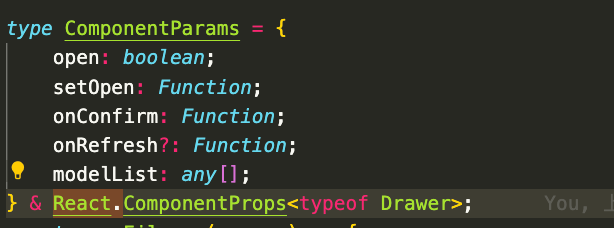

# ------python
## 学习地址
python
【素材下载】
本书内配有纸质版的宣传卡
1.e读版电子书和在线练习环境请打开纸质宣传卡的唯一码领取
2.【本书配套资源】（仅支持PC端在线领取）
https://www.epubit.com/bookDetails?id=UBbf1aa359cbf9&typeName=%E6%90%9C%E7%B4%A2

电子书：https://www.epubit.com/bookDetails?id=UBbf1aa359cbf9&typeName=%E6%90%9C%E7%B4%A2

820D3 电子阅读码 登录微信，psd 1Z

<a href="https://mp.weixin.qq.com/s/RUeHI4PR2ddwnb0eBIevBA">点我即可获取Python书单~</a>  

《Python编程：从入门到实践（第2版）》随书下载资料领取↓
链接: https://pan.baidu.com/s/1qYukGPnS6d8Jydqy_DEpFg
提取码: yfvh

github加速网址
https://www.3kjs.com/topic/15079.html


- input()输入
- len 长度
- 类型，str,float,int()
- 整数等于浮点数
- and,or,not, not 2 + 2 == 5,先not 在and 再or
- range(0,10,2) 递增2，直到>=10终止，不包含10，比如range(5,-1,-1)

## 语法

- 内置模块,常用模块
random，random.randint(1,10), random.choice('abcdefg')
sys sys.exit()
time time.sleep()
copy copy.copy([a,b])可以拷贝一个列表，而不是拷贝引用，如果是复杂的列表，比如二维列表，就需要deepcopy()
- 生成随机数
```python
# 生成随机字符串的函数
def generate_random_string(length):
    letters_and_digits = string.ascii_letters + string.digits
    return ''.join(random.choice(letters_and_digits) for _ in range(length))
```

- from random import * 可以让你random.randint(0,10)不用写random. 但是这样不利于阅读，建议用普通的import
- None, null, nil, undefined
- print('cats', 'dogs', 'mice', sep=','), 指定分隔符
- print('Hello', end='')将结尾的符号换成空格，默认结尾都是换行
- 如果需要函数内修改全局变量，需要global var声明是全局的
- 异常处理
```python
try: 
    ...
except ZeroDivisionError:
    print('adf')
except: 
    print('asfd')
```
- pprint pprint.pformat, pprint.pprint()
- pyperclip pyperclip.copy('Hello world!'), .paste()
- sudo apt install xsel xclip
- sys sys.argv[1] 代表命令后第一个参数
- 列表，元祖
- arr[-1]倒数第一项
- arr[:2]省略代表是0
- [1,2] + [3,4]
- del arr[2]会直接剔除
- a in，a not in
- a,b,c = [1,3,4] 变量长度相等可以一次性多重赋值
- 列表，有.index方法获取索引，.append('a'), .insert(1,'a')任意位置插入,1是新值的下标，.remove('a'),同理多次出现的只会操作第一次出现的值，如果要根据下表删，用del好用，.sort(reverse=True),.sort(key=str.lower)普通字典排序
- for i in arr
- 改变字符串的正确方式newName = name[0:7] + 'the' + name[8:12]，name[7] = 'the'这样是不行的
- 元祖是(a,b)这种写法，跟列表一样，但是元祖是只读的
- type()判断类型，（a,）只有一个元素时，有逗号表示是元祖，不然就只会判断成普通（）里面的字符串
- 类型转换 str(),list(),tuple()
- python变量同样也有值引用和对象引用的问题

- 字典
- 不同键值的字典一样相等
- .values(),返回类似列表，但不能修改没有append，可以for in
- .keys(), .items返回元祖(key, value)
- 可以用list转换得到的列表为真实列表
- .get(key, 0) 可以直接访问字典某个key的值并处理异常情况，异常时返回0
- .setdefault('color', 'black') 如果没有值就设置默认值，常用在for in 时一开始设置默认值
  
- 字符
- '''三引号相当于`,也用于多行注释
- .upper(),.lower(),.isupper(),islower(),startswith,endswith()
- .join('asdf'),.join(['cats', 'rats', 'bats'])
- >>> 'MyABCnameABCisABCSimon'.split('ABC')
['My', 'name', 'is', 'Simon']
>>> 'My name is Simon'.split('m')
['My na', 'e is Si', 'on']
- spam.split('\n') 分割换行
- partion('e') 'hellow' => h e llow
- rjust(10)，右对齐，.ljust, .center, .strip() 相当于trim(), .rstip,.lstrip,
- spam = 'SpamSpamBaconSpamEggsSpamSpam'   spam.strip('ampS') ==> 'BaconSpamEggs'
- ord,转为阿斯克码数字，chr，转回来

- 正则表达式
- phoneNumRegex = re.compile(r'\d\d\d-\d\d\d-\d\d\d\d')
 >>> phoneNumRegex = re.compile(r'\d\d\d-\d\d\d-\d\d\d\d')
>>> mo = phoneNumRegex.search('My number is 415-555-4242.')
>>> print('Phone number found: ' + mo.group())
- .group(1)
- 正则 >>> batRegex = re.compile(r'Bat(man|mobile|copter|bat)')
>>> mo = batRegex.search('Batmobile lost a wheel')
>>> mo.group()
'Batmobile'
>>> mo.group(1)
'mobile'
- r'Bat(wo)?man'
- r'(Ha){3,5}?' 默认是贪心的，非贪心需要加?
- findall返回列表，如果有括号分组，则返回元祖列表
>>> phoneNumRegex = re.compile(r'(\d\d\d)-(\d\d\d)-(\d\d\d\d)') # has groups
>>> phoneNumRegex.findall('Cell: 415-555-9999 Work: 212-555-0000')
[('415', '555', '9999'), ('212', '555', '0000')]
- newlineRegex = re.compile('.*', re.DOTALL)，re.DOTAIL表示.也可以匹配包含换行符
- re.I 相当于ignore，不区分大小写，
- sub，相当于replace，参数1是最终要替换的词，第二个参数是原文
>>> namesRegex = re.compile(r'Agent \w+')
>>> namesRegex.sub('CENSORED', 'Agent Alice gave the secret documents to Agent Bob.')
'CENSORED gave the secret documents to CENSORED.'
可以输入\1,\2,\3代表只替换哪个出现的返祖
- 
>>> agentNamesRegex = re.compile(r'Agent (\w)\w*')
>>> agentNamesRegex.sub(r'\1****', 'Agent Alice told Agent Carol that Agent
Eve knew Agent Bob was a double agent.')
A**** told C**** that E**** knew B**** was a double agent.'


# ------实用
## 快捷
包围tag ctrl+shift+ i 
json to ts ctrl + alt + v
option + 左右移动到词尾，或者option直接放置光标，然后ctrl+w删除整个单词
ctrl+a/e 移动到开头或结尾
ctrl + U 删除整行
ctrl+K 删除光标后面的东西
按住option 框选需要的文本

commit规范
feat: 新特性
fix: 修改问题
refactor: 代码重构
docs: 文档修改
style: 代码格式修改, 注意不是 css 修改
test: 测试用例修改
chore: 其他修改, 比如构建流程, 依赖管理.
pref: 性能提升的修改
build: 对项目构建或者依赖的改动
ci: CI 的修改
revert: revert 前一个 commit


# ------部署实践

- 配置ci环境变量

```
gitlab.ci
stages:
  - token-scan
  - build

variables:
  GIT_DOMAIN: https://gitlab.nie.netease.com
  DOCKER_REGISTRY: dockerhub.nie.netease.com
  NCR_REGISTRY: ncr.nie.netease.com

# 检查代码合规
auth-guard:
  only:
    - master
    - tags
  stage: token-scan
  image:
    name: ncr.nie.netease.com/dap/auth-guard:master
  variables:
    GIT_DEPTH: '5'
  script:
    - /home/gpx/app/bin/run scan-token .

build_image:
  tags:
    - docker
    # 使用tag为docker的runner触发构建
  stage: build
  only:
    - master
    - develop
    - testing
    - /^feature.*/
    - /^release.*/
    - /^hotfix.*/
    - staging
    - tags
  script:
    - run_build_image
  # 锚点函数
  .auto_devops: &auto_devops |
    function run_build_image() {
        BRANCH=${CI_COMMIT_REF_NAME//\//_}
        REPO=`echo $CI_PROJECT_DIR | awk -F '/' '{print $NF}'`
        GROUP=`echo $CI_PROJECT_DIR | awk -F '/' '{print $(NF-1)}'`
        DOCKER_REPO="$GROUP/$REPO"
        PROJECT_PATH="tmax/dreammaker-docs"
        echo "CI_COMMIT_TAG: " "${CI_COMMIT_TAG}"
        VERSION_TAG=`echo ${CI_COMMIT_TAG}`
        if [ "$VERSION_TAG" != "" ];then TAG=$VERSION_TAG ;else TAG=$BRANCH ;fi
        echo "TAG: " "$TAG"

        docker login -u $NCR_USER -p $NCR_TOKEN $NCR_REGISTRY
        docker build -t $NCR_REGISTRY/$PROJECT_PATH:$TAG .
        docker push $NCR_REGISTRY/$PROJECT_PATH:$TAG
        echo docker build $NCR_REGISTRY/$PROJECT_PATH:$TAG
        # node script/test.js
    }
    
  # 定义锚点
  before_script:
    - *auto_devops
```


- nginx文件
```
# 这段代码是在 Nginx 中使用 map 指令来定义一个变量 $connection_upgrade，它的值取决于请求头中的 $http_upgrade 变量。
# 因此，这段代码的作用是将请求头中的 Upgrade 字段映射为响应头中的 Upgrade 字段，从而实现 WebSocket 连接的升级。
# 具体来说，当 $http_upgrade 的值为 default 时，$connection_upgrade 的值为 upgrade；当 $http_upgrade 的值为“”时，$connection_upgrade 的值为 close。
map $http_upgrade $connection_upgrade {
  default upgrade;
  '' close;
}
# 如果有上游服务器
# upstream webserver {
#   server logtailx.nie.netease.com:8124;
#   server backend1.example.com weight=5;
#   server backend2.example.com;
#   server backend3.example.com;
# }
# 通过 upstream 关键字来定义上游服务器，然后在 server 块中使用 proxy_pass 指令将请求转发给上游服务器。通过使用上游服务器，可以实现负载均衡、高可用性和容错等功能。
# weight=5代表权重为5会收到更多的请求

server {
    listen 80;
    root   /usr/share/nginx/html;  
    index index.html index.htm;

    # location = / {
    #     rewrite ^/ /doc;
    # }

    # location / {
    #     # 解决单页应用服务端路由的问题
    #     try_files  $uri $uri/ /index.html;
    #     # 非带 hash 的资源，需要配置 Cache-Control: no-cache，避免浏览器默认为强缓存
    # }
    location /doc/ {
        try_files $uri $uri/ /doc/index.html;
        add_header X-Cache "nocache";
        expires -1;
    }

    # location ^~ /dist {
    # autoindex on;   #开启nginx目录浏览功能
    # autoindex_exact_size off;   #文件大小从KB开始显示
    # autoindex_localtime on;
    # add_header X-hejie "123";
    # }

    # 图片、视频等静态资源缓存 1 周
    location ~* \.(?:jpg|jpeg|gif|png|ico|cur|gz|svg|svgz|mp4|ogg|ogv|webm|htc)$ {
        add_header Cache-Control "public";
        add_header X-Cache "cache1w";
        expires 1w;
    }
    # CSS、JS 缓存 1 天
    location ~* \.(?:css|js)$ {
        add_header Cache-Control "public";
        add_header X-Cache "cache1d";
        expires 1d;
    }

    location ~* \.(eot|otf|ttf|woff|svg)$ {
        add_header Access-Control-Allow-Origin *;
        add_header X-Cache "cache1w";
        expires 1w;
    }
}


```

- 如果不想部署在根目录，则 base设置为 /doc/ 
- dockerfile里面直接把打包好的东西放在doc文件夹即可
dockerfile
```
FROM node:16.15.1 as builder

WORKDIR /code

# 单独分离 package.json，是为了 yarn 可最大限度利用缓存
ADD package.json yarn.lock /code/
RUN yarn

# 单独分离 public/src，是为了避免 ADD . /code 时，因为 Readme/nginx.conf 的更改避免缓存生效
# 也是为了 npm run build 可最大限度利用缓存
ADD vite.config.js /code/vite.config.js
ADD index.md /code/index.md
ADD zh /code/zh
ADD en /code/en
ADD public /code/public
ADD .vitepress /code/.vitepress
RUN npm run build

# 选择更小体积的基础镜像
FROM nginx:alpine
ADD depoly/nginx.conf /etc/nginx/nginx.conf
ADD depoly/default.conf /etc/nginx/conf.d/default.conf
COPY --from=builder code/.vitepress/dist /usr/share/nginx/html/doc

```

- docker本地运行
```bash
# 先删除原有的容器再打包运行
 "scripts": {
    "build": "vitepress build",
    "del": "docker rm -f $(docker ps -a |  grep 'netdocs*'  | awk '{print $1}')",
    "preview": "npm run del && docker build -t netdocs:latest . && docker run -d -p 6300:80 --name netdocs netdocs:latest",
  }
```
- 查看打包镜像详情
```
docker exec -it netdocs /bin/sh
cd /usr/share/nginx/html
vi /etc/nginx/conf.d/default.conf

```


# ------Ts

透传组件属性



# ------Shell/linux
## curl
Curl是一个功能强大的命令行工具，用于与Web服务器进行数据交换。以下是一些常用的curl选项：
-o, --output <file>：将输出保存到指定文件中
-O, --remote-name：使用服务器端的文件名将输出保存到当前目录中
-L, --location：跟随重定向
-I, --head：仅获取文件头信息
-X, --request <command>：使用指定的HTTP方法发送请求
-H, --header <header>：在请求中添加自定义标头
-d, --data <data>：将数据作为POST请求的主体发送
-b, --cookie <name=value>：添加cookie到请求中
-u, --user <user:password>：使用指定的用户名和密码进行身份验证
-s, --silent：静默模式，不输出进度和错误信息
find
find . -name ".DS_Store" | xargs rm -f
q: 这是一个在终端中使用的命令，其作用是查找当前目录及其子目录下名为 .DS_Store的文件，并将其删除。

具体分解如下：

- `find . -name “.DS_Store”：在当前目录及其子目录下查找文件名为 &quot;.DS_Store&quot; 的文件。
- `|`：将查找结果输出到下一条命令的输入中。
- `xargs`：将输入作为参数传递给下一条命令。
- `rm -f`：强制删除文件，不进行提示。

## shell语法

```bash

- 变量：

设置：your_name="runoob.com",=左右不能有空格
unset your_name 删除
数组：array_name=(value0 value1 value2 value3)

使用：$your_name 或者在模板语句中用${your_name}
只读：readonly your_name

- 字符串
单引号：原样输出
双引号：可以有变量

your_name="runoob"
# 使用双引号拼接
greeting="hello, $your_name!"
greeting_1="hello, ${your_name} !"
echo $greeting  $greeting_1

# 使用单引号拼接
greeting_2='hello, '$your_name' !'
greeting_3='hello, ${your_name} !'
echo $greeting_2  $greeting_3

- 获取长度 
string="abcd"
echo ${#string}   # 输出 4

- 提取字符
string="runoob is a great site"
echo ${string:1:4} # 输出 unoo

- 查找子字符串
查找字符 i 或 o 的位置(哪个字母先出现就计算哪个)：
string="runoob is a great site"
echo `expr index "$string" io`  # 输出 4

- 数组
使用 @ 符号可以获取数组中的所有元素，例如：
实例
# 取得数组元素的个数
length=${#array_name[@]}
# 或者
length=${#array_name[*]}
# 取得数组单个元素的长度
lengthn=${#array_name[n]}


- 多行注释
:<<!
注释内容...
注释内容...
注释内容...
!

- 传参
./test.sh 1 2 3
echo $0 $1 $2

- 循环
#!/bin/bash
# author:菜鸟教程
# url:www.runoob.com
$* 与 $@ 区别：

相同点：都是引用所有参数。
不同点：只有在双引号中体现出来。假设在脚本运行时写了三个参数 1、2、3，，则 " * " 等价于 "1 2 3"（传递了一个参数），而 "@" 等价于 "1" "2" "3"（传递了三个参数）。

echo "-- \$* 演示 ---"
for i in "$*"; do
    echo $i
done

echo "-- \$@ 演示 ---"
for i in "$@"; do
    echo $i
done

- 特殊字符
参数处理    说明
$#  传递到脚本的参数个数
$*  以一个单字符串显示所有向脚本传递的参数。
如"$*"用「"」括起来的情况、以"$1 $2 … $n"的形式输出所有参数。
$$  脚本运行的当前进程ID号
$!  后台运行的最后一个进程的ID号
$@  与$*相同，但是使用时加引号，并在引号中返回每个参数。
如"$@"用「"」括起来的情况、以"$1" "$2" … "$n" 的形式输出所有参数。
$-  显示Shell使用的当前选项，与set命令功能相同。
$?  显示最后命令的退出状态。0表示没有错误，其他任何值表明有错误。
```

## ssh
lsof -ti:3000 | xargs kill
ssh-add ~/.ssh/id_rsa
ssh -A zhanghejie@7.34.76.19

## vim相关
配置固定访问ssh
vim ~/.ssh/config 
Host *
     User zhanghejie
     Port 32200
     IdentityFile ~/.ssh/id_rsa
IdentityFile是SSH配置文件中的一个选项，用于指定用于身份验证的私钥文件的路径。当您使用SSH连接到服务器时，服务器会要求您提供身份验证凭据。如果您使用公钥/私钥对进行身份验证，则需要指定您的私钥文件路径。在SSH配置文件中指定IdentityFile可以避免您每次连接时都需要手动指定私钥文件路径。
登录ssh并且rsync上传文件
rsync -avz -e ssh /path/to/local/file username@remote_host:/path/to/remote/directory
rsync -avz -e 'ssh -p32200 -i /Users/game-netease/.ssh/id_rsa' /Users/game-netease/Desktop/netease/gdc-loghub-ui/ zhanghejie@10.214.37.100:/home/zhanghejie/gdc-loghub-ui/

Python


虚拟env
curl https://bootstrap.pypa.io/get-pip.py >> get-pip.py
pip install virtualenv
virtualenv venv3

# ------Devops
## 学习流程
笔记：
开发语言
    Python
    Go
    Ruby

操作系统知识
    启动管理
    进程管理
    线程和并发
    Sockets
    Posix基础
    网络
    I/O
    虚拟化
    内存、存储
    文件系统
    服务管理

管理服务
    管理操作系统
        Centos
        Ubuntu
        Windows
        FreeBSD
    Terminal
        screen
        tmux

网络安全和协议
    HTTP
    HTTPS
    FTP
    SSL/TSL
    SSH
    Port Fording

服务周边
    缓存服务器
    负载均衡
    防火墙
    反向代理
    正想代理

Web Server
    Nginx
    Lstio

架构
    Service Mesh
    CI/CO
        Jenkins
    容器
        Docker
    配置管理
        Ansible
        Salt
    容器管理
        K8s

监控
    云服务
        AWS    
        阿里云
    日志管理
        ELK
    基础监控
        Grafana
        Prometheus
    应用监控
        New Relic

    云模式
        可用性
        数据管理
        设计和实现
        管理和监控

# ------亮点
自定义plugin检测addeventlistener规范 
一键压缩组件，可视化拖拽生成平台，
性能优化，网络安全，防抖节流，多端适配
编辑器，可视区内加载，懒加载，viewer项目，流式渲染，JSONStream读取流
性能优化，时序上，资源上，图片上，webpack插件工具类
脚手架，npm包，sdk
传输，断点传输
性能监控
位运算
Devops
编辑器，可视区加载，并行限制，分时，断点传输，
预览器，服务端用xtpl涂模板，客户端接入逻辑，懒加载，预加载，并发限制，分时
性能优化，时序上，资源上【webpack】，感观体验和交互，代码上，指标【Lighthouse，火山图，performance】
SDK，位运算，订阅器模式，依赖收集
流式
异常监控系统
- 错误类型
  Error
  EvalError
  RangeError
  ReferenceError
  SyntaxError（语法错误）
  TypeError
  URIError

1. trycath 只能抓同步的运行时错误，语法错误抓不了，异步请求错误也抓不了，比如 setTimeout 里面的错误抓不了
2. Promise.catch()抓异步错误，所以改写 Promise.catch 可以进行错误上报，但 promise.catch 同样抓不了语法错误和异步任务
3. unhandledrejection unhandledrejection：当 Promise 被 reject 且没有 reject 处理器的时候，会触发 unhandledrejection 事件
Iframe,onerror,
跨端脚本，对 script 标签增加一个 crossorigin=”anonymous”
sourceMap 定位错误文件

# ------umi
```js


antpro request脚手架拦截器
import { message as Msg } from 'antd';
import { signData, isEmpty, deepCopy, getUid, delCookie } from '@/utils';
import qs from 'qs';
import type { requsetOptions } from './index';
import { OaToken } from '../constants/index';

const codeMessage = {
  200: '服务器成功返回请求的数据。',
  201: '新建或修改数据成功。',
  202: '一个请求已经进入后台排队（异步任务）。',
  204: '删除数据成功。',
  400: '发出的请求有错误，服务器没有进行新建或修改数据的操作。',
  401: '用户没有权限（令牌、用户名、密码错误）。',
  403: '用户得到授权，但是访问是被禁止的。',
  404: '发出的请求针对的是不存在的记录，服务器没有进行操作。',
  406: '请求的格式不可得。',
  410: '请求的资源被永久删除，且不会再得到的。',
  422: '当创建一个对象时，发生一个验证错误。',
  500: '服务器发生错误，请检查服务器。',
  502: '网关错误。',
  503: '服务不可用，服务器暂时过载或维护。',
  504: '网关超时。',
};

let canDeleteToken: boolean = true;

/**
 * 异常处理程序
 */
const errorHandler = (error: { response: Response; message: string }): Response => {
  const { response, message } = error;
  if (response && response.status) {
    const errorText = codeMessage[response.status] || response.statusText;
    const { status, url } = response;
    console.log(`请求错误 ${status}: ${url}`, error);
    Msg.error(errorText);
  } else {
    Msg.error(message);
  }
  return response;
};

// _noFilter 和 _listField有关
// 正常来说请求到的接口如果有_listField（默认为list）字段标志为是表单接口，返回的东西会自动只取出标记字段并转换格式来兼容anttable
// 但是有些情况下不止需要list接口也需要别的东西的话就不能做过滤，这时候加上_noFilter不对接口进行格式转换
const requestInterceptors = (url: string, options: requsetOptions) => {
  if (!getUid()) {
    return;
  }
  const { method, _sorter, _prefix = '' } = options;
  let { data = {} } = options;
  // 处理数据
  if (data.current && data.pageSize) {
    data.page = data.current;
    delete data.current;
    data.size = data.pageSize;
  }
  if (!isEmpty(_sorter)) {
    for (const s in _sorter) {
      data.sortField = s;
      data.sortOrder = _sorter[s] === 'ascend' ? 'asc' : 'desc';
    }
  }
  // 如果有需要导出数据
  if (window?._exportObj?.startExport) {
    window._exportObj.startExport = false;
    let originData = deepCopy(data) || {};
    originData = signData(originData);
    window._exportObj.cb(originData);
  }
  const finalOptions = { ...options };
  if (!url.startsWith('http')) {
    if (_prefix) url = `${_prefix}${url}`;
    else url = `${process.env.API_URL}${url}`;
  }

  const finalReqObj = {
    url,
    options: {},
  };

  // 数据处理完成，格式化数据
  data = signData(data);
  const serialData = qs.stringify(data) || '';

  if (method === 'get') {
    finalOptions.params = data;
  } else {
    finalOptions.data = serialData;
  }
  // 请求方式
  if (method.includes('_')) {
    const tmp = method.split('_');
    finalOptions.method = tmp?.[0];
    if (tmp?.[1] === 'json') {
      finalOptions.data = data;
      finalOptions.headers['Content-Type'] = 'application/json; charset=utf-8';
      finalOptions.headers.Accept = 'application/json';
    }
  }
  finalReqObj.options = finalOptions;
  return finalReqObj;
};
const responseInterceptors = async (response: Response) => {
  const data = await response?.clone()?.json();
  let msg = '';
  const { code, message } = data;
  if (code !== 200 && message) {
    if (message) msg = message;
    else msg = codeMessage[code];
    if ([401].includes(+code)) {
      msg = `错误：${message}（确保后台有添加角色权限后，再重新刷新，还不行的话尝试清除cookie再打开）`;
      if (canDeleteToken) {
        canDeleteToken = false;
        setTimeout(() => {
          delCookie(OaToken);
        }, 2000);
      }
    }
    throw new Error(msg);
  } else if (code === 200) {
    canDeleteToken = true;
    sessionStorage.setItem('tryLogin', '0');
  }
  return response;
};

const request = {
  timeout: 5000,
  headers: {
    'Content-Type': 'application/x-www-form-urlencoded;',
  },
  errorConfig: {
    adaptor: (resData: Obj, options: Obj) => {
      const { req = {} } = options;
      const { _listField, _noFilter } = req?.options || {};
      const { data, code } = resData;
      // 对于分页的数据需要进行改造才能适用于antPro
      const _field = _listField === undefined ? 'list' : _listField;
      const targetData = resData?.data?.[_field];
      if (_field && data?.total !== undefined && targetData) {
        if (!_noFilter) resData.data = targetData;
        resData.total = data.total;
        resData.success = code === 200;
      }
      return resData;
    },
  },
  credentials: 'include',
  errorHandler, // 默认错误处理
  // 新增自动添加AccessToken的请求前拦截器
  requestInterceptors: [requestInterceptors],
  responseInterceptors: [responseInterceptors],
};

export default request;

```
