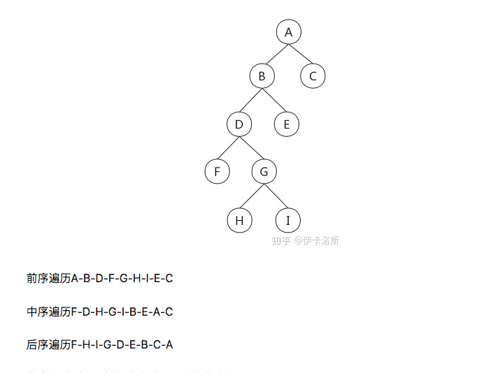

## 二维数组中的查找

题目描述
在一个二维数组中（每个一维数组的长度相同），每一行都按照从左到右递增的顺序排序，每一列都按照从上到下递增的顺序排序。请完成一个函数，输入这样的一个二维数组和一个整数，判断数组中是否含有该整数。
示例 1
输入
7,[[1,2,8,9],[2,4,9,12],[4,7,10,13],[6,8,11,15]]
返回值
true

```
while(line=readline()){
    var index = line.indexOf(',');
    var left = parseInt(line.substring(0,index));
    var right = JSON.parse(line.substring(index+1));
    print(Find(left,right))
}

function Find(target, array)
{
    // write code here
    lenX = array.length;
    lenY = array[0].length;
    for (var i = lenX - 1, j = 0; i >= 0 && j < lenY;) {
        if (target > array[i][j]) {
            j++;
        }
        else if (target < array[i][j]) {
            i--;
        }
        else {
            return true;
        }
    }
    return false
}
```

## 空格替换

请实现一个函数，将一个字符串中的每个空格替换成“%20”。例如，当字符串为 We Are Happy.则经过替换之后的字符串为 We%20Are%20Happy。

```
function replaceSpace(str)
{
 return str.replace(/\s/g,'%20')
}
module.exports = {
    replaceSpace : replaceSpace
};
```

## 从头

输入一个链表，按链表从尾到头的顺序返回一个 ArrayList。
示例 1
输入
{67,0,24,58}
返回值
[58,24,0,67]

```
/*function ListNode(x){
    this.val = x;
    this.next = null;
}*/
function printListFromTailToHead(head)
{
    // write code here
    // write code here
    let node = head
    let arr = []
    while(node != null) {
        arr.unshift(node.val)
        node = node.next
    }
    return arr
}

```

## 重建二叉树

题目描述
输入某二叉树的前序遍历和中序遍历的结果，请重建出该二叉树。假设输入的前序遍历和中序遍历的结果中都不含重复的数字。例如输入前序遍历序列{1,2,4,7,3,5,6,8}和中序遍历序列{4,7,2,1,5,3,8,6}，则重建二叉树并返回。
示例 1
输入
[1,2,3,4,5,6,7],[3,2,4,1,6,5,7]
返回值
{1,2,5,3,4,6,7}

```
/* function TreeNode(x) {
    this.val = x;
    this.left = null;
    this.right = null;
} */
function reConstructBinaryTree(pre, vin)
{
    // write code here
    let p = 0;
    let i = 0;
    let build = function(stop) {
        if (vin[i] != stop) {
            var root = new TreeNode(pre[p++])
            root.left = build(root.val)
            i++
            root.right = build(stop)
            return root
        }
        return null
    }
    return build()
}
```

## 用两个栈实现队列

用两个栈来实现一个队列，完成队列的 Push 和 Pop 操作。 队列中的元素为 int 类型

```
let stack1=[], stack2=[];
function push(node)
{
    // write code here
    stack1.push(node);
}
function pop()
{
    // write code here
    if(stack2.length == 0){
        while(stack1.length!=0){
            stack2.push(stack1.pop());
        }
    }
    return stack2.pop();
}
```

## 旋转数组的最小数字

把一个数组最开始的若干个元素搬到数组的末尾，我们称之为数组的旋转。
输入一个非递减排序的数组的一个旋转，输出旋转数组的最小元素。即二分查找法查最小
NOTE：给出的所有元素都大于 0，若数组大小为 0，请返回 0。
示例 1
输入
[3,4,5,1,2]
返回值
1

```
while (line = readline()) {
  let arr = JSON.parse(line);
  print(minNumberInRotateArray(arr));
}
function minNumberInRotateArray (rotateArray) {
  var l = 0, r = rotateArray.length - 1
  var mid
  while (l + 1 < r) {
    mid = Math.floor((r + l) / 2)
    if (rotateArray[mid] >= rotateArray[l]) {
      l = mid
    } else {
      r = mid
    }
  }
  return rotateArray[r]
}
```

## 斐波那契数列

大家都知道斐波那契数列，现在要求输入一个整数 n，请你输出斐波那契数列的第 n 项（从 0 开始，第 0 项为 0，第 1 项是 1）。
n\leq 39n≤39

```
function Fibonacci(n)
{
    // write code here
    let arr = [0, 1];
    for(let i = 2; i <= n; i++) {
        arr[i] = arr[i - 1] + arr[i - 2];
    }
    return arr[n];
}
```

## 跳台阶

一只青蛙一次可以跳上 1 级台阶，也可以跳上 2 级。求该青蛙跳上一个 n 级的台阶总共有多少种跳法（先后次序不同算不同的结果）。

```
function jumpFloor(number)
{
    // write code here
    if(number==1) return 1
    if(number==2) return 2
    else {
        let arr=[1,2]
        for(let i=2;i<=number-1;i++){
            arr.push(arr[i-1]+arr[i-2])
        }
        return arr[arr.length-1]
    }
}
module.exports = {
    jumpFloor : jumpFloor
};
```

## 变态跳台阶

一只青蛙一次可以跳上 1 级台阶，也可以跳上 2 级……它也可以跳上 n 级。求该青蛙跳上一个 n 级的台阶总共有多少种跳法。

```

function jumpFloorII(number)
{
    // write code here
    if(number===0||number===1)
        return 1;

    let res=1;
    for(let i=2;i<=number;i++){
        res*=2;
    }
    return res;
}
module.exports = {
    jumpFloorII : jumpFloorII
};
```

## 矩形覆盖

我们可以用 2*1 的小矩形横着或者竖着去覆盖更大的矩形。请问用 n 个 2*1 的小矩形无重叠地覆盖一个 2*n 的大矩形，总共有多少种方法？
比如 n=3 时，2*3 的矩形块有 3 种覆盖方法

解法：递推得知，fn = f(n-1)+f(n-2),其实就是个裴波那契数列

```
function rectCover(number)
{
    // write code here
    let arr = [0, 1, 2]
    for(let i=3; i<=number; i++){
        arr[i] = arr[i-1] + arr[i-2]
    }
    return arr[number];
}
module.exports = {
    rectCover : rectCover
};
```

## 二进制中 1 的个数

输入一个整数，输出该数 32 位二进制表示中 1 的个数。其中负数用补码表示

```
function NumberOf1(n)
{
    let count = 0
    while(n) {
        n = n & (n - 1)
        count++
    }
    return count
}
```

## 数值的整数次方

给定一个 double 类型的浮点数 base 和 int 类型的整数 exponent。求 base 的 exponent 次方。保证 base 和 exponent 不同时为 0

```
function Power(base, exponent)
{
    // write code here
    if (exponent === 0) return 1;
    if (exponent < 0) return 1 / Power(base, -exponent);
    if (exponent & 1) return base * Power(base, exponent - 1);
    return Power(base * base, exponent / 2);
}
module.exports = {
    Power : Power
};
```

## 调整数组顺序使奇数位于偶数前面

```
function reOrderArray(array)
{
    // write code here
    function isOdd(n){
        return n%2!=0;
    }
    return array.filter(item=>isOdd(item)).concat(array.filter(item=>!isOdd(item)))
}
module.exports = {
    reOrderArray : reOrderArray
};
```

## 链表中倒数第 k 个结点 链表双指针

输入
1,{1,2,3,4,5}
返回值
{5}
转为数组，再直接取

```
function FindKthToTail(head, k)
{
    let temp = []
    let cur = head
    while(cur) {
        temp.push(cur)
        cur = cur.next
    }
    return temp[temp.length - k]
}
module.exports = {
    FindKthToTail : FindKthToTail
};
```

## 树的子结构

输入两棵二叉树 A，B，判断 B 是不是 A 的子结构。（ps：我们约定空树不是任意一个树的子结构）
示例 1
输入
{8,8,#,9,#,2,#,5},{8,9,#,2}
返回值
true

```
/* function TreeNode(x) {
    this.val = x;
    this.left = null;
    this.right = null;
} */
function HasSubtree(pRoot1, pRoot2)
{
    if(!pRoot1||!pRoot2) return false
    // 当前节点的root1树，是否有符合子结构的root2。若没有，就进行root1的左节点试试，再试试右节点
    return same(pRoot1,pRoot2)||HasSubtree(pRoot1.left,pRoot2)||HasSubtree(pRoot1.right,pRoot2)
}
function same(root1,root2){
    if(!root2) return true
    if(!root1) return false
    // 比当前这个节点，是不是有符合的子结构
    return root1.val==root2.val && same(root1.left,root2.left) && same(root1.right,root2.right)
}
```

## 二叉树镜像

操作给定的二叉树，将其变换为源二叉树的镜像。即以 root 为中间轴水平翻转对称

```
function Mirror(root)
{
    if (root){
        [root.left,root.right] = [root.right,root.left]
        Mirror(root.left);
        Mirror(root.right);
    }
}
```

## 顺时针打印矩阵

输入一个矩阵，按照从外向里以顺时针的顺序依次打印出每一个数字，例如，如果输入如下 4 X 4 矩阵： 1 2 3 4 5 6 7 8 9 10 11 12 13 14 15 16 则依次打印出数字 1,2,3,4,8,12,16,15,14,13,9,5,6,7,11,10.
输入
[[1,2],[3,4]]
返回值
[1,2,4,3]

```
function printMatrix(matrix)
{
    var container = []
    var top = 0,
        left = 0,
        right = matrix[0].length-1,
        bottom = matrix.length-1;
    while(left <= right && top <= bottom){
        // 顺时针依次打印
        //第一行
        for (let i=left;i<=right;i++){
            container.push(matrix[top][i])
        }
        top++;
        // 最右边一列
        for (let i=top;i<=bottom;i++){
            container.push(matrix[i][right])
        }
        right--;
        if(top>bottom || left>right){
         break;
         }
        // 最低端一行
        for (let i=right;i>=left;i--){
            container.push(matrix[bottom][i])
        }
        bottom--;
        // 最左边一列
        for (let i=bottom;i>=top;i--){
            container.push(matrix[i][left])
        }
        left++;
    }
    return container;
}
```

## 包含 min 的栈

定义栈的数据结构，请在该类型中实现一个能够得到栈中所含最小元素的 min 函数（时间复杂度应为 O（1））

```
let stack = []
function push(node)
{
    // write code here
    stack.push(node);
}
function pop()
{
    // write code here
    return stack.length ? stack.pop() : null;
}
function top()
{
    // write code here
    return stack.length ? stack[stack.length - 1] : null;
}
function min()
{
    // write code here
    if(stack.length == 0)
        return null;
    return Math.min(...stack);
}
```

## 反转链表

in: {1,2,3}
out:{3,2,1}

```
/**
 * @param {ListNode} head
 * @return {ListNode}
 */
var reverseList = function(head) {
  let cur = head
  let prev = null
  while (cur !== null) {
    // 精简之后，可以免去交换变量
    [cur.next, prev, cur] = [prev, cur, cur.next]
  }
  return prev
}
```

## 合并链表并排序

```
/*function ListNode(x){
    this.val = x;
    this.next = null;
}*/
function Merge(pHead1, pHead2)
{
    // write code here
    //递归
    if(!pHead1) return pHead2
    if(!pHead2) return pHead1
    if(pHead1.val < pHead2.val){
        pHead1.next = Merge(pHead1.next,pHead2)
        return pHead1
    }else{
         pHead2.next = Merge(pHead1,pHead2.next)
        return pHead2
    }

}
```

## 栈的压入、弹出序列

输入两个整数序列，第一个序列表示栈的压入顺序，请判断第二个序列是否可能为该栈的弹出顺序。假设压入栈的所有数字均不相等。例如序列 1,2,3,4,5 是某栈的压入顺序，序列 4,5,3,2,1 是该压栈序列对应的一个弹出序列，但 4,3,5,1,2 就不可能是该压栈序列的弹出序列。（注意：这两个序列的长度是相等的）
in:
[1,2,3,4,5],[4,3,5,1,2]
返回值
false

解答：
一开始都看不懂题目...

后来才好像明白是什么个意思...

假设有一串数字要将他们压栈: 1 2 3 4 5

如果这个栈是很大很大，那么一次性全部压进去，再出栈：5 4 3 2 1

但是，如果这个栈高度为 4，会发生什么？ 1 2 3 4 都顺利入栈，但是满了，那么要先出栈一个，才能入栈，那么就是先出 4，然后压入 5，随后再全部出栈：4 5 3 2 1

那么我总结了所有可能的出栈情况:

5 4 3 2 1//栈高度为 5

4 5 3 2 1//栈高度为 4

3 4 5 2 1//栈高度为 3

2 3 4 5 1//栈高度为 2

1 2 3 4 5//栈高度为 1

借助一个辅助的栈，遍历压栈的顺序，依次放进辅助栈中。

对于每一个放进栈中的元素，栈顶元素都与出栈的 popIndex 对应位置的元素进行比较，是否相等，相等则 popIndex++，再判断，直到为空或者不相等为止。

```
function IsPopOrder(pushV, popV)
{
    // write code here
    var stack = [];
    let flag = 0;
    for(let i = 0; i < pushV.length; i++){
        stack.push(pushV[i]);

        //判断当前栈是否为空 并且栈顶元素和popV[flag]是否相等 相等弹出，并向下继续判断
        while(stack.length && stack[stack.length-1] === popV[flag]) {
           stack.pop();
            flag++;
        }
    }
    return stack.length === 0;
}
module.exports = {
    IsPopOrder : IsPopOrder
};
```

## 树的遍历



```
// 前序遍历： 自 - 左 - 右    先顶点，然后左子节点，左子节点没有了，再从最底部的右节点递归打印
// 中序遍历： 左 - 自 - 右    最左，然后最左那一层逐步一层一层补充完成树
// 后序遍历： 左 - 右 - 自    类似横向激光从下到上扫描树
var preorderTraversal = function(root, arr = []) {
  // 1. 递归
  if (root) {
    // 先处理自己，再处理左右
    // 前序
    // arr.push(root.val)
    preorderTraversal(root.left, arr)
    // 中序
    // arr.push(root.val)
    preorderTraversal(root.right, arr)
    // 后序
    // arr.push(root.val)
  }
  return arr
  // -----------------
  // 2. 迭代实现前序遍历1
  // 开始遍历，stack存储，left入栈，直到left为空，节点出栈，右孩子为目标节点
  // let res = []
  // let stack = []
  // let cur = root
  // while (cur || stack.length > 0) {
  //   while (cur) {
  //     res.push(cur.val)
  //     stack.push(cur) // 后面要通过cur找他的right
  //     cur = cur.left
  //   }
  //   cur = stack.pop()
  //   cur = cur.right
  // }
  // return res
}
```

## 从上往下打印二叉树

从上往下打印出二叉树的每个节点，同层节点从左至右打印。
示例 1
输入
{5,4,#,3,#,2,#,1}
返回值
[5,4,3,2,1]

```
function PrintFromTopToBottom(root) {
  if(!root || !root.val) return []
  const res = [];
  const queue = [];
  queue.push(root);
  while (queue.length > 0) {
    const node = queue.shift();
    res.push(node.val);
    if (node.left) queue.push(node.left);
    if (node.right) queue.push(node.right);
  }
  return res;
}
module.exports = {
    PrintFromTopToBottom : PrintFromTopToBottom
};
```

## 二叉搜索树的后序遍历序列

输入一个整数数组，判断该数组是不是某二叉搜索树的后序遍历的结果。如果是则返回 true,否则返回 false。假设输入的数组的任意两个数字都互不相同。
示例 1
输入
[4,8,6,12,16,14,10]
返回值
true

```
function VerifySquenceOfBST(sequence) {
    console.log(sequence)
    if (sequence.length === 0) {
        return false;
    }
    const root = sequence.pop();
    const left = [];
    const right = [];
    let firstRight;

    for (let index = 0 ; index < sequence.length; index++) {
        const element = sequence[index];
        if (element > root) {
            right.push(element)
            firstRight = root;
        } else {
            left.push(element)
        }
        if ( firstRight && element < root) {
            return false;
        }
    }

    return (VerifySquenceOfBST(left) || left.length===0) && (VerifySquenceOfBST(right) || right.length === 0);
}

```

## 二叉树中和为某一值的路径

输入一颗二叉树的根节点和一个整数，按字典序打印出二叉树中结点值的和为输入整数的所有路径。路径定义为从树的根结点开始往下一直到叶结点所经过的结点形成一条路径。
示例 1
输入
{10,5,12,4,7},22
返回值
[[10,5,7],[10,12]]

```
/* function TreeNode(x) {
    this.val = x;
    this.left = null;
    this.right = null;
} */
function DFS(root,number,path,result){
    if(!root){
        return null
    }
    if(root.left == null && root.right == null){
        if(root.val == number){
            path.push(root.val)
            result.push(path)
            return result
        }else{
            path = []
            return null
        }
    }
    path.push(root.val)
    DFS(root.left,number - root.val, [...path] ,result)
    DFS(root.right,number - root.val,[...path],result)
    return result
}
function FindPath(root, expectNumber)
{
    // write code here
    var result = DFS(root,expectNumber,[],[])
    if(result == null)
        return []
    result.sort((x,y)=>{
        return x.toString() - y.toString()
    })
    return result
}
module.exports = {
    FindPath : FindPath
};
```

## 复杂链表的复制

输入一个复杂链表（每个节点中有节点值，以及两个指针，一个指向下一个节点，另一个特殊指针 random 指向一个随机节点），请对此链表进行深拷贝，并返回拷贝后的头结点。（注意，输出结果中请不要返回参数中的节点引用，否则判题程序会直接返回空）
https://www.nowcoder.com/practice/f836b2c43afc4b35ad6adc41ec941dba?tpId=13&tqId=11178&rp=1&ru=%2Fta%2Fcoding-interviews&qru=%2Fta%2Fcoding-interviews%2Fquestion-ranking&tab=answerKey

## 二叉搜索树与双向链表

输入一棵二叉搜索树，将该二叉搜索树转换成一个排序的双向链表。要求不能创建任何新的结点，只能调整树中结点指针的指向。

```
/* function TreeNode(x) {
    this.val = x;
    this.left = null;
    this.right = null;
} */
function Convert(pRootOfTree)
{
    // write code here
    if(!pRootOfTree) return null;
    let pre = null, head = null;
    function inOrder(node) {
        if(!node) return;
        inOrder(node.left);
        if(pre == null) {
            pre = node;
            head = node;
        }
        else {
            node.left = pre;
            pre.right = node;
            pre = node;
        }
        inOrder(node.right);
    }
    inOrder(pRootOfTree);
    return head;
}
module.exports = {
    Convert : Convert
};
```

## 字符串的排列 字符串动态规划

输入一个字符串,按字典序打印出该字符串中字符的所有排列。例如输入字符串 abc,则按字典序打印出由字符 a,b,c 所能排列出来的所有字符串 abc,acb,bac,bca,cab 和 cba。

```
function Permutation(str)
{
    let result = []
    if(str==0){
        return []
    }
    if(str.length==1){
        result.push(str)
    }else{
        let maps = {}
        for(let i = 0;i<str.length;i++){
            let now = str[i]
            if(!maps[now]){
                let res = Permutation(str.slice(0,i)+str.slice(i+1,str.length))
                for(let j = 0;j<res.length;j++){
                    result.push(now+res[j])
                }
                maps[now] = true
            }
        }
    }
    return result;
}
//arr[index1] = arr.splice(index2, 1, arr[index1])[0];

```

## 数组中出现次数超过一半的数字 数组，哈希

```
function GetLeastNumbers_Solution(input, k)
{
    // write code here
    let len = input.length
    return k <= len ? input.sort().slice(0,k) : []
}
module.exports = {
    GetLeastNumbers_Solution : GetLeastNumbers_Solution
};
```

## 连续子数组的最大和

输入一个整型数组，数组里有正数也有负数。数组中的一个或连续多个整数组成一个子数组。求所有子数组的和的最大值。要求时间复杂度为 O(n).
示例 1
输入
[1,-2,3,10,-4,7,2,-5]
返回值
18

```
function FindGreatestSumOfSubArray(array)
{
    // write code here
    let sum = array[0]
    let res = array[0]
    for(let i=1;i<array.length;i++){

        if(sum>0){
            sum = sum+array[i]
        }else{
            sum = array[i]
        }
        res = Math.max(res,sum)
    }
    return res
}
module.exports = {
    FindGreatestSumOfSubArray : FindGreatestSumOfSubArray
};
```

## 整数中 1 出现的次数（从 1 到 n 整数中 1 出现的次数

```
function NumberOf1Between1AndN_Solution(n)
{
    // write code here


    if( n < 1) return 0
    let count = 0
    for(let i = 1; i <= n; i *= 10){
        count += Math.floor(n/(i*10)) * i
        let k = n % (i * 10)
        if(k < i){
            count += 0
        } else if ( k > 2*i - 1){
            count += i
        } else {
            count += k - i + 1
        }
    }
    return count
}
module.exports = {
    NumberOf1Between1AndN_Solution : NumberOf1Between1AndN_Solution
};
```

## 把数组排成最小的数

输入一个正整数数组，把数组里所有数字拼接起来排成一个数，打印能拼接出的所有数字中最小的一个。例如输入数组{3，32，321}，则打印出这三个数字能排成的最小数字为 321323
解法：先排序后直接整合

```
function PrintMinNumber(numbers)
{
    // write code here
    return numbers.sort((a,b)=>{
        return (a+''+b)-(b+''+a)
    }).join('')
}
module.exports = {
    PrintMinNumber : PrintMinNumber
};

```

## 第一个只出现一次的字符位置

```
function FirstNotRepeatingChar(str)
{
    // write code here
    for(let i = 0; i < str.length; i++) {
        if(str.indexOf(str[i]) === str.lastIndexOf(str[i])) {
            return i
        }
    }
    return -1
}
module.exports = {
    FirstNotRepeatingChar : FirstNotRepeatingChar
};
```

## 数组中的逆序对

在数组中的两个数字，如果前面一个数字大于后面的数字，则这两个数字组成一个逆序对。输入一个数组,求出这个数组中的逆序对的总数 P。并将 P 对 1000000007 取模的结果输出。 即输出 P%1000000007

对于 50\%50%的数据,size\leq 10^4size≤10
4

对于 75\%75%的数据,size\leq 10^5size≤10
5

对于 100\%100%的数据,size\leq 2\*10^5size≤2∗10
5
https://www.nowcoder.com/practice/96bd6684e04a44eb80e6a68efc0ec6c5?tpId=13&tags=&title=&diffculty=0&judgeStatus=0&rp=1&tab=answerKey

## 数字在排序数组中出现的次数

indexOf 和 lastIndexOf

## 和为 S 的两个数字

输入一个递增排序的数组和一个数字 S，在数组中查找两个数，使得他们的和正好是 S，如果有多对数字的和等于 S，输出两个数的乘积最小的。

```
function FindNumbersWithSum(array, sum)
{
    // write code
    let map = new Map;
    let arr = [];
    for(let i = 0;i<array.length;i++){
        if(map.has(array[i])){
            arr.push(array[i])
        }else{
            map.set(sum-array[i],array[i])
        }
    }
    if(arr.length==0){
        return []
    }
    return [sum-arr[arr.length-1],arr[arr.length-1]]
}
module.exports = {
    FindNumbersWithSum : FindNumbersWithSum
};
```

## 翻转单词顺序列

牛客最近来了一个新员工 Fish，每天早晨总是会拿着一本英文杂志，写些句子在本子上。同事 Cat 对 Fish 写的内容颇感兴趣，有一天他向 Fish 借来翻看，但却读不懂它的意思。例如，“student. a am I”。后来才意识到，这家伙原来把句子单词的顺序翻转了，正确的句子应该是“I am a student.”。Cat 对一一的翻转这些单词顺序可不在行，你能帮助他么？

```
function ReverseSentence(str)
{
    let cur = str.split(' ');
    cur.reverse();
    return cur.join(' ');
}
module.exports = {
    ReverseSentence : ReverseSentence
};
```

## 数组中重复的数字

在一个长度为 n 的数组里的所有数字都在 0 到 n-1 的范围内。 数组中某些数字是重复的，但不知道有几个数字是重复的。也不知道每个数字重复几次。请找出数组中第一个重复的数字。 例如，如果输入长度为 7 的数组{2,3,1,0,2,5,3}，那么对应的输出是第一个重复的数字 2。
返回描述：
如果数组中有重复的数字，函数返回 true，否则返回 false。
如果数组中有重复的数字，把重复的数字放到参数 duplication[0]中。（ps:duplication 已经初始化，可以直接赋值使用。）

```
function duplicate(numbers, duplication)
{
    // write code here
    //这里要特别注意~找到任意重复的一个值并赋值到duplication[0]
    //函数返回True/False
    let map = {}
    for(let i = 0; i < numbers.length; i++) {
        if(numbers.lastIndexOf(numbers[i]) !== i) {
            duplication[0] = numbers[i]
            return true
        } else {
            map[numbers[i]] = i
        }
    }
    return false
}
module.exports = {
    duplicate : duplicate
};
```

## 排序总结

- 快速排序在完全无序的情况下效果最好，时间复杂度为 O(nlogn)，在有 序情况下效果最差，时间复杂度为 O(n^2)。
- 初始数据集的排列顺序对算法的性能无影响的有堆排序，直接选择排序， 归并排序，基数排序。
- 合并 m 个长度为 n 的已排序数组的时间复杂度为 O(nmlogm)。 6. 7.
- 外部排序常用的算法是归并排序。
- 数组元素基本有序的情况下，插入排序效果最好，因为这样只需要比较大 小，不需要移动，时间复杂度趋近于 O(n)。
- 如果只想得到 1000 个元素组成的序列中第 5 个最小元素之前的部分排序 的序列，用堆排序方法最快。
- 插入排序和优化后的冒泡在最优情况（有序）都只用比较 n-1 次。
- 对长度为 n 的线性表作快速排序，在最坏情况下，比较次数为 n(n-1)/2。
- 下标从 1 开始，在含有 n 个关键字的小根堆（堆顶元素最小）中，关键 字最大的记录有可能存储在 [n/2]+2 位置上。 因为小根堆中最大的数一 定是放在叶子节点上，堆本身是个完全二叉树，完全二叉树的叶子节点的 位置大于 [n/2]。
- 拓扑排序的算法，每次都选择入度为 0 的结点从图中删去，并从图中删除 该顶点和所有以它为起点的有向边。
- 任何一个基于"比较"的内部排序的算法，若对 n 个元素进行排序，则在 最坏情况下所需的比较次数 k 满足 2^k > n!， 时间下界为 O(nlogn)
- m 个元素 k 路归并的归并趟数 s=logk(m)，代入数据：logk(100)≦3
- 对 n 个记录的线性表进行快速排序为减少算法的递归深度，每次分区后， 先处理较短的部分。
- 在用邻接表表示图时，拓扑排序算法时间复杂度为 O(n+e)

## 算法复杂度

:https://oola-web.oss-cn-shenzhen.aliyuncs.com/oolaimgs/oolam/repo/img-suanfa.png

## 归并排序

```
function mergeSort(arr) {
  采用自上而下的递归方法
  var len = arr.length
  if (len < 2) {
    return arr
  }
  var middle = Math.floor(len / 2),
    left = arr.slice(0, middle),
    right = arr.slice(middle)
  return merge(mergeSort(left), mergeSort(right))
}

function merge(left, right) {
  var result = []
  console.time("归并排序耗时")
  while (left.length && right.length) {
    if (left[0] <= right[0]) {
      result.push(left.shift())
    } else {
      result.push(right.shift())
    }
  }

  while (left.length) result.push(left.shift())

  while (right.length) result.push(right.shift())
  console.timeEnd("归并排序耗时")
  return result
}

```

## 快速排序（快排）

```
function quick_sort(arr) {
  if (arr.length <= 1) {
    return arr
  }
  let pivot = arr[0]
  let left = []
  let right = []
  for (let i = 1; i < arr.length; i++) {
    if (arr[i] < pivot) {
      left.push(arr[i])
    } else {
      right.push(arr[i])
    }
  }
  return quick_sort(left).concat([pivot], quick_sort(right))
}

```

## 原地快排

```
var quickSort = function(arr, left, right) {
  <!-- 如果左边界比右边界大，返回结果，排序结束 -->
  if (left > right) {
    return
  }

  <!-- 默认值处理，如果有传入left和right参数，就赋值这个参数，否则就赋值后面的默认值 -->
  left = left || 0
  right = right || arr.length - 1

  <!-- 定义移动的左游标和右游标 -->
  var leftPoint = left
  var rightPoint = right

  <!-- 定义一个基准数 -->
  var temp = arr[left]

  <!-- 判断左右游标是否重合，如果重合，循环结束 -->
  while (leftPoint != rightPoint) {
    <!-- 基准数在左边，因此从右边开始一个个扫描
    从右到左，寻找小于基准数的数，且左游标要小于右游标
    如果数字大于基准数（证明不符合条件），寻找下一个
    直到找到比基准数小的数，游标停止递减 -->
    while (arr[rightPoint] >= temp && leftPoint < rightPoint) {
      rightPoint--
    }
    <!-- 从左到右，寻找大于基准数的数，且左游标要小于右游标
    如果数字小于基准数（证明不符合条件），寻找下一个
    直到找到比基准数小的数，游标停止递增 -->
    while (arr[leftPoint] <= temp && leftPoint < rightPoint) {
      leftPoint++
    }

    <!-- 如果左游标小于右游标，则交换两个数字的位置 -->
    if (leftPoint < rightPoint) {
      var changeNumber = arr[leftPoint]
      arr[leftPoint] = arr[rightPoint]
      arr[rightPoint] = changeNumber
    }
    <!-- 进行下一次循环，直到两个游标重合位置 -->
  }

  <!-- 重合之后，交换基准数 -->
  arr[left] = arr[leftPoint]
  arr[leftPoint] = temp

  <!-- 递归操作左右两个数组 -->
  quickSort(arr, left, leftPoint - 1)
  quickSort(arr, leftPoint + 1, right)

  return arr
}


```

## 选择排序

```
function selectionSort(arr) {
  var len = arr.length
  var minIndex, temp
  console.time("选择排序耗时")
  for (var i = 0; i < len - 1; i++) {
    minIndex = i
    for (var j = i + 1; j < len; j++) {
      if (arr[j] < arr[minIndex]) {
        寻找最小的数
        minIndex = j 将最小数的索引保存
      }
    }
    temp = arr[i]
    arr[i] = arr[minIndex]
    arr[minIndex] = temp
  }
  console.timeEnd("选择排序耗时")
  return arr
}
```

## 插入排序

```
function binaryInsertionSort(array) {
  if (Array.isArray(array)) {
    console.time("二分插入排序耗时：")

    for (var i = 1; i < array.length; i++) {
      var key = array[i],
        left = 0,
        right = i - 1
      while (left <= right) {
        var middle = parseInt((left + right) / 2)
        if (key < array[middle]) {
          right = middle - 1
        } else {
          left = middle + 1
        }
      }
      for (var j = i - 1; j >= left; j--) {
        array[j + 1] = array[j]
      }
      array[left] = key
    }
    console.timeEnd("二分插入排序耗时：")

    return array
  } else {
    return "array is not an Array!"
  }
}

```

## 二分查找（递归）

```
function binary_search(arr, low, high, key) {
  if (low > high) {
    return -1
  }
  var mid = parseInt((high + low) / 2)
  if (arr[mid] == key) {
    return mid
  } else if (arr[mid] > key) {
    high = mid - 1
    return binary_search(arr, low, high, key)
  } else if (arr[mid] < key) {
    low = mid + 1
    return binary_search(arr, low, high, key)
  }
}
var arr = [1, 2, 3, 4, 5, 6, 7, 8, 9, 10, 11, 23, 44, 86]
var result = binary_search(arr, 0, 13, 10)
alert(result) 9 返回目标元素的索引值

```

## 二分补齐

```
function leftPad(str, length, ch) {
  let len = (length = str.length)
  let total = ""
  while (len) {
    if (len % 2 == 1) total += ch
    if (len == 1) return total + str
    ch += ch // 0 00 0000
  }
}

```

## 1.字符串隐藏，找出最少需要的硬币数，转换成可读性好的文本

https:juejin.im/post/5e92eb5b6fb9a03c8966dc88

```
coinChange([1, 2, 5], 11); 3
coinChange([2, 4], -1) -1
coinChange([1, 2, 4, 5, 10], 100) 10
coinChange(coins, amount) {
  let ans = new Array(amount + 1).fill(Infinity)
  ans[0] = 0
  for (let i = 1; i <= amount; i++) {
    for (let coin of coins) {
      if (i >= coin) {
        ans[i] = Math.min(ans[i], ans[i - coin] + 1)
      }
    }
  }
  return ans[amount] === Infinity ? -1 : ans[amount]
}
```

## 正则解码

```
decode() {
  let sindex = (eindex = -1)
  let count = -1
  let substr = ''
  for (let i = 0; i < str.length; i++) {
    if (str[i] == '[') {
      sindex = i
      if (!isNaN(parseInt(str[i - 1]))) {
        let reg = /(\d)+$/g
        reg.test(str.slice(0,i))
        count = RegExp.$1
        count = str.slice(0, i).match(reg)[0]
      } else {
        count = -1
      }
    }
    if (str[i] == ']') {
      eindex = i
    }
    if (![sindex, eindex].includes(-1)) {
      substr = str.slice(sindex + 1, eindex)
      if (count != -1) {
        str =
          str.slice(0, sindex - count.length) +
          substr.repeat(count) +
          str.slice(eindex + 1)
      }
      sindex = eindex = count = i = -1
    }
  }
  return str
},
```

## 找数组中最接近指定值得值，找最近

找最接近目标的值，找最近
直接将目标插入数组，排序，然后 indexOf()找到目标值，然后比较左右两个谁最近就好了

```

findNearest(arr, target) {
  这一步是深拷贝，目的是为了不影响原数组
  let arr = JSON.parse(JSON.stringify(tmp))
  arr.push(target)
  let index = arr.sort((a, b) => a - b).indexOf(target)
  let res
  if (index === 0) res = arr[index + 1]
  else if (index === arr.length - 1) res = arr[index - 1]
  else {
    res =
      target - arr[index - 1] > arr[index + 1] - target
        ? arr[index + 1]
        : arr[index - 1]
  }
  return res
},
```

## 千位符分割

```
let str = '1475893475324234'
console.log( str.replace(/\d{1,3}(?=(\d{3})+$)/g,function(s){
  return s+','
}) )

```

## Eatman 连续调用闭包

```
function EatMan(name) {
  return new _eatman(name)
}
let _eatman = function (name) {
  let queue = []
  let init = function () {
    console.log(`Hi! This is ${name}!`)
    self.next()
  }
  queue.push(init)
  setTimeout(function () {
    self.next()
  }, 0)
  let self = {
    next: function () {
      if (queue.length) {
        var fn = queue.shift()
        if (typeof fn === 'function') {
          fn()
        }
      }
    },
    eat: function (item) {
      queue.push(function () {
        console.log(`Eat ${item}~`)
        self.next()
      })
      return this
    },
    eatFirst: function (item) {
      queue.unshift(function () {
        console.log(`Eat ${item}~`)
        self.next()
      })
      return this
    }
  }
  return self
}
EatMan('hank').eat('dinner').eatFirst('lanunch')

```

## 对象数组去重

const responseList = [
{ id: 1, a: 1 },
{ id: 2, a: 2 },
{ id: 3, a: 3 },
{ id: 1, a: 4 },
];
const result = responseList.reduce((acc, cur) => {
const ids = acc.map(item => item.id);
return ids.includes(cur.id) ? acc : [...acc, cur];
}, []);
console.log(result); -> [ { id: 1, a: 1}, {id: 2, a: 2}, {id: 3, a: 3} ]

## 转换成树,树结构

以下数据结构中，id 代表部门编号，name 是部门名称，parentId 是父部门编号，为 0 代表一级部门，现在要求实现一个 convert 方法，把原始 list 转换成树形结构，parentId 为多少就挂载在该 id 的属性 children 数组下，结构如下：
原始 list 如下

```
let list =[
    {id:1,name:'部门A',parentId:0},
    {id:2,name:'部门B',parentId:0},
    {id:3,name:'部门C',parentId:1},
    {id:4,name:'部门D',parentId:1},
    {id:5,name:'部门E',parentId:2},
    {id:6,name:'部门F',parentId:3},
    {id:7,name:'部门G',parentId:2},
    {id:8,name:'部门H',parentId:4}
];
const result = convert(list, ...);
function convert(list) {
  const res = []
  const map = list.reduce((res, v) => ((res[v.id] = v), res), {})
  for (const item of list) {
    if (item.parentId === 0) {
      res.push(item)
      continue
    }
    if (item.parentId in map) {
      const parent = map[item.parentId]
      parent.children = parent.children || []
      parent.children.push(item)
    }
  }
  return res
}
```

## 取中间数

这个在 leetCode 上有， 不考虑时间负责度的情况下 把两个数组合并 -> 排序 -> 单数取中间，双数取中间两个平均值

O(log(m+n))解法
/\*\*

- @param {number[]} nums1
- @param {number[]} nums2
- @return {number}
  \*/

```
var findMedianSortedArrays = function(nums1, nums2) {
  let m = nums1.length
  let n = nums2.length
  let k1 = Math.floor((m + n + 1) / 2)
  let k2 = Math.floor((m + n + 2) / 2)

  return (
    (findMedianSortedArraysCore(nums1, 0, nums2, 0, k1) +
      findMedianSortedArraysCore(nums1, 0, nums2, 0, k2)) /
    2
  )
}

const findMedianSortedArraysCore = (nums1, i, nums2, j, k) => {
  如果数组起始位置已经大于数组长度-1
  说明已经是个空数组
  直接从另外一个数组里取第k个数即可
  if (i > nums1.length - 1) {
    return nums2[j + k - 1]
  }
  if (j > nums2.length - 1) {
    return nums1[i + k - 1]
  }
  如果k为1
  就是取两个数组的起始值里的最小值
  if (k === 1) {
    return Math.min(nums1[i], nums2[j])
  }
  取k2为(k/2)或者数组1的长度或者数组2的长度的最小值
  这一步可以避免k2大于某个数组的长度（长度为从起始坐标到结尾）
  let k2 = Math.floor(k / 2)
  let length1 = nums1.length - i
  let length2 = nums2.length - j
  k2 = Math.min(k2, length1, length2)

  let value1 = nums1[i + k2 - 1]
  let value2 = nums2[j + k2 - 1]

  比较两个数组的起始坐标的值
  如果value1小于value2
  就舍弃nums1前i + k2部分
  否则舍弃nums2前j + k2部分
  if (value1 < value2) {
    return findMedianSortedArraysCore(nums1, i + k2, nums2, j, k - k2)
  } else {
    return findMedianSortedArraysCore(nums1, i, nums2, j + k2, k - k2)
  }
}

```

## 手动实现 filter

```
Array.prototype.filter = function(fn, context) {
  if (typeof fn != "function") {
    throw new TypeError(`${fn} is not a function`)
  }
  let arr = this
  let reuslt = []
  for (var i = 0; i < arr.length; i++) {
    let temp = fn.call(context, arr[i], i, arr)
    if (temp) {
      result.push(arr[i])
    }
  }
  return result
}

```

## 数组乱序

取巧的一种算法，但是每个位置乱序的概率不同

```
function mixArr(arr) {
  return arr.sort(() => {
    return Math.random() - 0.5
  })
}

```

## 驼峰命名

var s1 = "get-element-by-id"

// 转化为 getElementById

```
var f = function(s) {
  return s.replace(/-\w/g, function(x) {
    return x.slice(1).toUpperCase()
  })
}

```

## 解析 urlquery 为对象

```
function parseParam(url) {
  const paramsStr = /.+\?(.+)$/.exec(url)[1] // 将 ? 后面的字符串取出来
  const paramsArr = paramsStr.split("&") // 将字符串以 & 分割后存到数组中
  let paramsObj = {}
  // 将 params 存到对象中
  paramsArr.forEach(param => {
    if (/=/.test(param)) {
      // 处理有 value 的参数
      let [key, val] = param.split("=") // 分割 key 和 value
      val = decodeURIComponent(val) // 解码
      val = /^\d+$/.test(val) ? parseFloat(val) : val // 判断是否转为数字

      if (paramsObj.hasOwnProperty(key)) {
        // 如果对象有 key，则添加一个值
        paramsObj[key] = [].concat(paramsObj[key], val)
      } else {
        // 如果对象没有这个 key，创建 key 并设置值
        paramsObj[key] = val
      }
    } else {
      // 处理没有 value 的参数
      paramsObj[param] = true
    }
  })

  return paramsObj
}

```

## 实现 eventListener,实现 emitter,实现 eventEmitter

触发名为 type 的事件

```
class EventEmitter {
  constructor() {
    this.events = {}
  }
  on(event, callback) {
    let callbacks = this.events[event] || []
    callbacks.push(callback)
    this.events[event] = callbacks
    return this
  }
  off(event, callback) {
    let callbacks = this.events[event]
    this.events[event] = callbacks && callbacks.filter(fn => fn !== callback)
    return this
  }
  emit(event, ...args) {
    let callbacks = this.events[event]
    callbacks.forEach(fn => {
      fn(...args)
    })
    return this
  }
  once(event, callback) {
    let wrapFun = function (...args) {
      callback(...args)
      this.off(event, wrapFun)
    }
    this.on(event, wrapFun)
    return this
  }
}


```

## 统计字符出现最多次的字符

```
let str = "abcabcabcbbccccc"
let num = 0
let char = ""

// 使其按照一定的次序排列
str = str
  .split("")
  .sort()
  .join("")
// "aaabbbbbcccccccc"

// 定义正则表达式
let re = /(\w)\1+/g
str.replace(re, ($0, $1) => {
  if (num < $0.length) {
    num = $0.length
    char = $1
  }
})
console.log(`字符最多的是${char}，出现了${num}次`)

```

## 统计出现最多的单词

```
function findMostWord(article) {
  // 合法性判断
  if (!article) return // 参数处理
  article = article.trim().toLowerCase()
  let wordList = article.match(/[a-z]+/g),
    visited = [],
    maxNum = 0,
    maxWord = ''
  article = ' ' + wordList.join(' ') + ' ' // 遍历判断单词出现次数
  wordList.forEach(function (item) {
    if (visited.indexOf(item) < 0) {
      // 加入 visited
      visited.push(item)
      let word = new RegExp(' ' + item + ' ', 'g'),
        num = article.match(word).length
      if (num > maxNum) {
        maxNum = num
        maxWord = item
      }
    }
  })
  return maxWord + ' ' + maxNum
}

```

## 多行文本溢出

```
@mixin ellipsis($rowCount: 1) {
  @if $rowCount <=1 {
    overflow: hidden;
    text-overflow: ellipsis;
    white-space: nowrap;
  }

  @else {
    min-width: 0;
    overflow: hidden;
    text-overflow: ellipsis;
    display: -webkit-box;
    -webkit-line-clamp: $rowCount;
    /* autoprefixer: off */
    -webkit-box-orient: vertical;
  }
}

```

## Domdiff 算法

https://segmentfault.com/a/1190000018914249
给组件加 key，用 key 来控制组件的刷新，key 改变组件就刷新，这样开发代码会很好

diff 策略
React 用 三大策略 将 O(n^3)复杂度 转化为 O(n)复杂度

1. 策略一（tree diff）：
   只比较同级同层节点，UI 中 DOM 节点跨层级的移动操作特别少，可以忽略不计。

2. 策略二（component diff）：

- 如果是同一类型的组件，按照原策略继续比较 Virtual DOM 树即可，对于同一类型的组件，有可能其 Virtual DOM 没有任何变化，如果能够确切知道这点，那么就可以节省大量的 diff 运算时间。因此，React 允许用户通过 shouldComponentUpdate()来判断该组件是否需要进行 diff 算法分析，但是如果调用了 forceUpdate 方法，shouldComponentUpdate 则失效。
- 如果不是，则将该组件判断为 dirty component，从而替换整个组件下的所有子节点。

3. 策略三（element diff）：
   加上 key 的话对性能是翻天覆地的优化，对于同一层级的一组子节点，通过唯一 id 区分。同级比较，节点的比较有五种情况

   :https://oola-web.oss-cn-shenzhen.aliyuncs.com/oolaimgs/oolam/repo/img-domdiff.png

## 遍历树

- 深度优先遍历三种方式

```
let deepTraversal1 = (node, nodeList = []) => {
  if (node !== null) {
    nodeList.push(node)
    let children = node.children
    for (let i = 0; i < children.length; i++) {
      deepTraversal1(children[i], nodeList)
    }
  }
  return nodeList
}

```

- 广度优先

```
let widthTraversal2 = node => {
  let nodes = []
  let stack = []
  if (node) {
    stack.push(node)
    while (stack.length) {
      let item = stack.shift()
      let children = item.children
      nodes.push(item)
      队列，先进先出
      nodes = [] stack = [parent]
      nodes = [parent] stack = [child1,child2,child3]
      nodes = [parent, child1] stack = [child2,child3,child1-1,child1-2]
      nodes = [parent,child1,child2]
      for (let i = 0; i < children.length; i++) {
        stack.push(children[i])
      }
    }
  }
  return nodes
}
```

## 遍历树结构

样例数据

```
let data = {
  name: "jack",
  child: [
    { name: "jack1" },
    {
      name: "jack2",
      child: [
        {
          name: "jack2-1",
          child: { name: "jack2-1-1" }
        },
        {
          name: "jack2-2"
        }
      ]
    },
    {
      name: "jack3",
      child: { name: "jack3-1" }
    }
  ]
}

function findMultiChildPerson(data) {
  let nameList = []

  function tmp(data) {
    if (data.hasOwnProperty("child")) {
      if (Array.isArray(data.child)) {
        nameList.push(data.name)
        data.child.forEach(child => tmp(child))
      } else {
        tmp(data.child)
      }
    }
  }
  tmp(data)
  return nameList
}

```

## 二叉树相关性质

- 节点的度：一个节点含有的子树的个数称为该节点的度；
- 叶节点或终端节点：度为零的节点；
- 节点的层次：从根开始定义起，根为第 1 层，根的子节点为第 2 层，以此 类推。
- 树的高度或深度：树中节点的最大层次。
- 在非空二叉树中，第 i 层的结点总数不超过 2^(i-1)，i>=1。
- 深度为 h 的二叉树最多有 2^h-1 个结点(h>=1)，最少有 h 个结点。
- 对于任意一棵二叉树，如果其叶结点数为 N0，而度数为 2 的结点总数为 N2，则 N0 = N2+1；
- 给定 N 个节点，能构成 h(N) 种不同的二叉树。h(N)为卡特兰数的第 N 项。(2n)!/(n!(n+1)!)。
- 二叉树的前序遍历，首先访问根结点，然后遍历左子树，最后遍历右子树。 简记根-左-右。
- 二叉树的中序遍历，首先遍历左子树，然后访问根结点，最后遍历右子树。 简记左-根-右。
- 二叉树的后序遍历，首先遍历左子树，然后遍历右子树，最后访问根结点。 简记左-右-根。
- 二叉树是非线性数据结构，但是顺序存储结构和链式存储结构都能存储。
- 一个带权的无向连通图的最小生成树的权值之和是唯一的。
- 只有一个结点的二叉树的度为 0 。
- 二叉树的度是以节点的最大的度数定义的。
- 树的后序遍历序列等同于该树对应的二叉树的中序序列。
- 树的先序遍历序列等同于该树对应的二叉树的先序序列。
- 线索二叉树的线索实际上指向的是相应遍历序列特定结点的前驱结点和 后继结点，所以先写出二叉树的中序遍历序列： debxac，中序遍历中在 x 左边和右边的字符，就是它在中序线索化的左、右线索，即 b、a 。
- 递归式的先序遍历一个 n 节点，深度为 d 的二叉树，需要栈空间的大 小为 O（d），因为二叉树并不一定是平衡的， 也就是深度 d！=logn， 有可能 d>>logn。所以栈大小应该是 O（d）
- 一棵具有 N 个结点的二叉树的前序序列和后序序列正好相反 ，则该二 叉树一定满足该二叉树只有左子树或只有右子树， 即该二叉树一定是一 条链（二叉树的高度为 N，高度等于结点数）。
- 引入二叉线索树的目的是加快查找结点的前驱或后继的速度。
- 二叉树线索化后，先序线索化与后序线索化最多有 1 个空指针域，而中序 线索化最多有 2 个空指针域。
- 不管是几叉树，节点数等于=分叉数+1
- 任何一棵二叉树的叶子结点在先序、中序和后序遍历中的相对次序不发生 改变。

- 满二叉树 对于一棵二叉树，如果每一个非叶子节点都存在左右子树，并且二叉树中所有的 叶子节点都在同一层中，这样的二叉树称为满 二叉树。

- 完全二叉树
  对于一棵具有 n 个节点的二叉树按照层次编号，同时，左右子树按照先左后右 编号，如果编号为 i 的节点与同样深度的满 二叉树中编号为 i 的节点在满二叉 树中的位置完全相同，则这棵二叉树称为完全二叉树。
  性质：

1. 具有 n 个结点的完全二叉树的深度为 K =[log2n」+1(取下整数)
2. 有 N 个结点的完全二叉树各结点如果用顺序方式存储，则结点之间有如 下关系： 若 I 为结点编号（从 1 开始编号）则 如果 I>1，则其父结点 的编号为 I/2；
3. 完全二叉树，如果 2 _ I <= N，则其左儿子（即左子树的根结点）的编号 为 2 _ I；若 2 _ I > N，则无左儿子；如 果 2 _ I + 1 <= N，则其右儿子 的结点编号为 2 _ I + 1；若 2 _ I + 1 > N，则无右儿子。

- 平衡二叉查找树（AVL） 平衡二叉查找树具有如下几个性质：
  1. 可以是空树。
  2. 假如不是空树，任何一个结点的左子树与右子树都是平衡二叉树，并且高 度之差的绝对值不超过 1。
     平衡二叉树是为了解决二叉查找树中出现链式结构（只有左子树或只有右子树） 的情况，这样的情况出现后对我们的查找没有 一点帮帮助，反而增加了维护的 成本。 平衡因子使用两个字母来表示。第一个字母表示最小不平衡子树根结点的平衡因 子，第二个字母表示最小不平衡子树较高子树 的根结点的平衡因子。根据不同 的情况使用不同的方法来调整失衡的子树。

剑指 offer
https://www.nowcoder.com/ta/coding-interviews

LeetCode: https://leetcode-cn.com/problemset/all/
